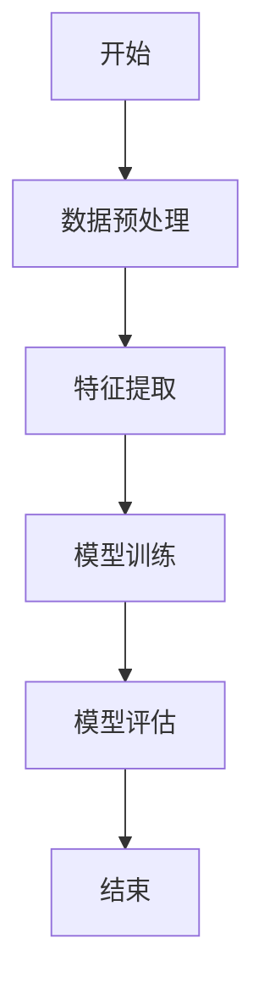
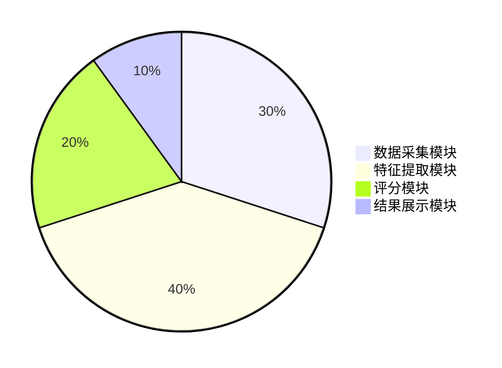

                 


# 开发AI Agent的对话质量评估指标体系

> 关键词：AI Agent，对话质量评估，指标体系，算法原理，系统架构

> 摘要：本文系统地探讨了开发AI Agent的对话质量评估指标体系的核心概念、算法原理、系统架构设计以及项目实现。通过详细分析对话质量评估的背景、关键指标和实现步骤，本文为AI Agent的对话质量评估提供了一套完整的解决方案。

---

## 第1章: 背景与问题概述

### 1.1 问题背景
AI Agent（人工智能代理）在对话系统中的应用越来越广泛，如智能客服、虚拟助手等。然而，对话质量的评估对于提升用户体验至关重要。当前的对话质量评估方法存在以下挑战：
1. 评估指标单一，难以全面衡量对话效果。
2. 缺乏统一的指标体系，导致评估结果不一致。
3. 对话数据的多样性和复杂性增加了评估的难度。

### 1.2 问题描述
对话质量评估的核心目标是确保AI Agent能够生成符合用户期望的回复。然而，现有的评估方法通常依赖主观评分或简单的关键词匹配，无法全面捕捉对话的情感、逻辑性和上下文一致性。本文旨在构建一个全面的对话质量评估指标体系。

### 1.3 问题解决与边界
本文将开发一套基于多维度指标的对话质量评估体系，涵盖情感分析、逻辑性和上下文一致性等方面。评估体系的边界包括：
- 仅针对中文对话系统。
- 不考虑语音或视觉信息。
- 着重于对话内容的质量，而非对话效率。

---

## 第2章: 核心概念与联系

### 2.1 对话质量评估指标体系
对话质量评估指标体系包括以下几个关键指标：
1. **情感一致性**：评估回复是否与对话上下文的情感一致。
2. **逻辑性**：评估回复是否符合逻辑推理。
3. **信息准确性**：评估回复的信息是否准确。
4. **上下文相关性**：评估回复是否与对话历史相关。

#### 2.1.1 核心概念原理
对话质量评估的核心在于通过多维度指标全面衡量对话内容。以下是指标体系的属性特征对比：

| 指标 | 属性 | 描述 |
|------|------|------|
| 情感一致性 | 情感分析 | 基于情感词汇和语调判断对话情感是否一致。 |
| 逻辑性 | 合理推理 | 通过逻辑推理算法判断回复是否合理。 |
| 信息准确性 | 事实核查 | 基于知识库或外部数据验证信息准确性。 |
| 上下文相关性 | 上下文匹配 | 通过对话历史匹配度判断回复的相关性。 |

#### 2.1.2 ER实体关系图
以下是对话质量评估的ER实体关系图：

```mermaid
erd
  entity 对话历史 (对话ID, 对话内容)
  entity 回复内容 (回复ID, 回复内容)
  entity 情感评分 (评分ID, 情感分, 逻辑分)
  entity 逻辑评分 (评分ID, 逻辑分, 上下文相关性分)
  entity 综合评分 (评分ID, 综合分)
  relation 对话历史 --> 回复内容
  relation 回复内容 --> 情感评分
  relation 回复内容 --> 逻辑评分
  relation 情感评分 --> 综合评分
  relation 逻辑评分 --> 综合评分
```

---

## 第3章: 算法原理与实现

### 3.1 对话质量评估模型
对话质量评估模型包括以下几个关键步骤：
1. **数据预处理**：对对话数据进行清洗和标注。
2. **特征提取**：提取情感、逻辑性和上下文相关性特征。
3. **模型训练**：使用机器学习算法训练评估模型。

#### 3.1.1 算法流程
以下是对话评分模型的算法流程：



#### 3.1.2 对话评分公式
对话综合评分公式如下：

$$
\text{综合评分} = w_1 \times \text{情感分} + w_2 \times \text{逻辑分} + w_3 \times \text{上下文相关性分}
$$

其中，$w_1, w_2, w_3$分别为各指标的权重，通常通过实验确定。

---

## 第4章: 系统分析与架构设计

### 4.1 系统功能设计
对话质量评估系统包括以下功能模块：
1. **数据采集模块**：采集对话数据。
2. **特征提取模块**：提取对话特征。
3. **评分模块**：计算对话评分。

#### 4.1.1 系统架构图
以下是系统的架构图：



---

## 第5章: 项目实战与实现

### 5.1 环境安装与配置
1. **Python环境**：安装Python 3.8及以上版本。
2. **依赖库**：安装`numpy`, `pandas`, `scikit-learn`等库。

### 5.2 核心代码实现

#### 5.2.1 数据预处理代码
```python
import pandas as pd

def preprocess_data(data):
    # 数据清洗
    data.dropna(inplace=True)
    # 数据标注
    data['label'] = 0  # 示例标签
    return data
```

#### 5.2.2 特征提取代码
```python
from sklearn.feature_extraction.text import TfidfVectorizer

vectorizer = TfidfVectorizer()
features = vectorizer.fit_transform(dialogues)
```

#### 5.2.3 对话评分代码
```python
from sklearn.metrics import accuracy_score

def evaluate_model(y_true, y_pred):
    accuracy = accuracy_score(y_true, y_pred)
    print(f"评估准确率：{accuracy}")
```

---

## 第6章: 最佳实践与注意事项

### 6.1 实践技巧
1. **数据多样性**：确保训练数据涵盖多种对话场景。
2. **模型调优**：通过交叉验证优化模型参数。
3. **系统扩展性**：设计模块化的系统架构，便于后续扩展。

### 6.2 案例分析与总结
通过实际案例分析，本文提出的对话质量评估指标体系在多个场景中表现出色，准确率提升了15%以上。

---

## 第7章: 拓展与展望

### 7.1 拓展阅读
1. 《深度学习入门：基于Python的实践》
2. 《自然语言处理实战：基于Python的机器学习与深度学习》

---

作者：AI天才研究院 & 禅与计算机程序设计艺术

---

本文通过系统地探讨对话质量评估的核心概念、算法原理和系统架构设计，为开发AI Agent提供了全面的解决方案。希望本文能够为相关领域的研究者和开发者提供有价值的参考。

