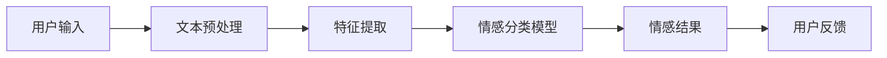
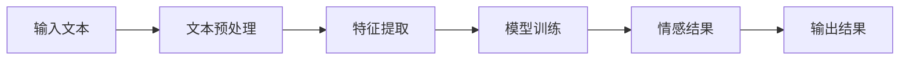

                 


# 开发AI Agent的情感分析引擎

> 关键词：AI Agent，情感分析，自然语言处理，文本挖掘，机器学习

> 摘要：本文将详细介绍如何开发一个基于AI Agent的情感分析引擎。文章从情感分析的基本概念和AI Agent的定义入手，分析了两者结合的必要性，详细讲解了情感分析引擎的核心算法和系统架构设计，通过实际案例展示了如何实现一个功能完善的情感分析引擎，并提出了开发过程中的注意事项和最佳实践。

---

# 第一章: 情感分析引擎开发背景与核心概念

## 第1节: 情感分析的基本概念

### 1.1 情感分析的定义与背景

情感分析（Sentiment Analysis）是自然语言处理（NLP）领域中的一个重要分支，旨在分析文本中所表达的情感倾向。简单来说，情感分析通过分析文本内容，判断文本是积极、消极还是中性。

情感分析的应用场景非常广泛，例如社交媒体分析、客户评论分析、市场调研等。通过情感分析，企业可以快速了解客户对产品或服务的满意度，从而做出相应的决策。

### 1.2 AI Agent的基本概念

AI Agent（人工智能代理）是一种能够感知环境并采取行动以实现目标的智能实体。与传统程序不同，AI Agent具有自主性、反应性、目标导向性和社交能力等特征。

AI Agent的核心特征包括：
- **自主性**：能够在没有外部干预的情况下独立运作。
- **反应性**：能够实时感知环境并做出响应。
- **目标导向性**：具有明确的目标，并能够采取行动以实现目标。
- **社交能力**：能够与其他AI Agent或人类进行交互。

### 1.3 情感分析与AI Agent的结合

情感分析在AI Agent中的作用主要体现在以下几个方面：
1. **输入处理**：AI Agent可以通过情感分析理解用户的输入文本，提取其中的情感倾向。
2. **决策依据**：情感分析结果可以作为AI Agent决策的依据，例如在客服场景中，AI Agent可以根据客户的情感倾向调整回应方式。
3. **输出生成**：AI Agent可以根据情感分析结果生成更加个性化的输出内容。

---

## 第2节: 情感分析引擎的核心概念与联系

### 2.1 情感分析的核心概念

情感分析的核心概念包括：
1. **文本特征提取**：通过词袋模型、词嵌入等方式提取文本中的特征信息。
2. **情感分类模型**：使用机器学习算法（如SVM、随机森林）或深度学习模型（如LSTM、BERT）对文本进行分类。
3. **情感强度计算**：除了分类结果，还可以计算情感的强度，例如情感值的范围在-1到1之间。

### 2.2 AI Agent情感分析引擎的实体关系图

以下是AI Agent情感分析引擎的实体关系图：



---

## 第3节: 情感分析引擎的算法原理

### 3.1 文本预处理

文本预处理是情感分析的第一步，主要包括以下步骤：
1. **分词**：将文本分割成单词或短语。
2. **去停用词**：去除无意义的词汇，例如“的”、“是”等。
3. **词干提取或词嵌入**：将单词转换为词干或向量表示。

### 3.2 特征提取

特征提取是情感分析的关键步骤，常用的特征提取方法包括：
1. **词袋模型（Bag of Words）**：将文本表示为单词的频率向量。
2. **TF-IDF（Term Frequency-Inverse Document Frequency）**：考虑词的重要性，避免常见词对结果的影响过大。
3. **词嵌入（Word Embedding）**：将单词表示为低维向量，常用的方法包括Word2Vec、GloVe等。

### 3.3 模型训练

模型训练是情感分析的核心步骤，常用的算法包括：
1. **机器学习算法**：
   - 支持向量机（SVM）
   - 随机森林（Random Forest）
2. **深度学习算法**：
   - 长短期记忆网络（LSTM）
   - 循环神经网络（RNN）
   - 变量分词编码器-解码器（Transformer）

---

## 第4节: 系统架构设计

### 4.1 问题场景介绍

在开发AI Agent的情感分析引擎时，我们需要考虑以下问题：
- 如何高效地处理大量文本数据？
- 如何保证模型的准确性和实时性？
- 如何与其他模块（如决策模块、反馈模块）进行集成？

### 4.2 系统功能设计

以下是情感分析引擎的核心功能：
1. **文本预处理模块**：负责对输入文本进行清洗和分词。
2. **特征提取模块**：负责提取文本特征，生成模型输入向量。
3. **模型训练模块**：负责训练情感分析模型。
4. **结果解析模块**：负责将模型输出结果转换为可理解的形式。

### 4.3 系统架构设计

以下是情感分析引擎的系统架构图：



---

## 第5节: 项目实战

### 5.1 环境安装

开发情感分析引擎需要以下环境：
- Python 3.8+
- numpy
- scikit-learn
- nltk

### 5.2 核心代码实现

以下是情感分析引擎的核心代码实现：

```python
from sklearn.feature_extraction.text import TfidfVectorizer
from sklearn.svm import SVC
from sklearn.pipeline import Pipeline
from sklearn.metrics import accuracy_score
import nltk
nltk.download('stopwords')

# 文本预处理
def preprocess(text):
    words = text.split()
    stopwords = set(nltk.corpus.stopwords.words('english'))
    filtered_words = [word for word in words if word not in stopwords]
    return ' '.join(filtered_words)

# 特征提取与模型训练
vectorizer = TfidfVectorizer()
model = SVC()

pipeline = Pipeline([
    ('preprocess', FunctionTransformer(preprocess)),
    ('tfidf', vectorizer),
    ('clf', model)
])

# 数据加载与训练
data = [...]  # 数据集
labels = [...]  # 标签

pipeline.fit(data, labels)

# 模型预测
test_data = ['I love this product!']
predicted = pipeline.predict(test_data)
print(predicted)
```

### 5.3 案例分析与解读

通过上述代码，我们可以实现一个简单的情感分析模型。需要注意的是，实际应用中可能需要更复杂的模型和更多的数据预处理工作。

---

## 第6节: 总结与展望

### 6.1 总结

本文详细介绍了如何开发一个基于AI Agent的情感分析引擎，涵盖了情感分析的基本概念、算法原理、系统架构设计以及项目实战等内容。

### 6.2 展望

未来，随着自然语言处理技术的不断发展，情感分析引擎将更加智能化和高效化。我们可以期待更多基于深度学习的情感分析模型，例如基于BERT的情感分析模型。

---

作者：AI天才研究院 & 禅与计算机程序设计艺术

