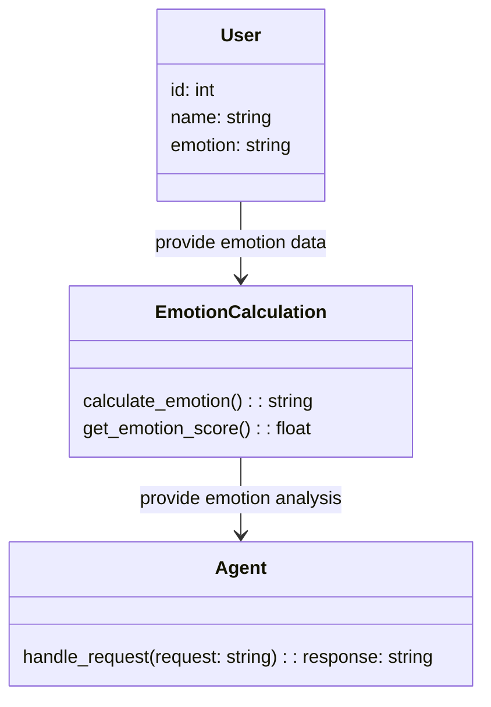
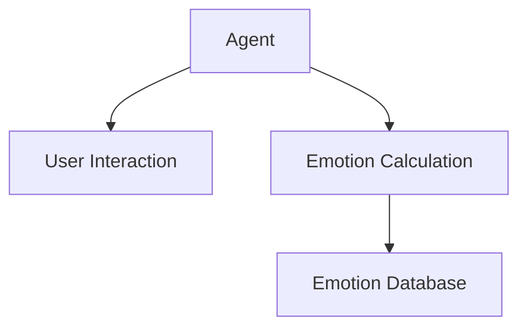
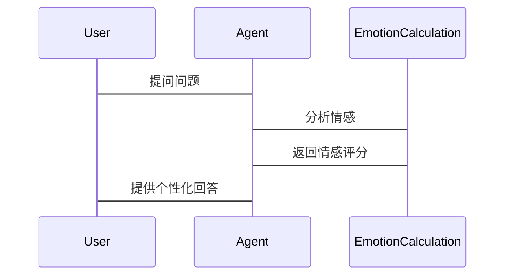

                 


# 开发AI Agent的情感计算在用户体验优化中的应用

> 关键词：AI Agent，情感计算，用户体验优化，机器学习，情感分析

> 摘要：本文将探讨AI Agent在用户体验优化中的情感计算应用。通过详细分析情感计算的核心概念、算法原理以及系统设计，结合实际项目案例，帮助读者理解如何通过情感计算提升AI Agent的用户体验优化能力。

---

## 第1章 情感计算与AI Agent概述

### 1.1 情感计算的基本概念

#### 1.1.1 情感计算的定义
情感计算（Affective Computing）是研究如何利用计算技术来识别、理解、分析和模拟人类情感的一门学科。它通过分析用户的情感状态，为用户提供更个性化的服务和交互体验。

#### 1.1.2 情感计算的核心要素
情感计算的核心要素包括：
1. **情感识别**：通过文本、语音或面部表情等输入，识别用户的情感状态。
2. **情感分析**：对情感数据进行分类，如正面、负面或中性。
3. **情感模拟**：根据用户的情感状态，生成相应的反馈或响应。

#### 1.1.3 情感计算与用户体验的关系
情感计算在用户体验优化中的作用至关重要。通过实时分析用户的情感状态，AI Agent可以动态调整交互策略，从而提升用户满意度和产品粘性。

### 1.2 AI Agent的定义与特点

#### 1.2.1 AI Agent的基本概念
AI Agent（人工智能代理）是一种能够感知环境、执行任务并做出决策的智能实体。它可以在没有人工干预的情况下，自主完成复杂任务。

#### 1.2.2 AI Agent的核心功能
1. **感知环境**：通过传感器或接口获取环境信息。
2. **推理与决策**：基于获取的信息，进行推理并做出决策。
3. **执行操作**：根据决策结果，执行相应的操作。

#### 1.2.3 AI Agent与传统软件的区别
AI Agent的核心区别在于其智能性和自主性。它能够学习、适应和优化自身行为，而传统软件则依赖于预定义的规则。

### 1.3 情感计算在AI Agent中的应用前景

#### 1.3.1 情感计算在AI Agent中的潜在应用领域
1. **智能客服**：通过情感计算分析用户情绪，提供更贴心的服务。
2. **教育辅助**：根据学生情绪状态，调整教学策略。
3. **健康管理**：通过情感分析，帮助用户管理心理健康。

#### 1.3.2 情感计算在用户体验优化中的优势
1. **个性化交互**：根据用户情感状态，提供定制化服务。
2. **实时反馈**：快速响应用户情感变化，提升交互效率。
3. **数据驱动优化**：通过情感数据，优化产品设计和服务流程。

#### 1.3.3 情感计算应用的挑战与机遇
- **挑战**：情感计算的准确性和实时性要求高，数据隐私问题突出。
- **机遇**：技术进步带来更高效的情感分析算法，应用场景广泛。

## 第2章 情感计算的核心概念与原理

### 2.1 情感计算的核心概念

#### 2.1.1 情感计算的输入与输出
- **输入**：文本、语音、面部表情等多模态数据。
- **输出**：情感类别（如正面、负面、中性）或情感强度评分。

#### 2.1.2 情感计算的关键技术
1. **自然语言处理（NLP）**：用于文本情感分析。
2. **计算机视觉（CV）**：用于面部表情识别。
3. **语音处理**：用于语音情感分析。

#### 2.1.3 情感计算的数学模型
情感计算的数学模型包括：
1. **情感评分模型**：将文本或语音转化为情感评分。
2. **情感分类模型**：将情感评分分为不同类别。

### 2.2 情感计算与AI Agent的关系

#### 2.2.1 情感计算在AI Agent中的作用
情感计算为AI Agent提供了理解用户情感的能力，使其能够更好地适应用户的交互需求。

#### 2.2.2 AI Agent如何利用情感计算优化用户体验
1. **动态调整交互策略**：根据用户情感状态，实时调整对话内容和语气。
2. **个性化推荐**：基于用户情感偏好，提供更符合其喜好的内容或服务。
3. **情绪管理**：帮助用户缓解负面情绪，提升整体体验。

### 2.3 情感计算的核心算法

#### 2.3.1 基于规则的情感计算
基于规则的情感计算通过预定义的规则来判断情感类别。例如，通过关键词匹配来识别正面或负面情感。

#### 2.3.2 基于机器学习的情感计算
基于机器学习的情感计算利用训练好的模型，自动识别情感特征并进行分类。常用算法包括支持向量机（SVM）和长短期记忆网络（LSTM）。

#### 2.3.3 情感计算的混合方法
混合方法结合了基于规则和基于机器学习的优势，通过规则过滤和模型校正，提升情感计算的准确性和鲁棒性。

## 第3章 情感计算的数学模型与算法原理

### 3.1 情感计算的数学模型

#### 3.1.1 情感评分模型
情感评分模型将输入的情感数据转化为具体的评分值。例如，将文本情感评分从0到1，其中0表示非常负面，1表示非常正面。

#### 3.1.2 情感分类模型
情感分类模型将情感评分分为多个类别，如正面、中性、负面。

#### 3.1.3 情感强度预测模型
情感强度预测模型预测情感的强度，如“非常高兴”或“轻微生气”。

### 3.2 情感计算的算法原理

#### 3.2.1 基于规则的算法
基于规则的算法通过预定义的规则进行情感分类。例如，匹配关键词“开心”则判定为正面情感。

#### 3.2.2 基于机器学习的算法
基于机器学习的算法利用训练数据，学习情感特征并进行分类。常用算法包括：
1. **支持向量机（SVM）**：用于情感分类的二分类问题。
2. **长短期记忆网络（LSTM）**：用于处理序列数据的情感分析。

#### 3.2.3 深度学习在情感计算中的应用
深度学习模型，如卷积神经网络（CNN）和循环神经网络（RNN），在情感计算中表现出色，能够捕捉复杂的语义信息。

### 3.3 情感计算的数学公式

#### 3.3.1 情感评分公式
$$ \text{情感评分} = \sum_{i=1}^{n} w_i \cdot f_i $$
其中，\( w_i \) 是第i个情感特征的权重，\( f_i \) 是第i个情感特征的值。

#### 3.3.2 情感分类公式
$$ P(y|x) = \frac{P(x|y)P(y)}{P(x)} $$
其中，\( P(y|x) \) 是在输入x下类别y的概率，\( P(x|y) \) 是类别y下输入x的条件概率，\( P(y) \) 是类别y的先验概率，\( P(x) \) 是输入x的总概率。

## 第4章 AI Agent的情感计算实现

### 4.1 AI Agent的情感计算模块设计

#### 4.1.1 情感数据的采集与预处理
情感数据的采集包括文本、语音和面部表情等多种形式。预处理步骤包括分词、去停用词和特征提取。

#### 4.1.2 情感特征的提取与分析
通过自然语言处理和特征工程，提取文本中的情感特征，如词袋模型和词嵌入。

#### 4.1.3 情感计算的结果输出
将情感计算的结果输出到AI Agent的其他模块，用于决策和交互。

### 4.2 基于规则的AI Agent情感计算实现

#### 4.2.1 规则库的构建
构建包含情感关键词和规则的情感规则库，用于快速判断情感类别。

#### 4.2.2 基于规则的情感评分计算
通过匹配规则库中的关键词，计算情感评分。

#### 4.2.3 规则库的优化与维护
定期更新和优化规则库，提升情感计算的准确性和覆盖率。

### 4.3 基于机器学习的AI Agent情感计算实现

#### 4.3.1 数据集的准备
收集和标注情感数据，构建训练集和测试集。

#### 4.3.2 模型的训练与优化
使用训练数据训练情感分类模型，调整模型参数，提升分类准确率。

#### 4.3.3 模型的部署与应用
将训练好的模型部署到AI Agent中，实时处理用户情感数据，提供个性化服务。

## 第5章 项目实战：AI Agent情感计算的实现与优化

### 5.1 项目背景与目标
本项目旨在开发一个基于情感计算的AI Agent，用于优化用户体验。目标包括情感数据采集、情感分析和情感驱动的交互优化。

### 5.2 系统功能设计

#### 5.2.1 领域模型设计
领域模型类图展示了系统的各个模块及其交互关系，包括情感计算模块、用户交互模块和决策模块。



#### 5.2.2 系统架构设计
系统架构图展示了AI Agent的整体架构，包括前端交互模块、后端处理模块和情感计算模块。



#### 5.2.3 系统接口设计
系统接口包括用户输入接口、情感计算接口和决策模块接口，确保模块之间的高效交互。

#### 5.2.4 交互序列图
交互序列图展示了用户与AI Agent之间的交互流程，包括情感数据的采集、分析和反馈。



### 5.3 代码实现

#### 5.3.1 环境安装
需要安装的Python库包括：
```bash
pip install numpy
pip install scikit-learn
pip install matplotlib
pip install transformers
```

#### 5.3.2 核心代码实现

```python
from sklearn.feature_extraction.text import TfidfVectorizer
from sklearn.svm import SVC
from sklearn.metrics import accuracy_score
import numpy as np

# 数据预处理
def preprocess(text):
    # 分词和去停用词
    words = text.split()
    return ' '.join(words)

# 情感计算模块
class EmotionCalculator:
    def __init__(self):
        self.vectorizer = TfidfVectorizer()
        self.classifier = SVC()

    def train(self, X, y):
        self.vectorizer.fit(X)
        X_vec = self.vectorizer.transform(X)
        self.classifier.fit(X_vec, y)

    def predict(self, text):
        X_test = self.vectorizer.transform([text])
        return self.classifier.predict(X_test)

# AI Agent实现
class AIAssistant:
    def __init__(self):
        self.emotion_calculator = EmotionCalculator()

    def handle_request(self, request):
        # 情感计算
        emotion = self.emotion_calculator.predict(request)
        # 根据情感结果生成响应
        response = f"我理解您的情绪是 {emotion[0]}。有什么可以帮助您的吗？"
        return response

# 示例使用
assistant = AIAssistant()
assistant.emotion_calculator.train(X_train, y_train)
response = assistant.handle_request("我感到非常开心。")
print(response)
```

### 5.4 项目小结
通过本项目的实施，我们成功开发了一个基于情感计算的AI Agent，能够实时分析用户情感，提供个性化服务。这不仅提升了用户体验，还为后续优化提供了数据支持。

---

## 第6章 最佳实践与注意事项

### 6.1 小结
情感计算在AI Agent中的应用前景广阔，通过结合规则和机器学习方法，可以有效提升用户体验优化能力。

### 6.2 注意事项
1. **数据隐私**：确保情感数据的安全性和隐私性。
2. **模型优化**：持续优化情感计算模型，提升准确性和实时性。
3. **用户体验**：在实际应用中，确保情感计算的反馈自然且符合用户预期。

### 6.3 拓展阅读
- **推荐书籍**：《情感计算：人工智能的新方向》
- **相关论文**：《基于深度学习的情感分析研究》

---

## 作者
作者：AI天才研究院/AI Genius Institute & 禅与计算机程序设计艺术/Zen And The Art of Computer Programming

