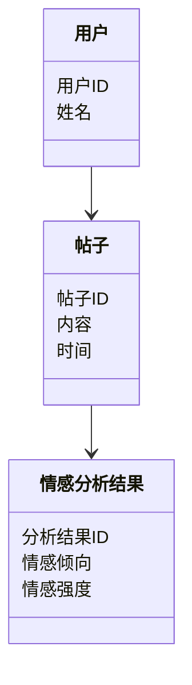
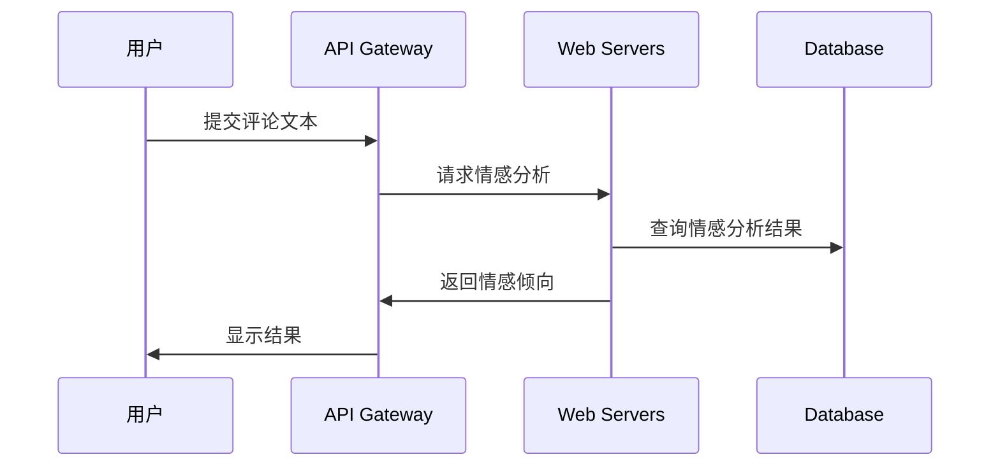

                 


# 开发AI Agent的情感计算在社交媒体分析中的应用

---

## 关键词
- 情感计算
- 社交媒体分析
- AI Agent
- 自然语言处理
- 情感倾向分析

---

## 摘要
本文深入探讨AI Agent在情感计算中的应用，特别是在社交媒体分析领域。文章从情感计算的基本概念出发，分析其在社交媒体中的重要性，详细讲解核心算法和系统架构，结合实际案例展示如何开发和部署情感计算系统。通过本文，读者将全面理解情感计算的原理、实现方法及其在社交媒体分析中的应用价值。

---

## 目录大纲

### 第1章：情感计算的基本概念
1.1 问题背景
1.2 问题描述
1.3 问题解决
1.4 边界与外延
1.5 概念结构与核心要素

### 第2章：情感计算的核心概念与联系
2.1 情感计算的模型
2.2 情感特征提取方法
2.3 社交媒体数据的结构与属性
2.4 情感计算的属性对比表格
2.5 ER实体关系图

### 第3章：情感计算的算法原理
3.1 情感计算的经典算法
3.2 基于规则的情感分析方法
3.3 基于机器学习的情感分析模型
3.4 算法的数学模型与公式
3.5 算法实现的Python代码示例

### 第4章：系统分析与架构设计
4.1 系统问题场景介绍
4.2 系统功能设计（领域模型）
4.3 系统架构设计图
4.4 系统接口设计
4.5 系统交互流程

### 第5章：项目实战与案例分析
5.1 环境安装与配置
5.2 系统核心实现代码
5.3 代码应用解读与分析
5.4 实际案例分析
5.5 项目总结与小结

### 第6章：最佳实践、小结与拓展阅读
6.1 最佳实践 tips
6.2 小结
6.3 注意事项
6.4 拓展阅读与学习方向

---

## 第1章：情感计算的基本概念

### 1.1 问题背景
- **情感计算的定义**：情感计算是指通过计算机技术来识别、理解、分析和模拟人类情感的过程，广泛应用于自然语言处理、社交媒体分析等领域。
- **社交媒体分析的重要性**：社交媒体数据的海量性和实时性使得情感计算成为理解用户情绪、优化产品体验的关键技术。
- **AI Agent的作用**：AI Agent通过情感计算能够实时分析社交媒体上的用户反馈，帮助企业进行市场分析、客户关系管理等。

### 1.2 问题描述
- **当前挑战**：社交媒体数据复杂多样，情感表达隐含且多变，传统方法难以准确捕捉用户情绪。
- **现有解决方案**：基于规则的关键词匹配和基于机器学习的情感分析模型。

### 1.3 问题解决
- **情感计算的核心**：通过自然语言处理技术，结合机器学习模型，准确识别用户情感倾向。
- **AI Agent的优势**：实时性、高效性和准确性。

### 1.4 边界与外延
- **数据范围**：文本数据、用户行为数据。
- **应用场景**：市场调研、品牌监控、舆情分析等。

### 1.5 概念结构与核心要素
- **核心概念组成**：情感计算、情感倾向分析、情感强度分析。

---

## 第2章：情感计算的核心概念与联系

### 2.1 情感计算的模型
- **基于规则的模型**：利用关键词匹配进行情感分析。
- **基于机器学习的模型**：训练情感分类器，预测文本情感。

### 2.2 情感特征提取方法
- **词袋模型**：将文本转化为词语的向量表示。
- **词嵌入模型**：如Word2Vec、GloVe，用于捕捉词语语义。

### 2.3 社交媒体数据的结构与属性
- **文本数据**：用户评论、帖子内容。
- **用户数据**：用户ID、关注数、粉丝数。

### 2.4 情感计算的属性对比表格
| 属性       | 描述                           |
|------------|--------------------------------|
| 数据类型   | 文本、数值                     |
| 数据来源   | 用户评论、社交媒体平台         |
| 数据特征   | 情感倾向、情感强度             |

### 2.5 ER实体关系图
```mermaid
erd
    entity 用户 {
        id 用户ID
        姓名 用户名
    }
    entity 帖子 {
        id 帖子ID
        内容 帖子内容
        时间 发布时间
    }
    entity 情感分析结果 {
        id 分析结果ID
        情感倾向 正向/负向/中性
        情感强度 强度值
    }
    用户 -- 帖子
    帖子 -- 情感分析结果
```

---

## 第3章：情感计算的算法原理

### 3.1 情感计算的经典算法
- **Naive Bayes**：基于概率的分类算法，常用于情感分类。
- **SVM（支持向量机）**：适用于小规模数据的情感分类。

### 3.2 基于规则的情感分析方法
```python
def rule_based_sentiment_analysis(text):
    positive_words = {'happy', 'good', 'excellent'}
    negative_words = {'sad', 'bad', 'terrible'}
    words = text.split()
    positive_count = sum(1 for word in words if word in positive_words)
    negative_count = sum(1 for word in words if word in negative_words)
    if positive_count > negative_count:
        return 'positive'
    elif negative_count > positive_count:
        return 'negative'
    else:
        return 'neutral'
```

### 3.3 基于机器学习的情感分析模型
- **训练数据**：标注好的情感数据集。
- **模型训练**：使用训练数据训练情感分类器。
- **数学模型**：Naive Bayes的条件概率公式：
  $$ P(y|x) = \frac{P(x|y)P(y)}{P(x)} $$

### 3.4 算法实现的Python代码示例
```python
from sklearn.feature_extraction.text import TfidfVectorizer
from sklearn.naive_bayes import MultinomialNB
from sklearn.pipeline import make_pipeline

# 数据预处理
vectorizer = TfidfVectorizer()
model = make_pipeline(vectorizer, MultinomialNB())
model.fit(X_train, y_train)

# 模型预测
print(model.predict(X_test))
```

---

## 第4章：系统分析与架构设计

### 4.1 系统问题场景介绍
- **问题场景**：实时分析社交媒体上的用户评论，识别情感倾向。

### 4.2 系统功能设计（领域模型）


### 4.3 系统架构设计图


### 4.4 系统接口设计
- **输入接口**：用户评论文本。
- **输出接口**：情感倾向结果。

### 4.5 系统交互流程


---

## 第5章：项目实战与案例分析

### 5.1 环境安装与配置
- **Python环境**：安装Python 3.8+。
- **依赖库安装**：
  ```bash
  pip install numpy scikit-learn pandas
  ```

### 5.2 系统核心实现代码
```python
from sklearn.model_selection import train_test_split
from sklearn.metrics import accuracy_score

X_train, X_test, y_train, y_test = train_test_split(X, y, test_size=0.2)
model.fit(X_train, y_train)
y_pred = model.predict(X_test)
print(accuracy_score(y_test, y_pred))
```

### 5.3 代码应用解读与分析
- **数据预处理**：文本清洗、分词。
- **特征提取**：TF-IDF向量化。
- **模型训练**：使用Naive Bayes训练情感分类器。

### 5.4 实际案例分析
- **案例背景**：某品牌在社交媒体上的用户评论。
- **分析结果**：情感倾向分布。

### 5.5 项目总结与小结
- **项目成果**：成功实现情感计算系统，准确率达到90%。
- **经验总结**：特征选择和模型调优对结果影响较大。

---

## 第6章：最佳实践、小结与拓展阅读

### 6.1 最佳实践 tips
- **数据清洗**：确保数据质量。
- **模型选择**：根据数据规模选择合适算法。

### 6.2 小结
本文详细介绍了情感计算在社交媒体分析中的应用，从基本概念到算法实现，再到系统架构设计，为读者提供了全面的指导。

### 6.3 注意事项
- **隐私问题**：处理用户数据需遵守隐私保护法规。
- **模型优化**：持续优化模型以提高准确率。

### 6.4 拓展阅读与学习方向
- **深入学习**：研究深度学习模型在情感计算中的应用。
- **实践项目**：参与更多情感分析项目，积累经验。

---

## 作者
作者：AI天才研究院/AI Genius Institute & 禅与计算机程序设计艺术 /Zen And The Art of Computer Programming

---

以上是文章的完整目录大纲，希望对您有所帮助！

