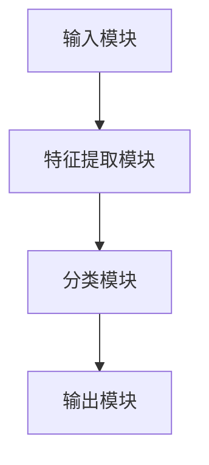

                 


# 开发AI Agent的情感计算模块

> 关键词：AI Agent，情感计算，自然语言处理，深度学习，机器学习，系统架构

> 摘要：本文详细探讨了开发AI Agent情感计算模块的各个方面，从基础概念到高级算法实现，再到系统架构设计。文章首先介绍了情感计算和AI Agent的基本概念及其在实际应用中的重要性。接着，深入分析了情感计算的核心原理、算法实现以及数学模型。随后，详细讨论了情感计算模块的系统架构设计、接口设计和交互流程。最后，通过实际项目案例展示了情感计算模块的开发过程，并总结了开发中的最佳实践和注意事项。

---

# 第1章: 情感计算与AI Agent概述

## 1.1 情感计算的基本概念

### 1.1.1 情感计算的定义
情感计算（Affective Computing）是计算机科学与心理学交叉领域的重要研究方向，旨在通过计算技术理解和模拟人类情感。情感计算的目标是让计算机能够像人类一样感知、理解和响应情感信息。

### 1.1.2 情感计算的核心要素
情感计算的核心要素包括：
1. **情感识别**：通过文本、语音或图像等输入，识别出其中的情感倾向（如正面、负面、中性）。
2. **情感分析**：对情感信息进行分类，如情感强度、情感类型（如愤怒、快乐、悲伤）。
3. **情感生成**：根据输入的情感信息，生成相应的情感表达或响应。

### 1.1.3 情感计算的应用场景
情感计算在多个领域有广泛应用，如智能客服、教育技术、健康管理、游戏设计等。例如，在智能客服中，情感计算可以用于分析用户情绪，提供更贴心的服务。

## 1.2 AI Agent的基本概念

### 1.2.1 AI Agent的定义
AI Agent（人工智能代理）是指能够感知环境、自主决策并执行任务的智能实体。AI Agent可以是软件程序或物理设备，具有自主性、反应性、目标导向性和社交能力。

### 1.2.2 AI Agent的分类
AI Agent可以根据功能、智能水平和环境类型进行分类：
1. **任务导向型Agent**：专注于完成特定任务，如智能助手。
2. **通用型Agent**：具备广泛的知识和能力，能够处理多种任务。
3. **反应型Agent**：根据环境反馈实时调整行为。

### 1.2.3 AI Agent的核心功能
AI Agent的核心功能包括：
1. **感知环境**：通过传感器或输入数据感知外部环境。
2. **决策制定**：基于感知信息进行分析和决策。
3. **执行任务**：根据决策结果执行相应操作。

## 1.3 情感计算在AI Agent中的作用

### 1.3.1 情感计算与AI Agent的结合
情感计算为AI Agent提供了情感理解和表达的能力，使其能够更好地与人类用户进行交互。例如，在智能音箱中，情感计算可以帮助识别用户的语气和情绪，从而提供更个性化的服务。

### 1.3.2 情感计算在AI Agent中的应用场景
1. **智能客服**：通过情感计算分析用户情绪，提供更贴心的服务。
2. **教育技术**：根据学生情绪调整教学策略。
3. **健康管理**：通过情感分析帮助用户管理情绪健康。

### 1.3.3 情感计算对AI Agent性能的提升
情感计算使AI Agent能够更好地理解用户需求，提高交互的准确性和效率。例如，在对话系统中，情感计算可以增强用户体验，使其更加自然和流畅。

## 1.4 本章小结
本章介绍了情感计算和AI Agent的基本概念，探讨了情感计算在AI Agent中的作用和应用场景。通过理解这些内容，我们可以更好地理解情感计算模块在AI Agent开发中的重要性。

---

# 第2章: 情感计算的核心概念与原理

## 2.1 情感计算的核心概念

### 2.1.1 情感分析的基本原理
情感分析是情感计算的核心任务之一，旨在对文本或语音的情感倾向进行分类。情感分析通常分为两个步骤：特征提取和分类。

### 2.1.2 情感计算的特征提取
特征提取是情感分析的关键步骤，常用的特征包括词袋模型、TF-IDF、词嵌入（如Word2Vec、GloVe）等。特征提取的目标是将文本或语音转换为可计算的向量形式。

### 2.1.3 情感计算的分类模型
常用的分类模型包括基于规则的模型（如情感词典）和基于机器学习的模型（如SVM、随机森林）以及基于深度学习的模型（如LSTM、Transformer）。

## 2.2 情感计算与AI Agent的联系

### 2.2.1 情感计算在AI Agent中的输入输出关系
AI Agent的情感计算模块通常接收用户输入（如文本或语音），并输出情感分析结果（如情感类别、情感强度）。这些结果可以用于后续的决策制定和任务执行。

### 2.2.2 情感计算对AI Agent决策的影响
情感计算可以帮助AI Agent理解用户的情感状态，从而调整其行为策略。例如，在智能音箱中，情感计算可以用于识别用户的语气，从而调整音乐播放列表或提醒用户注意情绪变化。

### 2.2.3 情感计算与AI Agent的交互过程
情感计算模块通常嵌入在AI Agent的交互流程中，通过实时或离线方式处理用户输入，生成情感分析结果，并将其传递给决策模块。

## 2.3 情感计算的核心原理

### 2.3.1 情感计算的特征提取方法
特征提取是情感计算的关键步骤，常用的特征提取方法包括：
1. **词袋模型**：基于词频统计的特征提取方法。
2. **TF-IDF**：基于词频和逆文档频率的特征提取方法。
3. **词嵌入**：将词表示为低维向量（如Word2Vec、GloVe）。

### 2.3.2 情感计算的分类算法
常用的分类算法包括：
1. **基于规则的分类**：如情感词典法。
2. **基于机器学习的分类**：如SVM、随机森林。
3. **基于深度学习的分类**：如LSTM、Transformer。

### 2.3.3 情感计算的模型优化
模型优化包括数据预处理、特征选择、模型调优等步骤。例如，可以通过交叉验证选择最优的分类算法，并通过正则化方法防止过拟合。

## 2.4 本章小结
本章详细探讨了情感计算的核心概念与原理，包括特征提取、分类算法和模型优化。通过理解这些内容，我们可以为AI Agent开发更高效的情感计算模块。

---

# 第3章: 情感计算的算法原理与实现

## 3.1 情感计算的算法原理

### 3.1.1 基于规则的情感计算
基于规则的情感计算通过预定义的情感词典进行情感分析。例如，如果文本中包含正面词汇（如“好”、“喜欢”），则判断情感为正面。

### 3.1.2 基于机器学习的情感计算
基于机器学习的情感计算通过训练数据学习情感分类器。例如，使用SVM或随机森林算法进行分类。

### 3.1.3 基于深度学习的情感计算
基于深度学习的情感计算通过神经网络模型（如LSTM、Transformer）进行情感分析。这些模型能够自动提取特征并进行分类。

## 3.2 情感计算的数学模型

### 3.2.1 情感计算的特征向量表示
特征向量是将文本或语音转换为数值向量的过程。例如，使用Word2Vec将每个词表示为低维向量。

### 3.2.2 情感计算的分类函数
分类函数是将特征向量映射到情感类别（如正面、负面、中性）的函数。例如，使用逻辑回归进行分类。

### 3.2.3 情感计算的损失函数
损失函数用于衡量模型预测与真实值之间的差异。例如，交叉熵损失函数常用于分类任务。

## 3.3 情感计算的算法实现

### 3.3.1 基于规则的情感计算实现
基于规则的情感计算实现简单，但效果有限。例如，可以使用情感词典（如AFIN-LEX）进行情感分类。

### 3.3.2 基于机器学习的情感计算实现
基于机器学习的情感计算需要标注数据进行训练。例如，使用SVM进行分类。

### 3.3.3 基于深度学习的情感计算实现
基于深度学习的情感计算需要大量数据和计算资源。例如，使用预训练的BERT模型进行情感分析。

## 3.4 本章小结
本章详细探讨了情感计算的算法原理与实现，包括基于规则、机器学习和深度学习的情感计算方法。通过理解这些内容，我们可以为AI Agent开发更高效的情感计算模块。

---

# 第4章: 情感计算的系统分析与架构设计

## 4.1 情感计算系统的功能需求

### 4.1.1 情感计算的基本功能
情感计算模块的基本功能包括情感识别、情感分析和情感生成。

### 4.1.2 情感计算的高级功能
高级功能包括情感强度分析、情感类型识别和情感预测。

### 4.1.3 情感计算的性能需求
性能需求包括处理速度、准确率和资源占用。

## 4.2 情感计算系统的架构设计

### 4.2.1 情感计算系统的模块划分
情感计算系统通常包括输入模块、特征提取模块、分类模块和输出模块。

### 4.2.2 情感计算系统的数据流设计
数据流设计描述了输入数据如何在系统中流动和处理。

### 4.2.3 情感计算系统的模块交互
模块交互描述了不同模块之间的接口和数据传递关系。

## 4.3 情感计算系统的架构设计图
以下是情感计算系统的架构设计图：



## 4.4 本章小结
本章详细探讨了情感计算系统的功能需求和架构设计，为AI Agent的情感计算模块提供了设计依据。

---

# 第5章: 情感计算模块的项目实战

## 5.1 项目环境搭建

### 5.1.1 环境要求
需要安装Python、TensorFlow、Keras等依赖库。

### 5.1.2 工具安装
使用pip安装所需的Python包。

## 5.2 情感计算模块的核心实现

### 5.2.1 情感分析代码实现
以下是一个基于机器学习的情感分析代码示例：

```python
from sklearn.feature_extraction.text import TfidfVectorizer
from sklearn.svm import SVC

# 数据预处理
X = [...]  # 特征文本
y = [...]  # 情感标签

# 特征提取
vectorizer = TfidfVectorizer()
X_vec = vectorizer.fit_transform(X)

# 模型训练
model = SVC()
model.fit(X_vec, y)

# 模型预测
test_X = [...]  # 测试文本
test_X_vec = vectorizer.transform(test_X)
predictions = model.predict(test_X_vec)
```

### 5.2.2 模型优化与调优
通过交叉验证选择最优的分类算法，并通过正则化方法防止过拟合。

## 5.3 项目实战案例分析

### 5.3.1 案例背景
假设我们开发一个智能客服系统，需要对用户输入的情感进行分类。

### 5.3.2 数据集准备
需要准备包含用户输入和情感标签的数据集。

### 5.3.3 模型训练与测试
使用训练数据训练情感分类器，并在测试数据上评估模型性能。

## 5.4 项目小结
本章通过实际项目展示了情感计算模块的开发过程，包括环境搭建、代码实现和案例分析。

---

# 第6章: 情感计算模块的最佳实践

## 6.1 情感计算开发中的注意事项

### 6.1.1 数据质量
确保数据的多样性和代表性。

### 6.1.2 模型选择
根据任务需求选择合适的模型。

### 6.1.3 性能优化
通过特征选择和模型优化提高计算效率。

## 6.2 情感计算开发中的最佳实践

### 6.2.1 设计原则
遵循模块化、可扩展和可维护的设计原则。

### 6.2.2 测试方法
采用单元测试、集成测试和用户测试等多种测试方法。

### 6.2.3 部署注意事项
确保系统在实际环境中的稳定性和可扩展性。

## 6.3 本章小结
本章总结了情感计算模块开发中的注意事项和最佳实践，为读者提供了宝贵的开发经验。

---

# 附录

## 附录A: 情感计算相关工具与库

### 1. 情感分析库
- **NLTK**：自然语言处理工具包。
- **TextBlob**：基于NLTK的简化接口。

### 2. 深度学习库
- **TensorFlow**：Google的深度学习框架。
- **Keras**：基于TensorFlow的高级API。

## 附录B: 进一步学习资源

### 1. 教科书
- 《情感计算入门》
- 《深度学习实战》

### 2. 在线课程
- Coursera上的《情感计算与自然语言处理》。

---

# 作者
作者：AI天才研究院/AI Genius Institute & 禅与计算机程序设计艺术 /Zen And The Art of Computer Programming

---

以上是《开发AI Agent的情感计算模块》的技术博客文章的完整目录和内容概要。根据实际需要，您可以进一步扩展每个章节的内容，添加更多细节和具体案例。

