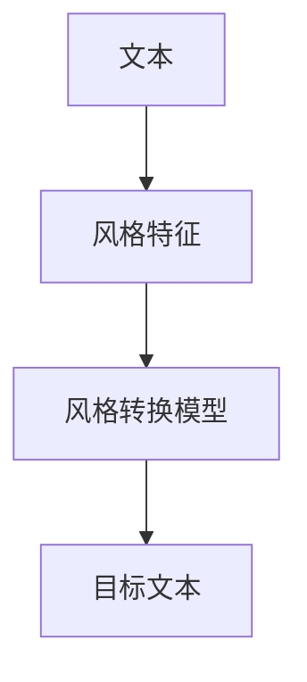
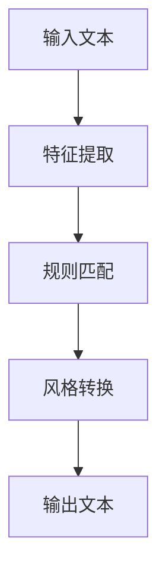
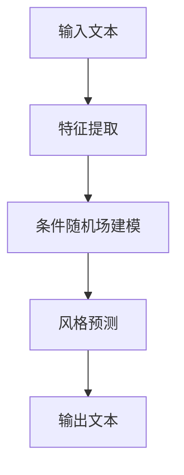
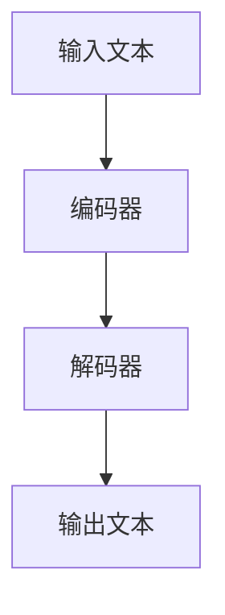
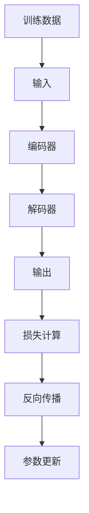
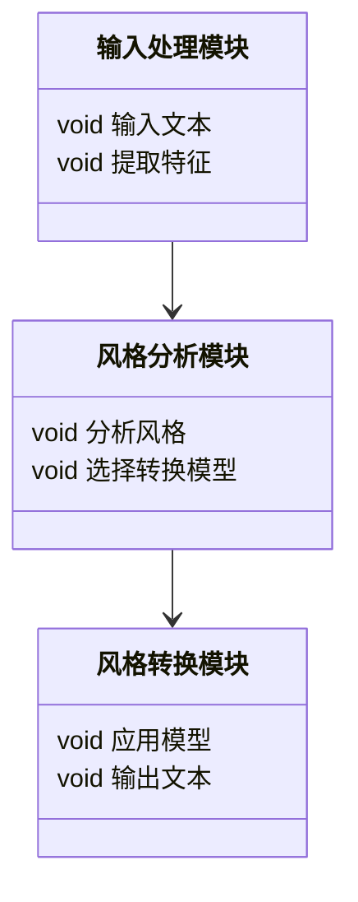

                 


# 开发AI Agent的文本风格转换能力

## 关键词：
AI Agent, 文本风格转换, 自然语言处理, 机器学习, 深度学习, 条件随机场, Transformer模型

## 摘要：
本文旨在探讨AI Agent在文本风格转换中的应用，从基础概念到算法实现，再到系统设计与实战案例，系统地分析和实现文本风格转换的关键技术。通过本文的学习，读者能够掌握AI Agent文本风格转换的核心原理，了解不同算法模型的优劣，并能够实际动手实现一个完整的文本风格转换系统。

---

# 第一部分: AI Agent与文本风格转换概述

# 第1章: AI Agent与文本风格转换的背景与概念

## 1.1 问题背景与描述
### 1.1.1 AI Agent的基本概念
AI Agent（智能代理）是指能够感知环境并采取行动以实现目标的智能系统。它可以在多个领域中应用，如自然语言处理、推荐系统、自动化任务等。

### 1.1.2 文本风格转换的定义
文本风格转换是指将一段文本从一种风格或语气转换为另一种风格的过程。例如，将正式的商务邮件转换为更口语化的社交媒体帖子，或将复杂的学术论文简化为通俗易懂的文章。

### 1.1.3 问题的解决方法与目标
文本风格转换的目标是通过AI Agent实现自动化、高效的文本风格转换，同时保持原文的意思和语义不变。常见的解决方法包括基于规则的转换、统计学习模型和深度学习模型。

### 1.1.4 问题的边界与外延
文本风格转换的边界在于保持原文的语义不变，同时改变其表达方式。其外延包括文本生成、文本编辑、文本摘要等任务。

### 1.1.5 核心概念的结构与组成要素
文本风格转换的核心要素包括输入文本、风格特征、风格转换模型和输出文本。

## 1.2 文本风格转换的核心要素
### 1.2.1 文本风格的分类与特征
文本风格可以分为正式、口语化、幽默、严肃等类型。每种风格都有其独特的特征，例如句式复杂度、词汇选择、语气等。

### 1.2.2 AI Agent在文本风格转换中的角色
AI Agent作为智能代理，负责接收输入文本，分析其风格特征，选择合适的转换模型，并输出目标风格的文本。

### 1.2.3 与文本生成、文本编辑的对比分析
文本风格转换与文本生成的区别在于，前者注重改变表达方式，而后者注重生成新的内容。文本编辑则是对已有文本进行修改，风格转换则是在编辑的基础上加入风格变换的任务。

## 1.3 本章小结
本章主要介绍了AI Agent与文本风格转换的基本概念、核心要素及其应用场景。通过对比分析，明确了文本风格转换在自然语言处理中的独特地位。

---

# 第2章: 文本风格转换的核心概念与联系

## 2.1 核心概念原理
### 2.1.1 文本风格转换的数学模型
文本风格转换可以通过多种数学模型实现，如基于条件随机场（CRF）的风格转换模型。

### 2.1.2 AI Agent的决策机制
AI Agent通过分析输入文本的特征，选择合适的风格转换策略。

### 2.1.3 风格表示的特征分析
文本风格可以通过词汇、句式、语义等特征进行表示。

## 2.2 核心概念对比分析
### 2.2.1 不同文本风格的特征对比表格
| 风格类型 | 词汇选择 | 句式复杂度 | 语气 |
|----------|-----------|------------|------|
| 正式     | 专业术语   | 复杂       | 严肃 |
| 口语化   | 日常用语   | 简单       | 友好 |

### 2.2.2 风格转换的ER实体关系图


## 2.3 本章小结
本章通过表格和ER图的形式，详细对比了不同文本风格的特征，并通过Mermaid图展示了风格转换的核心概念。

---

# 第3章: 文本风格转换的算法原理

## 3.1 基于规则的风格转换算法
### 3.1.1 算法流程图


### 3.1.2 Python实现示例
```python
def style_convert(text):
    # 特征提取
    features = extract_features(text)
    # 规则匹配
    matched_rule = find_matching_rule(features)
    # 转换实现
    converted_text = apply_rule(matched_rule, text)
    return converted_text
```

## 3.2 统计学习模型的风格转换
### 3.2.1 基于条件随机场的风格转换
条件随机场（CRF）是一种用于序列标注的模型，可以用于风格转换任务。

### 3.2.2 算法流程图


## 3.3 深度学习模型的风格转换

---

## 3.4 本章小结
本章详细介绍了基于规则和统计学习的风格转换算法，并给出了Python实现示例和流程图。

---

# 第4章: 基于深度学习的文本风格转换

## 4.1 Transformer模型在风格转换中的应用
### 4.1.1 Transformer模型的结构


### 4.1.2 基于Transformer的风格转换模型
通过预训练的Transformer模型，可以实现高效的文本风格转换。

## 4.2 深度学习模型的训练与优化
### 4.2.1 模型训练流程


### 4.2.2 模型优化技巧
包括学习率调整、批次归一化、 dropout 等技术。

## 4.3 本章小结
本章介绍了深度学习模型在文本风格转换中的应用，特别是Transformer模型的结构和训练流程。

---

# 第5章: AI Agent文本风格转换系统的架构设计

## 5.1 问题场景介绍
AI Agent需要处理大量的文本数据，并根据需求进行风格转换。

## 5.2 系统功能设计
### 5.2.1 功能模块划分
包括输入处理模块、风格分析模块、风格转换模块和输出模块。

### 5.2.2 领域模型图


## 5.3 系统架构设计
### 5.3.1 分层架构
```
输入层 --> 处理层 --> 转换层 --> 输出层
```

### 5.3.2 模块间的接口设计
包括特征提取接口、模型选择接口和输出生成接口。

## 5.4 本章小结
本章详细设计了AI Agent文本风格转换系统的架构，包括功能模块划分和接口设计。

---

# 第6章: 项目实战——开发一个简单的文本风格转换系统

## 6.1 环境安装
安装Python、TensorFlow、Keras等开发环境。

## 6.2 核心代码实现
### 6.2.1 特征提取模块
```python
def extract_features(text):
    # 实现特征提取逻辑
    return features
```

### 6.2.2 风格转换模块
```python
def style_convert(text):
    features = extract_features(text)
    model = select_model(features)
    converted_text = apply_model(model, text)
    return converted_text
```

## 6.3 案例分析与详细解读
通过具体案例，展示系统如何实现从输入到输出的风格转换。

## 6.4 项目小结
总结项目开发过程中的经验和教训。

---

# 第7章: 最佳实践与注意事项

## 7.1 小结
总结全文的核心内容和主要结论。

## 7.2 注意事项
包括模型选择、数据预处理、性能优化等方面的注意事项。

## 7.3 拓展阅读
推荐相关领域的书籍和论文，供读者进一步学习。

---

# 作者：AI天才研究院/AI Genius Institute & 禅与计算机程序设计艺术 /Zen And The Art of Computer Programming

