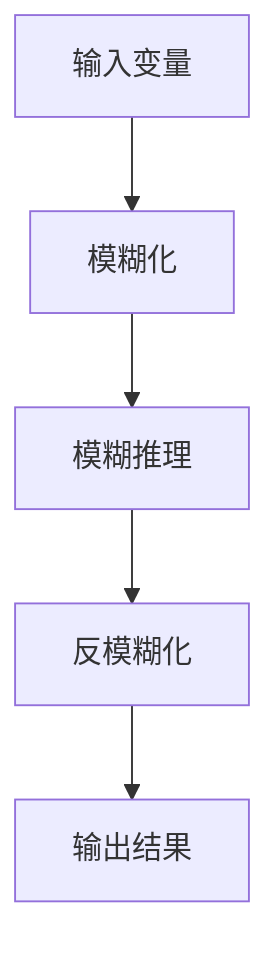
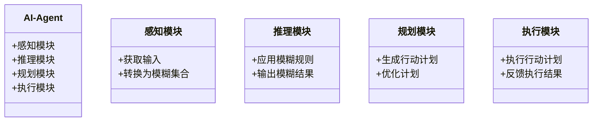
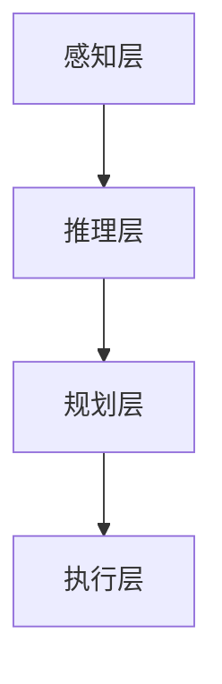

                 


# 开发AI Agent的模糊逻辑推理能力

---

## 关键词：AI Agent，模糊逻辑，模糊推理，自然语言处理，决策支持系统，模糊集合，隶属度函数

---

## 摘要：模糊逻辑是一种处理不确定性问题的有效方法，AI Agent需要在复杂和模糊的环境中做出决策。本文详细探讨了模糊逻辑在AI Agent中的应用，从基本概念到算法实现，再到系统设计，最后通过实际案例展示如何开发具备模糊逻辑推理能力的AI Agent。

---

# 第一部分：模糊逻辑与AI Agent的背景介绍

## 第1章：模糊逻辑的基本概念

### 1.1 模糊逻辑的定义与特点

模糊逻辑是一种处理模糊性问题的数学框架，它允许命题的真值在0到1之间变化，而非传统的二值逻辑。这种特性使其非常适合处理现实世界中的不确定性问题。

#### 模糊逻辑的特点：
- **连续性**：允许命题的真值在0到1之间连续变化。
- **可调节性**：可以根据具体问题调整模糊规则的隶属度。
- **灵活性**：适用于处理模糊、不精确的信息。

### 1.2 AI Agent的基本概念

AI Agent是一种智能体，能够感知环境、自主决策并执行任务。AI Agent的核心能力包括感知、推理、规划和执行。

#### AI Agent的分类：
- **简单反射式AI Agent**：基于当前感知做出反应。
- **基于模型的AI Agent**：利用内部模型进行推理和规划。
- **实用基于模型的AI Agent**：基于效用函数做出决策。

### 1.3 模糊逻辑与AI Agent的结合

模糊逻辑为AI Agent提供了处理模糊信息的能力，使其在复杂和不确定的环境中能够做出更智能的决策。

---

## 第2章：模糊逻辑的核心原理

### 2.1 模糊集合与隶属度函数

模糊集合是一种允许元素部分属于集合的数学概念，而隶属度函数用于描述每个元素属于某个集合的程度。

#### 隶属度函数的类型：
- ** crisp函数**：0或1，表示完全不属于或属于。
- **梯形函数**：平滑过渡的隶属度曲线。
- **三角形函数**：线性的隶属度变化。

### 2.2 模糊逻辑运算

模糊逻辑运算包括模糊与、模糊或和模糊非，它们在处理模糊信息时起关键作用。

#### 模糊逻辑运算的数学表达式：
- **模糊与**：使用最小值函数，例如 $A \land B = \min(A, B)$。
- **模糊或**：使用最大值函数，例如 $A \lor B = \max(A, B)$。
- **模糊非**：使用补集函数，例如 $\lnot A = 1 - A$。

---

## 第3章：模糊推理的原理与方法

### 3.1 模糊推理的基本概念

模糊推理是基于模糊逻辑的推理过程，通常包括模糊化、推理和反模糊化三个步骤。

#### 模糊推理的过程：
1. **模糊化**：将输入信息转换为模糊集合。
2. **推理**：应用模糊规则进行推理。
3. **反模糊化**：将模糊结果转换为精确值。

### 3.2 模糊推理的具体方法

#### 3.2.1 基于Mamdani推理方法

Mamdani方法是一种常用的模糊推理方法，它使用模糊集合运算来处理规则。

#### 3.2.2 基于Gaines-Bellman推理方法

Gaines-Bellman方法是另一种模糊推理方法，适用于连续的模糊推理过程。

---

## 第4章：模糊推理算法的实现

### 4.1 模糊推理算法的流程图



### 4.2 模糊推理算法的Python实现

```python
# 模糊化过程
def fuzzification(input_value, membership_function):
    return membership_function(input_value)

# 推理过程
def fuzzy_inference(rule_base, fuzzy_input):
    # 假设rule_base是一个模糊规则列表
    # 每个规则形如：如果A是X，则B是Y
    # 其中X和Y是模糊集合
    results = []
    for rule in rule_base:
        antecedent = rule['antecedent']
        consequent = rule['consequent']
        # 计算前件的隶属度
        antecedent_membership = fuzzification(antecedent['input'], antecedent['membership_function'])
        # 计算后件的隶属度
        consequent_membership = fuzzification(consequent['input'], consequent['membership_function'])
        results.append({'antecedent': antecedent_membership, 'consequent': consequent_membership})
    return results

# 反模糊化过程
def defuzzification(fuzzy_output, defuzzification_method):
    if defuzzification_method == 'centroid':
        return calculate_centroid(fuzzy_output)
    elif defuzzification_method == 'max':
        return calculate_max(fuzzy_output)
    else:
        raise ValueError("Invalid defuzzification method")
```

---

## 第5章：模糊逻辑推理的数学模型

### 5.1 模糊逻辑的数学基础

模糊逻辑的数学模型包括模糊关系和模糊推理的合成规则。

#### 模糊关系的定义：
- 模糊关系是一种模糊集合，表示两个集合之间的关系。

#### 模糊推理的合成规则：
- 使用模糊关系和合成规则进行推理，例如Sugeno推理方法。

---

## 第6章：AI Agent中的模糊逻辑应用案例

### 6.1 自然语言处理中的应用

模糊逻辑可以用于处理自然语言中的模糊性，例如情感分析和意图识别。

### 6.2 决策支持系统中的应用

模糊逻辑可以用于构建决策支持系统，帮助AI Agent在不确定环境中做出决策。

---

## 第7章：开发AI Agent的系统架构设计

### 7.1 系统功能设计

AI Agent的系统功能包括感知、推理、规划和执行。

#### 领域模型类图：


### 7.2 系统架构设计

AI Agent的系统架构包括感知层、推理层、规划层和执行层。

#### 系统架构图：


### 7.3 系统接口设计

系统接口包括输入接口、输出接口和反馈接口。

---

## 第8章：项目实战：开发具备模糊逻辑推理能力的AI Agent

### 8.1 项目环境安装

安装必要的Python库，例如Fuzzywalrus和Scikit-fuzzy。

### 8.2 核心代码实现

实现模糊化、推理和反模糊化过程的代码。

### 8.3 案例分析与解读

通过一个具体案例展示模糊逻辑在AI Agent中的应用，例如智能客服系统的实现。

---

## 第9章：总结与展望

### 9.1 本文总结

模糊逻辑在AI Agent中的应用增强了其处理复杂和模糊问题的能力，为智能系统的发展提供了新的思路。

### 9.2 未来展望

未来的研究方向包括模糊逻辑与深度学习的结合，以及在更多领域的应用。

---

## 作者：AI天才研究院/AI Genius Institute & 禅与计算机程序设计艺术 /Zen And The Art of Computer Programming

---

这篇文章详细探讨了模糊逻辑在AI Agent中的应用，从基本概念到算法实现，再到系统设计，最后通过实际案例展示如何开发具备模糊逻辑推理能力的AI Agent。

