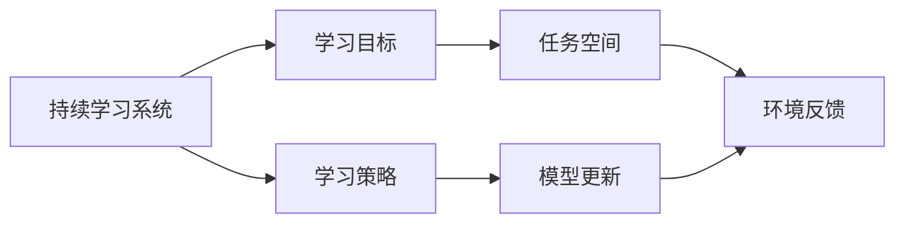

                 


# 开发AI Agent的自学习能力：持续学习机制

> 关键词：持续学习，AI Agent，模型更新，经验重放，在线学习，离线学习

> 摘要：本文将探讨AI Agent的自学习能力，重点介绍持续学习机制。文章从持续学习的定义、核心概念、算法实现到系统设计和项目实战，全面分析AI Agent的持续学习能力，并通过具体案例展示如何实现高效的持续学习机制，帮助读者掌握AI Agent的自学习能力开发。

---

# 第一部分: AI Agent的自学习能力基础

# 第1章: 持续学习机制概述

## 1.1 持续学习的定义与背景

### 1.1.1 什么是持续学习
持续学习（Lifelong Learning）是一种机器学习范式，允许模型在连续的任务流中逐步学习和适应，无需重新训练整个模型。与传统的批量学习不同，持续学习强调模型在动态环境中逐步积累知识，应对新任务或数据的变化。

### 1.1.2 持续学习的背景与意义
随着人工智能技术的快速发展，AI Agent需要在复杂多变的环境中自主完成任务。持续学习通过允许模型在线更新和适应，能够有效应对动态环境中的挑战。例如，在智能助手、自动驾驶和机器人等领域，持续学习能够使系统在使用过程中不断优化性能。

### 1.1.3 持续学习与传统机器学习的区别
| 特性         | 批量学习          | 持续学习         |
|--------------|------------------|------------------|
| 数据处理方式  | 批处理            | 流式处理          |
| 任务处理方式  | 单一任务          | 多任务、连续任务  |
| 模型更新方式  | 一次性训练        | 在线更新          |
| 知识积累      | 无                | 有                |

## 1.2 AI Agent与持续学习的关系

### 1.2.1 AI Agent的基本概念
AI Agent是一种智能体，能够感知环境、执行任务并做出决策。AI Agent的核心能力包括感知能力、推理能力、学习能力和执行能力。持续学习机制是提升AI Agent自适应能力的关键。

### 1.2.2 持续学习在AI Agent中的作用
持续学习使AI Agent能够在动态环境中不断优化自身行为。例如，在智能客服系统中，AI Agent可以通过持续学习掌握最新的产品知识，提高服务质量。

### 1.2.3 持续学习与AI Agent能力提升的关系
持续学习通过模型更新和知识积累，显著提升了AI Agent的泛化能力、适应能力和问题解决能力。AI Agent通过持续学习能够更好地应对未知挑战。

## 1.3 持续学习的核心概念与特征

### 1.3.1 持续学习的核心概念
持续学习的核心概念包括模型更新、经验重放、任务迁移和在线学习。这些概念共同构成了持续学习的理论基础。

### 1.3.2 持续学习的特征对比表
| 特性         | 在线学习          | 离线学习         |
|--------------|------------------|------------------|
| 数据来源      | 实时数据流        | 离线数据集        |
| 训练方式      | 流式训练          | 批量训练          |
| 模型更新      | 微调             | 重训练            |
| 适应性        | 高               | 中               |

### 1.3.3 持续学习的ER实体关系图



## 1.4 持续学习的类型与场景

### 1.4.1 在线学习与离线学习
在线学习是指模型在数据流中逐个样本进行学习，适用于实时数据处理；离线学习是指模型在批量数据上进行训练，适用于离线数据分析。

### 1.4.2 任务迁移与任务无关学习
任务迁移是指利用之前任务的知识来辅助当前任务学习；任务无关学习是指每个任务独立进行学习。

### 1.4.3 持续学习的典型应用场景
持续学习在智能客服、推荐系统、自动驾驶等领域有广泛应用。例如，在自动驾驶系统中，持续学习能够帮助AI Agent实时更新道路规则和驾驶策略。

---

# 第二部分: 持续学习机制的核心算法

# 第2章: 模型更新策略

## 2.1 模型更新的基本原理

### 2.1.1 模型更新的必要性
模型更新是指在持续学习过程中，根据新的数据或任务，调整模型参数以提升性能。模型更新能够使AI Agent在动态环境中保持竞争力。

### 2.1.2 模型更新的数学模型
模型更新的数学模型可以表示为：
$$f(x) = w^T x + b$$
其中，$w$是权重向量，$b$是偏置项，$x$是输入样本。

模型更新的优化目标是最小化损失函数：
$$L(w) = \frac{1}{n}\sum_{i=1}^{n} (y_i - f(x_i))^2$$
通过梯度下降算法，可以逐步更新权重：
$$w_{new} = w + \alpha \nabla L$$

### 2.1.3 模型更新的优化方法
模型更新的优化方法包括增量式更新、随机优化和负梯度下降算法。

---

## 2.2 模型更新的优化方法

### 2.2.1 增量式更新
增量式更新是指每次仅更新部分参数，适用于在线学习场景。

### 2.2.2 随机优化方法
随机优化方法是指利用随机梯度下降等算法，通过随机选择样本进行更新。

### 2.2.3 负梯度下降算法
负梯度下降算法是一种特殊的优化方法，用于解决非凸优化问题。

## 2.3 模型更新的算法流程图


---

# 第3章: 经验重放机制

## 3.1 经验重放的基本原理

### 3.1.1 经验重放的定义
经验重放是指将过去的经验存储在记忆库中，并在后续学习过程中随机采样这些经验进行训练。

### 3.1.2 经验重放的作用
经验重放能够缓解短期记忆不足的问题，帮助模型更好地泛化。

### 3.1.3 经验重放的实现方法
经验重放的实现方法包括使用队列存储经验，随机采样经验进行训练。

## 3.2 经验重放的优化策略

### 3.2.1 优先级队列
优先级队列根据经验的重要程度进行排序，优先选择重要经验进行训练。

### 3.2.2 增量式经验重放
增量式经验重放是指在每次学习时，逐步增加新的经验到队列中。

### 3.2.3 分布式经验重放
分布式经验重放是指在分布式系统中并行处理经验重放，提高训练效率。

## 3.3 经验重放的算法实现

### 3.3.1 经验重放流程图


---

# 第三部分: AI Agent的持续学习系统设计

# 第4章: 系统架构与实现

## 4.1 系统架构设计

### 4.1.1 系统功能模块
系统功能模块包括感知模块、决策模块、学习模块和执行模块。

### 4.1.2 系统架构图


### 4.1.3 系统交互流程图


## 4.2 核心算法实现

### 4.2.1 模型更新算法
模型更新算法代码示例：

```python
def update_model(model, optimizer, loss_fn, inputs, targets):
    outputs = model(inputs)
    loss = loss_fn(outputs, targets)
    loss.backward()
    optimizer.step()
```

### 4.2.2 经验重放算法
经验重放算法代码示例：

```python
class ExperienceReplay:
    def __init__(self, capacity):
        self.capacity = capacity
        self.memory = deque(maxlen=capacity)
    
    def remember(self, state, action, reward, next_state):
        self.memory.append((state, action, reward, next_state))
    
    def sample(self, batch_size):
        batch = random.sample(self.memory, batch_size)
        return batch
```

## 4.3 项目实战: 智能客服系统的持续学习实现

### 4.3.1 项目背景
智能客服系统需要在实际应用中不断优化对话策略，提高客户满意度。

### 4.3.2 核心实现代码

```python
import random
from collections import deque

class AIAssistant:
    def __init__(self, memory_size=1000):
        self.memory = deque(maxlen=memory_size)
        # 初始化模型
    
    def update_model(self, inputs, targets):
        # 更新模型权重
    
    def remember(self, state, action, reward, next_state):
        self.memory.append((state, action, reward, next_state))
    
    def sample_experience(self, batch_size):
        if len(self.memory) < batch_size:
            return []
        batch = random.sample(self.memory, batch_size)
        return batch
    
    def train(self, batch_size):
        batch = self.sample_experience(batch_size)
        for state, action, reward, next_state in batch:
            # 计算损失并更新模型
```

### 4.3.3 代码解读与分析
代码实现了一个简单的经验重放机制，通过随机采样经验来更新模型权重。在智能客服系统中，经验重放能够帮助模型积累对话经验，提升对话质量。

### 4.3.4 案例分析与优化建议
通过案例分析，我们可以看出，经验重放机制在智能客服系统中能够显著提高对话系统的适应性和智能化水平。优化建议包括增加优先级队列和分布式经验重放。

## 4.4 本章小结

---

# 第五章: 持续学习机制的优化与挑战

## 5.1 持续学习的优化方向

### 5.1.1 模型压缩与知识蒸馏
模型压缩通过降低模型复杂度，提高推理效率；知识蒸馏通过教师模型指导学生模型学习，减少计算开销。

### 5.1.2 任务迁移与多任务学习
任务迁移通过共享不同任务的知识，减少训练数据需求；多任务学习通过同时学习多个任务，提高模型泛化能力。

## 5.2 持续学习的挑战与解决方案

### 5.2.1 知识遗忘问题
知识遗忘是持续学习中的主要挑战，解决方案包括使用弹性权重 consolidation 等方法。

### 5.2.2 模型更新的效率问题
模型更新效率低下的解决方案包括优化算法和分布式训练。

## 5.3 持续学习的未来发展趋势

### 5.3.1 联合学习
联合学习通过多个模型协作，提高整体性能。

### 5.3.2 自适应学习
自适应学习通过动态调整学习策略，应对复杂环境。

### 5.3.3 跨模态学习
跨模态学习结合多种数据类型，提升模型理解能力。

---

# 第六章: 总结与展望

## 6.1 本章总结
本文全面探讨了AI Agent的自学习能力，重点分析了持续学习机制的核心算法和系统设计。通过经验重放和模型更新等技术，能够显著提升AI Agent的适应性和智能化水平。

## 6.2 未来展望
未来，随着人工智能技术的不断进步，持续学习将在更多领域得到应用。特别是结合边缘计算和5G技术，持续学习将为AI Agent带来更广阔的发展空间。

---

# 作者：AI天才研究院/AI Genius Institute & 禅与计算机程序设计艺术 /Zen And The Art of Computer Programming

---

以上是《开发AI Agent的自学习能力：持续学习机制》的技术博客文章的大纲和详细内容，涵盖了从基础概念到算法实现，再到系统设计和项目实战的各个方面，旨在为读者提供全面而深入的指导。

