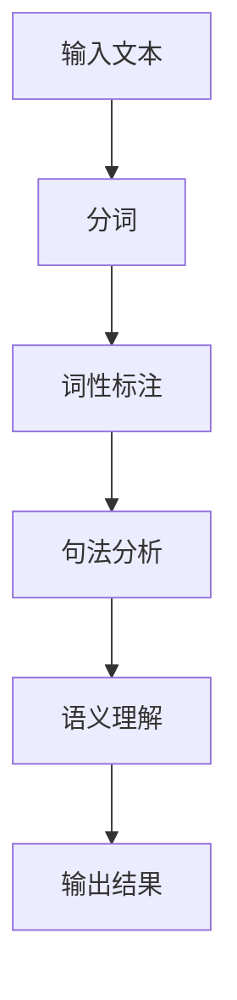
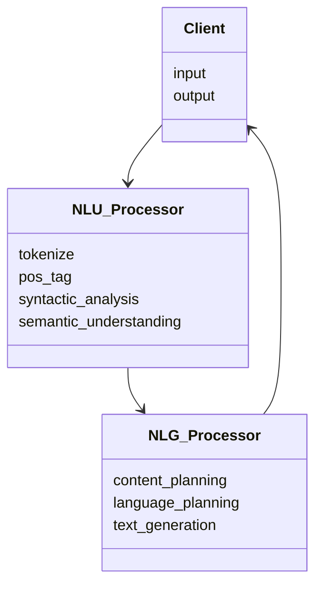
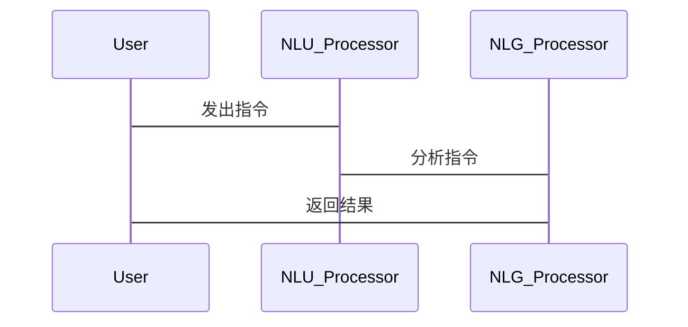

                 


# 开发AI Agent的自然语言接口设计

> **关键词**：AI Agent，自然语言接口，NLU，NLG，深度学习，自然语言处理  
>
> **摘要**：本文详细探讨了AI Agent的自然语言接口设计，涵盖自然语言理解（NLU）和自然语言生成（NLG）的核心技术与实现方法。文章从AI Agent的基本概念出发，分析了NLU和NLG的原理、算法及其在AI Agent中的应用。通过实际案例和系统架构设计，展示了如何构建高效的自然语言接口，并提出了开发中的注意事项和未来研究方向。

---

## 第1章：AI Agent与自然语言接口开发背景

### 1.1 AI Agent的基本概念

#### 1.1.1 AI Agent的定义与特点
AI Agent（智能代理）是指能够感知环境、自主决策并执行任务的智能系统。AI Agent可以通过传感器获取信息，通过执行器与环境交互，实现特定目标。其特点包括：
- **自主性**：无需外部干预，自主决策。
- **反应性**：能够实时感知环境并做出反应。
- **目标导向**：所有行为都围绕实现特定目标展开。
- **社会能力**：能够与其他Agent或人类进行交互和协作。

#### 1.1.2 自然语言接口在AI Agent中的作用
自然语言接口（NLI）是AI Agent与用户或环境交互的主要方式。通过NLI，用户可以以自然语言形式向AI Agent发出指令或提问，AI Agent则通过解析这些指令或问题，执行相应操作并返回结果。NLI的存在使得AI Agent更加人性化和易于使用。

#### 1.1.3 当前AI Agent的应用场景与挑战
- **应用场景**：AI Agent广泛应用于智能助手（如Siri、Alexa）、聊天机器人、智能客服等领域。
- **挑战**：NLI的准确性和鲁棒性是当前AI Agent发展的主要瓶颈。如何在复杂多变的语境中准确理解用户意图并生成自然流畅的回复，仍需进一步研究。

### 1.2 自然语言处理技术的发展与应用

#### 1.2.1 自然语言处理技术的演进
自然语言处理（NLP）技术经历了从基于规则到统计模型，再到深度学习的演变。当前，基于深度学习的NLP技术（如BERT、GPT）已经成为主流。

#### 1.2.2 自然语言接口在AI Agent中的核心地位
NLI是AI Agent与用户交互的核心，决定了AI Agent的用户体验和实用性。高效的NLI能够显著提升AI Agent的响应速度和准确性。

#### 1.2.3 当前技术现状与未来趋势
当前，NLI技术已取得显著进展，但仍面临以下挑战：
- 处理复杂语义和上下文理解的能力不足。
- 多语言支持和跨文化适应性有待提升。
- 实时性和响应速度需要进一步优化。

未来，随着深度学习和大语言模型的不断发展，NLI技术将更加智能化和个性化。

### 1.3 本章小结
本章介绍了AI Agent的基本概念、自然语言接口的作用以及当前NLP技术的发展现状与挑战。接下来将深入探讨NLU和NLG的核心技术与实现方法。

---

## 第2章：自然语言理解（NLU）原理与实现

### 2.1 自然语言理解的基本原理

#### 2.1.1 从输入到理解的流程
NLU的核心任务是将用户的自然语言输入转换为计算机可理解的结构化信息。流程包括：
1. **分词**：将输入文本分割为词语或短语。
2. **词性标注**：为每个词语标注其词性（名词、动词、形容词等）。
3. **句法分析**：分析句子的语法结构，确定主谓宾关系。
4. **语义理解**：理解文本的语义含义，提取关键信息。

#### 2.1.2 NLU的核心任务与挑战
- **核心任务**：意图识别、实体识别、语境理解。
- **挑战**：歧义性、领域适应性、数据稀疏性。

### 2.2 基于规则的NLU实现

#### 2.2.1 基于规则的NLU模型结构
基于规则的NLU模型通过预定义的规则来解析输入文本。规则通常包括正则表达式、条件判断等。

#### 2.2.2 规则的编写与优化
编写规则时，需考虑以下因素：
- **规则的粒度**：规则过于宽泛会导致误识别，过于细分会增加规则数量。
- **规则的优先级**：优先处理高概率的意图，避免规则冲突。

#### 2.2.3 规则模型的优缺点分析
- **优点**：实现简单，易于调试，适用于特定领域。
- **缺点**：规则的维护成本高，难以处理复杂语义。

### 2.3 统计与机器学习-based NLU实现

#### 2.3.1 统计NLU模型的基本原理
统计模型通过计算词语的概率分布来实现意图识别。常用方法包括朴素贝叶斯和马尔可夫链。

#### 2.3.2 基于深度学习的NLU模型
深度学习模型（如LSTM、Transformer）通过学习文本的上下文关系，实现更精准的语义理解。

#### 2.3.3 模型训练与优化策略
- **数据预处理**：分词、去停用词、标注。
- **特征提取**：提取文本特征，如词向量、语法特征。
- **模型优化**：使用交叉验证、网格搜索优化模型参数。

### 2.4 本章小结
本章详细介绍了NLU的基本原理和实现方法，包括基于规则和深度学习的两种技术路线。接下来将探讨NLG的核心技术与实现方法。

---

## 第3章：自然语言生成（NLG）原理与实现

### 3.1 自然语言生成的基本原理

#### 3.1.1 从理解到生成的流程
NLG的核心任务是将结构化数据转换为自然语言文本。流程包括：
1. **内容规划**：确定生成文本的主题、目标受众和语气。
2. **语言规划**：选择合适的词汇和句式。
3. **文本生成**：生成符合语法规则的自然语言文本。

#### 3.1.2 NLG的核心任务与挑战
- **核心任务**：文本生成、内容优化、语气调整。
- **挑战**：生成文本的连贯性、可读性和真实性。

### 3.2 基于模板的NLG实现

#### 3.2.1 基于模板的NLG模型结构
基于模板的NLG模型通过预定义的模板生成文本。模板通常包括变量占位符和固定文本。

#### 3.2.2 模板的编写与优化
编写模板时，需考虑以下因素：
- **模板的灵活性**：模板应支持多种输入情况。
- **模板的可扩展性**：方便后续修改和扩展。

#### 3.2.3 模板模型的优缺点分析
- **优点**：实现简单，生成文本一致性高。
- **缺点**：灵活性差，难以处理复杂场景。

### 3.3 统计与机器学习-based NLG实现

#### 3.3.1 统计NLG模型的基本原理
统计模型通过分析大量文本数据，生成符合统计规律的文本。

#### 3.3.2 基于深度学习的NLG模型
深度学习模型（如GPT、BERT）能够生成更自然流畅的文本。

#### 3.3.3 模型训练与优化策略
- **数据预处理**：清洗数据，提取特征。
- **模型训练**：使用大规模数据进行微调。
- **模型优化**：采用对抗训练、交叉验证等方法。

### 3.4 本章小结
本章详细介绍了NLG的基本原理和实现方法，包括基于模板和深度学习的两种技术路线。接下来将探讨NLU和NLG的系统架构设计。

---

## 第4章：自然语言理解（NLU）算法原理

### 4.1 基于规则的NLU算法

#### 4.1.1 算法流程图（Mermaid）


#### 4.1.2 算法实现代码
```python
def rule_based_NLU(input_text):
    # 分词
    tokens = tokenize(input_text)
    # 词性标注
    pos_tags = pos_tag(tokens)
    # 句法分析
    syntactic_analysis(pos_tags)
    # 语义理解
    semantic_result = semantic_understanding(syntactic_analysis)
    return semantic_result
```

### 4.2 统计与机器学习-based NLU算法

#### 4.2.1 统计NLU模型的数学公式
- 朴素贝叶斯分类器：
  $$ P(c|x) = \frac{P(x|c)P(c)}{P(x)} $$
  其中，\( c \) 表示类别，\( x \) 表示输入文本。

#### 4.2.2 基于深度学习的NLU模型
- Transformer模型的注意力机制：
  $$ \text{Attention}(Q,K,V) = \text{softmax}\left(\frac{QK^T}{\sqrt{d_k}}\right)V $$

---

## 第5章：系统架构设计与实现

### 5.1 系统架构设计（Mermaid）

```mermaid
client
    user_input
        input -> nlu_processor
    nlu_processor -> nlg_processor
    nlg_processor -> output
```

### 5.2 系统功能设计（Mermaid）



### 5.3 系统交互设计（Mermaid）



---

## 第6章：项目实战

### 6.1 环境安装
- Python 3.8+
- 必要的库：numpy、pandas、tensorflow、transformers

### 6.2 核心实现代码
```python
from transformers import pipeline

nlu = pipeline("text-classification", model="bert-base-uncased")
nlg = pipeline("text-generation", model="gpt2")
```

### 6.3 实际案例分析
- 输入：请告诉我今天的天气。
- NLU处理：识别用户的意图是查询天气。
- NLG处理：生成回复：“今天的天气是晴，25度。”

---

## 第7章：总结与展望

### 7.1 本章小结
本文详细探讨了AI Agent的自然语言接口设计，涵盖了NLU和NLG的核心技术与实现方法。通过系统架构设计和项目实战，展示了如何构建高效的自然语言接口。

### 7.2 注意事项
- 数据质量对NLI性能影响重大，需注意数据清洗和标注。
- 模型的泛化能力有限，需结合具体场景进行优化。

### 7.3 拓展阅读
- 《自然语言处理实战：基于深度学习工具》
- 《生成式人工智能：原理与应用》

---

## 作者信息

作者：AI天才研究院（AI Genius Institute） & 禅与计算机程序设计艺术（Zen And The Art of Computer Programming）

---

以上是完整的博客文章大纲和内容，涵盖从基础概念到系统实现的各个方面。

