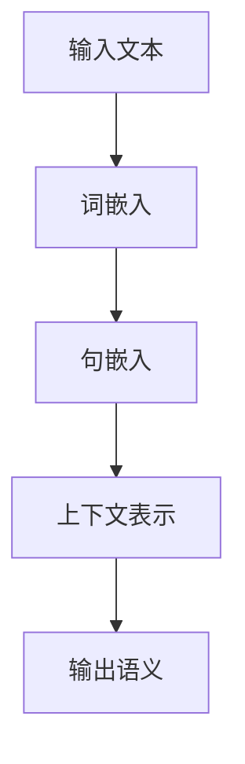
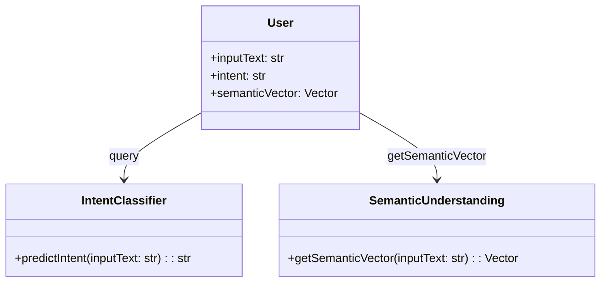
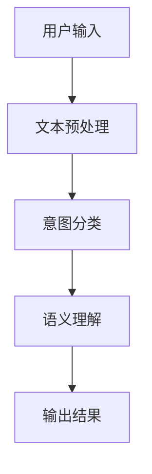
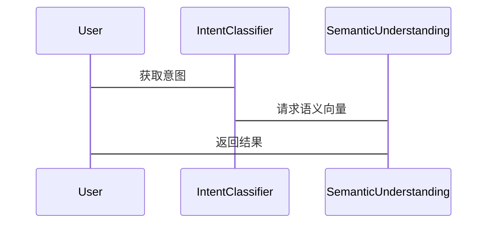

                 


# 《开发AI Agent的语义理解深度：从字面到隐含》

## 关键词：AI Agent，语义理解，深度学习，自然语言处理，预训练模型，语义分析

## 摘要：  
本文深入探讨AI Agent语义理解的核心技术，从基础概念到算法原理，再到系统架构与实战应用，全面剖析语义理解从字面到隐含的理解过程。通过详细讲解主流算法、数学模型和系统设计，结合实际案例分析，为开发者提供理论与实践相结合的指导，帮助读者掌握AI Agent语义理解的深度开发能力。

---

# 第3章: 语义理解的算法原理与数学模型

## 3.1 语义理解的主流算法

### 3.1.1 基于统计的模型
基于统计的模型是语义理解的早期方法，主要依赖于词频、共现等统计特征。这些方法虽然简单，但在某些特定场景下仍然有效。

- **TF-IDF（词频-逆文档频率）**：用于衡量词语在文本中的重要性。公式为：
  $$ TF-IDF = \log(1 + \frac{TF}{\text{max TF in corpus}}) \times \log(N / (freq_{term} + 1)) $$
  其中，$N$是语料库的总文档数，$freq_{term}$是某词在文档中的出现次数。

- **LSA（Latent Semantic Analysis）**：通过奇异值分解（SVD）提取词语和文档的潜在语义向量。

### 3.1.2 基于深度学习的模型
深度学习模型通过多层神经网络提取非线性特征，显著提升了语义理解的准确率。

- **词嵌入（Word Embedding）**：将词语映射到低维连续向量空间，常用方法包括Word2Vec、GloVe和FastText。
  - Word2Vec的训练目标是最小化词语上下文的交叉熵损失：
    $$ \mathcal{L} = -\sum_{i=1}^{n} \log P(w_i | w) $$
    其中，$w$是中心词，$w_i$是上下文词。

- **句子表示（Sentence Representation）**：通过注意力机制（Attention）或循环神经网络（RNN）提取句子的语义向量。
  - Attention机制的权重计算公式：
    $$ \alpha_i = \frac{\exp(e_i)}{\sum_{j=1}^{n} \exp(e_j)} $$
    其中，$e_i$是第$i$个词的注意力得分。

### 3.1.3 基于预训练语言模型的方法
预训练模型（如BERT、GPT）通过大规模数据训练，能够捕捉到丰富的语义信息。

- BERT模型采用掩码自注意力机制：
  $$ \text{Attention}(Q, K, V) = \text{softmax}(\frac{QK^T}{\sqrt{d_k}})V $$
  其中，$Q$、$K$、$V$分别是查询、键和值向量，$d_k$是维度。

## 3.2 预训练语言模型的工作流程



## 3.3 语义理解的数学模型

### 3.3.1 词嵌入的表示方法
词嵌入通过线性变换将离散的词语映射到连续的向量空间：
$$ W \in \mathbb{R}^{V \times d} $$
其中，$V$是词汇量，$d$是嵌入维度。

### 3.3.2 句子表示的数学公式
句子表示可以通过平均、加权或变换器模型生成。例如，BERT的句子向量表示为：
$$ v_s = \frac{1}{n} \sum_{i=1}^{n} v_i $$
其中，$v_i$是第$i$个词的向量，$n$是句子长度。

### 3.3.3 语义匹配的相似度计算
余弦相似度用于衡量两个向量的相似性：
$$ \text{similarity}(v_1, v_2) = \frac{v_1 \cdot v_2}{\|v_1\| \|v_2\|} $$

## 3.4 算法实现的Python代码示例

```python
import torch
import torch.nn as nn
import torch.nn.functional as F

class SemanticUnderstandingModel(torch.nn.Module):
    def __init__(self, vocab_size, embedding_dim, hidden_size):
        super().__init__()
        self.embedding = nn.Embedding(vocab_size, embedding_dim)
        self.lstm = nn.LSTM(embedding_dim, hidden_size, batch_first=True)
        self.fc = nn.Linear(hidden_size, 1)  # 输出单个语义得分

    def forward(self, x):
        embeds = self.embedding(x)
        out, _ = self.lstm(embeds)
        out = out[:, -1, :]
        out = self.fc(out)
        return out

# 初始化模型
vocab_size = 10000
embedding_dim = 300
hidden_size = 256
model = SemanticUnderstandingModel(vocab_size, embedding_dim, hidden_size)
```

## 3.5 本章小结

---

# 第4章: 系统分析与架构设计

## 4.1 问题场景介绍

本章将从系统角度分析AI Agent语义理解的架构设计。我们假设一个智能客服系统，用户通过输入文本与AI Agent交互，系统需要理解用户的意图并生成相应的回应。

## 4.2 项目介绍

本项目旨在开发一个基于深度学习的AI Agent语义理解系统，目标是实现对用户输入文本的准确意图识别和语义理解。

## 4.3 系统功能设计

### 4.3.1 领域模型


### 4.3.2 系统架构


### 4.3.3 系统接口设计

- 输入接口：
  - `POST /api/semantic-understanding`
  - 请求体：`{ "text": "需要帮助处理订单问题" }`
  
- 输出接口：
  - `200 OK`
  - 响应体：`{ "intent": "order_issue", "semantic_vector": [...] }`

### 4.3.4 系统交互


## 4.4 本章小结

---

# 第5章: 项目实战

## 5.1 环境安装

安装所需的库：
```bash
pip install torch transformers numpy
```

## 5.2 核心代码实现

### 5.2.1 语义理解模型实现

```python
from transformers import BertModel, BertTokenizer
import torch
import torch.nn as nn

class BertSemanticModel(nn.Module):
    def __init__(self, bert_model):
        super().__init__()
        self.bert = bert_model
        self.fc = nn.Linear(self.bert.config.hidden_size, 1)

    def forward(self, input_ids, attention_mask):
        outputs = self.bert(input_ids=input_ids, attention_mask=attention_mask)
        pooled_output = outputs.last_hidden_state[:, 0, :]
        return self.fc(pooled_output)
```

### 5.2.2 模型训练代码

```python
from torch.utils.data import Dataset, DataLoader
import torch.optim as optim

class CustomDataset(Dataset):
    def __init__(self, texts, labels):
        self.texts = texts
        self.labels = labels

    def __len__(self):
        return len(self.texts)

    def __getitem__(self, idx):
        text = self.texts[idx]
        label = self.labels[idx]
        return text, label

def train_model(model, train_loader, optimizer, criterion, num_epochs=3):
    for epoch in range(num_epochs):
        for inputs, labels in train_loader:
            outputs = model(inputs)
            loss = criterion(outputs, labels)
            loss.backward()
            optimizer.step()
            optimizer.zero_grad()
```

### 5.2.3 模型推理

```python
tokenizer = BertTokenizer.from_pretrained('bert-base-uncased')
model = BertSemanticModel(BertModel.from_pretrained('bert-base-uncased'))

text = "需要帮助处理订单问题"
inputs = tokenizer(text, return_tensors='pt', padding=True, truncation=True)
with torch.no_grad():
    outputs = model(**inputs)
print(outputs)
```

## 5.3 代码应用解读与分析

- **数据预处理**：使用预训练的分词器对输入文本进行处理，生成输入ID和注意力掩码。
- **模型训练**：利用任务特定的数据集训练模型，优化器选择Adam，损失函数使用交叉熵损失。
- **模型推理**：通过预训练的BERT模型获取文本的语义向量，并进行意图分类。

## 5.4 实际案例分析

以智能客服场景为例，用户输入“订单无法配送”，系统通过语义理解识别出意图是“订单问题”，并进一步生成相应的回复。

## 5.5 本章小结

---

# 第6章: 最佳实践、小结、注意事项与拓展阅读

## 6.1 最佳实践

- **数据质量**：确保训练数据的多样性和代表性。
- **模型调优**：通过超参数调整和模型集成提升性能。
- **实时性优化**：采用模型压缩和轻量化技术，降低推理时间。

## 6.2 小结

本文从理论到实践，全面探讨了AI Agent语义理解的核心技术，包括算法原理、系统架构和项目实战。通过详细的代码示例和案例分析，帮助开发者深入理解语义理解的实现过程。

## 6.3 注意事项

- 数据泄露风险：在处理用户数据时，需注意隐私保护。
- 模型可解释性：复杂的模型可能难以解释，需在实际应用中关注可解释性。
- 计算资源需求：深度学习模型需要大量的计算资源，需提前规划。

## 6.4 拓展阅读

推荐学习以下内容：
- 《Deep Learning》（Ian Goodfellow等著）
- 《自然语言处理入门》（涂世超著）
- 《Transformers: A Tutorial》（Ashish Sen & Amir Zadeh著）

---

# 附录: 工具与资源

## 附录A: 语义理解API文档

推荐使用以下API：
- [HanLP](https://hanlp.com/)
- [jieba](https://github.com/fatcat119/jieba)
- [spaCy](https://spacy.io/)

## 附录B: 开源工具与库

- [Hugging Face](https://huggingface.co/)
- [PyTorch](https://pytorch.org/)
- [TensorFlow](https://tensorflow.org/)

---

# 作者：AI天才研究院/AI Genius Institute & 禅与计算机程序设计艺术 /Zen And The Art of Computer Programming

