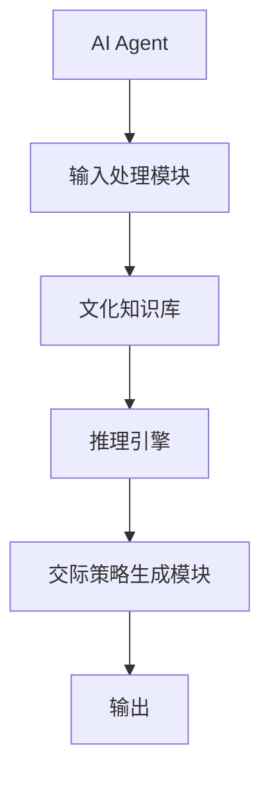

                 


# 开发AI Agent的跨文化交际能力

> 关键词：AI Agent，跨文化交际，文化敏感性，交际策略，自然语言处理

> 摘要：本文探讨了AI Agent在跨文化交际中的能力开发，分析了跨文化交际的核心概念、算法原理和系统架构，通过实际案例展示了如何实现具有跨文化交际能力的AI Agent，并提出了相关的最佳实践建议。

---

# 第一部分: AI Agent与跨文化交际能力的背景介绍

# 第1章: AI Agent与跨文化交际能力概述

## 1.1 AI Agent的基本概念
### 1.1.1 AI Agent的定义与分类
AI Agent（人工智能代理）是指能够感知环境、自主决策并执行任务的智能实体。根据功能和复杂程度，AI Agent可以分为简单反射型、基于模型的反应型、目标驱动型和实用驱动型。

### 1.1.2 跨文化交际能力的定义
跨文化交际能力是指个体在不同文化背景下有效沟通和理解他人能力的综合体现。对于AI Agent来说，这意味着能够理解并适应不同文化背景下的语言、习俗和交际习惯。

### 1.1.3 AI Agent与跨文化交际能力的关系
AI Agent的跨文化交际能力是其智能化和适应性的重要组成部分，能够帮助其在多元文化环境中更好地与人类交互。

## 1.2 跨文化交际能力的重要性
### 1.2.1 跨文化交际能力的核心要素
- **语言理解能力**：能够识别和理解多种语言及其文化背景。
- **文化敏感性**：能够感知和适应不同文化背景下的交际需求。
- **交际策略的灵活性**：能够在不同文化背景下调整交际策略。

### 1.2.2 AI Agent在跨文化交际中的优势
- **高效性**：AI Agent可以快速分析和处理大量跨文化数据。
- **准确性**：通过机器学习和自然语言处理技术，AI Agent能够准确理解复杂的文化背景信息。

### 1.2.3 跨文化交际能力的边界与外延
跨文化交际能力的边界在于AI Agent的理解和适应能力，而其外延则涉及语言处理、文化分析和策略调整等多个方面。

---

# 第二部分: 跨文化交际能力的核心概念与联系

# 第2章: 跨文化交际能力的核心概念

## 2.1 跨文化交际能力的属性特征
### 2.1.1 语言理解能力
AI Agent需要能够识别和理解多种语言及其文化背景。例如，中文和英文在表达礼貌和委婉方面的差异。

### 2.1.2 文化敏感性
AI Agent需要能够感知和适应不同文化背景下的交际需求。例如，在某些文化中，直接拒绝可能被视为不礼貌，而间接表达更为合适。

### 2.1.3 交际策略的灵活性
AI Agent需要能够在不同文化背景下调整其交际策略。例如，在商务谈判中，某些文化更注重直接表达意见，而另一些文化则更倾向于间接沟通。

## 2.2 跨文化交际能力与相关概念的对比
### 2.2.1 跨文化交际能力与语言理解能力的对比
- **语言理解能力**：主要关注语言本身的理解，如语法、词汇等。
- **跨文化交际能力**：不仅关注语言本身，还包括文化背景对语言使用的影响。

### 2.2.2 跨文化交际能力与文化适应性的对比
- **文化适应性**：关注个体或系统在文化环境中的适应能力。
- **跨文化交际能力**：关注在跨文化交际中的理解和沟通能力。

### 2.2.3 跨文化交际能力与跨语言处理能力的对比
- **跨语言处理能力**：主要关注多语言处理和翻译。
- **跨文化交际能力**：关注在跨文化背景下的有效沟通。

## 2.3 跨文化交际能力的ER实体关系图
```mermaid
er
actor(AI Agent) --> knowledge_base(文化知识库)
actor(AI Agent) --> communication_channel(交际渠道)
knowledge_base(文化知识库) --> culture_context(文化背景)
communication_channel(交际渠道) --> message(信息)
```

---

# 第三部分: 跨文化交际能力的算法原理

# 第3章: 跨文化交际能力的算法原理

## 3.1 跨文化交际能力的算法原理
### 3.1.1 跨文化信息的输入与处理
AI Agent接收来自不同文化背景的信息，通过自然语言处理技术进行解析和分析。

### 3.1.2 文化知识的表示与推理
通过知识图谱或语义网络表示文化知识，并基于这些知识进行推理和决策。

### 3.1.3 跨文化交际策略的生成
根据文化背景和交际场景生成相应的交际策略，例如调整语气、选择合适的表达方式等。

## 3.2 跨文化交际能力的数学模型
### 3.2.1 文化背景的向量化表示
将文化背景信息转化为向量，以便进行计算和推理。例如，使用Word2Vec模型将文化关键词向量化。

### 3.2.2 跨文化信息的相似度计算
使用余弦相似度等方法计算不同文化背景下的信息相似度。

### 3.2.3 交际策略的优化
通过强化学习或遗传算法优化交际策略，以提高交际的成功率。

---

# 第四部分: 跨文化交际能力的系统分析与架构设计

# 第4章: 跨文化交际能力的系统分析与架构设计

## 4.1 系统功能设计
### 4.1.1 输入处理模块
接收多语言输入并进行预处理。

### 4.1.2 文化知识库
存储和管理各种文化背景的知识。

### 4.1.3 推理引擎
基于文化知识库进行推理，生成交际策略。

### 4.1.4 交际策略生成模块
根据推理结果生成具体的交际策略。

## 4.2 系统架构设计


---

# 第五部分: 跨文化交际能力的项目实战

# 第5章: 跨文化交际能力的项目实战

## 5.1 项目环境安装
```bash
pip install -r requirements.txt
```

## 5.2 核心代码实现
```python
def cross_cultural_communication(agent, input_message):
    # 输入预处理
    processed_message = preprocess(input_message)
    # 文化背景分析
    culture_context = analyze_culture(processed_message)
    # 交际策略生成
    communication_strategy = generate_strategy(culture_context)
    # 输出生成
    output = generate_response(processed_message, communication_strategy)
    return output
```

## 5.3 代码解读与分析
- **preprocess**：对输入消息进行清洗和结构化。
- **analyze_culture**：分析消息的文化背景，调用文化知识库。
- **generate_strategy**：根据文化背景生成交际策略。
- **generate_response**：根据策略生成最终的输出。

## 5.4 实际案例分析
- **案例1**：中英文问候语的处理。
- **案例2**：跨文化商务谈判中的策略调整。

---

# 第六部分: 跨文化交际能力的最佳实践

# 第6章: 跨文化交际能力的最佳实践

## 6.1 小结
本文详细探讨了AI Agent跨文化交际能力的开发，从核心概念到算法原理，再到系统设计和项目实战，为开发者提供了全面的指导。

## 6.2 注意事项
- **文化知识的准确性**：确保文化知识库的准确性和全面性。
- **算法的可解释性**：确保算法的决策过程清晰可追溯。
- **用户体验的友好性**：确保AI Agent的交互过程自然流畅。

## 6.3 拓展阅读
- **推荐书籍**：《跨文化交际学》、《人工智能与自然语言处理》。
- **推荐论文**：相关领域的最新研究论文。

---

作者：AI天才研究院/AI Genius Institute & 禅与计算机程序设计艺术 /Zen And The Art of Computer Programming

