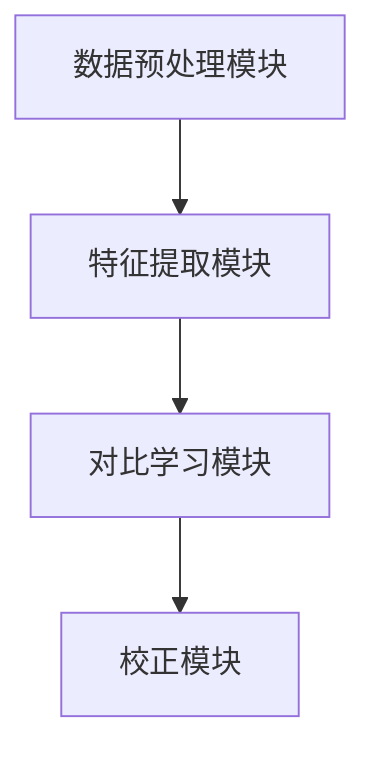

                 


# 开发AI Agent的跨模态内容一致性检查器

> 关键词：AI Agent，跨模态数据，内容一致性，检查器，算法原理

> 摘要：本文详细探讨了开发AI Agent的跨模态内容一致性检查器的关键技术与实现方法。文章首先介绍了跨模态数据一致性的背景与核心概念，然后分析了相关算法的原理，接着从系统架构与设计的角度进行了深入讨论，并通过实际项目案例展示了如何在实践中应用这些技术。最后，本文总结了开发跨模态内容一致性检查器的最佳实践与注意事项。

---

## 第一部分: 背景介绍

### 第1章: 问题背景

#### 1.1 跨模态数据的定义与特点
跨模态数据是指来自不同感知模态（如文本、图像、语音、视频等）的数据。这些数据在形式和语义上有显著差异，但通常描述的是同一现实场景的不同方面。跨模态数据的特点包括多样性、异构性和互补性。

#### 1.2 跨模态数据一致性问题的提出
在实际应用中，AI Agent需要处理来自多种模态的数据。然而，由于数据来源、采集方式和语义表达的差异，这些数据可能存在不一致的问题。例如，在自动驾驶系统中，摄像头捕捉的图像和GPS提供的地理位置信息可能存在时间或空间上的不一致。

#### 1.3 AI Agent在跨模态数据处理中的作用
AI Agent需要能够理解并整合不同模态的数据，确保其一致性，以做出正确的决策。跨模态内容一致性检查器是AI Agent的关键组件，用于验证和修正不同模态数据之间的不一致。

---

### 第2章: 问题描述

#### 2.1 跨模态数据不一致性的表现形式
跨模态数据不一致性的表现形式包括：
1. **语义冲突**：不同模态的数据描述同一实体时存在语义冲突。例如，文本描述“红色跑车”与图像中的“蓝色跑车”。
2. **格式差异**：不同模态的数据格式不同，难以直接比较。
3. **时间或空间错位**：不同模态的数据采集时间或空间位置不一致。

#### 2.2 AI Agent在跨模态数据处理中的挑战
1. **数据异构性**：不同模态的数据具有不同的结构和语义。
2. **一致性验证的复杂性**：需要同时理解多种模态的数据，并确保其一致性。
3. **实时性要求**：在某些应用场景中，AI Agent需要实时处理跨模态数据，这对一致性检查器的效率提出了要求。

#### 2.3 跨模态数据一致性检查的必要性
跨模态数据一致性检查是确保AI Agent正确理解和处理数据的基础。如果不进行一致性检查，可能导致错误的决策，甚至引发安全事故。

---

## 第二部分: 核心概念

### 第3章: 跨模态内容一致性检查的核心概念

#### 3.1 跨模态数据一致性的定义
跨模态数据一致性是指不同模态的数据在语义、时间和空间上的一致性。具体来说，一致性检查器需要验证不同模态的数据是否描述了同一现实场景，并确保其描述的准确性。

#### 3.2 跨模态数据一致性检查的关键属性
跨模态数据一致性检查的关键属性包括：
1. **语义一致性**：不同模态的数据描述同一实体时，语义是否一致。
2. **时空一致性**：不同模态的数据是否在相同的时间和空间范围内。
3. **格式一致性**：不同模态的数据是否可以被统一处理。

#### 3.3 跨模态数据一致性检查的核心要素
跨模态数据一致性检查的核心要素包括：
1. **数据预处理**：对不同模态的数据进行标准化处理，确保其格式一致。
2. **特征提取**：提取不同模态数据的特征，以便进行对比和校正。
3. **数据对比与校正**：通过对比不同模态的特征，发现不一致并进行校正。

---

## 第三部分: 算法原理

### 第4章: 跨模态数据一致性检查的算法原理

#### 4.1 基于对比学习的跨模态一致性检查
对比学习是一种有效的跨模态数据处理方法。其核心思想是通过对比不同模态的数据，学习其共同特征，从而实现一致性检查。

##### 4.1.1 算法流程
1. **数据预处理**：对不同模态的数据进行归一化处理，确保其格式一致。
2. **特征提取**：分别提取文本、图像等模态的特征向量。
3. **对比学习**：通过对比不同模态的特征向量，计算其相似度，判断是否一致。
4. **校正**：如果发现不一致，根据相似度结果进行校正。

##### 4.1.2 算法实现
```python
def contrastive_learning(text_features, image_features):
    # 计算相似度
    similarity = cosine_similarity(text_features, image_features)
    # 判断一致性
    is_consistent = np.min(similarity) > 0.8
    return is_consistent
```

##### 4.1.3 数学模型
对比学习的目标是最大化不同模态数据之间的相似度。其数学模型如下：

$$
\text{similarity}(x_i, y_j) = \frac{x_i \cdot y_j}{\|x_i\| \|y_j\|}
$$

其中，\(x_i\) 和 \(y_j\) 分别表示文本和图像的特征向量。

---

## 第四部分: 系统分析与架构设计

### 第5章: 系统分析与架构设计

#### 5.1 系统功能设计
跨模态内容一致性检查器的功能模块包括：
1. **数据预处理模块**：对输入的多模态数据进行标准化处理。
2. **特征提取模块**：提取不同模态的特征向量。
3. **对比学习模块**：计算不同模态特征的相似度，判断一致性。
4. **校正模块**：根据相似度结果，对不一致的数据进行校正。

#### 5.2 系统架构设计
系统架构采用模块化设计，各模块之间通过接口进行通信。以下是系统的架构图：



#### 5.3 系统接口设计
系统接口采用RESTful API设计，支持以下接口：
1. `POST /api/process`：接收多模态数据，返回一致性检查结果。
2. `GET /api/status`：获取系统状态信息。

---

## 第五部分: 项目实战

### 第6章: 项目实战

#### 6.1 环境安装
项目需要以下环境：
- Python 3.8+
- NumPy
- Scikit-learn
- TensorFlow

安装命令：
```bash
pip install numpy scikit-learn tensorflow
```

#### 6.2 核心代码实现
以下是核心代码实现：

```python
import numpy as np
from sklearn.metrics.pairwise import cosine_similarity

def preprocess(text, image):
    # 文本预处理
    text_features = text_to_features(text)
    # 图像预处理
    image_features = image_to_features(image)
    return text_features, image_features

def text_to_features(text):
    # 文本特征提取
    # 示例：使用TF-IDF提取关键词
    from sklearn.feature_extraction.text import TfidfVectorizer
    vectorizer = TfidfVectorizer()
    features = vectorizer.fit_transform([text]).toarray()
    return features

def image_to_features(image):
    # 图像特征提取
    # 示例：使用预训练的CNN模型提取特征
    model = load_pretrained_model()
    features = model.predict(image)
    return features

def contrastive_learning(text_features, image_features):
    similarity = cosine_similarity(text_features, image_features)
    is_consistent = np.min(similarity) > 0.8
    return is_consistent

# 示例使用
text = "这是一辆红色跑车"
image = np.array([[[128, 0, 0], [128, 0, 0], [128, 0, 0]]])  # 示例图像数据
text_features, image_features = preprocess(text, image)
is_consistent = contrastive_learning(text_features, image_features)
print(f"一致性检查结果: {is_consistent}")
```

#### 6.3 实际案例分析
假设我们有一个自动驾驶系统，接收到以下数据：
- 文本描述：前方是红灯。
- 图像数据：摄像头捕捉到的前方交通灯为绿色。

通过跨模态内容一致性检查器，发现文本描述和图像数据存在冲突，系统将触发警报，并提示驾驶员进行人工干预。

---

## 第六部分: 总结

### 第7章: 总结

#### 7.1 最佳实践
1. 在实际应用中，建议结合具体场景需求，选择合适的特征提取方法。
2. 对比学习是一种有效的跨模态一致性检查方法，但在实际应用中需要根据数据特性进行调整。

#### 7.2 小结
本文详细探讨了开发AI Agent的跨模态内容一致性检查器的关键技术与实现方法。通过背景介绍、核心概念、算法原理、系统设计和项目实战的全面分析，为读者提供了一个完整的解决方案。

#### 7.3 注意事项
1. 数据预处理是跨模态一致性检查的关键步骤，需要仔细处理。
2. 对比学习的相似度阈值需要根据实际数据进行调整。

#### 7.4 拓展阅读
推荐读者进一步阅读以下内容：
- 《Deep Learning for Multimodal Data Analysis》
- 《Contrastive Learning: A Unified Framework for Self-Supervised Learning》

---

作者：AI天才研究院 & 禅与计算机程序设计艺术

