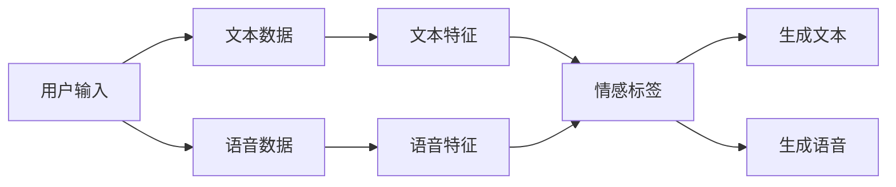
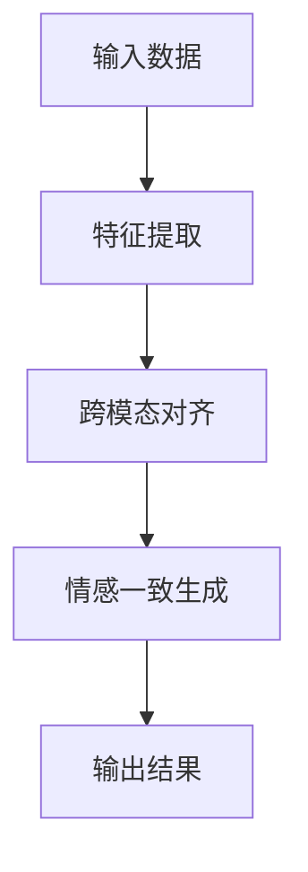
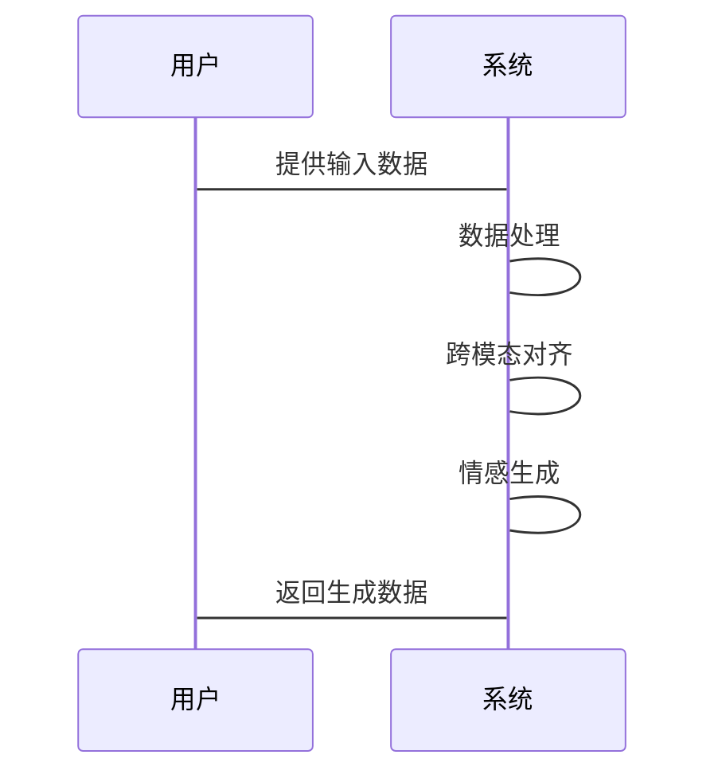

                 


# 开发AI Agent的跨模态情感一致性生成

## 关键词：AI Agent，跨模态，情感一致性，生成模型，深度学习

## 摘要：本文深入探讨了AI Agent在跨模态情感一致性生成中的应用，分析了其核心概念、算法原理、系统架构及项目实现，为开发者提供全面的技术指导。

---

## 第一部分：跨模态情感一致性生成的背景与概述

### 第1章：跨模态情感一致性生成的背景与概述

#### 1.1 跨模态情感一致性生成的问题背景

##### 1.1.1 多模态数据的广泛应用
在现代AI应用中，多模态数据如文本、图像、语音和视频的使用越来越普遍。例如，智能客服系统不仅处理文本，还可能结合语音情感分析来提升用户体验。

##### 1.1.2 情感一致性的重要性
情感一致性指的是不同模态的数据表达同一情感时的一致性。例如，当用户表达愤怒时，文本和语音中都应体现出这种情感，以确保AI Agent能够准确理解和回应。

##### 1.1.3 当前技术的局限性
现有技术在处理跨模态情感一致性时，往往忽视了不同模态之间的关联性，导致生成的内容缺乏一致性，影响用户体验。

#### 1.2 跨模态情感一致性生成的问题描述

##### 1.2.1 跨模态数据的定义与特点
跨模态数据指的是来自不同感官渠道的数据，如文本、图像、语音等。其特点在于多样性、互补性和复杂性。

##### 1.2.2 情感一致性的定义与目标
情感一致性生成的目标是让不同模态的数据表达相同的情感，使AI Agent能够协调一致地理解和生成信息。

##### 1.2.3 问题解决的必要性
解决跨模态情感一致性问题对于提升AI Agent的交互能力和用户体验至关重要。

#### 1.3 跨模态情感一致性生成的解决思路

##### 1.3.1 多模态数据的融合方法
采用对齐模型将不同模态的数据映射到同一个 latent space，确保各模态之间的信息一致。

##### 1.3.2 情感一致性的建模策略
使用生成对抗网络（GAN）或变体自编码器（VAE）来生成与输入情感一致的多模态数据。

##### 1.3.3 生成模型的选择与优化
选择适合多模态数据的生成模型，并通过对抗训练或预训练提升模型性能。

#### 1.4 跨模态情感一致性生成的边界与外延

##### 1.4.1 边界条件的定义
明确问题的边界，如只处理文本和语音模态，不涉及视频。

##### 1.4.2 外延与相关领域的联系
跨模态情感生成与计算机视觉、自然语言处理等领域密切相关。

##### 1.4.3 与其他技术的区分
与单一模态生成不同，跨模态生成强调各模态之间的协调一致性。

#### 1.5 核心概念与结构组成

##### 1.5.1 核心概念的定义与属性
- **多模态数据**：来自多个感官的数据。
- **情感一致性**：各模态数据表达相同情感。

##### 1.5.2 概念结构的层次化分析
从数据采集、预处理到模型训练，构建层次化的处理流程。

##### 1.5.3 核心要素的组成与关系
涉及数据预处理、模型训练、生成推理等关键步骤，各步骤相互关联，共同实现目标。

#### 1.6 本章小结
本章介绍了跨模态情感一致性生成的背景、问题描述及解决思路，为后续章节打下基础。

---

## 第二部分：跨模态情感一致性生成的核心概念与联系

### 第2章：跨模态情感一致性生成的核心概念

#### 2.1 跨模态数据的处理方法

##### 2.1.1 多模态数据的采集与预处理
采集多模态数据后，进行清洗、归一化等预处理，确保数据质量。

##### 2.1.2 数据模态的特征提取与表示
使用CNN、RNN等模型提取各模态的特征，并进行降维处理。

##### 2.1.3 模态间的信息对齐策略
通过对比学习等方法，对齐不同模态的特征空间。

#### 2.2 情感一致性生成的原理

##### 2.2.1 情感一致性的定
定义情感一致性的度量标准，如余弦相似度。

##### 2.2.2 情感生成的数学模型
建立情感生成的数学模型，如条件生成对抗网络（cGAN）。

#### 2.3 情感一致性生成的数学模型

##### 2.3.1 对比学习公式
$$ L_{\text{contrast}} = \log\frac{p(x,y)}{p(x)p(y)} $$

##### 2.3.2 注意力机制公式
$$ \alpha_i = \frac{\exp(e_i)}{\sum_j \exp(e_j)} $$

#### 2.4 跨模态情感一致性生成的ER实体关系图



#### 2.5 本章小结
本章详细讲解了跨模态数据的处理方法和情感一致性生成的原理，为后续算法实现奠定基础。

---

## 第三部分：跨模态情感一致性生成的算法原理

### 第3章：跨模态情感一致性生成的算法原理

#### 3.1 跨模态对齐算法

##### 3.1.1 对比学习
通过对比学习对齐不同模态的特征，公式如下：
$$ L_{\text{contrast}} = \log\frac{p(x,y)}{p(x)p(y)} $$

##### 3.1.2 注意力机制
使用自注意力机制捕捉模态间的关系，公式：
$$ \alpha_i = \frac{\exp(e_i)}{\sum_j \exp(e_j)} $$

##### 3.1.3 实现代码
```python
import torch

def contrastive_loss(x, y):
    x = F.normalize(x, p=2, dim=1)
    y = F.normalize(y, p=2, dim=1)
    similarity = torch.mm(x, y.T)
    labels = torch.diag(torch.ones(x.size(0)))
    loss = F.binary_cross_entropy_with_logits(similarity, labels)
    return loss
```

#### 3.2 情感一致性生成算法

##### 3.2.1 情感生成模型
使用生成对抗网络（GAN）生成与输入情感一致的文本或语音。

##### 3.2.2 情感一致性损失
定义一致性损失函数，确保生成内容与输入情感一致。

##### 3.2.3 实现代码
```python
import torch
from torch.nn import GAN
class Generator(torch.nn.Module):
    def __init__(self, input_dim, output_dim):
        super(Generator, self).__init__()
        self.fc = torch.nn.Linear(input_dim, output_dim)
    def forward(self, x):
        return torch.sigmoid(self.fc(x))
```

#### 3.3 跨模态情感一致性生成的算法流程



#### 3.4 本章小结
本章详细讲解了跨模态情感一致性生成的算法原理，包括对比学习和生成对抗网络的应用。

---

## 第四部分：跨模态情感一致性生成的系统分析与架构设计

### 第4章：跨模态情感一致性生成的系统分析与架构设计

#### 4.1 系统功能设计

##### 4.1.1 多模态数据处理模块
负责数据的采集、预处理和特征提取。

##### 4.1.2 跨模态对齐模块
实现不同模态数据的特征对齐。

##### 4.1.3 情感一致性生成模块
生成与输入情感一致的多模态数据。

#### 4.2 系统架构设计


#### 4.3 接口设计

##### 4.3.1 数据输入接口
接受多模态数据输入。

##### 4.3.2 模型训练接口
用于训练模型参数。

##### 4.3.3 生成输出接口
输出生成的多模态数据。

#### 4.4 交互流程



#### 4.5 本章小结
本章详细描述了系统的功能设计、架构设计和交互流程，为实际开发提供指导。

---

## 第五部分：跨模态情感一致性生成的项目实战

### 第5章：跨模态情感一致性生成的项目实战

#### 5.1 项目介绍

##### 5.1.1 项目背景
开发一个AI Agent，能够根据用户输入生成情感一致的文本和语音。

##### 5.1.2 项目目标
实现跨模态情感一致性生成功能。

#### 5.2 核心代码实现

##### 5.2.1 环境安装
安装必要的库，如PyTorch、Transformers等。

##### 5.2.2 数据预处理代码
```python
import torch
def preprocess_data(data):
    # 数据清洗和归一化
    pass
```

##### 5.2.3 模型训练代码
```python
def train_model(model, optimizer, criterion, data_loader):
    for epoch in range(num_epochs):
        for batch in data_loader:
            outputs = model(batch)
            loss = criterion(outputs, batch_labels)
            optimizer.zero_grad()
            loss.backward()
            optimizer.step()
```

##### 5.2.4 模型生成代码
```python
def generate_output(model, input_data):
    with torch.no_grad():
        output = model(input_data)
    return output
```

#### 5.3 案例分析

##### 5.3.1 输入分析
输入文本和语音数据，提取特征并进行对齐。

##### 5.3.2 生成结果
生成与输入情感一致的文本和语音。

##### 5.3.3 案例小结
展示生成结果，分析模型性能。

#### 5.4 本章小结
本章通过实际项目展示了跨模态情感一致性生成的实现过程。

---

## 第六部分：跨模态情感一致性生成的最佳实践与未来展望

### 第6章：跨模态情感一致性生成的最佳实践

#### 6.1 最佳实践

##### 6.1.1 数据预处理技巧
确保数据的多样性和平衡性。

##### 6.1.2 模型调优技巧
使用早停、学习率调整等方法优化模型性能。

##### 6.1.3 系统优化建议
采用分布式训练、缓存优化等提升系统效率。

#### 6.2 小结

##### 6.2.1 核心内容回顾
总结跨模态情感一致性生成的关键点。

##### 6.2.2 读者思考与实践
鼓励读者尝试实现模型，并进行实验验证。

#### 6.3 注意事项

##### 6.3.1 数据隐私问题
注意数据的隐私保护，避免泄露用户信息。

##### 6.3.2 模型泛化能力
确保模型在不同场景下的泛化能力。

##### 6.3.3 系统可扩展性
设计系统时考虑未来的扩展需求。

#### 6.4 未来展望

##### 6.4.1 研究方向
探索更高效的对齐方法和生成模型。

##### 6.4.2 应用前景
跨模态情感生成在智能客服、虚拟助手等领域有广泛应用潜力。

#### 6.5 本章小结
本章提供了实用的建议，并展望了未来的研究方向和应用前景。

---

## 作者：AI天才研究院/AI Genius Institute & 禅与计算机程序设计艺术 /Zen And The Art of Computer Programming

---

以上是《开发AI Agent的跨模态情感一致性生成》的完整目录和内容概要，涵盖了从背景介绍到项目实战的各个方面，为开发者提供了全面的技术指导。

