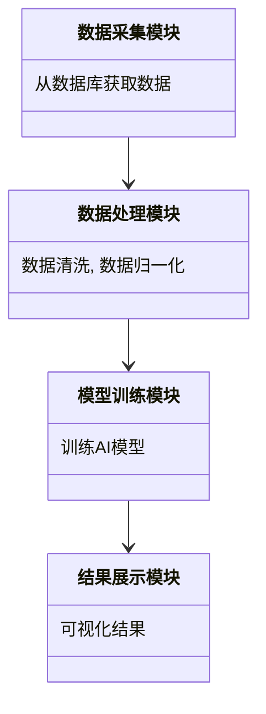

                 


# 开发AI辅助的企业财务弹性评估工具

> **关键词：** 人工智能、财务弹性评估、企业财务分析、深度学习、系统架构设计

> **摘要：**  
本文详细探讨了如何开发一种基于人工智能的企业财务弹性评估工具。通过分析财务弹性评估的核心概念、AI技术的应用、模型构建的数学基础、系统架构设计以及实际项目实现，本文为读者提供了一个全面的视角。从问题背景到解决方案，从理论分析到实际应用，本文旨在帮助企业利用AI技术提升财务弹性评估的效率和准确性。通过本文的阐述，读者可以系统地了解如何构建一个高效且可靠的AI辅助财务弹性评估系统。

---

# 第1章: 企业财务弹性评估的背景与问题

## 1.1 财务弹性评估的定义与重要性

### 1.1.1 财务弹性的定义
财务弹性是指企业在面对外部环境变化时，能够维持财务稳定、适应市场波动并实现可持续发展的能力。它是企业财务健康的重要指标之一。

### 1.1.2 财务弹性评估对企业的重要性
企业财务弹性评估能够帮助企业识别潜在的财务风险，优化资本结构，制定合理的财务策略，从而提升企业的抗风险能力和市场竞争力。

### 1.1.3 传统财务弹性评估的局限性
传统财务弹性评估方法依赖人工分析，耗时耗力，且容易受到主观因素的影响，难以快速响应市场变化和数据的复杂性。

## 1.2 问题背景与目标

### 1.2.1 企业财务健康评估的现状
随着全球经济的不确定性增加，企业面临的财务风险也在加剧。传统的财务分析方法难以满足企业对实时、动态评估的需求。

### 1.2.2 传统方法的不足
传统财务弹性评估方法依赖人工判断，效率低、准确性差，且难以处理大规模、多维度的数据。

### 1.2.3 引入AI技术的目标与意义
通过引入AI技术，可以实现自动化、智能化的财务弹性评估，提高评估的效率和准确性，帮助企业更好地应对财务风险。

## 1.3 核心概念与边界

### 1.3.1 财务弹性评估的核心要素
- 财务数据：收入、利润、现金流、资产负债率等。
- 市场环境：行业趋势、经济周期、政策变化等。
- 企业内部管理：财务策略、内部控制系统等。

### 1.3.2 边界与外延
财务弹性评估的边界在于企业内部的财务数据和外部市场环境，外延则包括企业的战略规划和风险管理。

### 1.3.3 与相关概念的对比分析
与财务健康评估、财务风险评估等概念的区别与联系。

---

# 第2章: AI辅助财务弹性评估的核心概念

## 2.1 AI在财务分析中的应用

### 2.1.1 AI技术的基本概念
人工智能（AI）是一种模拟人类智能的技术，包括机器学习、深度学习、自然语言处理等领域。

### 2.1.2 AI在财务分析中的优势
- 自动化处理：快速分析大量财务数据。
- 高准确性：通过机器学习算法提高预测准确性。
- 实时性：实时监控财务状况，及时发现风险。

### 2.1.3 AI与传统财务分析的对比
从数据处理速度、准确性、适应性等方面进行对比分析。

## 2.2 财务弹性评估的AI模型框架

### 2.2.1 模型的基本结构
基于深度学习的模型框架，包括数据输入、特征提取、模型训练等模块。

### 2.2.2 输入与输出的定义
输入：企业的财务数据、市场数据等；输出：财务弹性评估结果。

### 2.2.3 核心算法的选择
选择适合财务弹性评估的算法，如随机森林、支持向量机（SVM）等。

## 2.3 核心概念的联系与对比

### 2.3.1 财务数据与AI模型的关系
财务数据是模型的输入，AI模型通过分析这些数据来生成评估结果。

### 2.3.2 不同AI算法的优缺点对比
从准确率、训练时间、可解释性等方面对比不同算法的优缺点。

### 2.3.3 模型性能的评估指标
准确率、召回率、F1值等。

---

# 第3章: 财务弹性评估的AI模型原理

## 3.1 财务数据的特征分析

### 3.1.1 数据类型与特征提取
财务数据包括数值型、分类型等，特征提取是关键步骤。

### 3.1.2 数据预处理方法
数据清洗、归一化、缺失值处理等。

### 3.1.3 数据特征的可视化
通过可视化工具展示数据分布、关联性等。

## 3.2 AI模型的数学基础

### 3.2.1 概率与统计基础
概率论、统计学是AI模型的基础，如贝叶斯定理、中心极限定理等。

### 3.2.2 线性代数与矩阵运算
矩阵乘法、特征值分解等在深度学习中广泛应用。

### 3.2.3 优化算法的基本原理
梯度下降、Adam优化器等。

## 3.3 深度学习模型的构建

### 3.3.1 神经网络的基本结构
输入层、隐藏层、输出层的定义。

### 3.3.2 模型训练的流程
数据预处理、模型训练、参数优化等。

### 3.3.3 模型调优与评估
交叉验证、超参数调优、评估指标的选择。

## 3.4 模型的数学公式与实现

### 3.4.1 概率分布的公式
例如，正态分布的概率密度函数：
$$ f(x) = \frac{1}{\sqrt{2\pi\sigma^2}} e^{-\frac{(x-\mu)^2}{2\sigma^2}} $$

### 3.4.2 损失函数的定义与计算
交叉熵损失函数：
$$ L = -\frac{1}{m}\sum_{i=1}^{m} [y_i \log(p_i) + (1-y_i)\log(1-p_i)] $$

### 3.4.3 网络层的数学推导
例如，全连接层的输出：
$$ a = Wx + b $$

---

# 第4章: 系统架构与功能设计

## 4.1 系统功能模块划分

### 4.1.1 数据采集模块
从企业财务系统中采集数据。

### 4.1.2 数据处理模块
对数据进行清洗、归一化处理。

### 4.1.3 模型训练模块
训练AI模型并保存模型参数。

### 4.1.4 结果展示模块
将评估结果以可视化形式展示。

## 4.2 系统功能设计（领域模型类图）



## 4.3 系统架构设计（架构图）


---

# 第5章: 项目实战

## 5.1 环境安装

### 5.1.1 安装Python
```bash
pip install python
```

### 5.1.2 安装深度学习库
```bash
pip install tensorflow numpy
```

## 5.2 核心代码实现

### 5.2.1 数据预处理代码
```python
import numpy as np
import pandas as pd

# 读取数据
data = pd.read_csv('financial_data.csv')

# 数据清洗
data.dropna(inplace=True)

# 归一化处理
from sklearn.preprocessing import MinMaxScaler
scaler = MinMaxScaler()
scaled_data = scaler.fit_transform(data)
```

### 5.2.2 模型训练代码
```python
import tensorflow as tf
from tensorflow.keras import layers

# 构建模型
model = tf.keras.Sequential([
    layers.Dense(64, activation='relu'),
    layers.Dense(1, activation='sigmoid')
])

# 编译模型
model.compile(optimizer='adam', loss='binary_crossentropy', metrics=['accuracy'])

# 训练模型
model.fit(scaled_data, labels, epochs=100, batch_size=32)
```

## 5.3 案例分析

### 5.3.1 数据来源
企业财务数据，包括收入、利润、现金流等。

### 5.3.2 模型评估
准确率、召回率等指标的计算。

---

# 第6章: 最佳实践与总结

## 6.1 小结

### 6.1.1 AI在财务弹性评估中的优势
提高效率、准确性，实时监控。

### 6.1.2 系统架构设计的重要性
模块化设计、可扩展性。

## 6.2 注意事项

### 6.2.1 数据质量的重要性
确保数据的完整性和准确性。

### 6.2.2 模型的可解释性
选择易于解释的模型，便于业务人员理解。

## 6.3 拓展阅读

### 6.3.1 推荐书籍
《深度学习》、《机器学习实战》。

### 6.3.2 技术博客
推荐相关技术博客，深入学习AI在财务分析中的应用。

---

# 作者信息

**作者：** AI天才研究院/AI Genius Institute & 禅与计算机程序设计艺术 /Zen And The Art of Computer Programming

---

以上是《开发AI辅助的企业财务弹性评估工具》的技术博客文章的详细目录和内容框架，涵盖了从背景介绍到系统架构设计的各个方面。

