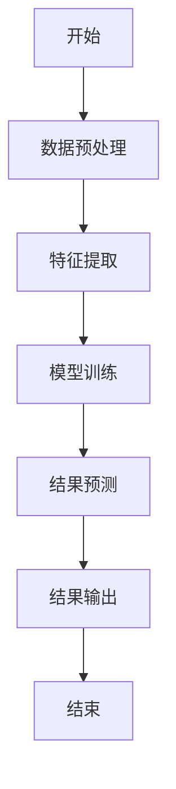
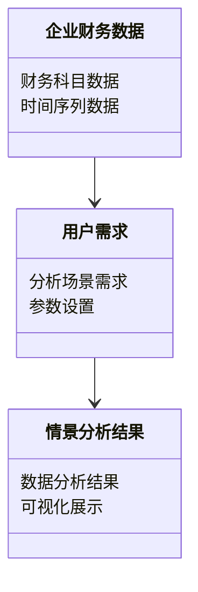
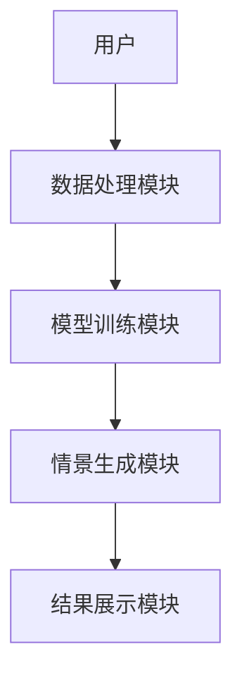
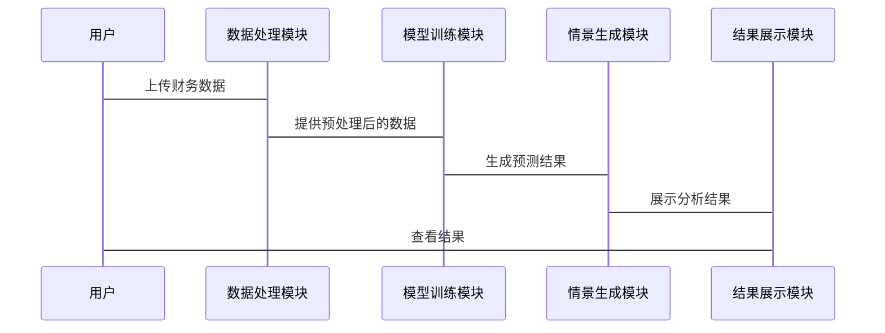

                 


# 开发AI辅助的企业财务情景分析工具

> 关键词：AI技术，财务分析，情景分析，企业财务，工具开发

> 摘要：本文详细探讨了如何利用AI技术开发企业财务情景分析工具，从背景介绍、核心概念、算法原理到系统架构、项目实战，全面解析了工具开发的全过程。文章内容丰富，逻辑清晰，旨在为企业财务分析提供新的思路和解决方案。

---

# 第一部分: AI辅助的企业财务情景分析工具开发背景

# 第1章: 企业财务情景分析工具的背景与需求

## 1.1 问题背景介绍
### 1.1.1 传统财务分析的局限性
传统的财务分析依赖于人工操作，存在效率低、误差大、覆盖面有限等问题。企业财务数据日益复杂，分析需求多样化，传统方法难以满足现代企业的高效分析需求。

### 1.1.2 企业财务分析的痛点与挑战
- 数据量大：企业财务数据种类繁多，结构复杂，人工分析效率低下。
- 需求多样：不同业务部门对财务分析的需求差异大，传统工具难以灵活应对。
- 时间压力：企业需要快速做出决策，传统分析流程耗时长，难以满足时效性要求。

### 1.1.3 AI技术在财务分析中的潜在价值
AI技术通过自动化数据处理、智能预测和实时分析，能够显著提升财务分析的效率和准确性。AI辅助工具可以帮助企业快速生成多种财务情景分析结果，为决策提供有力支持。

### 1.1.4 工具开发的边界与外延
本工具主要针对企业财务数据的场景分析，涵盖财务预测、趋势分析、风险评估等功能，不涉及具体的财务数据录入和基础计算。

## 1.2 问题描述与目标
### 1.2.1 企业财务情景分析的核心问题
如何利用AI技术快速生成多种财务情景，帮助企业在复杂市场环境中做出明智决策。

### 1.2.2 开发AI辅助工具的目标与意义
- 提升财务分析效率，缩短分析周期。
- 提高分析结果的准确性，降低人为误差。
- 支持多维度情景分析，增强企业应对市场变化的能力。

## 1.3 问题解决思路
### 1.3.1 利用AI技术提升财务分析效率
通过机器学习算法，实现财务数据的自动分类、预测和分析。

### 1.3.2 数据驱动的财务情景分析方法
结合历史数据和市场趋势，构建多维度情景模型，生成预测结果。

### 1.3.3 工具与传统财务分析的对比分析
通过对比分析，明确AI辅助工具的优势和适用场景。

## 1.4 概念结构与核心要素
### 1.4.1 财务情景分析的基本框架
包括数据采集、模型构建、情景生成和结果展示四个主要环节。

### 1.4.2 AI辅助工具的核心要素组成
- 数据处理模块：负责数据的清洗和预处理。
- 模型训练模块：基于机器学习算法构建预测模型。
- 情景生成模块：根据输入参数生成多种财务情景。
- 结果展示模块：以可视化形式呈现分析结果。

## 1.5 本章小结

---

# 第二部分: AI辅助企业财务情景分析的核心概念与联系

# 第2章: AI辅助工具的核心概念与原理

## 2.1 核心概念的定义与解析
### 2.1.1 财务情景分析的定义
通过对历史数据和市场趋势的分析，预测企业在不同情景下的财务表现。

### 2.1.2 AI辅助工具的定义
基于AI技术开发的财务分析工具，能够自动处理数据、构建模型并生成分析结果。

### 2.1.3 工具与企业财务流程的结合
AI辅助工具嵌入企业财务流程，提供实时数据分析和情景模拟功能。

## 2.2 核心概念的属性特征对比
### 2.2.1 传统财务分析的属性特征
- 人工主导：依赖财务人员的经验和技能。
- 数据依赖性高：分析结果受数据质量和完整性影响较大。
- 分析范围有限：难以处理复杂多变的市场环境。

### 2.2.2 AI辅助工具的属性特征
- 自动化：能够自动处理大量数据，减少人工干预。
- 智能化：通过机器学习算法实现预测和分析。
- 高扩展性：支持多种情景分析需求，适应不同业务场景。

### 2.2.3 两者对比分析
从效率、准确性、灵活性等方面对比传统财务分析和AI辅助工具的优劣。

## 2.3 ER实体关系图架构
```mermaid
er
    title ER Diagram for Financial Scenario Analysis

    Entity: 企业财务数据
    Entity: 用户需求
    Entity: 情景分析结果

    企业财务数据 --| 《包含》--> 财务科目数据
    用户需求 --| 《包含》--> 分析场景需求
    情景分析结果 --| 《包含》--> 数据分析结果
```

## 2.4 本章小结

---

# 第三部分: AI辅助工具的算法原理与数学模型

# 第3章: 算法原理与实现

## 3.1 算法原理概述
### 3.1.1 基于NLP的文本分析算法
用于从财务报告中提取关键信息，例如收入、成本和利润数据。

### 3.1.2 基于机器学习的预测模型
利用回归分析、随机森林等算法，预测企业在不同情景下的财务表现。

### 3.1.3 算法选择与优化
根据具体需求选择合适的算法，并通过参数调优提升模型性能。

## 3.2 算法流程图


## 3.3 算法实现代码
```python
# 示例代码：基于机器学习的预测模型
from sklearn.ensemble import RandomForestRegressor
from sklearn.model_selection import train_test_split
import pandas as pd

# 加载数据
data = pd.read_csv('financial_data.csv')

# 分割特征与目标变量
X = data.drop('target', axis=1)
y = data['target']

# 划分训练集和测试集
X_train, X_test, y_train, y_test = train_test_split(X, y, test_size=0.2, random_state=42)

# 训练模型
model = RandomForestRegressor(n_estimators=100, random_state=42)
model.fit(X_train, y_train)

# 预测结果
y_pred = model.predict(X_test)
```

## 3.4 算法的数学模型与公式
### 3.4.1 机器学习模型的数学基础
随机森林回归模型的数学表达式如下：

$$ y = \sum_{i=1}^{n} (w_i x_i) $$

其中，\( w_i \) 是特征 \( x_i \) 的权重。

### 3.4.2 模型优化与调参
通过交叉验证等方法，优化模型参数，提升预测精度。

## 3.5 本章小结

---

# 第四部分: AI辅助企业财务情景分析的系统架构与设计

# 第4章: 系统架构与设计

## 4.1 系统架构概述
### 4.1.1 问题场景介绍
企业在使用AI辅助工具时，需要考虑数据源、计算能力和用户需求等多个方面。

### 4.1.2 项目介绍
本项目旨在开发一个基于AI技术的企业财务情景分析工具，帮助企业快速生成多种财务情景。

## 4.2 系统功能设计
### 4.2.1 领域模型设计


### 4.2.2 系统架构设计


## 4.3 系统接口设计
### 4.3.1 接口设计
- 数据接口：用于接收企业财务数据。
- 模型接口：用于调用机器学习模型。
- 结果接口：用于输出分析结果。

### 4.3.2 交互设计
用户通过界面对工具进行操作，包括数据上传、参数设置和结果查看。

## 4.4 系统交互设计


## 4.5 本章小结

---

# 第五部分: AI辅助企业财务情景分析工具的项目实战

# 第5章: 项目实战

## 5.1 环境安装与配置
### 5.1.1 开发环境要求
- 操作系统：Windows 10 或 macOS 10.15 以上
- Python版本：3.8 以上
- 需要安装的库：scikit-learn、pandas、numpy、mermaid

### 5.1.2 工具安装
通过pip安装所需库：
```bash
pip install scikit-learn pandas numpy mermaid
```

## 5.2 系统核心实现
### 5.2.1 核心代码实现
```python
import pandas as pd
from sklearn.ensemble import RandomForestRegressor
from sklearn.model_selection import train_test_split

# 加载数据
data = pd.read_csv('financial_data.csv')

# 分割特征与目标变量
X = data.drop('target', axis=1)
y = data['target']

# 划分训练集和测试集
X_train, X_test, y_train, y_test = train_test_split(X, y, test_size=0.2, random_state=42)

# 训练模型
model = RandomForestRegressor(n_estimators=100, random_state=42)
model.fit(X_train, y_train)

# 预测结果
y_pred = model.predict(X_test)

# 保存结果
pd.DataFrame({'预测值': y_pred, '实际值': y_test}).to_csv('result.csv', index=False)
```

### 5.2.2 代码解读与分析
- 数据加载：使用pandas读取CSV格式的财务数据。
- 数据分割：将数据划分为训练集和测试集。
- 模型训练：使用随机森林回归模型进行训练。
- 结果预测：生成预测结果并保存。

## 5.3 实际案例分析
### 5.3.1 案例背景
某企业希望预测未来三年的销售收入，基于过去五年的财务数据和市场趋势。

### 5.3.2 数据分析
通过随机森林模型，预测销售收入的变化趋势，并生成不同情景下的预测结果。

## 5.4 工具的实际应用与效果
### 5.4.1 工具的实际应用
企业财务部门使用该工具进行多情景分析，支持决策制定。

### 5.4.2 工具的效果评估
通过对比实际数据和预测结果，评估工具的准确性和实用性。

## 5.5 本章小结

---

# 第六部分: 总结与展望

# 第6章: 总结与展望

## 6.1 最佳实践 tips
- 数据质量是关键：确保输入数据的准确性和完整性。
- 模型选择与调优：根据具体需求选择合适的算法，并进行参数优化。
- 结果可视化：通过图表等形式，直观展示分析结果。

## 6.2 小结
本文详细介绍了AI辅助企业财务情景分析工具的开发背景、核心概念、算法原理、系统架构以及项目实战。通过实际案例分析，展示了工具的应用价值和效果。

## 6.3 注意事项
- 数据隐私与安全：在处理企业财务数据时，需注意数据的安全性和隐私保护。
- 模型的可解释性：确保模型结果能够被财务人员理解和信任。

## 6.4 拓展阅读
建议读者进一步学习机器学习在金融领域的应用，以及更高级的财务分析方法。

---

# 附录

## 附录A: 术语表
- AI：人工智能
- NLP：自然语言处理
- RF：随机森林

## 附录B: 参考文献
- [1] 刘军, 等. 《人工智能在金融领域的应用》. 清华大学出版社, 2022.
- [2] 王伟, 等. 《财务数据分析与建模》. 北京大学出版社, 2021.

---

# 作者：AI天才研究院/AI Genius Institute & 禅与计算机程序设计艺术 /Zen And The Art of Computer Programming

---

**注意：以上目录大纲为示例，实际文章内容需要根据具体需求进行扩展和调整。**

