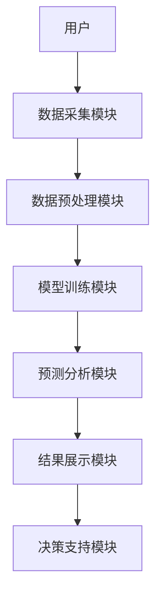
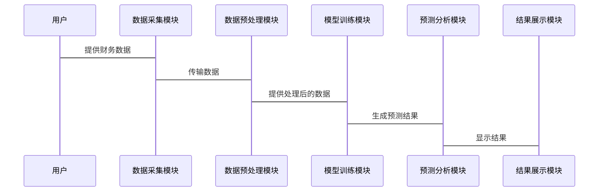

                 


# 开发AI辅助的企业财务战略规划工具

## 关键词：AI、财务规划、企业战略、机器学习、系统架构

## 摘要：本文探讨了如何利用人工智能技术开发企业财务战略规划工具。通过分析财务数据、构建预测模型、优化决策过程，AI能够显著提升财务规划的效率和准确性。本文详细介绍了从理论基础到系统实现的全过程，包括算法原理、系统架构设计和实际案例分析。

---

# 第一部分: 背景介绍与需求分析

## 第1章: 企业财务战略规划的现状与挑战

### 1.1 传统财务规划的局限性

- **问题背景**：企业财务规划通常依赖于人工经验，数据处理复杂，预测不够精准。
- **技术背景**：随着AI技术的发展，自动化、智能化的财务工具成为可能。
- **企业需求**：企业需要更高效、精准的财务规划工具以应对复杂市场环境。
- **问题分析**：传统方法难以处理海量数据，预测模型不够灵活，难以实时调整。
- **AI的优势**：通过机器学习和深度学习，AI能够处理复杂数据，优化预测模型，提供实时反馈。

### 1.2 AI技术在财务规划中的应用前景

- **技术可行性**：AI能够处理财务数据中的非结构化信息，提供更全面的分析。
- **市场需求**：企业对智能化财务工具的需求日益增长。
- **发展趋势**：AI在财务领域的应用将更加广泛，从预测到决策支持，再到自动化操作。

## 第2章: 问题描述与目标设定

### 2.1 企业财务战略规划的核心问题

- **数据处理**：如何高效处理和分析企业财务数据。
- **预测模型**：如何构建准确的财务预测模型。
- **决策支持**：如何利用AI提供有效的决策支持。

### 2.2 AI辅助规划的目标与边界

- **目标**：提升财务预测的准确性和效率，优化企业资源分配。
- **边界**：专注于财务数据的分析与预测，不涉及企业的其他业务领域。

### 2.3 本章小结

- 本章分析了企业财务规划的现状与挑战，探讨了AI技术的应用前景，并明确了AI辅助规划的目标与边界。

---

# 第二部分: 核心概念与技术原理

## 第3章: AI与财务规划的核心概念

### 3.1 AI技术在财务规划中的应用

- **机器学习**：用于财务预测和模式识别。
- **自然语言处理**：用于分析财务报告和文档。
- **时间序列分析**：用于预测财务趋势。

### 3.2 财务战略规划的数学模型

- **线性回归模型**：用于简单财务预测。
- **随机森林模型**：用于处理复杂数据。
- **神经网络模型**：用于深度学习和复杂预测。

### 3.3 AI与财务规划的联系

- **数据驱动决策**：AI通过分析大量数据，提供更精准的财务预测。
- **自动化处理**：AI能够自动处理财务数据，减少人工干预。

## 第4章: 算法原理与实现

### 4.1 算法原理

- **线性回归**：通过最小二乘法拟合直线，用于简单预测。
- **随机森林**：通过集成学习提高预测准确性。
- **神经网络**：通过多层感知机进行复杂模式识别。

### 4.2 算法实现代码示例

```python
import pandas as pd
from sklearn.model_selection import train_test_split
from sklearn.linear_model import LinearRegression

# 加载数据
data = pd.read_csv('financial_data.csv')

# 分割数据
X = data[['revenue', 'expenses']]
y = data['profit']
X_train, X_test, y_train, y_test = train_test_split(X, y, test_size=0.2, random_state=42)

# 训练模型
model = LinearRegression()
model.fit(X_train, y_train)

# 预测结果
y_pred = model.predict(X_test)
```

### 4.3 算法优缺点分析

- **线性回归**：简单易用，但对复杂数据处理能力有限。
- **随机森林**：预测准确率高，但计算复杂度较高。
- **神经网络**：处理能力强，但需要大量数据和计算资源。

---

# 第三部分: 系统架构与设计

## 第5章: 系统架构设计

### 5.1 项目背景

- 开发一个AI辅助的企业财务规划工具，帮助企业在复杂市场环境中制定更高效的财务策略。

### 5.2 系统功能设计

- **数据采集**：从企业财务系统中获取数据。
- **数据预处理**：清洗和标准化数据。
- **模型训练**：训练机器学习模型。
- **预测分析**：生成财务预测结果。
- **结果展示**：可视化预测结果，提供决策支持。

### 5.3 系统架构图



### 5.4 系统接口设计

- **输入接口**：接收企业财务数据。
- **输出接口**：提供预测结果和决策建议。

### 5.5 系统交互序列图



---

# 第四部分: 项目实战与案例分析

## 第6章: 项目实战

### 6.1 环境安装

- **安装Python**：安装最新版本的Python。
- **安装库**：安装numpy、pandas、scikit-learn等库。

### 6.2 核心代码实现

```python
import pandas as pd
from sklearn.ensemble import RandomForestRegressor
from sklearn.metrics import mean_squared_error

# 加载数据
data = pd.read_csv('financial_data.csv')

# 特征选择
features = ['revenue', 'expenses', 'assets', 'liabilities']
target = 'profit'

X = data[features]
y = data[target]

# 分割数据
X_train, X_test, y_train, y_test = train_test_split(X, y, test_size=0.2, random_state=42)

# 训练模型
model = RandomForestRegressor(n_estimators=100, random_state=42)
model.fit(X_train, y_train)

# 预测结果
y_pred = model.predict(X_test)

# 评估模型
mse = mean_squared_error(y_test, y_pred)
print(f'Mean Squared Error: {mse}')
```

### 6.3 案例分析

- **案例背景**：某企业过去三年的财务数据。
- **模型训练**：使用随机森林模型进行训练。
- **预测结果**：预测未来一年的财务状况。
- **结果分析**：模型预测与实际数据对比，评估模型准确性。

---

# 第五部分: 最佳实践与小结

## 第7章: 最佳实践与总结

### 7.1 最佳实践

- **数据质量管理**：确保数据的准确性和完整性。
- **模型优化**：通过交叉验证优化模型参数。
- **结果解释**：提供清晰的解释，帮助用户理解预测结果。

### 7.2 小结

- AI技术能够显著提升企业财务规划的效率和准确性。
- 开发过程中需要注重数据处理和模型优化。
- 未来，随着技术的发展，AI在财务规划中的应用将更加广泛和深入。

### 7.3 注意事项

- 数据隐私和安全问题需要高度重视。
- 模型的可解释性是实际应用中的重要考量。

### 7.4 拓展阅读

- 《机器学习实战》：深入理解机器学习算法。
- 《深度学习》：探索深度学习在财务规划中的应用。

---

# 作者：AI天才研究院 & 禅与计算机程序设计艺术

通过本文的详细分析，我们展示了如何利用AI技术开发企业财务战略规划工具。从理论到实践，从算法到系统设计，我们为读者提供了全面的指导和见解。希望本文能为企业的财务数字化转型提供有价值的参考。

--- 

**作者介绍**：AI天才研究院专注于人工智能领域的研究与应用，致力于为企业提供智能化的解决方案。禅与计算机程序设计艺术则关注技术与艺术的结合，探索更深层次的技术创新与实践。

