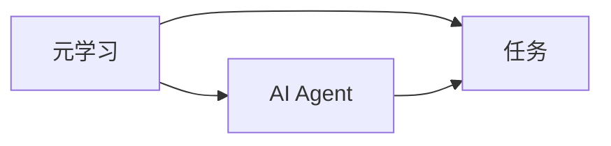
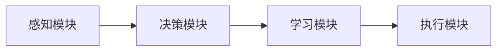
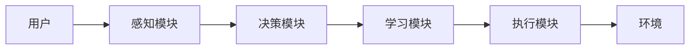

                 


# 开发具有元学习能力的AI Agent

## 关键词：元学习，AI Agent，机器学习，深度学习，强化学习

## 摘要：本文系统阐述了如何开发具有元学习能力的AI Agent，从元学习的基本概念、算法原理、系统架构到实际应用案例，详细探讨了元学习如何增强AI Agent的学习能力，并通过具体的技术实现和数学模型，深入分析了元学习在AI Agent开发中的应用前景和挑战。

---

## 第一部分: 元学习与AI Agent基础

### 第1章: 元学习与AI Agent概述

#### 1.1 元学习的基本概念

##### 1.1.1 元学习的定义
元学习（Meta-Learning）是一种机器学习范式，旨在让模型学会如何学习。与传统机器学习不同，元学习的目标不是直接解决特定任务，而是通过学习多个任务的规律，形成一种“元能力”，从而能够快速适应新任务。

##### 1.1.2 元学习的核心思想
元学习的核心思想是通过学习任务之间的共性，构建一种通用的学习能力。这种能力使得模型能够快速适应新任务，而无需大量数据或训练时间。元学习的关键在于找到任务之间的相似性，并利用这种相似性来加速新任务的学习。

##### 1.1.3 元学习与传统机器学习的区别
| 特性 | 传统机器学习 | 元学习 |
|------|---------------|----------|
| 数据需求 | 高 | 较低 |
| 任务适应性 | 低 | 高 |
| 学习目标 | 解决特定任务 | 学会如何学习 |

#### 1.2 AI Agent的基本概念

##### 1.2.1 AI Agent的定义
AI Agent（人工智能代理）是一种智能系统，能够感知环境、自主决策并采取行动，以实现特定目标。AI Agent可以是软件程序、机器人或其他智能实体。

##### 1.2.2 AI Agent的核心特征
| 特性 | 描述 |
|------|------|
| 感知能力 | 能够感知环境状态 |
| 决策能力 | 能够根据感知做出决策 |
| 适应能力 | 能够适应新环境或任务 |
| 学习能力 | 能够通过学习提升性能 |

##### 1.2.3 AI Agent的应用场景
AI Agent广泛应用于自动驾驶、智能助手、游戏AI、机器人控制等领域。在这些场景中，AI Agent需要具备快速学习和适应新任务的能力。

#### 1.3 元学习在AI Agent中的作用

##### 1.3.1 元学习如何增强AI Agent的学习能力
元学习通过学习多个任务的共性，使得AI Agent能够快速适应新任务，从而提升其学习效率和适应性。

##### 1.3.2 元学习与AI Agent的结合方式
元学习可以作为AI Agent的学习模块，帮助其快速掌握新任务。通过元学习，AI Agent能够在有限的数据和时间内完成任务。

##### 1.3.3 元学习在AI Agent中的应用前景
随着元学习技术的不断发展，AI Agent将具备更强的通用性和适应性，能够在更多复杂场景中发挥作用。

#### 1.4 本章小结
本章介绍了元学习和AI Agent的基本概念，分析了元学习在AI Agent中的作用，并展望了其应用前景。

---

### 第2章: 元学习的核心概念与联系

#### 2.1 元学习的原理

##### 2.1.1 元学习的算法流程
元学习的典型流程包括以下步骤：
1. **元任务选择**：选择一组基础任务。
2. **任务学习**：在每个任务上训练模型。
3. **元学习**：通过分析任务间的共性，学习一种通用的策略。

##### 2.1.2 元学习的核心要素
- **元任务**：用于训练元学习模型的任务集合。
- **元模型**：能够快速适应新任务的模型。
- **任务间共性**：任务之间的相似性或共享特征。

##### 2.1.3 元学习的数学模型
元学习的数学模型通常涉及优化目标函数，例如：
$$ \min_{\theta} \sum_{i=1}^{N} \mathcal{L}_i(\theta) $$
其中，$\theta$ 是模型参数，$\mathcal{L}_i$ 是第 $i$ 个任务的损失函数。

#### 2.2 元学习与AI Agent的关系

##### 2.2.1 元学习如何提升AI Agent的适应性
通过元学习，AI Agent能够快速适应新任务，减少对新任务数据的依赖。

##### 2.2.2 元学习在AI Agent中的具体应用
- **多任务学习**：AI Agent可以在多个任务之间切换，利用元学习快速掌握新任务。
- **快速适应新环境**：AI Agent能够快速适应新环境，减少适应时间。

##### 2.2.3 元学习与AI Agent的协同进化
元学习和AI Agent的结合，使得AI Agent不仅能够完成特定任务，还能够通过元学习不断进化其学习能力。

#### 2.3 核心概念对比表
| 概念 | 元学习 | AI Agent |
|------|--------|----------|
| 核心目标 | 学会如何学习 | 完成特定任务 |
| 输入 | 多任务学习 | 任务特定输入 |
| 输出 | 学习策略 | 任务特定输出 |

#### 2.4 ER实体关系图


#### 2.5 本章小结
本章详细讲解了元学习的原理，并分析了其与AI Agent的关系，通过对比和图示帮助读者理解两者的核心联系。

---

### 第3章: 元学习算法原理

#### 3.1 元学习算法概述

##### 3.1.1 元学习算法的分类
元学习算法主要分为基于梯度的元学习和非基于梯度的元学习两类。

##### 3.1.2 各类元学习算法的优缺点
| 算法类型 | 优点 | 缺点 |
|----------|------|------|
| 基于梯度 | 收敛速度快 | 计算复杂度高 |
| 非基于梯度 | 计算效率高 | 收敛速度慢 |

##### 3.1.3 元学习算法的数学模型
元学习的数学模型通常涉及优化问题，例如：
$$ \min_{\theta} \sum_{i=1}^{N} \mathcal{L}_i(\theta) + \lambda \Omega(\theta) $$
其中，$\Omega(\theta)$ 是正则化项，$\lambda$ 是正则化系数。

#### 3.2 基于梯度的元学习算法

##### 3.2.1 MAML算法
MAML（Meta-Anti Gradients）是一种基于梯度的元学习算法，通过优化元任务的梯度来实现快速适应新任务。

##### 3.2.2 ReMAML算法
ReMAML是对MAML的改进，通过引入重放机制来增强模型的泛化能力。

##### 3.2.3 其他基于梯度的元学习算法
包括Meta-SGD、Meta-Adam等算法。

#### 3.3 非基于梯度的元学习算法

##### 3.3.1 迁移学习
迁移学习是一种非基于梯度的元学习算法，通过将一个任务的知识迁移到新任务。

##### 3.3.2 自适应学习
自适应学习是一种通过调整模型参数来适应新任务的元学习方法。

#### 3.4 本章小结
本章详细讲解了元学习算法的分类和具体实现，重点介绍了几种典型的元学习算法及其优缺点。

---

### 第4章: 元学习在AI Agent中的应用

#### 4.1 AI Agent的系统功能设计

##### 4.1.1 系统功能模块
AI Agent的系统功能模块包括感知模块、决策模块、学习模块和执行模块。

##### 4.1.2 功能模块的相互关系
感知模块负责收集环境信息，决策模块基于感知信息做出决策，学习模块通过元学习提升决策模块的性能，执行模块将决策转化为具体行动。

#### 4.2 AI Agent的系统架构设计

##### 4.2.1 系统架构图


##### 4.2.2 模块间的接口设计
- 感知模块与决策模块之间的接口：环境状态信息传递。
- 决策模块与学习模块之间的接口：任务信息传递。
- 学习模块与执行模块之间的接口：策略更新传递。

#### 4.3 AI Agent的交互流程

##### 4.3.1 交互流程图


#### 4.4 本章小结
本章详细介绍了AI Agent的系统功能设计和架构设计，并通过图示展示了各模块之间的关系和交互流程。

---

## 第五部分: 项目实战

### 第5章: 元学习驱动的AI Agent开发

#### 5.1 项目背景与目标
本项目旨在开发一个具有元学习能力的AI Agent，使其能够快速适应新任务。

#### 5.2 环境安装与配置

##### 5.2.1 安装Python
安装Python 3.8或更高版本。

##### 5.2.2 安装依赖库
安装TensorFlow、Keras、PyTorch等深度学习库。

#### 5.3 系统核心实现

##### 5.3.1 元学习模型实现
```python
class MetaLearningModel:
    def __init__(self, input_dim, output_dim):
        self.input_dim = input_dim
        self.output_dim = output_dim
        self.model = self.build_model()
    
    def build_model(self):
        # 构建元学习模型
        pass
    
    def forward(self, x):
        # 前向传播
        pass
    
    def backward(self, loss):
        # 反向传播
        pass
```

##### 5.3.2 AI Agent实现
```python
class AI-Agent:
    def __init__(self, input_dim, output_dim):
        self.model = MetaLearningModel(input_dim, output_dim)
    
    def perceive(self, environment):
        # 感知环境
        pass
    
    def decide(self, state):
        # 做出决策
        pass
    
    def learn(self, task):
        # 元学习
        pass
```

#### 5.4 项目测试与验证

##### 5.4.1 测试环境
构建测试环境，验证AI Agent的感知和决策能力。

##### 5.4.2 测试结果分析
分析测试结果，评估元学习模型的性能。

#### 5.5 本章小结
本章通过一个实际项目，详细讲解了元学习驱动的AI Agent开发过程，包括环境配置、系统实现和测试验证。

---

## 第六部分: 高级主题

### 第6章: 元学习的优化与应用

#### 6.1 元学习的优化方法

##### 6.1.1 参数优化
通过优化模型参数，提升元学习的性能。

##### 6.1.2 算法优化
改进元学习算法，降低计算复杂度。

#### 6.2 元学习与其他技术的结合

##### 6.2.1 元学习与强化学习
结合强化学习，提升AI Agent的决策能力。

##### 6.2.2 元学习与自监督学习
结合自监督学习，增强模型的自适应能力。

#### 6.3 元学习的未来发展方向

##### 6.3.1 更高效的元学习算法
开发更高效的元学习算法，降低计算成本。

##### 6.3.2 更广泛的应用场景
探索元学习在更多领域的应用。

#### 6.4 本章小结
本章探讨了元学习的优化方法及其与其他技术的结合，展望了元学习的未来发展方向。

---

## 作者：AI天才研究院/AI Genius Institute & 禅与计算机程序设计艺术 /Zen And The Art of Computer Programming

---

这篇文章系统地介绍了如何开发具有元学习能力的AI Agent，从基础概念到算法实现，再到项目实战和高级主题，内容详实，结构清晰。通过本文，读者可以全面掌握元学习的核心原理及其在AI Agent中的应用，为实际开发提供理论和实践指导。

