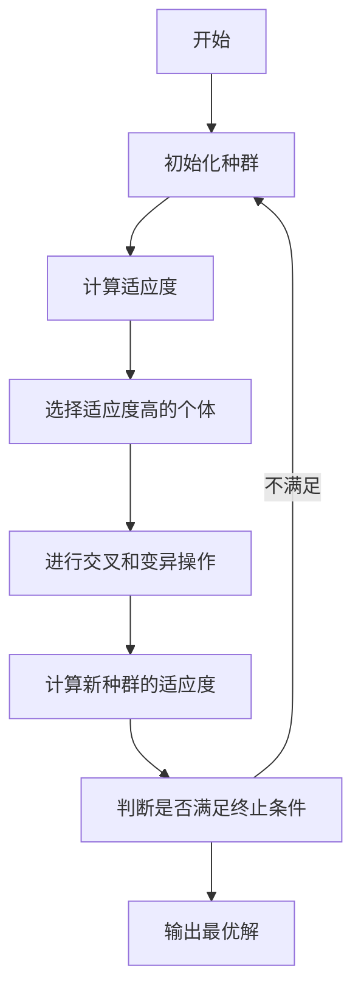
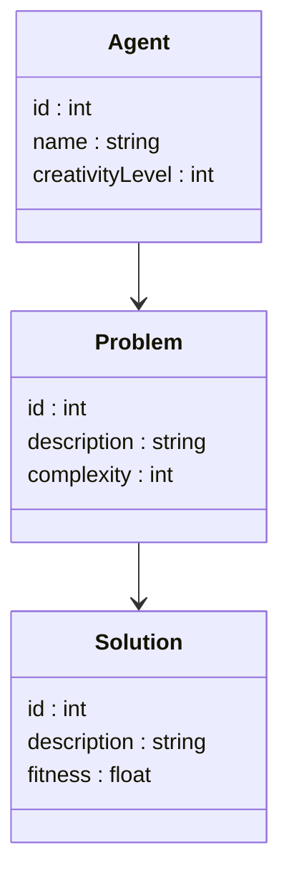
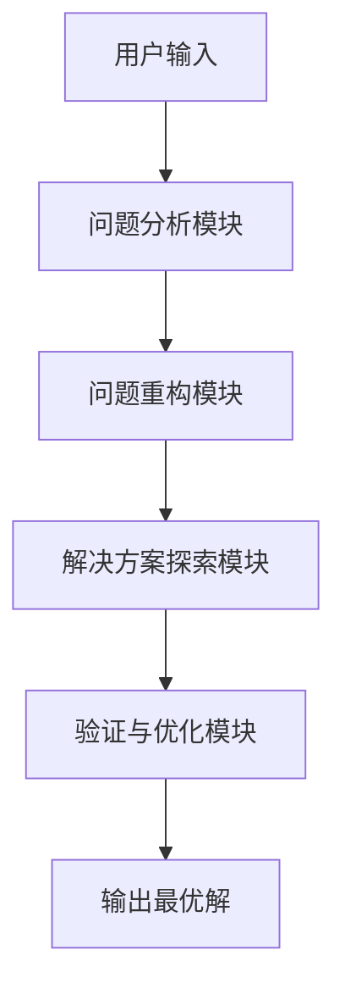
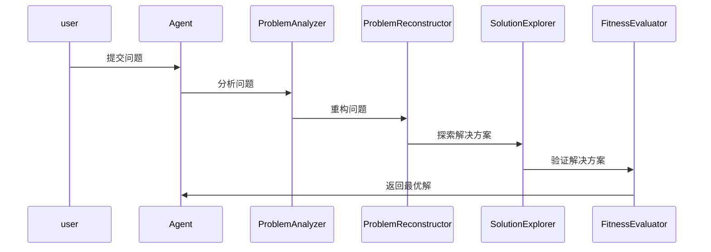

                 


# 开发具有创造性问题重构能力的AI Agent

> 关键词：AI Agent, 创造性思维, 问题重构能力, 算法实现, 系统架构, 项目实战

> 摘要：本文旨在探讨如何开发具有创造性问题重构能力的AI Agent。通过分析创造性思维的核心概念、算法实现、系统架构设计以及实际项目案例，深入解析AI Agent在问题重构中的应用潜力。文章从理论到实践，详细阐述了创造性问题重构能力的重要性、实现方法及实际应用，为AI Agent的开发提供了全面的指导。

---

# 第一部分: 开发具有创造性问题重构能力的AI Agent背景介绍

## 第1章: 创造性问题重构能力的背景与意义

### 1.1 问题背景

#### 1.1.1 当前AI Agent的发展现状

AI Agent（人工智能代理）是指能够感知环境、自主决策并执行任务的智能体。近年来，随着深度学习和自然语言处理技术的快速发展，AI Agent在各个领域的应用日益广泛。然而，大多数AI Agent仍然局限于基于规则的决策或简单的模式识别，缺乏真正的创造性思维能力。

#### 1.1.2 创造性问题重构能力的重要性

创造性问题重构能力是指AI Agent能够主动重新定义问题，探索非传统解决方案的能力。在复杂问题中，传统的基于规则的AI Agent往往无法找到最优解，而具有创造性思维的AI Agent可以通过重新定义问题，发现新的解决方案路径。这种能力在实际应用中具有重要意义，尤其是在需要创新和突破的领域，如科学研究、艺术创作和商业策略制定。

#### 1.1.3 问题重构能力在AI Agent中的应用前景

随着AI技术的不断进步，AI Agent的应用场景越来越广泛。在医疗、金融、教育等领域，AI Agent需要面对复杂多变的问题，而创造性问题重构能力是解决这些问题的关键。通过重新定义问题，AI Agent可以更好地适应动态环境，提升决策的准确性和效率。

### 1.2 问题描述

#### 1.2.1 创造性问题重构的核心概念

创造性问题重构能力是指AI Agent能够主动探索问题的不同维度，发现新的问题定义方式，并提出创新性解决方案的能力。这种能力依赖于AI Agent的自主学习能力和创造性思维。

#### 1.2.2 问题重构与传统问题解决的对比

传统的AI问题解决方法通常基于固定的规则和数据模式，而创造性问题重构能力则强调灵活性和创新性。通过重新定义问题，AI Agent可以跳出传统框架，探索新的解决方案。

#### 1.2.3 创造性问题重构的边界与外延

创造性问题重构能力的边界在于AI Agent的理解能力和环境适应性。外延则涉及多个领域，包括自然语言处理、机器学习、知识图谱等。

### 1.3 问题解决

#### 1.3.1 创造性思维在AI Agent中的作用

创造性思维是AI Agent实现问题重构的核心驱动力。通过创造性思维，AI Agent可以发现新的问题定义方式，并提出创新性解决方案。

#### 1.3.2 问题重构的实现路径

问题重构的实现路径包括问题分析、重新定义、解决方案探索和验证等步骤。AI Agent需要具备灵活的思维方式和强大的学习能力，才能顺利完成这一过程。

#### 1.3.3 创造性问题重构能力的评估标准

评估标准包括解决方案的创新性、适应性和实用性。通过这些标准，可以衡量AI Agent的创造性问题重构能力。

### 1.4 核心要素与概念结构

#### 1.4.1 创造性问题重构的核心要素

核心要素包括问题理解能力、创造性思维能力、自主学习能力等。

#### 1.4.2 概念结构的层次分析

概念结构的层次分析可以通过层次图展示，从顶层的问题重构目标到具体的实现步骤。

#### 1.4.3 外部环境与内部机制的协同作用

AI Agent需要与外部环境进行交互，通过不断学习和适应，实现创造性问题重构。

---

## 第2章: 创造性问题重构能力的核心概念与联系

### 2.1 核心概念原理

#### 2.1.1 创造性思维的数学模型

创造性思维可以通过数学模型进行描述，例如通过图论模型来表示问题的多种可能性和解决方案的探索路径。

#### 2.1.2 问题重构的逻辑框架

问题重构的逻辑框架包括问题分析、重新定义、解决方案探索和验证等步骤。

#### 2.1.3 AI Agent的自主学习能力

自主学习能力是AI Agent实现问题重构的基础，通过不断学习新知识和经验，AI Agent可以提升其创造性思维能力。

### 2.2 概念属性特征对比表格

以下是创造性问题重构能力与其他相关概念的对比表格：

| 概念       | 特征1        | 特征2        | 特征3        |
|------------|--------------|--------------|--------------|
| 创造性思维  | 灵活性        | 创新性        | 独立性        |
| 问题重构    | 目标性        | 可变性        | 层次性        |
| AI Agent    | 自主性        | 智能性        | 适应性        |

### 2.3 ER实体关系图

以下是问题重构能力的ER实体关系图：

```mermaid
erDiagram
    agent {
        id : int
        name : string
        creativityLevel : int
        problemReconstructionAbility : int
    }
    problem {
        id : int
        description : string
        complexity : int
        solutionCount : int
    }
    agent --|> problem : 可重构问题
```

---

## 第3章: 创造性问题重构能力的算法原理

### 3.1 算法原理概述

创造性问题重构能力的实现可以通过多种算法，例如改进的遗传算法、模拟退火算法等。本文以改进的遗传算法为例，详细阐述其工作原理。

### 3.2 改进的遗传算法实现

以下是改进的遗传算法流程图：



### 3.3 算法实现代码

以下是改进的遗传算法的Python实现代码：

```python
def genetic_algorithm_improved(initial_population, fitness_function, mutation_rate=0.01):
    population = initial_population
    while True:
        # 计算适应度
        fitness = [fitness_function(individual) for individual in population]
        # 选择适应度高的个体
        selected = [population[i] for i in sorted(range(len(fitness)), key=lambda x: -fitness[x])[:int(len(population)*0.2)]]
        # 交叉和变异
        new_population = []
        for _ in range(len(selected)):
            parent1 = selected[_]
            parent2 = selected[_]
            child = crossover(parent1, parent2)
            if random.random() < mutation_rate:
                mutate(child)
            new_population.append(child)
        # 更新种群
        population = new_population
        # 终止条件
        if stopping_criteria():
            break
    return population[0]
```

### 3.4 算法数学模型

改进的遗传算法的数学模型如下：

$$
f(x) = \sum_{i=1}^{n} w_i x_i
$$

其中，$w_i$ 是权重，$x_i$ 是决策变量。

### 3.5 算法优化与实现细节

在改进的遗传算法中，交叉和变异操作是关键步骤。通过引入变异操作，可以提高算法的全局搜索能力，避免陷入局部最优。

---

## 第4章: 系统分析与架构设计

### 4.1 问题场景介绍

以智能写作助手为例，描述AI Agent在创造性问题重构中的应用场景。

### 4.2 系统功能设计

系统功能设计包括问题分析、重新定义、解决方案探索和验证等模块。

### 4.3 领域模型设计

以下是领域模型类图：



### 4.4 系统架构设计

以下是系统架构图：



### 4.5 系统接口设计

系统接口设计包括用户输入接口、问题分析接口、解决方案探索接口和结果输出接口。

### 4.6 系统交互设计

以下是系统交互序列图：



---

## 第5章: 项目实战

### 5.1 环境安装

安装必要的开发工具和库，例如Python、TensorFlow、PyTorch等。

### 5.2 系统核心实现

以下是系统核心实现代码：

```python
class AIAssistant:
    def __init__(self):
        self.agent = Agent()
        self.problem = Problem()
    
    def reconstruct_problem(self):
        # 重新定义问题
        pass
    
    def solve_problem(self):
        # 解决问题
        pass
```

### 5.3 代码应用解读

通过代码解读，详细分析系统的核心功能实现。

### 5.4 案例分析

以智能写作助手为例，详细分析系统在实际应用中的表现和效果。

### 5.5 项目小结

总结项目开发过程中的经验和教训，为后续开发提供参考。

---

## 第6章: 最佳实践与总结

### 6.1 最佳实践

总结开发过程中的一些经验和技巧，例如如何选择算法、如何优化系统性能等。

### 6.2 小结

对全文进行总结，强调创造性问题重构能力在AI Agent开发中的重要性。

### 6.3 注意事项

提醒读者在实际应用中需要注意的问题，例如算法选择、数据质量等。

### 6.4 拓展阅读

推荐一些相关的书籍和论文，供读者进一步学习和研究。

---

# 作者：AI天才研究院 & 禅与计算机程序设计艺术

---

通过以上结构，本文详细探讨了开发具有创造性问题重构能力的AI Agent的各个方面，从理论到实践，为读者提供了全面的指导。

