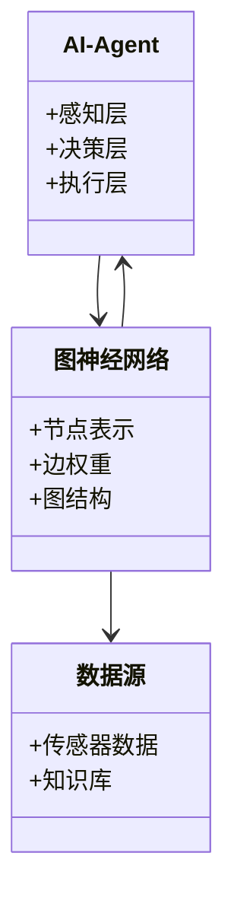
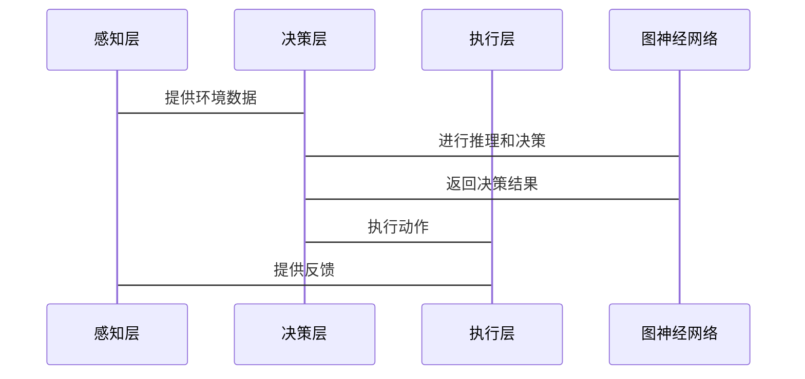

                 


# 《开发具有图神经网络能力的AI Agent》

> **关键词**：AI Agent、图神经网络、深度学习、知识图谱、智能系统、算法原理

> **摘要**：本文深入探讨了如何开发具有图神经网络能力的AI Agent，涵盖AI Agent与图神经网络的基本概念、图神经网络的核心原理、AI Agent的系统架构设计、项目实战案例以及总结与展望。文章通过详细的理论分析和实际案例，展示了如何利用图神经网络增强AI Agent的能力，实现更智能的决策和交互。

---

# 《开发具有图神经网络能力的AI Agent》

> **关键词**：AI Agent、图神经网络、深度学习、知识图谱、智能系统、算法原理

> **摘要**：本文深入探讨了如何开发具有图神经网络能力的AI Agent，涵盖AI Agent与图神经网络的基本概念、图神经网络的核心原理、AI Agent的系统架构设计、项目实战案例以及总结与展望。文章通过详细的理论分析和实际案例，展示了如何利用图神经网络增强AI Agent的能力，实现更智能的决策和交互。

---

## 第1章: AI Agent与图神经网络概述

### 1.1 AI Agent的基本概念

#### 1.1.1 什么是AI Agent

AI Agent（人工智能代理）是指能够感知环境、做出决策并执行动作的智能实体。它可以是一个软件程序、机器人或其他智能系统，其核心目标是通过自主决策和问题解决来实现特定任务。

#### 1.1.2 AI Agent的分类与特点

AI Agent可以根据智能水平分为：

- **反应式AI Agent**：基于当前感知做出反应，不依赖历史信息。
- **认知式AI Agent**：具有推理、规划和学习能力，能够处理复杂任务。
- **混合式AI Agent**：结合反应式和认知式的特点，适用于复杂的动态环境。

其特点包括自主性、反应性、目标导向和学习能力。

#### 1.1.3 AI Agent的应用场景

AI Agent广泛应用于多个领域：

- **自动驾驶**：如自动驾驶汽车中的路径规划和决策系统。
- **智能助手**：如Siri、Alexa等，提供语音交互和任务执行。
- **推荐系统**：基于用户行为推荐个性化内容。
- **机器人控制**：用于工业机器人或服务机器人的智能控制。

### 1.2 图神经网络的基本概念

#### 1.2.1 图的基本概念与表示

图（Graph）由节点（顶点）和边（边）组成，用于表示实体及其关系。节点表示个体，边表示关系或连接。例如，社交网络中的用户和他们的关系。

#### 1.2.2 图神经网络的定义与特点

图神经网络（Graph Neural Networks, GNNs）是一种处理图结构数据的深度学习模型。其特点包括：

- **局部聚合**：每个节点的表示依赖其邻居节点的信息。
- **全局建模**：能够捕捉图的整体结构和关系。
- **可扩展性**：适用于大规模图数据。

#### 1.2.3 图神经网络的应用领域

图神经网络在多个领域有广泛应用：

- **社交网络分析**：用户关系、影响力分析。
- **生物信息学**：蛋白质相互作用网络分析。
- **推荐系统**：基于用户-物品交互图进行推荐。

### 1.3 AI Agent与图神经网络的结合

#### 1.3.1 图神经网络在AI Agent中的作用

图神经网络为AI Agent提供了处理复杂关系的能力，帮助其在动态环境中做出更智能的决策。

#### 1.3.2 图神经网络如何增强AI Agent的能力

通过图神经网络，AI Agent可以：

- **理解复杂关系**：识别实体之间的隐含联系。
- **实时更新知识**：动态调整图结构，适应环境变化。
- **提升决策能力**：基于关系推理做出更准确的决策。

#### 1.3.3 当前研究与应用现状

当前，研究主要集中在如何优化图神经网络的性能和扩展性，以及如何将其应用于更复杂的场景，如多智能体协作和实时交互系统。

### 1.4 本章小结

本章介绍了AI Agent和图神经网络的基本概念，分析了它们的结合方式及其应用前景，为后续章节奠定了基础。

---

## 第2章: 图神经网络的核心概念与原理

### 2.1 图结构与节点表示

#### 2.1.1 图的表示方法

图通常用邻接矩阵或邻接列表表示，其中邻接矩阵适用于小图，而邻接列表适用于大规模稀疏图。

#### 2.1.2 节点表示的特征提取

节点表示旨在将节点特征转化为低维向量，常用方法包括：

- **one-hot编码**：将节点特征转换为二进制向量。
- **词嵌入**：如Word2Vec，用于捕捉节点间的关系。

#### 2.1.3 边权重与节点关系

边权重表示节点间关系的强度或类型，可以通过属性或标签来定义。

### 2.2 图神经网络的算法原理

#### 2.2.1 图卷积网络（GCN）的基本原理

GCN通过聚合每个节点及其邻居的信息来更新节点表示，公式如下：

$$
h_i^{(l+1)} = \sum_{j \in N(i)} \frac{1}{d_j} h_j^{(l)}
$$

其中，$d_j$是节点$j$的度数，$N(i)$是节点$i$的邻居。

#### 2.2.2 图注意力网络（GAT）的核心思想

GAT引入注意力机制，根据节点间的关系动态调整权重，公式如下：

$$
\alpha_{ij} = \text{softmax}(\frac{W h_i + b}{d})
$$

其中，$\alpha_{ij}$是注意力权重，$W$和$b$是参数。

#### 2.2.3 图嵌入技术与节点分类

图嵌入技术将图结构嵌入到低维空间，常用技术包括：

- **Node2Vec**：通过随机游走生成节点表示。
- **GraphSAGE**：通过聚合邻居特征生成节点表示。

### 2.3 图神经网络的数学模型

#### 2.3.1 图神经网络的数学表示

图神经网络的输入是一个图$G=(V, E)$，其中$V$是节点集合，$E$是边集合。输出是节点的表示或预测结果。

#### 2.3.2 节点表示的数学公式

节点表示通过聚合邻居信息生成，公式如下：

$$
h_i = \sigma\left( \sum_{j \in N(i)} W h_j \right)
$$

其中，$\sigma$是激活函数，$W$是权重矩阵。

#### 2.3.3 图结构的数学建模

图结构通常用邻接矩阵$A$表示，其中$A_{ij}=1$表示节点$i$和$j$相连，否则为0。

### 2.4 本章小结

本章详细讲解了图神经网络的核心概念和算法原理，为后续章节的应用奠定了理论基础。

---

## 第3章: AI Agent的系统分析与架构设计

### 3.1 AI Agent的系统组成

#### 3.1.1 感知层：数据采集与处理

感知层负责从环境中获取信息，包括：

- **传感器数据**：如视觉、听觉等多模态数据。
- **知识库**：如知识图谱中的结构化数据。

#### 3.1.2 决策层：策略制定与优化

决策层基于感知层的信息，通过图神经网络生成决策，包括：

- **路径规划**：在复杂环境中规划最优路径。
- **关系推理**：基于图结构进行推理和预测。

#### 3.1.3 执行层：动作输出与反馈

执行层根据决策层的指令执行动作，并将反馈信息传递给感知层。

### 3.2 图神经网络在AI Agent中的应用架构

#### 3.2.1 图数据的输入与预处理

图数据通常包括节点特征和边信息，预处理步骤包括归一化和特征提取。

#### 3.2.2 图神经网络的模型构建

模型构建包括选择算法、训练数据和优化参数。

#### 3.2.3 模型输出与结果解释

模型输出包括节点表示和预测结果，结果解释用于指导决策。

### 3.3 系统架构的Mermaid类图



### 3.4 系统接口设计

系统接口包括数据输入接口和决策输出接口，确保模块间的高效通信。

### 3.5 系统交互的Mermaid序列图



### 3.6 本章小结

本章分析了AI Agent的系统架构，设计了图神经网络的应用架构，并通过图表展示了系统交互流程。

---

## 第4章: 项目实战——基于图神经网络的AI Agent开发

### 4.1 项目背景与目标

项目目标是开发一个基于图神经网络的AI Agent，实现社交网络中的用户影响力分析。

### 4.2 项目介绍

项目名称：社交网络影响力分析AI Agent。

### 4.3 系统功能设计

功能包括：

- **用户关系分析**：识别用户之间的关系。
- **影响力评估**：预测用户的影响力。
- **动态更新**：实时更新用户关系和影响力。

### 4.4 系统实现

#### 4.4.1 环境配置

安装Python、TensorFlow、Keras、NetworkX。

#### 4.4.2 核心代码实现

```python
import tensorflow as tf
from tensorflow.keras import layers

class GraphNeuralNetwork(tf.keras.Model):
    def __init__(self, input_dim):
        super(GraphNeuralNetwork, self).__init__()
        self.gcn_layer = layers.Dense(16, activation='relu')
        self.output_layer = layers.Dense(1, activation='sigmoid')

    def call(self, inputs):
        nodes = inputs['nodes']
        adjacency = inputs['adjacency']
        # 实现GCN层
        aggregated = tf.matmul(adjacency, nodes)
        output = self.gcn_layer(aggregated)
        output = self.output_layer(output)
        return output

# 创建实例
model = GraphNeuralNetwork(input_dim=10)
```

#### 4.4.3 功能解读

代码实现了一个简单的GCN层，用于处理节点和边的特征。

### 4.5 案例分析与实际应用

通过分析社交网络数据，展示了如何利用图神经网络预测用户的影响力。

### 4.6 本章小结

本章通过实际案例展示了如何开发具有图神经网络能力的AI Agent，提供了完整的实现过程和应用分析。

---

## 第5章: 总结与展望

### 5.1 总结

本文详细探讨了AI Agent与图神经网络的结合，分析了其核心概念和算法原理，并通过项目实战展示了其应用。

### 5.2 未来展望

未来研究可以集中在以下方向：

- **模型优化**：提高图神经网络的计算效率。
- **多模态融合**：结合文本、图像等多种数据源。
- **实时应用**：优化模型以支持实时决策。

### 5.3 最佳实践 tips

- **数据质量**：确保数据的准确性和完整性。
- **模型解释性**：提高模型的可解释性。
- **安全性**：确保AI Agent的安全性和鲁棒性。

### 5.4 本章小结

本文总结了开发具有图神经网络能力的AI Agent的关键点，并展望了未来的研究方向。

---

## 作者：AI天才研究院/AI Genius Institute & 禅与计算机程序设计艺术 /Zen And The Art of Computer Programming

---

感谢您的耐心阅读，希望本文能为您提供有价值的信息和启发！

