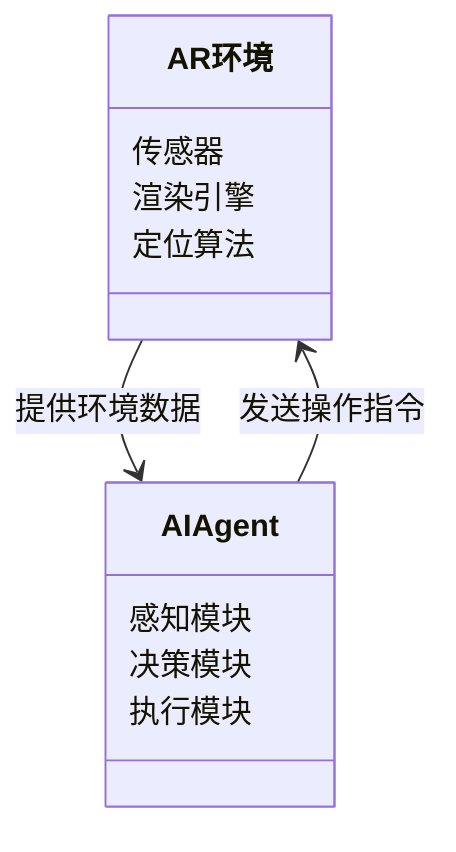
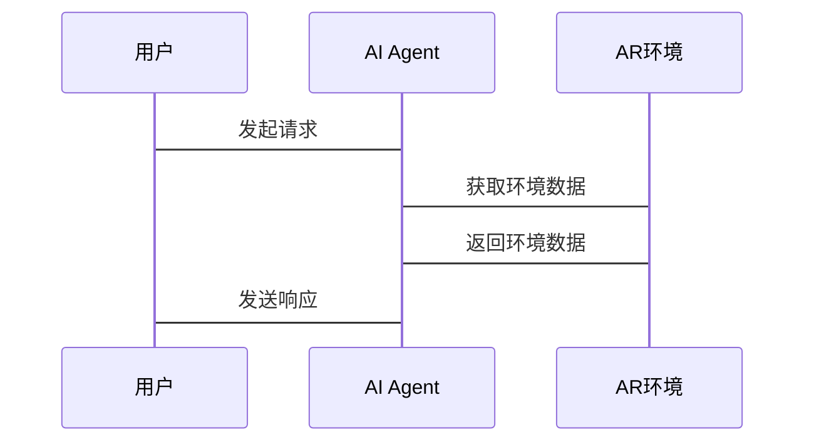

                 


# 开发具有增强现实能力的AI Agent

> 关键词：增强现实（AR）、人工智能（AI）、AI Agent、计算机视觉、机器学习、实时交互

> 摘要：本文详细探讨了开发具有增强现实能力的AI Agent的各个方面，从核心概念、算法原理到系统架构设计，再到项目实战，为读者提供了一条从理论到实践的完整路径。通过本文，读者将了解如何将AR与AI Agent结合，实现增强现实环境下的智能交互。

---

## 第一部分: 开发具有增强现实能力的AI Agent概述

## 第1章: 背景介绍与问题背景

### 1.1 增强现实与AI Agent的定义

#### 1.1.1 增强现实（AR）的定义与特点
增强现实（Augmented Reality，AR）是一种将数字信息叠加到真实世界中的技术，通过计算机视觉、图形渲染和传感器融合等技术，实现虚拟与现实的无缝结合。AR的核心特点包括实时性、交互性和沉浸性。

#### 1.1.2 AI Agent的基本概念与分类
AI Agent（人工智能代理）是指能够感知环境、自主决策并执行任务的智能实体。AI Agent可以分为基于规则的Agent、基于模型的Agent、基于学习的Agent等多种类型。

#### 1.1.3 AR与AI Agent的结合与应用
AR与AI Agent的结合为用户提供了一种更智能、更自然的交互方式。例如，在AR游戏中，AI Agent可以作为虚拟角色与玩家互动；在工业领域，AI Agent可以辅助工人进行复杂操作。

### 1.2 问题背景与需求分析

#### 1.2.1 增强现实技术的现状与挑战
尽管AR技术在近年来取得了显著进展，但仍面临诸多挑战，如定位精度不足、计算资源消耗大、用户交互体验欠佳等问题。

#### 1.2.2 AI Agent在AR中的应用痛点
AI Agent在AR中的应用需要解决感知精度、实时性和用户隐私保护等问题。此外，AI Agent的决策能力和学习能力也是关键挑战。

#### 1.2.3 开发AR能力AI Agent的目标与意义
开发具有增强现实能力的AI Agent，旨在提升AR应用的智能化水平，实现更自然、更高效的用户交互，推动AR技术在各个领域的广泛应用。

---

## 第2章: 核心概念与原理

### 2.1 增强现实的核心原理

#### 2.1.1 AR的关键技术与实现流程
AR的核心技术包括：
1. **传感器融合**：结合摄像头、IMU等传感器数据，实现精准定位。
2. **目标检测与跟踪**：通过计算机视觉技术，检测并跟踪现实世界中的目标。
3. **图形渲染**：将虚拟物体叠加到真实场景中，并实现实时渲染。

#### 2.1.2 AR中的传感器融合与定位技术
传感器融合技术通过结合多种传感器数据，提升定位精度。常见的定位技术包括基于视觉的定位和基于惯性传感器的定位。

#### 2.1.3 AR中的图形渲染与用户交互
图形渲染技术需要实现虚拟物体与真实场景的融合，用户交互则通过手势、语音等方式实现。

### 2.2 AI Agent的核心原理

#### 2.2.1 AI Agent的感知与决策机制
AI Agent通过感知环境信息，利用算法进行决策，并执行相应的操作。

#### 2.2.2 AI Agent的学习与自适应能力
基于机器学习的AI Agent能够通过数据学习，提升自身的感知和决策能力。

#### 2.2.3 AI Agent的通信与协作能力
AI Agent需要与其他Agent或系统进行通信，实现协作任务。

### 2.3 AR与AI Agent的结合原理

#### 2.3.1 AR环境中的AI Agent定位与感知
AI Agent需要在AR环境中进行定位，并感知周围环境信息。

#### 2.3.2 AI Agent对AR数据的处理与分析
AI Agent对AR环境中的数据进行分析，生成相应的决策。

#### 2.3.3 AR用户与AI Agent的交互机制
通过用户交互界面，用户与AI Agent进行实时互动，提升用户体验。

---

## 第3章: 核心概念与联系

### 3.1 增强现实与AI Agent的核心要素

#### 3.1.1 AR的核心要素：传感器、渲染引擎、定位算法
AR的核心要素包括传感器、渲染引擎和定位算法。

#### 3.1.2 AI Agent的核心要素：感知、决策、执行
AI Agent的核心要素包括感知、决策和执行。

#### 3.1.3 AR与AI Agent的结合要素：数据流、交互接口、协作机制
AR与AI Agent的结合需要考虑数据流、交互接口和协作机制。

### 3.2 核心概念对比与联系

#### 3.2.1 AR与AI Agent的核心属性对比
通过表格对比AR与AI Agent的核心属性，包括实时性、交互性、计算复杂度等。

| 属性 | AR | AI Agent |
|------|------|------|
| 实时性 | 高 | 中 |
| 交互性 | 高 | 高 |
| 计算复杂度 | 高 | 中 |

#### 3.2.2 AR与AI Agent的联系与区别
AR与AI Agent的联系在于它们都需要感知环境并进行实时交互。区别在于AR更注重视觉呈现，而AI Agent更注重智能决策。

#### 3.2.3 AR与AI Agent的协同工作流程
AR与AI Agent协同工作流程包括：环境感知、数据处理、决策生成、用户交互。

---

## 第4章: 算法原理与数学模型

### 4.1 增强现实中的关键算法

#### 4.1.1 基于视觉的AR定位算法
基于视觉的AR定位算法通过图像匹配实现定位。

#### 4.1.2 增强现实中的3D重建算法
3D重建算法通过深度学习实现三维空间重建。

#### 4.1.3 AR中的实时渲染算法
实时渲染算法通过图形学技术实现虚拟物体的叠加。

### 4.2 AI Agent中的核心算法

#### 4.2.1 基于深度学习的感知算法
基于深度学习的感知算法通过卷积神经网络实现目标检测。

#### 4.2.2 基于强化学习的决策算法
基于强化学习的决策算法通过策略梯度法实现决策优化。

#### 4.2.3 基于图神经网络的协作算法
基于图神经网络的协作算法通过图结构数据实现多Agent协作。

### 4.3 数学模型与公式

#### 4.3.1 增强现实中的几何变换公式
几何变换公式用于实现虚拟物体的三维变换：

$$
\begin{pmatrix}
x' \\
y' \\
z' \\
1
\end{pmatrix}
=
\begin{pmatrix}
a & b & c & d \\
e & f & g & h \\
i & j & k & l \\
0 & 0 & 0 & 1
\end{pmatrix}
\begin{pmatrix}
x \\
y \\
z \\
1
\end{pmatrix}
$$

#### 4.3.2 AI Agent中的概率推理模型
概率推理模型用于实现不确定性推理：

$$
P(A|B) = \frac{P(B|A)P(A)}{P(B)}
$$

#### 4.3.3 AR与AI Agent结合的协同优化公式
协同优化公式用于实现AR与AI Agent的协同优化：

$$
\arg \min_{\theta} \left( L_{AR}(\theta) + L_{AI}(\theta) \right)
$$

---

## 第5章: 系统分析与架构设计

### 5.1 问题场景与项目介绍

#### 5.1.1 开发目标与项目背景
开发目标是实现一个具有增强现实能力的AI Agent，项目背景是提升AR应用的智能化水平。

#### 5.1.2 项目需求与功能模块划分
项目需求包括实时定位、目标检测、用户交互等功能模块。

### 5.2 系统功能设计

#### 5.2.1 领域模型（Mermaid 类图）


#### 5.2.2 系统架构设计（Mermaid 架构图）


#### 5.2.3 系统交互设计（Mermaid 序列图）


---

## 第6章: 项目实战

### 6.1 环境安装与配置

#### 6.1.1 开发工具安装
安装必要的开发工具，如Python、OpenCV、TensorFlow等。

#### 6.1.2 依赖库安装
使用pip安装必要的依赖库，如numpy、pytorch等。

### 6.2 系统核心实现

#### 6.2.1 AR定位算法实现
实现基于视觉的AR定位算法，使用OpenCV库。

```python
import cv2

def ar定位():
    # 图像匹配算法实现
    pass
```

#### 6.2.2 AI Agent决策算法实现
实现基于深度学习的决策算法，使用TensorFlow库。

```python
import tensorflow as tf

def ai决策():
    # 模型训练与推理
    pass
```

#### 6.2.3 用户交互界面实现
实现用户与AI Agent的交互界面，支持手势和语音交互。

### 6.3 实际案例分析

#### 6.3.1 案例背景与需求
案例背景是实现一个增强现实的智能助手。

#### 6.3.2 系统实现与代码解读
详细解读实现过程和代码。

#### 6.3.3 实验结果与分析
分析实验结果，总结经验教训。

### 6.4 项目小结

#### 6.4.1 项目总结
总结项目实现的关键点和难点。

#### 6.4.2 经验与教训
分享开发过程中的经验和教训。

---

## 第7章: 最佳实践与总结

### 7.1 最佳实践 tips

#### 7.1.1 开发工具选择
推荐使用PyCharm、VS Code等开发工具。

#### 7.1.2 代码规范与文档管理
遵循代码规范，保持代码可读性。

#### 7.1.3 性能优化建议
通过算法优化和硬件加速提升系统性能。

### 7.2 小结与展望

#### 7.2.1 本文总结
总结本文的主要内容和研究成果。

#### 7.2.2 未来展望
展望增强现实AI Agent技术的未来发展方向。

### 7.3 注意事项与风险提示

#### 7.3.1 开发中的常见问题
列出开发过程中可能遇到的问题和解决方案。

#### 7.3.2 用户隐私与安全提示
提醒读者注意用户隐私和数据安全。

### 7.4 拓展阅读

#### 7.4.1 推荐书籍
推荐相关领域的书籍和论文。

#### 7.4.2 推荐课程与在线资源
推荐相关的在线课程和资源。

---

## 作者：AI天才研究院/AI Genius Institute & 禅与计算机程序设计艺术 /Zen And The Art of Computer Programming

---

通过本文，读者可以系统地了解开发具有增强现实能力的AI Agent的核心概念、算法原理和系统设计，并通过实际案例掌握开发技巧。

