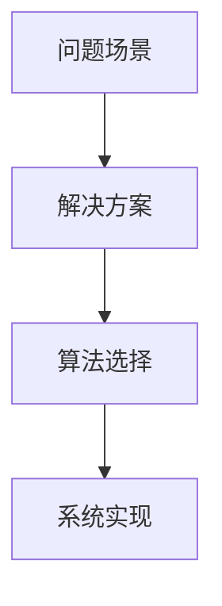
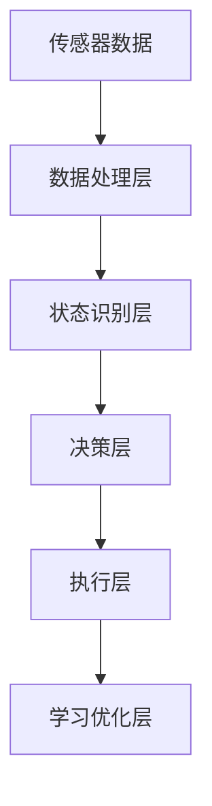
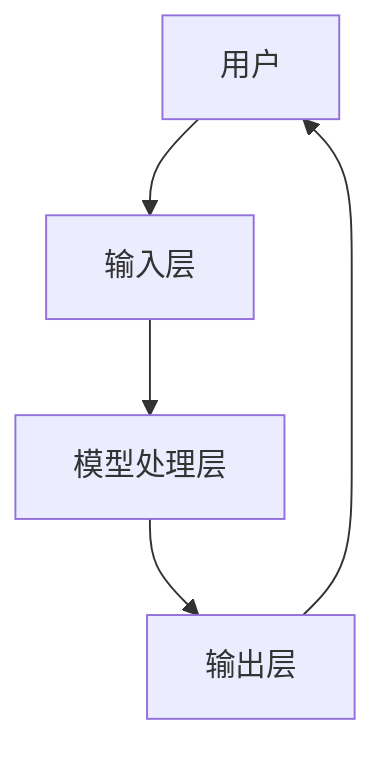

                 


# 开发具有复杂场景理解与决策能力的AI Agent

## 关键词：
- AI Agent
- 复杂场景理解
- 决策能力
- 强化学习
- 图神经网络
- 系统架构设计

## 摘要：
本文详细探讨了开发具有复杂场景理解与决策能力的AI Agent所需的关键技术与方法。从AI Agent的基本概念和核心算法入手，结合数学模型与实际案例，分析了强化学习和图神经网络在复杂场景中的应用。通过系统架构设计和项目实战，展示了如何构建高效的AI Agent系统，并提供了最佳实践和未来研究方向的展望。

---

# 第1章: AI Agent 的基本概念与问题背景

## 1.1 什么是AI Agent

### 1.1.1 AI Agent 的定义
AI Agent（人工智能代理）是指能够感知环境、自主决策并采取行动以实现目标的智能实体。AI Agent可以是软件程序、机器人或其他智能系统，其核心目标是通过与环境交互来优化自身行为以达到预设目标。

### 1.1.2 AI Agent 的核心特征
- **自主性**：AI Agent能够在没有外部干预的情况下自主决策。
- **反应性**：能够实时感知环境变化并做出反应。
- **目标导向**：所有行为都围绕特定目标展开。
- **学习能力**：通过经验改进自身决策能力。

### 1.1.3 AI Agent 的应用场景
- 智能助手（如Siri、Alexa）
- 自动驾驶
- 游戏AI
- 机器人控制
- 智慧城市中的自动化决策系统

## 1.2 复杂场景理解与决策的必要性

### 1.2.1 复杂场景的特点
- **多因素影响**：决策受到多个变量的约束。
- **动态变化**：环境和条件可能会实时变化。
- **非确定性**：决策结果具有不确定性。
- **高维度**：问题空间维度高，难以直接处理。

### 1.2.2 传统AI的局限性
- **规则引擎的不足**：难以应对复杂多变的场景。
- **单领域优化**：传统AI通常针对特定任务优化，难以扩展到复杂场景。
- **缺乏自适应性**：无法根据环境变化动态调整策略。

### 1.2.3 开发复杂场景AI Agent的意义
- 提升AI系统在复杂场景中的适应性和决策能力。
- 为自动驾驶、智慧城市等领域提供更高效的解决方案。
- 推动AI技术向更通用化和智能化方向发展。

---

# 第2章: AI Agent 的核心概念与背景

## 2.1 问题背景与问题描述

### 2.1.1 问题背景分析
在复杂场景中，AI Agent需要同时处理多个任务，应对不确定性，并在有限资源下做出最优决策。例如，在自动驾驶中，AI Agent需要实时处理来自传感器的大量数据，做出转向、加速或减速的决策。

### 2.1.2 问题的边界与外延
- **边界**：AI Agent的决策范围和能力限制。
- **外延**：AI Agent与其他系统或组件的交互界面。

### 2.1.3 核心概念的结构与组成
- **状态空间**：环境中的所有可能状态。
- **动作空间**：AI Agent可以执行的所有动作。
- **奖励函数**：衡量AI Agent行为优劣的标准。

## 2.2 核心概念的联系与对比

### 2.2.1 AI Agent与传统AI的区别
| 特性                | AI Agent                          | 传统AI                            |
|---------------------|-----------------------------------|-----------------------------------|
| 自主性               | 高                                | 低                                |
| 反应性               | 强                                | 弱                                |
| 目标导向             | 是                                | 否                                |
| 学习能力             | 强                                | 弱                                |

### 2.2.2 知识图谱与决策树的对比
- **知识图谱**：通过图结构表示知识，能够处理复杂的关系和语义信息。
- **决策树**：通过树状结构进行决策，适合处理规则明确的问题。

### 2.2.3 问题场景与解决方案的对应关系
通过绘制**Mermaid图**，可以清晰展示问题场景与解决方案的对应关系：



---

# 第3章: AI Agent 的问题建模与数学表达

## 3.1 问题建模的基本原理

### 3.1.1 状态空间的定义与表示
状态空间是AI Agent所处环境的所有可能状态的集合。例如，在自动驾驶中，状态可以是车辆的位置、速度和周围障碍物的位置。

### 3.1.2 动作空间的构建与选择
动作空间是AI Agent可以执行的所有动作的集合。例如，在游戏中，动作可以是“向上”、“向下”、“左转”、“右转”。

### 3.1.3 奖励函数的设计与优化
奖励函数是衡量AI Agent行为优劣的标准。例如，在游戏AI中，奖励函数可以是得分的变化。

## 3.2 数学模型与公式

### 3.2.1 状态空间的表示
$$ S = \{ s_1, s_2, ..., s_n \} $$

### 3.2.2 动作空间的表示
$$ A = \{ a_1, a_2, ..., a_m \} $$

### 3.2.3 奖励函数的定义
$$ R(s, a) = r $$

---

# 第4章: AI Agent 的决策算法原理

## 4.1 强化学习算法

### 4.1.1 Q-Learning算法
Q-Learning是一种经典的强化学习算法，通过学习Q值函数来优化决策策略。

### 4.1.2 Deep Q-Networks (DQN) 算法
DQN算法通过深度神经网络近似Q值函数，解决了传统Q-Learning在高维状态空间中的计算难题。

### 4.1.3 算法的数学模型与公式
$$ Q(s, a) = \max_{a'} Q(s', a') + \gamma r $$

## 4.2 图神经网络与知识图谱

### 4.2.1 图神经网络的基本原理
图神经网络通过图结构处理复杂的关系数据，能够更好地理解场景中的实体关系。

### 4.2.2 知识图谱的构建与应用
知识图谱通过构建语义网络，帮助AI Agent更好地理解上下文信息。

### 4.2.3 图神经网络的数学模型
$$ Z = GNN(X, A) $$

---

# 第5章: AI Agent 的系统架构与设计

## 5.1 系统分析与设计

### 5.1.1 问题场景介绍
以自动驾驶为例，AI Agent需要实时处理来自传感器的数据，并做出驾驶决策。

### 5.1.2 系统功能设计
- 数据采集与处理
- 状态识别与判断
- 决策与执行
- 学习与优化

### 5.1.3 系统架构设计
通过**Mermaid图**展示系统架构：



## 5.2 系统架构图


---

# 第6章: 项目实战

## 6.1 环境安装与配置
安装Python、TensorFlow、Keras等开发工具和框架。

## 6.2 核心代码实现

### 6.2.1 Q-Learning算法实现
```python
import numpy as np

class QLearning:
    def __init__(self, state_space_size, action_space_size, gamma=0.99, epsilon=1.0):
        self.q_table = np.zeros((state_space_size, action_space_size))
        self.gamma = gamma
        self.epsilon = epsilon

    def get_action(self, state):
        if np.random.random() < self.epsilon:
            return np.random.randint(0, action_space_size)
        else:
            return np.argmax(self.q_table[state])

    def update_q_table(self, state, action, reward, next_state):
        self.q_table[state, action] = reward + self.gamma * np.max(self.q_table[next_state])
```

### 6.2.2 图神经网络实现
```python
import tensorflow as tf
from tensorflow.keras.layers import Dense, Input, Dropout
from tensorflow.keras.models import Model

def build_graph Neural_Network(input_dim):
    input_layer = Input(shape=(input_dim,))
    hidden_layer = Dense(64, activation='relu')(input_layer)
    output_layer = Dense(1, activation='sigmoid')(hidden_layer)
    model = Model(inputs=input_layer, outputs=output_layer)
    model.compile(optimizer='adam', loss='binary_crossentropy')
    return model
```

## 6.3 案例分析与详细解读
以自动驾驶为例，详细分析AI Agent在复杂场景中的决策过程。

## 6.4 项目总结与优化建议
总结项目经验，提出优化建议，如引入更先进的强化学习算法或优化系统架构设计。

---

# 第7章: 最佳实践与未来展望

## 7.1 小结
总结本文的核心内容和主要观点。

## 7.2 注意事项
提醒读者在开发AI Agent时需要注意的问题。

## 7.3 拓展阅读
推荐相关领域的书籍和论文，供读者深入研究。

---

# 作者

作者：AI天才研究院/AI Genius Institute & 禅与计算机程序设计艺术 /Zen And The Art of Computer Programming

---

以上是《开发具有复杂场景理解与决策能力的AI Agent》的技术博客文章的完整大纲和内容，涵盖从基础概念到实际应用的各个方面，逻辑清晰，结构紧凑，适合希望深入理解AI Agent开发的专业人士阅读。

