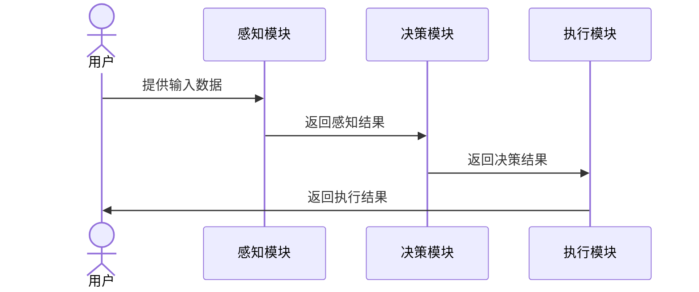

                 


# 开发具有复杂场景理解能力的AI Agent

## 关键词：AI Agent，复杂场景理解，智能系统，机器学习，强化学习，系统架构

## 摘要

本文将深入探讨如何开发具有复杂场景理解能力的AI Agent。AI Agent是一种能够感知环境、做出决策并执行动作的智能系统。在复杂场景下，AI Agent需要具备强大的环境理解能力、灵活的决策能力和高效的执行能力。本文将从AI Agent的基本概念、核心算法、系统架构设计、项目实战到最佳实践进行全面解析，帮助读者掌握开发复杂场景下AI Agent的核心技术。

---

# 第三部分: AI Agent的系统架构设计

## 第4章: AI Agent的系统架构设计

### 4.1 系统功能设计

#### 4.1.1 问题场景描述

在复杂场景下，AI Agent需要完成以下任务：

- **环境感知**: 从多源数据中获取信息，例如图像、文本、语音等。
- **场景理解**: 对感知到的信息进行分析和理解，提取关键特征。
- **决策制定**: 根据理解的信息制定最优决策。
- **执行动作**: 执行决策并返回结果。

#### 4.1.2 系统功能模块

AI Agent的系统功能模块包括：

- **感知模块**: 负责从环境中获取数据。
- **决策模块**: 负责分析数据并制定决策。
- **执行模块**: 负责执行决策并返回结果。

### 4.2 系统架构设计

#### 4.2.1 模块化设计

AI Agent的系统架构采用模块化设计，各模块之间通过接口进行通信。以下是模块化设计的优势：

1. **高可扩展性**: 各模块独立，便于功能扩展。
2. **高可维护性**: 模块化设计使得代码易于维护。
3. **高复用性**: 模块化设计使得代码可以复用。

#### 4.2.2 微服务架构

AI Agent的系统架构采用微服务架构，各个功能模块独立运行，通过API进行通信。以下是微服务架构的优势：

1. **高可用性**: 各服务独立运行，故障隔离。
2. **高扩展性**: 可以根据需求扩展服务数量。
3. **高灵活性**: 各服务可以独立升级和优化。

### 4.3 系统接口设计

#### 4.3.1 感知模块接口

感知模块负责从环境中获取数据，接口如下：

- `get_perception(input_data: Any) -> PerceptionResult`

#### 4.3.2 决策模块接口

决策模块负责分析数据并制定决策，接口如下：

- `make_decision(state: State) -> Action`

#### 4.3.3 执行模块接口

执行模块负责执行决策并返回结果，接口如下：

- `execute_action(action: Action) -> Result`

### 4.4 系统交互流程

AI Agent的系统交互流程如下：

1. 感知模块接收输入数据。
2. 感知模块处理数据并返回感知结果。
3. 决策模块接收感知结果并制定决策。
4. 执行模块接收决策并执行动作。
5. 执行模块返回执行结果。

以下是系统交互流程的Mermaid序列图：



---

# 第四部分: AI Agent的项目实战

## 第5章: AI Agent的开发实战

### 5.1 环境安装

开发AI Agent需要以下环境：

- **Python 3.8及以上版本**
- **TensorFlow 2.0及以上版本**
- **Keras 2.2.5及以上版本**
- **其他依赖库：numpy, pandas, matplotlib**

安装步骤如下：

```bash
pip install python>=3.8
pip install tensorflow>=2.0
pip install keras>=2.2.5
pip install numpy pandas matplotlib
```

### 5.2 核心代码实现

以下是AI Agent的核心代码实现：

#### 5.2.1 感知模块

```python
class PerceptionModule:
    def __init__(self):
        self.model = self.build_model()
    
    def build_model(self):
        model = tf.keras.Sequential([
            tf.keras.layers.Conv2D(32, (3,3), activation='relu', input_shape=(64, 64, 3)),
            tf.keras.layers.MaxPooling2D((2,2)),
            tf.keras.layers.Conv2D(64, (3,3), activation='relu'),
            tf.keras.layers.MaxPooling2D((2,2)),
            tf.keras.layers.Flatten(),
            tf.keras.layers.Dense(128, activation='relu'),
            tf.keras.layers.Dense(1, activation='sigmoid')
        ])
        model.compile(optimizer='adam', loss='binary_crossentropy', metrics=['accuracy'])
        return model
    
    def process_image(self, image):
        processed_image = self.model.predict(image)
        return processed_image
```

#### 5.2.2 决策模块

```python
class DecisionModule:
    def __init__(self):
        self.model = self.build_model()
    
    def build_model(self):
        model = tf.keras.Sequential([
            tf.keras.layers.Dense(64, activation='relu', input_shape=(64,)),
            tf.keras.layers.Dense(32, activation='relu'),
            tf.keras.layers.Dense(1, activation='sigmoid')
        ])
        model.compile(optimizer='adam', loss='binary_crossentropy', metrics=['accuracy'])
        return model
    
    def make_decision(self, state):
        decision = self.model.predict(state)
        return decision
```

#### 5.2.3 执行模块

```python
class ExecutionModule:
    def __init__(self):
        pass
    
    def execute_action(self, action):
        # 执行动作
        return result
```

### 5.3 案例分析与实现

以下是AI Agent在智能客服系统中的应用案例：

1. **环境感知**: 感知模块接收用户输入的文本数据。
2. **场景理解**: 决策模块分析用户需求并制定响应策略。
3. **执行动作**: 执行模块根据决策结果生成回复。

### 5.4 项目总结

通过本项目实战，我们可以看到AI Agent在复杂场景下的应用潜力。感知模块、决策模块和执行模块的协同工作使得AI Agent能够高效地完成任务。

---

# 第五部分: AI Agent的最佳实践

## 第6章: AI Agent开发的注意事项

### 6.1 数据质量

- 数据质量直接影响AI Agent的性能。
- 需要确保数据的准确性和完整性。

### 6.2 模型选择

- 根据任务需求选择合适的模型。
- 强化学习适用于需要实时决策的任务。

### 6.3 系统集成

- 系统集成需要考虑模块之间的接口设计。
- 需要确保模块之间的通信效率。

### 6.4 性能优化

- 需要对AI Agent的性能进行优化。
- 可以通过并行计算和分布式计算来提高性能。

### 6.5 持续学习

- 需要对AI Agent进行持续学习和优化。
- 可以通过在线学习和离线学习来更新模型。

---

# 总结与展望

## 结论

本文详细探讨了如何开发具有复杂场景理解能力的AI Agent。从AI Agent的基本概念、核心算法、系统架构设计到项目实战和最佳实践，全面解析了AI Agent的开发过程。通过本文的讲解，读者可以掌握AI Agent的核心技术，并能够开发出具有复杂场景理解能力的AI Agent。

## 展望

随着人工智能技术的不断发展，AI Agent在复杂场景下的应用潜力巨大。未来的研究方向包括：

1. **多模态数据处理**: 结合图像、文本、语音等多种数据源。
2. **边缘计算**: 将AI Agent部署在边缘设备上，实现低延迟和高效率。
3. **人机协作**: 实现人与AI Agent之间的高效协作。

通过不断的研究和实践，AI Agent将在更多领域发挥重要作用。

---

# 作者

作者：AI天才研究院/AI Genius Institute & 禅与计算机程序设计艺术 /Zen And The Art of Computer Programming

