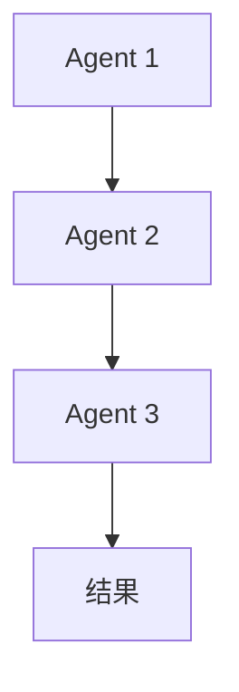
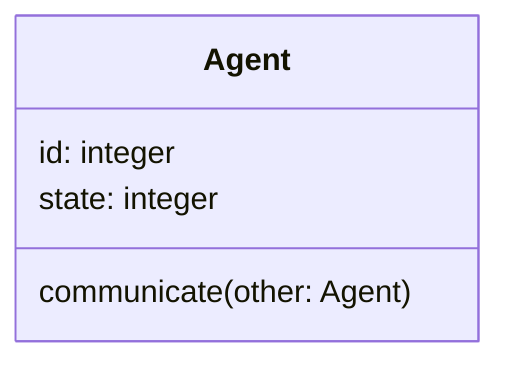
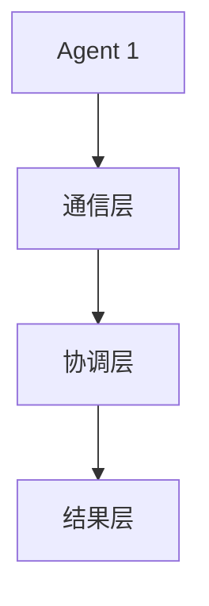
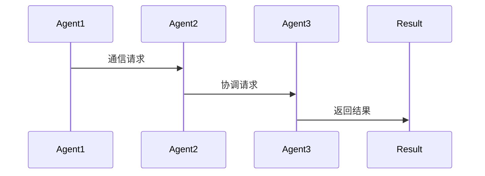

                 


```markdown
# 开发具有多Agent协作能力的系统

## 关键词：多Agent系统、协作机制、算法原理、系统架构、项目实战、总结与扩展

## 摘要：本文详细介绍了开发具有多Agent协作能力的系统的关键技术，从背景介绍、核心概念与联系、算法原理、系统分析与架构设计、项目实战到总结与扩展，系统地阐述了多Agent协作的各个方面。通过实际案例分析和代码实现，帮助读者深入理解多Agent协作的原理和应用。

---

# 第一部分: 多Agent协作系统概述

## 第1章: 多Agent协作系统背景介绍

### 1.1 多Agent协作的概念与背景

#### 1.1.1 多Agent系统的定义
多Agent系统是由多个智能体（Agent）组成的分布式系统，这些智能体能够通过协作完成复杂任务。每个Agent都有自己的目标、知识和行为规则。

#### 1.1.2 多Agent协作的背景与问题背景
在现代分布式系统中，单个Agent的能力往往不足以完成复杂任务，因此需要多个Agent协作。多Agent协作的核心问题在于如何实现高效、协调的通信与决策。

#### 1.1.3 多Agent协作的核心问题描述
- **通信问题**：如何确保Agent之间高效、可靠地交换信息。
- **协调问题**：如何实现Agent之间的任务分配与协作。
- **决策问题**：如何在动态环境中做出最优决策。

#### 1.1.4 多Agent协作的边界与外延
多Agent协作的边界包括通信机制、任务分配算法和决策模型。外延则涉及分布式计算、人工智能和分布式系统架构。

#### 1.1.5 多Agent协作的概念结构与核心要素组成
- **Agent**：具备自主性、反应性、主动性、社会性和目标性。
- **协作机制**：通信机制、任务分配机制和决策机制。

### 1.2 多Agent协作的核心概念与联系

#### 1.2.1 多Agent协作的核心概念原理
多Agent协作通过通信、协调和决策实现任务完成。通信机制确保信息共享，协调机制确保任务分配，决策机制确保最优决策。

#### 1.2.2 多Agent协作的概念属性特征对比表格
| 属性         | 单Agent协作 | 多Agent协作 |
|--------------|------------|------------|
| 独立性       | 低         | 高         |
| 通信复杂度   | 低         | 高         |
| 协调难度     | 低         | 高         |

#### 1.2.3 多Agent协作的ER实体关系图架构
```mermaid
erd
actor(Agent) -[通信]-> message
agent -[任务分配]-> task
task -[决策]-> decision
```

## 第2章: 多Agent协作的算法原理

### 2.1 多Agent协作算法概述

#### 2.1.1 多Agent协作算法的分类
- **基于规则的算法**：基于预定义规则进行协作。
- **基于目标的算法**：基于Agent的目标进行协作。
- **基于模型的算法**：基于全局模型进行协作。

#### 2.1.2 多Agent协作算法的核心思想
通过通信、协调和决策实现任务完成，核心思想是最大化整体效率和任务完成质量。

#### 2.1.3 多Agent协作算法的数学模型
$$ \text{总效率} = \sum_{i=1}^{n} \text{Agent}_i \text{的效率} $$

### 2.2 多Agent协作算法的详细讲解

#### 2.2.1 多Agent协作算法的数学公式
$$ \text{通信效率} = \frac{\text{有效信息量}}{\text{总通信量}} $$

#### 2.2.2 多Agent协作算法的流程图


#### 2.2.3 多Agent协作算法的代码实现
```python
class Agent:
    def __init__(self, id):
        self.id = id
        self.state = 0

    def communicate(self, other):
        # 通信机制
        self.state += other.state
        other.state += self.state

agent1 = Agent(1)
agent2 = Agent(2)
agent1.communicate(agent2)
```

---

# 第二部分: 多Agent协作系统分析与架构设计

## 第3章: 多Agent协作系统的分析与架构设计

### 3.1 系统分析

#### 3.1.1 问题场景介绍
在分布式系统中，多个Agent需要协作完成复杂任务，如分布式计算、机器人协作和智能交通管理。

#### 3.1.2 项目介绍
本项目旨在开发一个多Agent协作系统，实现任务分配、通信和决策。

### 3.2 系统功能设计

#### 3.2.1 领域模型类图


### 3.3 系统架构设计

#### 3.3.1 系统架构图


### 3.4 系统接口设计

#### 3.4.1 接口描述
- 通信接口：负责Agent之间的信息交换。
- 协调接口：负责任务分配和决策。

#### 3.4.2 接口实现
```python
class CommunicateInterface:
    def send(self, message):
        pass

class CoordinateInterface:
    def assign_task(self, task):
        pass
```

### 3.5 系统交互流程图

#### 3.5.1 交互流程图


---

# 第三部分: 项目实战

## 第4章: 多Agent协作系统实战

### 4.1 项目实战

#### 4.1.1 环境安装
安装必要的库，如Python的`networkx`和`matplotlib`。

#### 4.1.2 核心代码实现
```python
class Agent:
    def __init__(self, id):
        self.id = id
        self.state = 0

    def communicate(self, other):
        self.state += other.state
        other.state += self.state

    def decide(self, task):
        pass

class Coordinator:
    def __init__(self):
        self.agents = []

    def add_agent(self, agent):
        self.agents.append(agent)

    def assign_task(self, task):
        for agent in self.agents:
            agent.decide(task)
```

#### 4.1.3 代码解读与分析
- **Agent类**：定义了Agent的基本行为，包括通信和决策。
- **Coordinator类**：负责管理多个Agent并分配任务。

#### 4.1.4 实际案例分析和详细讲解剖析
通过具体案例展示多Agent协作的实现过程，分析代码的运行逻辑和效果。

---

# 第四部分: 总结与扩展

## 第5章: 总结与扩展

### 5.1 最佳实践 tips
- **通信机制**：确保通信高效可靠。
- **任务分配**：采用合理的任务分配算法。
- **决策机制**：使用高效的决策算法。

### 5.2 小结
多Agent协作系统通过通信、协调和决策实现任务完成，是现代分布式系统的重要组成部分。

### 5.3 注意事项
- 避免通信瓶颈。
- 处理动态环境中的不确定性。
- 确保系统的可扩展性和可维护性。

### 5.4 拓展阅读
推荐相关书籍和论文，供读者深入学习。

---

# 作者：AI天才研究院/AI Genius Institute & 禅与计算机程序设计艺术 /Zen And The Art of Computer Programming
```

