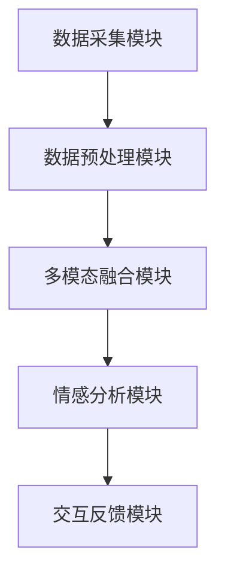

                 


# 开发具有多模态情感分析能力的AI Agent

> **关键词**：多模态情感分析、AI Agent、机器学习、深度学习、自然语言处理  
> **摘要**：本文详细探讨了开发具有多模态情感分析能力的AI Agent的关键技术，包括多模态数据融合方法、情感分析算法、系统架构设计以及实际应用案例。通过逐步分析和具体实现，展示了如何构建一个高效且准确的AI Agent，能够理解和处理多种模态的情感信息。

---

## 第1章：多模态情感分析与AI Agent的背景介绍

### 1.1 情感分析的基本概念
情感分析是自然语言处理中的一个核心任务，旨在判断一段文本所表达的情感倾向（如正面、负面或中性）。传统的单模态情感分析仅依赖文本数据，但实际应用中，情感信息可能通过多种模态（如文本、语音、图像）表达，因此需要引入多模态情感分析。

### 1.2 多模态数据的重要性
多模态数据的引入能够显著提升情感分析的准确性和鲁棒性。例如，结合文本和语音信息可以更准确地判断用户的真正情感，而结合文本和图像信息则能够捕捉到更多的情感线索。

### 1.3 AI Agent在情感分析中的应用
AI Agent是一种智能体，能够根据环境信息自主决策并执行任务。在情感分析中，AI Agent可以实时处理多模态数据，提供更精准的情感理解，并与用户进行自然交互。

---

## 第2章：多模态情感分析的核心概念与原理

### 2.1 多模态数据融合方法
多模态数据融合是将多种模态的信息整合起来，以获得更全面的理解。常用的方法包括特征级融合、决策级融合和晚期融合。

#### 2.1.1 特征级融合
在特征级融合中，我们将不同模态的特征（如文本的词向量、语音的频谱特征）直接进行拼接或加权组合。例如：
$$
f_{\text{multi}} = \alpha f_{\text{text}} + (1-\alpha) f_{\text{audio}}
$$
其中，$\alpha$ 是融合权重。

#### 2.1.2 注意力机制
注意力机制可以帮助模型关注重要模态的信息。例如，交叉注意力机制可以同时考虑文本和语音特征：
$$
\text{Attention}(Q,K,V) = \text{softmax}\left(\frac{QK^T}{\sqrt{d_k}}\right)V
$$

### 2.2 AI Agent的情感理解模块
AI Agent的情感理解模块需要能够处理多种模态的输入，并通过融合后的特征进行情感预测。模块设计包括数据预处理、特征提取、模型训练和结果分析四个部分。

---

## 第3章：系统架构设计

### 3.1 系统模块划分
系统主要分为以下几个模块：
1. **数据采集模块**：从多模态数据源（如文本、语音、图像）获取数据。
2. **数据预处理模块**：对数据进行清洗、归一化和特征提取。
3. **多模态融合模块**：将不同模态的特征进行融合。
4. **情感分析模块**：基于融合后的特征进行情感预测。
5. **交互反馈模块**：与用户进行实时交互并提供反馈。

### 3.2 系统架构设计图
使用mermaid绘制系统架构图如下：


---

## 第4章：项目实战

### 4.1 环境搭建与数据准备
#### 4.1.1 开发环境安装
安装必要的库：
```bash
pip install numpy tensorflow pandas scikit-learn
```

#### 4.1.2 数据集准备
使用包含文本、语音和图像的多模态数据集，进行预处理并提取特征。

### 4.2 模型实现与优化
#### 4.2.1 多模态融合模型实现
基于交叉注意力机制的模型实现：
```python
def multi_modal_attention(text_features, audio_features):
    # 计算注意力权重
    attention_weights = Dense(1, activation='sigmoid')(Concatenate()([text_features, audio_features]))
    # 加权融合
    fused_features = Multiply()([audio_features, attention_weights])
    return fused_features
```

#### 4.2.2 模型训练与调优
使用深度学习框架（如TensorFlow）进行模型训练，并通过交叉验证优化超参数。

### 4.3 应用案例分析
以客服系统中的应用为例，展示如何通过多模态情感分析提升用户体验。

---

## 第5章：总结与展望

### 5.1 总结
本文详细介绍了开发具有多模态情感分析能力的AI Agent的关键技术，包括多模态数据融合方法、系统架构设计和实际应用案例。

### 5.2 展望
未来的研究方向包括更高效的多模态融合算法、更智能的交互反馈机制以及更广泛的实际应用场景。

---

**作者**：AI天才研究院 & 禅与计算机程序设计艺术

