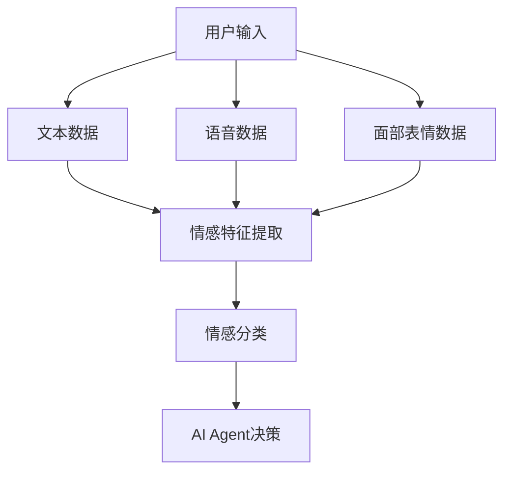
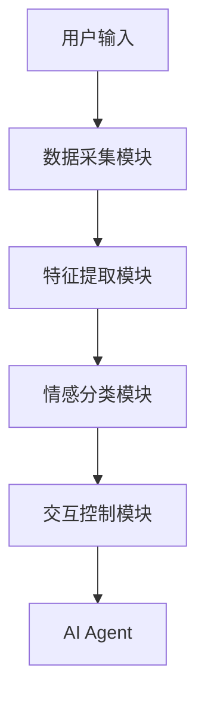

                 


---

# 开发具有多模态情感识别能力的AI Agent

> 关键词：多模态情感识别，AI Agent，文本特征提取，语音特征提取，面部表情识别，数据融合，情感分类

> 摘要：本文详细探讨了开发具有多模态情感识别能力的AI Agent的关键技术与实现方法。文章从背景与核心概念出发，逐步分析了多模态数据的特征提取、融合与情感分类的算法原理，并通过系统架构设计与项目实战，展示了如何构建一个高效的多模态情感识别系统。文章还讨论了系统的部署与优化策略，为实际应用提供了参考。

---

## 第一部分: 多模态情感识别AI Agent的背景与核心概念

### 第1章: 多模态情感识别的背景与问题描述

#### 1.1 多模态情感识别的背景
- **情感计算的定义与演进**  
  情感计算（Affective Computing）是研究如何识别、理解和模拟人类情感的计算科学领域。它结合了人工智能、认知科学和心理学，旨在通过技术手段实现人与计算机之间的自然情感交互。

- **多模态数据的引入与优势**  
  单一模态（如文本或语音）的情感识别存在局限性，引入多模态数据（文本、语音、面部表情、姿态等）可以显著提高识别的准确性和鲁棒性。例如，结合文本和语音可以更准确地判断用户的情感状态。

- **当前AI Agent的发展趋势**  
  随着AI技术的进步，AI Agent（智能体）逐渐从单一功能的工具向具备情感交互能力的伙伴型AI发展。情感识别能力的加入，使AI Agent能够更好地理解用户需求，提供更个性化的服务。

#### 1.2 多模态情感识别的核心问题
- **情感识别的定义与目标**  
  情感识别旨在通过分析多模态数据，推断出用户的情感状态（如快乐、悲伤、愤怒等）。其目标是实现高精度、实时的情感检测，为后续的情感计算和交互提供支持。

- **多模态数据融合的挑战**  
  不同模态的数据具有不同的特征和表达方式，如何有效地融合这些数据以提高识别精度是多模态情感识别的核心挑战。

- **AI Agent在情感交互中的角色**  
  AI Agent通过情感识别能力，能够实时感知用户的情感状态，从而调整交互策略，提供更智能的服务。例如，在客服系统中，AI Agent可以根据用户的情感状态调整回复语气，提升用户体验。

#### 1.3 问题的边界与外延
- **情感识别的适用场景**  
  情感识别适用于多种场景，如智能客服、教育辅助、心理健康咨询等。不同场景对情感识别的精度和实时性要求不同。

- **多模态数据的处理边界**  
  多模态数据的采集、处理和融合需要考虑数据的质量、实时性以及计算资源的限制。例如，在实时交互场景中，需要考虑数据处理的延迟问题。

- **AI Agent的性能与伦理边界**  
  情感识别的准确性受到数据质量和模型训练的影响，同时需要考虑隐私保护和伦理问题。例如，如何在不侵犯用户隐私的前提下进行情感数据的采集和分析。

### 第2章: 多模态情感识别的核心概念与联系

#### 2.1 核心概念原理
- **多模态数据的定义与分类**  
  多模态数据是指来自不同感官渠道的数据，如文本（语言）、语音（声音）、图像（视觉）等。不同模态的数据可以互补，提供更全面的信息。

- **情感识别的数学模型**  
  情感识别通常基于机器学习模型，如支持向量机（SVM）、随机森林（RF）和深度学习模型（如LSTM、Transformer）。这些模型通过学习多模态特征，实现对情感状态的分类。

- **AI Agent的交互机制**  
  AI Agent通过感知用户的情感状态，动态调整交互策略。例如，在对话过程中，AI Agent可以根据用户的情感变化调整回复内容和语气。

#### 2.2 核心概念对比表格
| 模态类型 | 数据来源 | 特征维度 | 处理方法 |
|----------|----------|----------|----------|
| 文本      | 用户输入 | 词汇、语义 | NLP处理 |
| 语音      | 音频信号 | 音调、语速 | 声学特征提取 |
| 面部表情    | 视频流     | 面部特征点 | 图像处理 |
| 姿势      | 视频流     | 关键点检测 | 3D姿态估计 |

#### 2.3 实体关系图（Mermaid）



---

## 第三部分: 多模态情感识别的算法原理

### 第3章: 多模态数据的特征提取与融合

#### 3.1 多模态数据的特征提取
- **文本特征提取**  
  - **词袋模型**：将文本表示为词袋，不考虑词序，只考虑词频。
  - **TF-IDF**：计算关键词的重要性，常用于文本分类。
  - **词嵌入（如Word2Vec）**：将词表示为低维向量，捕捉词义信息。

- **语音特征提取**  
  - **音调分析**：通过分析语音的音调变化，判断情感状态。
  - **语速分析**：通过分析说话速度的变化，判断情感状态。
  - **声学特征（如MFCC）**：将语音信号转换为频域特征，提取声音的特征。

- **面部表情特征提取**  
  - **面部关键点检测**：通过图像处理技术，检测面部关键点的位置。
  - **人脸特征向量提取**：将面部表情表示为特征向量，用于情感分类。

#### 3.2 多模态数据融合方法
- **级联融合**：将不同模态的特征依次处理，逐步融合。
- **并行融合**：同时处理不同模态的特征，最后将结果融合。
- **混合融合**：结合级联和并行方法，根据具体场景选择融合方式。

---

### 第4章: 多模态情感识别的数学模型与算法

#### 4.1 情感分类的数学模型
- **线性模型**  
  支持向量机（SVM）是一种常用的分类模型，适用于小规模数据集。
  $$ \text{目标函数}：\min \frac{1}{2}||\mathbf{w}||^2 $$
  $$ \text{约束条件}：y_i (\mathbf{w} \cdot \mathbf{x}_i + b) \geq 1 $$

- **深度学习模型**  
  Transformer模型在情感分类中表现出色，尤其适用于多模态数据的融合。

---

## 第五部分: 系统分析与架构设计

### 第5章: 系统架构设计

#### 5.1 系统功能设计
- **数据采集模块**：采集文本、语音、图像等多模态数据。
- **特征提取模块**：对采集的数据进行特征提取。
- **情感分类模块**：基于提取的特征，进行情感分类。
- **交互控制模块**：根据分类结果，调整AI Agent的交互策略。

#### 5.2 系统架构图（Mermaid）



---

## 第六部分: 项目实战与优化

### 第6章: 项目实战

#### 6.1 环境安装
- 安装Python和相关库（如TensorFlow、OpenCV）。

#### 6.2 核心代码实现
```python
import numpy as np
from sklearn.svm import SVC

# 文本特征提取
def text_feature_extraction(text):
    # 简单实现，返回词袋模型的特征向量
    return text.split()

# 情感分类模型训练
def train_emotion_classifier(X_train, y_train):
    clf = SVC()
    clf.fit(X_train, y_train)
    return clf

# 预测情感
def predict_emotion(clf, X_test):
    return clf.predict(X_test)
```

---

## 第七部分: 总结与展望

### 第7章: 总结与展望

#### 7.1 总结
本文详细介绍了开发具有多模态情感识别能力的AI Agent的关键技术与实现方法。通过背景分析、核心概念讲解、算法原理分析、系统架构设计和项目实战，全面展示了多模态情感识别的实现过程。

#### 7.2 展望
未来，随着AI技术的进步，多模态情感识别将更加精准和智能化。同时，如何在实际应用中平衡性能与隐私保护，将是该领域的重要研究方向。

---

## 作者：AI天才研究院/AI Genius Institute & 禅与计算机程序设计艺术 /Zen And The Art of Computer Programming

