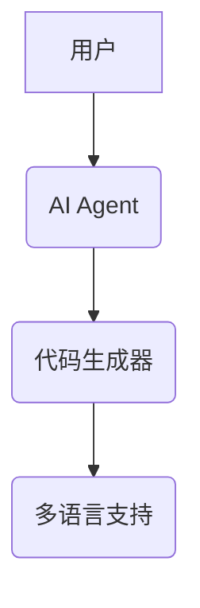
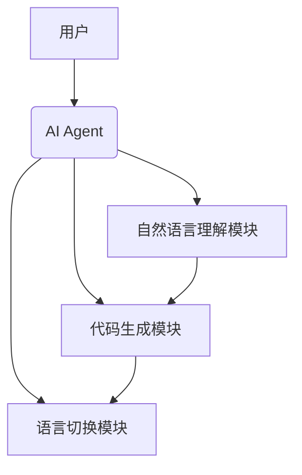
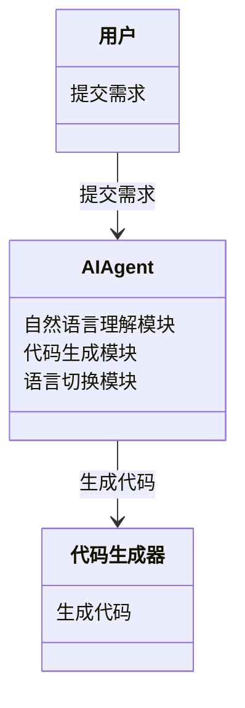
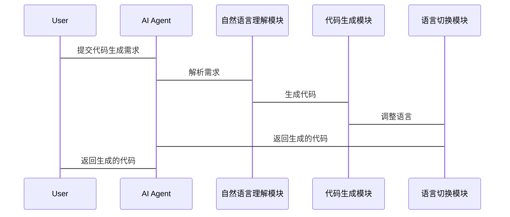

                 


# 开发具有多语言代码生成能力的AI Agent

> 关键词：AI Agent，多语言代码生成，自然语言处理，机器学习，深度学习

> 摘要：本文详细探讨了开发具有多语言代码生成能力的AI Agent的背景、核心概念、算法原理、系统架构、项目实战及最佳实践。通过逐步分析，本文为读者提供了从理论到实践的全面指导，帮助开发者构建一个能够生成多种编程语言代码的智能代理系统。

---

## 第1章: 问题背景与需求分析

### 1.1 问题背景
#### 1.1.1 当前AI技术的发展现状
人工智能技术近年来取得了显著进展，尤其是在自然语言处理（NLP）和生成模型领域。然而，现有AI工具在代码生成方面，尤其是多语言支持方面仍有较大提升空间。

#### 1.1.2 开发AI Agent的必要性
随着软件开发的复杂性增加，开发者需要更高效的工具来辅助编写代码。AI Agent可以通过理解需求，自动生成高质量的代码，显著提高开发效率。

#### 1.1.3 多语言代码生成的市场需求
现代软件开发经常需要跨语言支持，一个能够生成多种编程语言代码的AI Agent能够满足更广泛的需求，提升开发效率和代码质量。

### 1.2 问题描述
#### 1.2.1 AI Agent的核心功能
AI Agent需要能够理解用户需求，并自动生成相应代码。这需要结合自然语言处理和生成模型技术。

#### 1.2.2 多语言代码生成的挑战
不同编程语言有其独特的语法和语义，代码生成需要考虑语言的差异性。此外，模型需要在多种语言之间进行切换，这对模型的泛化能力提出了更高要求。

#### 1.2.3 用户需求与期望
用户期望AI Agent能够快速生成高质量的代码，支持多种编程语言，并且能够根据需求灵活调整代码结构。

### 1.3 问题解决思路
#### 1.3.1 基于大模型的AI Agent设计
利用预训练的大语言模型（如GPT）进行微调，使其具备代码生成能力。通过多任务学习，模型可以同时支持多种编程语言。

#### 1.3.2 多语言代码生成的关键技术
结合多语言模型和代码生成技术，通过设计适当的提示（prompt）来指导模型生成目标语言的代码。

#### 1.3.3 系统架构与实现方案
设计一个模块化的系统架构，包括自然语言理解模块、代码生成模块和语言切换模块。

### 1.4 问题的边界与外延
#### 1.4.1 AI Agent的功能边界
AI Agent专注于代码生成，不涉及编译或调试功能。代码生成的质量取决于模型的训练数据和微调策略。

#### 1.4.2 多语言代码生成的适用范围
目前主要支持主流编程语言，如Python、Java、JavaScript等。未来可以扩展到更多编程语言。

#### 1.4.3 系统的可扩展性与限制
系统架构设计具有良好的扩展性，可以方便地添加新的编程语言支持。但模型的训练和微调需要大量的计算资源。

### 1.5 核心概念与组成
#### 1.5.1 AI Agent的定义与组成要素
AI Agent是一个智能代理系统，结合自然语言处理和生成模型技术，能够根据用户需求生成代码。

#### 1.5.2 多语言代码生成的实现机制
通过多语言模型和适当的提示策略，生成目标语言的代码。模型需要理解代码结构和编程语言的语法规则。

#### 1.5.3 系统架构的核心组件
- **自然语言理解模块**：解析用户需求，生成代码生成的提示。
- **代码生成模块**：基于提示生成代码。
- **语言切换模块**：根据目标语言调整代码生成策略。

---

## 第2章: AI Agent的核心概念与原理

### 2.1 AI Agent的定义与分类
#### 2.1.1 AI Agent的定义
AI Agent是一种智能代理系统，能够通过与用户交互，理解需求并执行任务。在代码生成场景下，AI Agent的目标是生成高质量的代码。

#### 2.1.2 基于规则的AI Agent
基于规则的AI Agent依赖预定义的规则和模板，生成代码。这种方法适用于特定场景，但灵活性较低。

#### 2.1.3 基于模型的AI Agent
基于模型的AI Agent利用深度学习模型（如 transformers）生成代码。这种方法具有较高的灵活性和可扩展性。

### 2.2 多语言代码生成的实现原理
#### 2.2.1 代码生成的基本原理
代码生成是通过模型生成代码的过程。模型需要理解用户需求，并将其转化为具体的代码结构。

#### 2.2.2 多语言支持的技术实现
通过多语言模型或模型微调，生成不同编程语言的代码。关键在于设计合适的提示策略，指导模型生成目标语言的代码。

#### 2.2.3 基于大模型的代码生成
利用大语言模型的生成能力，通过微调和提示工程，生成高质量的代码。模型需要具备编程语言的语法和语义知识。

### 2.3 AI Agent与代码生成的关系
#### 2.3.1 AI Agent在代码生成中的角色
AI Agent作为中间桥梁，连接用户的自然语言需求和代码生成模块。它负责理解需求，并指导代码生成。

#### 2.3.2 多语言支持对AI Agent的影响
多语言支持增加了AI Agent的复杂性，但同时也提升了其价值和应用范围。

#### 2.3.3 代码生成对AI Agent能力的提升
代码生成能力的提升使得AI Agent能够更高效地协助开发者，减少手动编写代码的时间和精力。

---

## 第3章: 核心概念的对比与分析

### 3.1 多语言代码生成的对比分析
| 特征                | 单一语言代码生成       | 多语言代码生成         |
|---------------------|-----------------------|-----------------------|
| 适用范围            | 一种编程语言           | 多种编程语言           |
| 模型复杂度          | 较低                   | 较高                   |
| 开发效率            | 较低                   | 较高                   |
| 用户需求支持        | 有限                   | 更广泛                 |

### 3.2 AI Agent与传统代码生成工具的对比
| 特征                | 传统代码生成工具       | AI Agent               |
|---------------------|-----------------------|------------------------|
| 生成方式            | 基于规则和模板         | 基于深度学习模型         |
| 灵活性              | 较低                   | 较高                   |
| 语言支持            | 单一或有限             | 多种                   |
| 交互方式            | 批量生成               | 交互式生成             |

### 3.3 实体关系与系统架构
#### 3.3.1 实体关系图


#### 3.3.2 系统架构


---

## 第4章: 算法原理与实现

### 4.1 算法原理
代码生成基于预训练的大语言模型（如GPT-3），通过微调和提示工程实现多语言支持。模型需要理解编程语言的语法和语义，生成符合用户需求的代码。

### 4.2 实现步骤
1. **模型选择与训练**：选择适合的模型，并在代码数据集上进行微调。
2. **提示设计**：设计适当的提示，指导模型生成目标语言的代码。
3. **语言切换策略**：根据目标语言调整模型的输出策略。

---

## 第5章: 系统分析与架构设计

### 5.1 系统功能设计
- **自然语言理解模块**：解析用户需求，生成代码生成的提示。
- **代码生成模块**：基于提示生成代码。
- **语言切换模块**：根据目标语言调整代码生成策略。

### 5.2 领域模型设计


### 5.3 系统架构设计


### 5.4 系统接口设计
- **用户接口**：文本输入接口，接收用户的代码生成需求。
- **模型接口**：与代码生成器的交互接口，发送提示和接收生成的代码。

### 5.5 系统交互流程图


---

## 第6章: 项目实战

### 6.1 环境安装
安装必要的工具和库，如Python、TensorFlow、Hugging Face库等。

### 6.2 核心代码实现
```python
def generate_code(prompt, language):
    # 提交提示到AI Agent
    response = agent.generate_code(prompt, language)
    return response.code
```

### 6.3 代码解读与分析
- **自然语言理解模块**：解析用户需求，生成代码生成的提示。
- **代码生成模块**：基于提示生成代码。
- **语言切换模块**：根据目标语言调整代码生成策略。

### 6.4 案例分析
通过实际案例分析，展示AI Agent如何生成多种语言的代码，并验证其效果。

### 6.5 项目小结
总结项目实现的关键点和经验教训，为后续优化提供参考。

---

## 第7章: 最佳实践与注意事项

### 7.1 最佳实践
- **模型选择与微调**：选择适合的模型，并在代码数据集上进行微调。
- **提示设计**：设计适当的提示，提高代码生成的准确性和可读性。
- **语言支持扩展**：通过模块化设计，方便地扩展对新编程语言的支持。

### 7.2 小结
本文详细探讨了开发具有多语言代码生成能力的AI Agent的背景、核心概念、算法原理、系统架构、项目实战及最佳实践。通过逐步分析，为读者提供了从理论到实践的全面指导。

### 7.3 注意事项
- **模型训练成本**：大模型的训练和微调需要大量计算资源，需提前做好资源规划。
- **代码质量保障**：生成的代码需要经过验证和测试，确保其正确性和可靠性。
- **用户隐私与安全**：确保用户需求和生成代码的安全性，避免数据泄露。

### 7.4 拓展阅读
推荐相关领域的书籍和论文，供读者进一步学习和研究。

---

## 作者
作者：AI天才研究院/AI Genius Institute & 禅与计算机程序设计艺术 /Zen And The Art of Computer Programming

