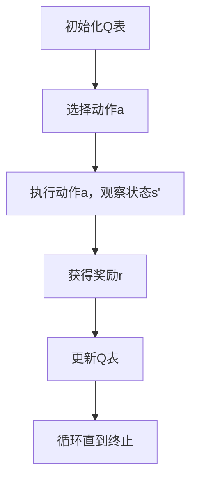
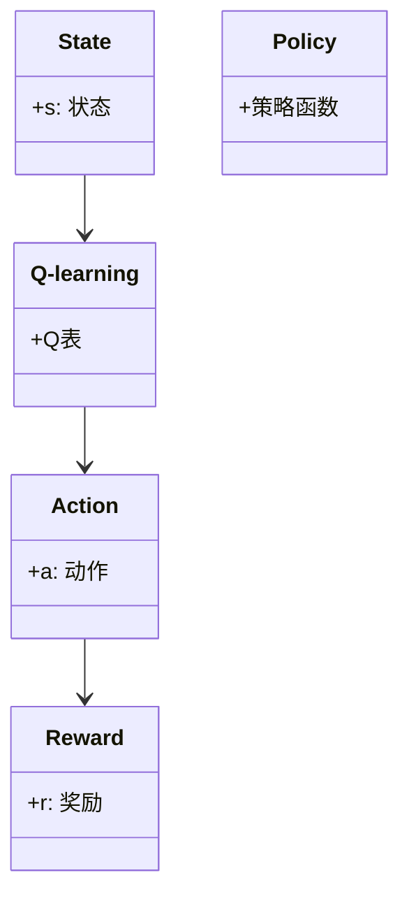
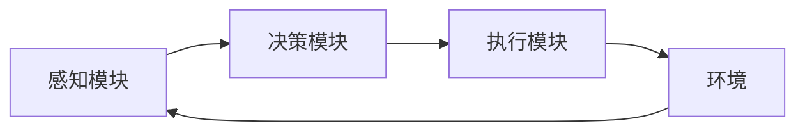
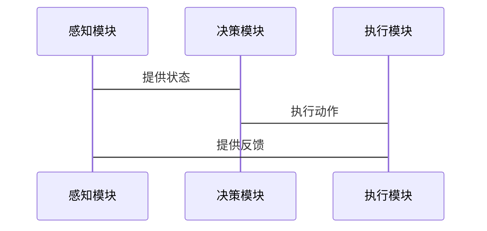

                 


# 开发具有强化学习能力的AI Agent

> 关键词：强化学习，AI Agent，Q-learning，策略梯度，系统架构，项目实战

> 摘要：本文详细介绍了开发具有强化学习能力的AI Agent的过程，从基本概念到算法原理，再到系统架构设计和项目实战，帮助读者全面掌握强化学习在AI Agent中的应用。

---

## 第1章: 强化学习与AI Agent概述

### 1.1 强化学习的基本概念

#### 1.1.1 强化学习的定义与特点
强化学习（Reinforcement Learning，RL）是一种机器学习范式，通过智能体与环境的交互来学习策略。其特点包括：
- **自主性**：智能体在没有明确指导的情况下做出决策。
- **试错性**：通过不断尝试和错误来优化策略。
- **延迟奖励**：奖励可能在决策后的多个步骤后才获得。

#### 1.1.2 AI Agent的定义与类型
AI Agent（智能体）是能够感知环境并采取行动以实现目标的实体。其类型包括：
- **反应式Agent**：基于当前感知做出反应。
- **认知式Agent**：具备复杂推理和规划能力。

#### 1.1.3 强化学习与AI Agent的联系与区别
- **联系**：强化学习为AI Agent提供决策策略。
- **区别**：强化学习侧重于学习过程，而AI Agent侧重于执行任务。

### 1.2 强化学习的核心概念
#### 1.2.1 状态、动作、奖励的定义
- **状态（State）**：环境的当前情况。
- **动作（Action）**：智能体的决策。
- **奖励（Reward）**：对动作的反馈。

#### 1.2.2 Q值函数与策略函数的对比
- Q值函数：评估状态-动作对的价值。
- 策略函数：直接输出最优动作。

#### 1.2.3 强化学习的数学模型与公式
数学模型：
$$ Q(s, a) = r + \gamma \max Q(s', a') $$
其中：
- $s$：当前状态
- $a$：当前动作
- $r$：奖励
- $\gamma$：折扣因子
- $s'$：下一个状态

### 1.3 AI Agent的应用领域
#### 1.3.1 游戏AI的发展历程
从简单游戏到复杂游戏，强化学习在游戏AI中的应用日益广泛。

#### 1.3.2 机器人控制与自主决策
机器人通过强化学习实现自主导航和任务执行。

#### 1.3.3 智能推荐系统与动态优化
通过强化学习优化推荐策略，提升用户体验。

---

## 第2章: 强化学习的核心算法原理

### 2.1 Q-learning算法

#### 2.1.1 Q-learning的基本原理
Q-learning是一种基于值函数的方法，通过更新Q表来学习最优策略。

#### 2.1.2 Q-learning的数学模型与公式
更新公式：
$$ Q(s, a) = Q(s, a) + \alpha [r + \gamma \max Q(s', a') - Q(s, a)] $$
其中：
- $\alpha$：学习率

#### 2.1.3 Q-learning的算法流程图（Mermaid）



### 2.2 策略梯度算法

#### 2.2.1 策略梯度的基本原理
通过优化策略函数的参数来最大化期望奖励。

#### 2.2.2 策略梯度的数学模型与公式
梯度更新：
$$ \theta_{t+1} = \theta_t + \alpha \nabla_\theta J(\theta) $$
其中：
- $J(\theta)$：目标函数
- $\alpha$：学习率

#### 2.2.3 策略梯度的算法流程图（Mermaid）

```mermaid
graph TD
    A[初始化参数θ] --> B[计算梯度∇J(θ)]
    B --> C[更新θ]
    C --> D[循环直到收敛]
```

---

## 第3章: AI Agent的系统架构设计

### 3.1 系统功能需求分析

#### 3.1.1 AI Agent的功能模块划分
- **感知模块**：处理环境输入。
- **决策模块**：执行强化学习算法。
- **执行模块**：输出动作。

#### 3.1.2 系统的输入输出接口设计
- 输入：状态、动作、奖励。
- 输出：优化后的策略。

#### 3.1.3 系统的性能指标与约束条件
- 响应时间：快速决策。
- 稳定性：避免崩溃。

### 3.2 系统架构设计

#### 3.2.1 领域模型设计（Mermaid类图）



#### 3.2.2 系统架构设计（Mermaid架构图）



#### 3.2.3 系统接口设计与交互流程（Mermaid序列图）



---

## 第4章: 强化学习算法的数学模型与公式

### 4.1 Q-learning的数学模型
更新公式：
$$ Q(s, a) = (1-\alpha) Q(s, a) + \alpha (r + \gamma \max Q(s', a')) $$

### 4.2 策略梯度的数学模型
梯度计算：
$$ \nabla J(\theta) = \mathbb{E}[ \nabla \log \pi_\theta(a|s) \cdot Q(s, a)] $$

---

## 第5章: 强化学习与AI Agent的项目实战

### 5.1 项目环境安装与配置

#### 5.1.1 Python环境的搭建
安装Python和必要的库：
```
pip install numpy matplotlib
```

#### 5.1.2 强化学习框架的选择与安装
使用TensorFlow或PyTorch。

#### 5.1.3 开发工具与调试环境的配置
建议使用Jupyter Notebook进行调试。

### 5.2 核心算法实现

#### 5.2.1 Q-learning的实现

```python
import numpy as np

class QLearning:
    def __init__(self, state_size, action_size, gamma=0.99, alpha=0.1):
        self.q_table = np.zeros((state_size, action_size))
        self.gamma = gamma
        self.alpha = alpha

    def choose_action(self, state):
        return np.argmax(self.q_table[state])

    def update_q_table(self, state, action, reward, next_state):
        self.q_table[state][action] += self.alpha * (reward + self.gamma * max(self.q_table[next_state]) - self.q_table[state][action])
```

#### 5.2.2 策略梯度的实现

```python
import numpy as np

class PolicyGradient:
    def __init__(self, state_size, action_size, gamma=0.99, alpha=0.1):
        self.theta = np.random.randn(state_size, action_size)
        self.gamma = gamma
        self.alpha = alpha

    def get_action(self, state):
        probs = np.exp(self.theta[state]) / np.sum(np.exp(self.theta[state]))
        return np.random.choice(len(probs), p=probs)

    def update_theta(self, states, actions, rewards):
        for i in range(len(states)):
            state = states[i]
            action = actions[i]
            reward = rewards[i]
            target = reward + self.gamma * np.max(self.theta[state])
            loss = target - self.theta[state][action]
            self.theta[state][action] += self.alpha * loss
```

### 5.3 项目实战

#### 5.3.1 环境搭建与代码实现
使用OpenAI Gym进行实验。

#### 5.3.2 代码应用解读与分析
详细分析每行代码的功能。

#### 5.3.3 实际案例分析和详细讲解剖析
通过案例展示强化学习的实际应用。

#### 5.3.4 项目小结
总结项目中的关键点和收获。

---

## 第6章: 强化学习与AI Agent的优化与扩展

### 6.1 小结
强化学习在AI Agent中的应用前景广阔。

### 6.2 注意事项
- 算法选择：根据任务选择合适的算法。
- 参数调优：合理设置参数。

### 6.3 拓展阅读
推荐相关书籍和论文。

---

## 作者

作者：AI天才研究院/AI Genius Institute & 禅与计算机程序设计艺术 /Zen And The Art of Computer Programming

---

**附录：**

### 附录A: 强化学习算法的数学推导

详细推导Q-learning和策略梯度的数学公式。

### 附录B: 项目代码与数据集

提供完整的项目代码和数据集链接。

### 附录C: 参考文献

列出所有引用的文献和资源。

---

通过以上结构，您可以撰写一篇内容丰富、逻辑清晰的博客文章，帮助读者全面理解开发具有强化学习能力的AI Agent的过程和方法。

