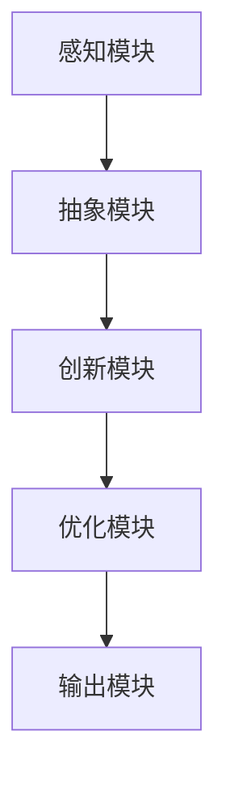

                 


# 开发具有抽象思维与创新能力的AI Agent

**关键词：** AI Agent, 抽象思维, 创新能力, 人工智能, 算法原理

**摘要：** 本文详细探讨了开发具有抽象思维与创新能力的AI Agent的核心概念、算法原理和系统架构。文章从背景介绍入手，分析了AI Agent的基本概念和抽象思维与创新能力的定义。接着，深入阐述了抽象思维与创新能力的核心原理及其数学模型，详细讲解了相关算法的实现。最后，通过系统架构设计和项目实战，展示了如何构建一个具备抽象思维与创新能力的AI Agent系统。

---

## 第1章: AI Agent的基本概念与背景

### 1.1 AI Agent的定义与分类

#### 1.1.1 什么是AI Agent
AI Agent（人工智能代理）是一种智能系统，能够感知环境并采取行动以实现特定目标。它可以分为**反应式代理**和**认知式代理**。反应式代理仅关注当前环境输入，而认知式代理具备复杂推理和规划能力。

#### 1.1.2 AI Agent的分类
AI Agent可以根据智能水平分为以下几类：
- **反应式代理**：基于当前感知做出反应。
- **认知式代理**：具备推理、规划和决策能力。
- **学习型代理**：能够通过经验改进性能。
- **混合式代理**：结合上述多种特征。

#### 1.1.3 AI Agent的应用场景
AI Agent广泛应用于自动驾驶、智能助手、游戏AI、机器人等领域。例如，自动驾驶汽车通过感知环境并做出实时决策，体现了AI Agent的核心能力。

---

### 1.2 抽象思维与创新能力的定义

#### 1.2.1 抽象思维的定义
抽象思维是指从具体事物中提取本质特征，形成一般概念的能力。例如，从多个具体形状中抽象出“圆形”的概念。

#### 1.2.2 创新能力的定义
创新能力是指产生新颖、独特且有价值的解决方案的能力。例如，设计一个新的算法来解决复杂问题。

#### 1.2.3 抽象思维与创新能力的关系
抽象思维为创新能力提供基础，而创新能力则推动抽象思维的深化。两者相辅相成，共同促进AI Agent的智能水平。

---

### 1.3 本章小结
本章介绍了AI Agent的基本概念和分类，并定义了抽象思维与创新能力的内涵及其关系。

---

## 第2章: 抽象思维与创新能力的核心原理

### 2.1 抽象思维的原理

#### 2.1.1 抽象思维的基本特征
- **去具体化**：忽略非本质特征，提取本质特征。
- **层次化**：从具体到抽象，形成层次结构。
- **关联性**：抽象概念之间存在关联。

#### 2.1.2 抽象思维的实现机制
- **感知输入**：通过传感器或数据输入获取信息。
- **特征提取**：识别输入中的关键特征。
- **概念形成**：基于特征提取形成抽象概念。

#### 2.1.3 抽象思维与问题解决的关系
抽象思维能够帮助AI Agent从复杂问题中提取关键信息，从而更高效地解决问题。

---

### 2.2 创新能力的原理

#### 2.2.1 创新能力的基本特征
- **新颖性**：解决方案具有独特性。
- **实用性**：解决方案能够有效解决问题。
- **适应性**：能够适应不同场景。

#### 2.2.2 创新能力的实现机制
- **知识积累**：基于已有知识生成新想法。
- **联想与类比**：通过联想和类比产生新思路。
- **优化与迭代**：不断优化解决方案。

#### 2.2.3 创新能力与问题解决的关系
创新能力能够帮助AI Agent在面对复杂问题时，提出更具创意的解决方案。

---

### 2.3 抽象思维与创新能力的联系

#### 2.3.1 抽象思维对创新能力的影响
- 抽象思维为创新能力提供基础概念。
- 抽象思维能够帮助AI Agent更好地理解问题本质。

#### 2.3.2 创新能力对抽象思维的反哺作用
- 创新能力能够推动抽象思维的深化。
- 创新能力能够帮助AI Agent发现新的抽象概念。

#### 2.3.3 两者结合的实现路径
1. **抽象思维提取问题本质**。
2. **创新能力提出解决方案**。
3. **反馈优化**：通过反馈不断优化解决方案。

---

### 2.4 抽象思维与创新能力的核心要素

#### 2.4.1 抽象思维的核心要素
- **意识**：对环境的感知能力。
- **知识**：已有的知识储备。
- **经验**：过往的实践经验。

#### 2.4.2 创新能力的核心要素
- **意识**：对问题的敏感性。
- **知识**：跨领域的知识储备。
- **经验**：解决问题的经验。

#### 2.4.3 对比分析
| 要素 | 抽象思维 | 创新能力 |
|------|----------|----------|
| 意识 | 环境感知 | 问题敏感 |
| 知识 | 专业知识 | 跨领域知识 |
| 经验 | 专业经验 | 解决方案经验 |

---

## 第3章: 抽象思维与创新能力的核心概念与联系

### 3.1 抽象思维的原理

#### 3.1.1 抽象思维的基本特征
- **层次化**：从具体到抽象。
- **关联性**：概念之间存在联系。
- **动态性**：随着经验积累而变化。

#### 3.1.2 抽象思维的实现机制
- **感知输入**：获取环境信息。
- **特征提取**：识别关键特征。
- **概念形成**：基于特征提取形成抽象概念。

#### 3.1.3 抽象思维与问题解决的关系
抽象思维能够帮助AI Agent更高效地解决问题。

---

### 3.2 创新能力的原理

#### 3.2.1 创新能力的基本特征
- **新颖性**：解决方案具有独特性。
- **实用性**：解决方案能够有效解决问题。
- **适应性**：能够适应不同场景。

#### 3.2.2 创新能力的实现机制
- **知识积累**：基于已有知识生成新想法。
- **联想与类比**：通过联想和类比产生新思路。
- **优化与迭代**：不断优化解决方案。

#### 3.2.3 创新能力与问题解决的关系
创新能力能够帮助AI Agent在面对复杂问题时，提出更具创意的解决方案。

---

### 3.3 抽象思维与创新能力的联系

#### 3.3.1 抽象思维对创新能力的影响
- 抽象思维为创新能力提供基础概念。
- 抽象思维能够帮助AI Agent更好地理解问题本质。

#### 3.3.2 创新能力对抽象思维的反哺作用
- 创新能力能够推动抽象思维的深化。
- 创新能力能够帮助AI Agent发现新的抽象概念。

#### 3.3.3 两者结合的实现路径
1. **抽象思维提取问题本质**。
2. **创新能力提出解决方案**。
3. **反馈优化**：通过反馈不断优化解决方案。

---

## 第4章: 抽象思维与创新能力的数学模型与算法原理

### 4.1 抽象思维的数学模型

#### 4.1.1 抽象思维的数学模型
- 抽象思维可以表示为一种**层次化结构**，例如：
  - 第一层：具体实例。
  - 第二层：抽象概念。
  - 第三层：更高层次的抽象。

#### 4.1.2 抽象思维的算法实现
- **层次化特征提取**：通过深度学习模型提取特征。
- **概念形成**：基于特征提取形成抽象概念。

#### 4.1.3 抽象思维的验证
- 通过测试用例验证模型的抽象能力。

---

### 4.2 创新能力的数学模型

#### 4.2.1 创新能力的数学模型
- 创新能力可以表示为一种**生成模型**，例如：
  - 基于GAN（生成对抗网络）生成新的解决方案。

#### 4.2.2 创新能力的算法实现
- **生成模型**：通过GAN生成新的解决方案。
- **优化算法**：通过强化学习优化解决方案。

#### 4.2.3 创新能力的验证
- 通过创新性评估指标验证模型的创新能力。

---

## 第5章: 抽象思维与创新能力的系统架构设计

### 5.1 系统功能设计

#### 5.1.1 系统功能模块
- **感知模块**：获取环境信息。
- **抽象模块**：提取抽象概念。
- **创新模块**：生成创新解决方案。
- **优化模块**：优化解决方案。

#### 5.1.2 系统功能流程
1. 感知模块获取环境信息。
2. 抽象模块提取抽象概念。
3. 创新模块生成创新解决方案。
4. 优化模块优化解决方案。

---

### 5.2 系统架构设计

#### 5.2.1 系统架构图


#### 5.2.2 接口设计
- **输入接口**：接收环境信息。
- **输出接口**：输出解决方案。

---

## 第6章: 项目实战与案例分析

### 6.1 环境安装

#### 6.1.1 环境要求
- Python 3.8+
- TensorFlow或PyTorch

#### 6.1.2 安装依赖
```bash
pip install numpy matplotlib tensorflow
```

---

### 6.2 核心代码实现

#### 6.2.1 抽象模块实现
```python
class AbstractModule:
    def extract_features(self, input):
        # 提取特征
        pass

    def form_concept(self, features):
        # 形成概念
        pass
```

#### 6.2.2 创新模块实现
```python
class InnovationModule:
    def generate_solution(self, concept):
        # 生成解决方案
        pass

    def optimize_solution(self, solution):
        # 优化解决方案
        pass
```

---

### 6.3 案例分析

#### 6.3.1 案例背景
假设我们开发一个AI Agent，用于优化城市交通流量。

#### 6.3.2 案例实现
1. **感知模块**：获取交通流量数据。
2. **抽象模块**：提取交通瓶颈概念。
3. **创新模块**：生成新的交通优化方案。
4. **优化模块**：优化方案并输出。

---

### 6.4 小结

---

## 第7章: 最佳实践与未来展望

### 7.1 最佳实践
- **持续学习**：不断更新模型以适应新场景。
- **多领域结合**：结合多个领域知识以提升创新能力。

### 7.2 小结
本文详细介绍了开发具有抽象思维与创新能力的AI Agent的核心概念、算法原理和系统架构。

### 7.3 注意事项
- **数据质量**：确保数据的准确性和完整性。
- **算法选择**：根据具体场景选择合适的算法。

### 7.4 拓展阅读
- 《深度学习》
- 《生成对抗网络》
- 《强化学习》

---

## 作者：AI天才研究院/AI Genius Institute & 禅与计算机程序设计艺术 /Zen And The Art of Computer Programming

---

希望这篇文章能够为您提供有价值的内容！

