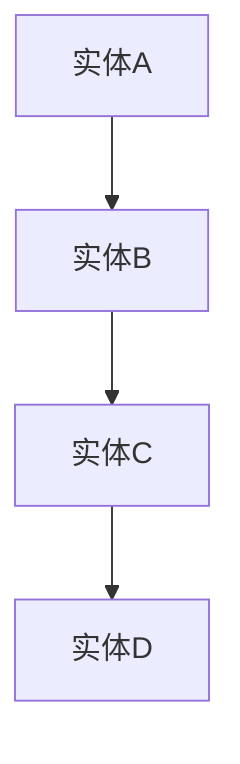
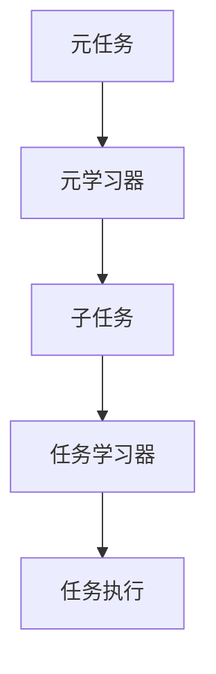
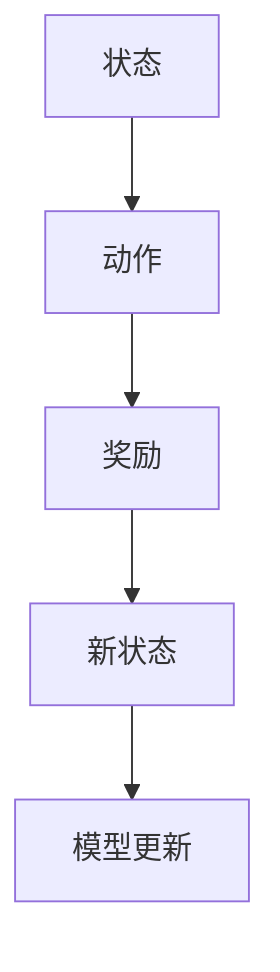
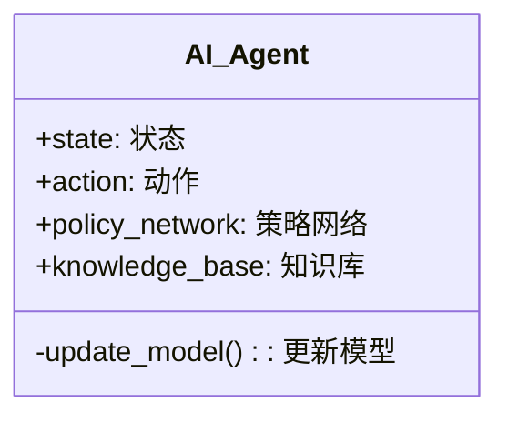
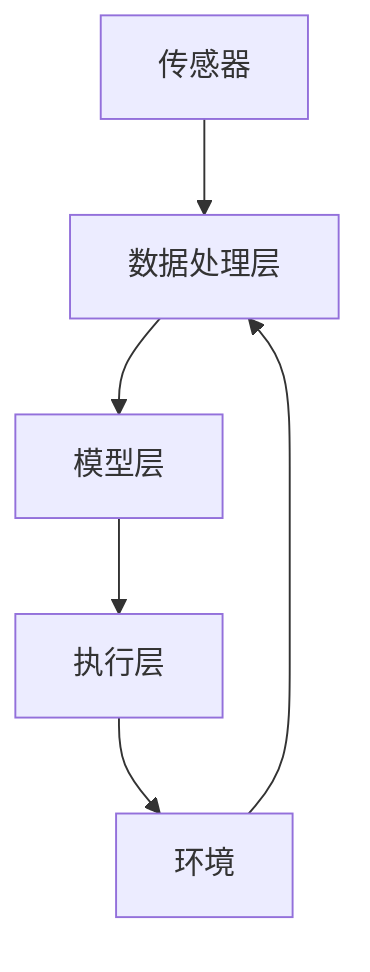
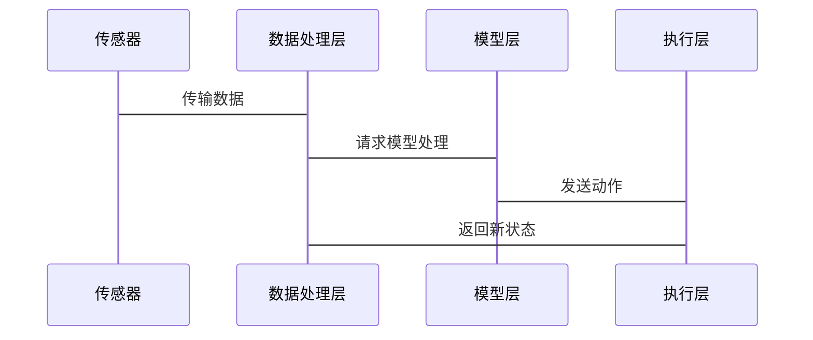

                 


# 开发具有持续学习能力的AI Agent

> 关键词：AI Agent，持续学习，知识表示，强化学习，机器学习，系统架构

> 摘要：本文详细探讨了开发具有持续学习能力的AI Agent的核心概念、算法原理、系统架构及项目实战。通过理论分析与实践案例相结合的方式，深入解析了持续学习的关键技术，包括知识表示、学习策略、算法实现等，并提供了完整的系统设计和代码实现，帮助读者全面理解和掌握开发持续学习AI Agent的能力。

---

## 第1章：AI Agent与持续学习概述

### 1.1 AI Agent的基本概念

#### 1.1.1 AI Agent的定义与分类
AI Agent（人工智能代理）是指能够感知环境并采取行动以实现目标的智能实体。根据功能和智能水平，AI Agent可以分为：
- **反应式AI Agent**：基于当前感知做出反应，如简单的机器人。
- **认知式AI Agent**：具备推理、规划能力，如自动驾驶系统。
- **学习型AI Agent**：能够通过经验改进性能，如推荐系统。

#### 1.1.2 持续学习的基本概念
持续学习是指AI Agent在动态环境中不断学习和适应新知识的能力。与传统机器学习不同，持续学习不依赖于离线训练数据，而是在线更新模型。

#### 1.1.3 持续学习AI Agent的背景与意义
随着AI Agent应用场景的扩展，持续学习能力变得至关重要。例如，在自动驾驶中，AI Agent需要实时适应道路和交通的变化。

### 1.2 持续学习的核心问题

#### 1.2.1 知识表示与更新
知识表示是AI Agent理解和推理的基础。常用的表示方法包括向量空间模型和知识图谱。

#### 1.2.2 知识遗忘与迁移
在持续学习中，模型可能会遗忘旧知识，影响新任务的性能。知识迁移技术可以缓解这一问题。

#### 1.2.3 动态环境中的适应性
AI Agent需要在动态环境中快速适应变化，持续优化自身行为。

### 1.3 持续学习AI Agent的应用场景

#### 1.3.1 智能推荐系统
AI Agent可以根据用户的实时反馈，动态调整推荐策略。

#### 1.3.2 自动驾驶
AI Agent需要实时处理传感器数据，动态调整驾驶策略。

#### 1.3.3 智能客服
AI Agent可以根据对话历史，动态调整回复内容，提供更个性化的服务。

---

## 第2章：持续学习的理论基础

### 2.1 知识表示与表示学习

#### 2.1.1 向量空间模型
向量空间模型通过将文本表示为向量，捕捉语义信息。例如，Word2Vec将单词映射到向量空间。

#### 2.1.2 图结构表示
图结构表示通过节点和边表示实体及其关系，如知识图谱。

#### 2.1.3 知识图谱
知识图谱通过结构化数据表示知识，支持复杂的推理任务。

#### 2.1.4 对比表格：知识表示方法的优缺点

| 方法       | 优点               | 缺点               |
|------------|--------------------|--------------------|
| 向量空间模型 | 易于计算，适合语义分析 | 无法捕捉复杂关系   |
| 图结构表示   | 能表示复杂关系     | 计算复杂度高       |

#### 2.1.5 ER实体关系图架构


### 2.2 学习策略与强化学习

#### 2.2.1 Q-learning算法
Q-learning是一种经典的强化学习算法，通过更新Q值表来学习最优策略。

#### 2.2.2 策略梯度方法
策略梯度方法直接优化策略参数，如Deep Q-Network（DQN）。

#### 2.2.3 多目标强化学习
多目标强化学习通过同时优化多个目标，提升AI Agent的适应性。

#### 2.2.4 对比表格：强化学习方法的优缺点

| 方法         | 优点               | 缺点               |
|--------------|--------------------|--------------------|
| Q-learning   | 简单易实现         | 易患鞍点问题       |
| 策略梯度方法  | 直接优化策略       | 计算复杂度高       |
| 多目标强化学习| 提升适应性         | 需要平衡多个目标   |

### 2.3 知识整合与融合方法

#### 2.3.1 知识蒸馏
知识蒸馏通过教师模型指导学生模型，减少知识损失。

#### 2.3.2 知识融合
知识融合将多源知识整合，提升模型的泛化能力。

#### 2.3.3 知识增强
知识增强通过外部数据增强模型的知识储备。

---

## 第3章：持续学习算法的核心原理

### 3.1 元学习（Meta-Learning）

#### 3.1.1 Meta-Learning的基本概念
元学习通过学习如何学习，提升模型的迁移能力。

#### 3.1.2 Meta-Learning的算法框架


#### 3.1.3 Meta-Learning在持续学习中的应用
Meta-Learning可以快速适应新任务，减少训练数据需求。

### 3.2 知识蒸馏与模型压缩

#### 3.2.1 知识蒸馏的基本原理
知识蒸馏通过教师模型指导学生模型，减少知识损失。

#### 3.2.2 模型压缩技术
模型压缩技术如剪枝和量化，降低模型复杂度。

#### 3.2.3 知识蒸馏在持续学习中的优势
知识蒸馏可以保持模型性能，同时减少计算开销。

### 3.3 自适应网络结构

#### 3.3.1 网络可塑性
网络可塑性允许网络结构根据输入数据动态调整。

#### 3.3.2 动态网络结构
动态网络结构通过参数化边权重，实现网络结构的动态变化。

#### 3.3.3 网络剪枝与生长
网络剪枝去除冗余节点，网络生长增加新节点以适应新任务。

---

## 第4章：持续学习的数学模型与算法实现

### 4.1 持续学习的数学模型

#### 4.1.1 知识表示的数学形式
知识表示可以用向量表示，如$e_i = [v_1, v_2, ..., v_n]^T$。

#### 4.1.2 学习目标的数学表达
学习目标可以通过损失函数表示，如$L = \sum_{i=1}^n (y_i - \hat{y}_i)^2$。

#### 4.1.3 模型更新的数学推导
模型更新可以通过梯度下降实现，如$\theta = \theta - \eta \nabla_\theta L$。

### 4.2 基于强化学习的持续学习算法

#### 4.2.1 算法流程图


#### 4.2.2 算法实现代码示例
```python
import torch

# 定义策略网络
class PolicyNetwork(torch.nn.Module):
    def __init__(self, state_dim, action_dim):
        super(PolicyNetwork, self).__init__()
        self.fc1 = torch.nn.Linear(state_dim, 64)
        self.fc2 = torch.nn.Linear(64, action_dim)
        self.softmax = torch.nn.Softmax(dim=1)
    
    def forward(self, state):
        x = torch.relu(self.fc1(state))
        x = self.softmax(self.fc2(x))
        return x

# 定义强化学习算法
def reinforce_learning(env, policy_network, optimizer):
    for episode in range(num_episodes):
        state = env.reset()
        while not done:
            # 选择动作
            with torch.no_grad():
                action_probs = policy_network(state)
                action = torch.multinomial(action_probs, 1).item()
            # 执行动作并获取奖励
            next_state, reward, done, _ = env.step(action)
            # 计算损失
            optimizer.zero_grad()
            loss = -torch.log(action_probs[0][action]) * reward
            loss.backward()
            optimizer.step()
            state = next_state
```

---

## 第5章：系统分析与架构设计方案

### 5.1 问题场景介绍
AI Agent需要在动态环境中实时处理数据，动态调整策略。

### 5.2 系统功能设计

#### 5.2.1 领域模型


#### 5.2.2 系统架构


#### 5.2.3 系统接口设计
- **输入接口**：接收传感器数据和用户输入。
- **输出接口**：输出动作和状态更新。
- **模型接口**：提供模型更新和查询功能。

#### 5.2.4 系统交互


---

## 第6章：项目实战

### 6.1 环境安装
- 安装Python和必要的库，如TensorFlow、PyTorch。

### 6.2 系统核心实现

#### 6.2.1 知识表示模块
```python
class KnowledgeBase:
    def __init__(self):
        self.entities = {}  # 实体存储
        self.relations = {}  # 关系存储
```

#### 6.2.2 学习策略模块
```python
class LearningStrategy:
    def __init__(self, knowledge_base):
        self.knowledge_base = knowledge_base
```

#### 6.2.3 系统主程序
```python
def main():
    kb = KnowledgeBase()
    strategy = LearningStrategy(kb)
    while True:
        # 获取输入
        input_data = input("请输入数据：")
        # 处理数据
        kb.update(input_data)
        # 执行策略
        action = strategy.decide_action(input_data)
        print(f"执行动作：{action}")

if __name__ == "__main__":
    main()
```

### 6.3 实际案例分析
以智能推荐系统为例，展示如何实时更新推荐策略。

---

## 第7章：总结与展望

### 7.1 最佳实践 Tips

#### 7.1.1 知识表示
选择合适的知识表示方法，提升模型的推理能力。

#### 7.1.2 算法选择
根据应用场景选择合适的算法，平衡性能和复杂度。

#### 7.1.3 系统架构
设计灵活的系统架构，支持动态扩展和调整。

### 7.2 小结
本文详细探讨了开发具有持续学习能力的AI Agent的关键技术，从理论到实践，提供了全面的指导。

### 7.3 注意事项
- 定期更新模型，避免知识过时。
- 监控系统性能，及时调整策略。

### 7.4 拓展阅读
推荐阅读相关领域的最新论文和书籍，持续提升技术水平。

---

## 作者信息

作者：AI天才研究院/AI Genius Institute & 禅与计算机程序设计艺术 /Zen And The Art of Computer Programming

---

通过以上结构，文章系统地介绍了开发具有持续学习能力的AI Agent的核心技术，从理论到实践，层层深入，帮助读者全面理解和掌握相关知识。

