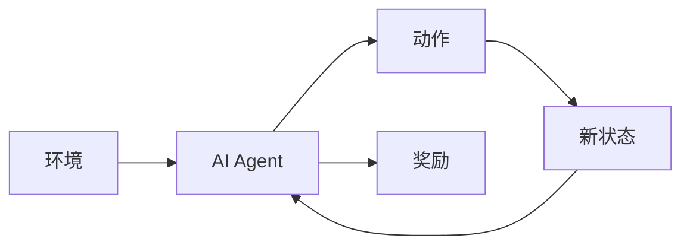
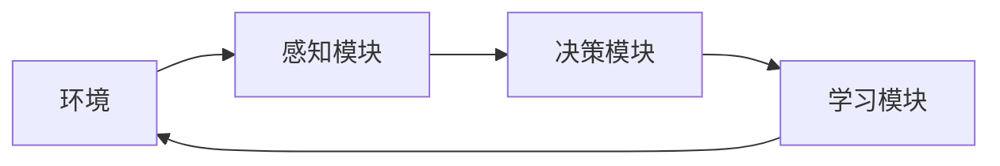
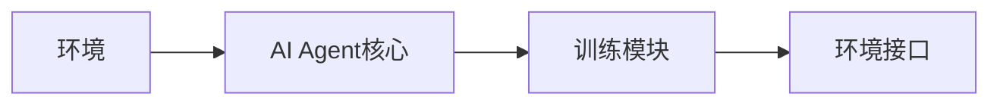

                 


# 开发具有深度强化学习能力的AI Agent

---

## 关键词
深度强化学习、AI Agent、强化学习、AI开发、机器学习

---

## 摘要
本文旨在详细探讨如何开发具有深度强化学习能力的AI Agent。从基本概念到算法实现，从系统架构到项目实战，本文将全面解析AI Agent的核心原理、深度强化学习的数学模型、算法实现方法以及系统设计的最佳实践。通过丰富的案例分析和详细的代码示例，本文将帮助读者掌握开发AI Agent的关键技术，理解深度强化学习在实际应用中的潜力与挑战。

---

# 第1章: AI Agent与深度强化学习概述

## 1.1 AI Agent的基本概念
### 1.1.1 什么是AI Agent
AI Agent（人工智能代理）是指能够感知环境、自主决策并执行任务的智能实体。它可以是一个软件程序、机器人或其他智能系统，目标是通过与环境交互，实现特定目标。

### 1.1.2 AI Agent的核心特征
- **自主性**：无需外部干预，自主决策。
- **反应性**：能够实时感知环境并做出反应。
- **目标导向性**：以目标为导向，优化决策。
- **学习能力**：通过经验改进性能。

### 1.1.3 AI Agent的应用场景
- **游戏AI**：在电子游戏中控制角色。
- **机器人控制**：用于工业自动化或服务机器人。
- **自动驾驶**：用于车辆的智能决策。
- **智能助手**：如Siri、Alexa等。

## 1.2 深度强化学习的基本概念
### 1.2.1 强化学习的定义
强化学习是一种机器学习范式，通过智能体在环境中采取行动，获得奖励或惩罚，从而学习最优策略。

### 1.2.2 深度强化学习的定义
深度强化学习是强化学习与深度学习的结合，利用深度神经网络作为价值函数或策略函数，实现更复杂的决策任务。

### 1.2.3 深度强化学习与传统强化学习的区别
| 特性         | 传统强化学习               | 深度强化学习               |
|--------------|----------------------------|----------------------------|
| 表示能力     | 有限，依赖于特征工程         | 强大，自动提取高维特征       |
| 应用场景     | 简单任务                   | 复杂任务                   |
| 计算资源     | 较低                       | 较高                       |

## 1.3 AI Agent与深度强化学习的关系
### 1.3.1 AI Agent的决策机制
AI Agent通过感知环境状态，选择最优动作，以最大化累积奖励。

### 1.3.2 深度强化学习在AI Agent中的作用
深度强化学习为AI Agent提供了强大的决策能力，使其能够在复杂环境中自主学习和优化。

### 1.3.3 深度强化学习与AI Agent的结合方式
- **策略网络**：直接输出动作。
- **Q-learning网络**：估计状态-动作对的值。

## 1.4 本章小结
本章介绍了AI Agent的基本概念、深度强化学习的核心思想，以及两者结合的方式，为后续内容打下基础。

---

# 第2章: 深度强化学习的核心概念与数学基础

## 2.1 深度强化学习的核心概念
### 2.1.1 状态、动作、奖励的定义
- **状态（State）**：环境的当前情况。
- **动作（Action）**：AI Agent的决策。
- **奖励（Reward）**：对动作的反馈。

### 2.1.2 策略与价值函数的定义
- **策略（Policy）**：动作选择的概率分布。
- **价值函数（Value Function）**：状态或状态-动作对的预期收益。

### 2.1.3 探索与利用的平衡
- **探索**：尝试未访问过的动作。
- **利用**：选择当前最优的动作。

## 2.2 深度强化学习的数学模型
### 2.2.1 状态值函数的数学表达
$$ V(s) = \max_{a} \left( r + \gamma V(s') \right) $$
其中，$r$ 是奖励，$\gamma$ 是折扣因子，$s'$ 是下一个状态。

### 2.2.2 策略梯度的数学表达
$$ \nabla \theta J(\theta) = \mathbb{E}[ \nabla \log \pi(a|s) Q(s,a) ] $$
其中，$\pi(a|s)$ 是策略函数，$Q(s,a)$ 是动作值函数。

## 2.3 深度强化学习的核心算法
### 2.3.1 Q-learning算法
通过更新Q值表，学习状态-动作对的值：
$$ Q(s, a) = Q(s, a) + \alpha (r + \gamma \max Q(s', a) - Q(s, a)) $$

### 2.3.2 DQN算法
DQN结合了Q-learning和深度学习，使用两个神经网络：
- **主网络**：评估当前策略。
- **目标网络**：存储目标值。

### 2.3.3 策略梯度算法
通过优化策略参数，直接最大化奖励的期望值。

## 2.4 本章小结
本章详细介绍了深度强化学习的核心概念和数学模型，为后续算法实现奠定了理论基础。

---

# 第3章: 深度强化学习算法原理与实现

## 3.1 DQN算法的原理与实现
### 3.1.1 DQN算法的基本原理
通过经验回放和目标网络，稳定地学习最优策略。

### 3.1.2 DQN算法的网络结构
- **输入层**：接收状态向量。
- **隐藏层**：提取特征。
- **输出层**：输出动作值。

### 3.1.3 DQN算法的训练流程


## 3.2 策略梯度算法的原理与实现
### 3.2.1 策略梯度算法的基本原理
通过梯度上升优化策略参数，最大化奖励的期望值。

### 3.2.2 策略梯度算法的网络结构
- **输入层**：接收状态向量。
- **隐藏层**：提取特征。
- **输出层**：输出动作概率。

### 3.2.3 策略梯度算法的训练流程


## 3.3 基于深度强化学习的AI Agent实现
### 3.3.1 环境接口的设计
定义环境的接口，使其能够与AI Agent交互。

### 3.3.2 AI Agent的网络结构设计
设计神经网络结构，实现策略或价值函数。

### 3.3.3 训练与推理的实现
编写训练循环，更新神经网络参数。

## 3.4 本章小结
本章详细讲解了DQN和策略梯度算法的原理与实现，展示了如何将理论应用于实际。

---

# 第4章: 深度强化学习的系统分析与架构设计

## 4.1 项目背景与目标
### 4.1.1 项目背景
开发一个能够在复杂环境中自主决策的AI Agent。

### 4.1.2 项目目标
实现一个基于深度强化学习的AI Agent，能够在特定环境中完成任务。

### 4.1.3 项目范围
限定在特定环境中，如游戏或机器人控制。

## 4.2 系统功能设计
### 4.2.1 系统功能模块划分
- **感知模块**：接收环境反馈。
- **决策模块**：执行决策算法。
- **学习模块**：更新模型参数。

### 4.2.2 系统功能流程设计


### 4.2.3 系统功能的实现方式
- 使用Python编写感知和决策模块。
- 使用TensorFlow或PyTorch实现学习模块。

## 4.3 系统架构设计
### 4.3.1 系统架构的分层设计
- **输入层**：接收环境输入。
- **中间层**：处理数据。
- **输出层**：输出决策结果。

### 4.3.2 系统架构的模块划分
- **环境接口**：与外部环境交互。
- **AI Agent核心**：执行决策算法。
- **训练模块**：更新模型参数。

### 4.3.3 系统架构的交互流程


## 4.4 本章小结
本章详细分析了系统的设计，为后续实现提供了指导。

---

# 第5章: 项目实战

## 5.1 环境配置
### 5.1.1 环境选择
选择适合的环境，如OpenAI Gym。

### 5.1.2 环境安装
安装必要的库，如TensorFlow、PyTorch、OpenAI Gym。

## 5.2 核心代码实现
### 5.2.1 DQN实现
```python
class DQNNetwork(tf.keras.Model):
    def __init__(self, state_size, action_size, hidden_size=64):
        super(DQNNetwork, self).__init__()
        self.fc1 = tf.keras.layers.Dense(hidden_size, activation='relu')
        self.fc2 = tf.keras.layers.Dense(action_size)
    
    def call(self, x):
        x = self.fc1(x)
        x = self.fc2(x)
        return x
```

### 5.2.2 策略梯度实现
```python
class PolicyGradient(tf.keras.Model):
    def __init__(self, state_size, action_size, hidden_size=64):
        super(PolicyGradient, self).__init__()
        self.fc1 = tf.keras.layers.Dense(hidden_size, activation='relu')
        self.fc2 = tf.keras.layers.Dense(action_size)
    
    def call(self, x):
        x = self.fc1(x)
        x = self.fc2(x)
        return x
```

## 5.3 案例分析
### 5.3.1 游戏AI案例
实现一个在OpenAI Gym中的游戏AI，通过强化学习学习策略。

### 5.3.2 机器人控制案例
实现一个基于强化学习的机器人控制算法，优化路径规划。

## 5.4 项目总结
通过项目实战，验证了深度强化学习算法的有效性和实用性。

---

# 第6章: 最佳实践与总结

## 6.1 最佳实践
### 6.1.1 环境选择
选择适合的环境，确保算法效果。

### 6.1.2 网络结构设计
合理设计网络结构，避免过拟合或欠拟合。

### 6.1.3 超参数调整
通过实验调整学习率、折扣因子等超参数。

## 6.2 小结
开发具有深度强化学习能力的AI Agent需要理论与实践的结合，通过不断实验和优化，才能实现最优性能。

## 6.3 注意事项
- 确保环境稳定。
- 避免过大的计算资源消耗。
- 及时监控训练过程。

## 6.4 拓展阅读
推荐阅读相关论文和书籍，深入理解深度强化学习的理论与应用。

---

# 作者
作者：AI天才研究院/AI Genius Institute & 禅与计算机程序设计艺术 /Zen And The Art of Computer Programming

---

本文详细探讨了开发具有深度强化学习能力的AI Agent的核心技术，从理论到实践，为读者提供了全面的指导。通过本文的学习，读者可以掌握深度强化学习的原理与实现方法，并能够将其应用于实际项目中。

