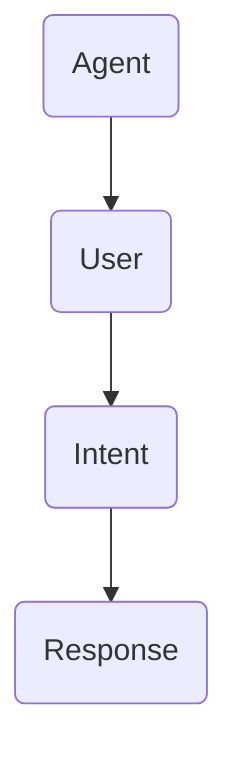

                 


# 开发具有自然语言对话能力的AI Agent

---

## 关键词：
- AI Agent
- 自然语言处理
- 对话系统
- 机器学习
- 转换器模型

---

## 摘要：
本文系统地探讨了开发具有自然语言对话能力的AI Agent的核心技术与实现方法。从背景介绍到核心概念，从算法原理到系统设计，再到项目实战，全面解析了构建智能对话系统的各个环节。通过对比分析、流程图展示和代码实现，深入浅出地揭示了AI Agent与自然语言处理的结合之道，帮助读者从理论到实践，掌握开发智能对话系统的关键技能。

---

## 第一部分：背景介绍

### 第1章：AI Agent与自然语言对话的背景

#### 1.1 AI Agent的基本概念
- **AI Agent的定义与特点**  
  AI Agent（智能体）是指能够感知环境、自主决策并执行任务的智能系统。它通过接收输入、处理信息和输出结果，实现与用户的交互。AI Agent的核心特点包括自主性、反应性、目标导向和社交能力。

- **自然语言对话的核心问题**  
  自然语言对话涉及语义理解、意图识别、上下文管理等多个环节。AI Agent需要能够准确理解用户意图，并生成符合语境的回复。

- **AI Agent的应用场景与边界**  
  AI Agent广泛应用于客服、智能家居、虚拟助手等领域。其边界在于处理复杂任务时的能力限制，如多轮对话中的状态管理。

#### 1.2 自然语言处理的发展历程
- **从规则驱动到数据驱动的转变**  
  早期的NLP主要依赖规则，而现在大数据和深度学习的兴起使得模型能够自适应地学习语言规律。

- **大模型在NLP中的突破**  
  如GPT系列模型的出现，极大提升了生成文本的质量和自然度。

- **当前自然语言对话的挑战与机遇**  
  挑战包括处理长尾问题和多语言支持，机遇则来自技术进步和行业需求的增长。

#### 1.3 为什么现在是开发AI对话Agent的最佳时机
- **技术进步的推动**  
  大模型和云计算技术的发展降低了开发门槛，提高了系统的可扩展性。

- **行业需求的增长**  
  各行业对智能化服务的需求日益增加，推动了AI Agent的应用。

- **开源工具与生态的支持**  
  开源库和工具的丰富性为开发者提供了强大的支持，加速了开发进程。

---

## 第二部分：核心概念与联系

### 第2章：AI Agent与自然语言处理的核心概念

#### 2.1 AI Agent的构成与工作原理
- **AI Agent的组成部分**  
  包括感知模块、推理模块、决策模块和执行模块。

- **自然语言处理在AI Agent中的作用**  
  NLP负责语义理解、意图识别和对话生成。

- **对话流程的关键环节**  
  包括用户输入、语义分析、决策生成和系统输出。

#### 2.2 自然语言处理的核心原理
- **语言模型的基本原理**  
  语言模型通过概率分布预测下一个词，训练目标是最小化预测误差。

- **注意力机制的作用**  
  注意力机制帮助模型关注输入中的关键部分，提升语义理解能力。

- **对话系统的生成策略**  
  基于规则、检索式和生成式的方法，各有优劣。

#### 2.3 核心概念对比与ER实体关系图

##### 对比表格
| 概念 | 特性 | 描述 |
|------|------|------|
| AI Agent | 输入输出 | 接收自然语言输入，生成自然语言输出 |
| 自然语言处理 | 核心技术 | 语义理解、意图识别、对话管理 |

##### ER实体关系图


---

## 第三部分：算法原理

### 第3章：自然语言对话的核心算法

#### 3.1 Transformer模型的原理与实现
- **Transformer模型的基本结构**  
  包括编码器和解码器，每个部分由多个层堆叠而成。

- **多头注意力机制的实现细节**  
  多头机制通过并行处理不同子空间的信息，提升模型的表达能力。

- **位置编码的作用**  
  通过编码器将位置信息融入模型，帮助模型理解词序。

#### 3.2 注意力机制的数学模型
- **注意力机制的计算公式**  
  $$\text{Attention}(Q, K, V) = \text{softmax}\left(\frac{QK^T}{\sqrt{d_k}}\right)V$$

- **多头注意力的实现步骤**  
  通过线性变换生成查询、键和值，计算注意力权重并加权求和。

#### 3.3 基于Transformer的对话生成模型
- **模型的整体结构**  
  由编码器和解码器组成，编码器处理输入，解码器生成输出。

- **训练目标与损失函数**  
  使用交叉熵损失函数，最小化生成文本与真实文本的差异。

---

## 第四部分：系统分析与架构设计

### 第4章：AI对话系统的架构设计

#### 4.1 系统功能设计
- **功能模块**  
  包括用户输入处理、意图识别、对话管理、生成回复和反馈优化。

- **领域模型设计**  
  ```mermaid
  classDiagram
      class Agent {
          input;
          output;
          model;
      }
      class User {
          input;
          output;
      }
      Agent --> User: interact
  ```

#### 4.2 系统架构设计
- **整体架构**  
  基于微服务架构，包括前端、后端和模型服务。

- **技术选型**  
  使用Python、Flask构建后端，TensorFlow训练模型。

#### 4.3 系统接口设计
- **HTTP接口设计**  
  提供RESTful API，支持POST请求，接收用户输入，返回生成回复。

- **交互流程图**  
  ```mermaid
  sequenceDiagram
      User ->+ Agent: send input
      Agent ->> NLP Service: process request
      NLP Service ->> Agent: return response
      Agent ->- User: send response
  ```

---

## 第五部分：项目实战

### 第5章：构建一个简单的AI对话系统

#### 5.1 环境安装与配置
- **Python环境搭建**  
  使用virtualenv创建虚拟环境，安装必要的库：`transformers`, `torch`, `flask`。

- **模型下载与加载**  
  使用Hugging Face提供的预训练模型，如GPT-2。

#### 5.2 对话系统核心代码实现
- **导入必要的库**  
  ```python
  from transformers import AutoTokenizer, AutoModelForCausalLM
  import torch
  ```

- **模型加载与初始化**  
  ```python
  model_name = "gpt2"
  tokenizer = AutoTokenizer.from_pretrained(model_name)
  model = AutoModelForCausalLM.from_pretrained(model_name)
  ```

- **生成回复的实现**  
  ```python
  def generate_response(input_text):
      inputs = tokenizer(input_text, return_tensors="pt")
      outputs = model.generate(**inputs, max_length=50)
      response = tokenizer.decode(outputs[0], skip_special_tokens=True)
      return response
  ```

- **Flask接口开发**  
  ```python
  from flask import Flask, request, jsonify

  app = Flask(__name__)

  @app.route('/api/chat', methods=['POST'])
  def chat():
      data = request.json
      message = data['message']
      response = generate_response(message)
      return jsonify({'response': response})

  if __name__ == '__main__':
      app.run(debug=True)
  ```

#### 5.3 代码解读与应用分析
- **模型加载**  
  使用预训练模型，无需重新训练，快速部署。

- **生成策略**  
  使用贪心算法生成回复，适合实时对话场景。

#### 5.4 案例分析与详细讲解
- **实际应用场景**  
  模型在客服问答系统中的应用，处理常见问题，提升用户体验。

- **代码优化建议**  
  增加上下文记忆模块，优化多轮对话的表现。

#### 5.5 项目小结
- **实现总结**  
  通过Flask构建了一个简单的对话系统，展示了AI Agent的基本实现流程。

- **经验分享**  
  模型选择、接口设计和代码优化是项目成功的关键。

---

## 第六部分：最佳实践

### 第6章：开发AI对话系统的注意事项与拓展

#### 6.1 小结
- **核心内容回顾**  
  从概念到实现，系统地介绍了AI Agent和自然语言对话系统的开发流程。

#### 6.2 注意事项
- **数据质量的重要性**  
  数据的多样性和代表性直接影响模型的表现。

- **模型的可解释性**  
  在关键场景中，模型的决策过程需要可解释，便于调试和优化。

- **性能优化建议**  
  使用更高效的模型架构和推理优化技术，提升系统的响应速度。

#### 6.3 拓展阅读
- **推荐书籍**  
  《Deep Learning》、《Natural Language Processing with PyTorch》。

- **推荐资源**  
  Hugging Face的教程和文档，Keras的官方文档。

---

## 作者

作者：AI天才研究院/AI Genius Institute & 禅与计算机程序设计艺术 /Zen And The Art of Computer Programming

---

**总结**：通过本文，读者将系统地了解开发自然语言对话AI Agent的核心技术与实现方法。从理论到实践，从算法到系统设计，全面掌握构建智能对话系统的关键技能，为未来的开发工作打下坚实的基础。

