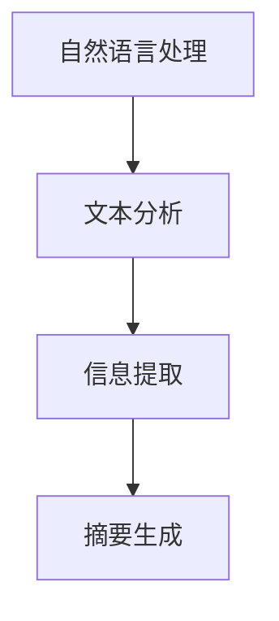
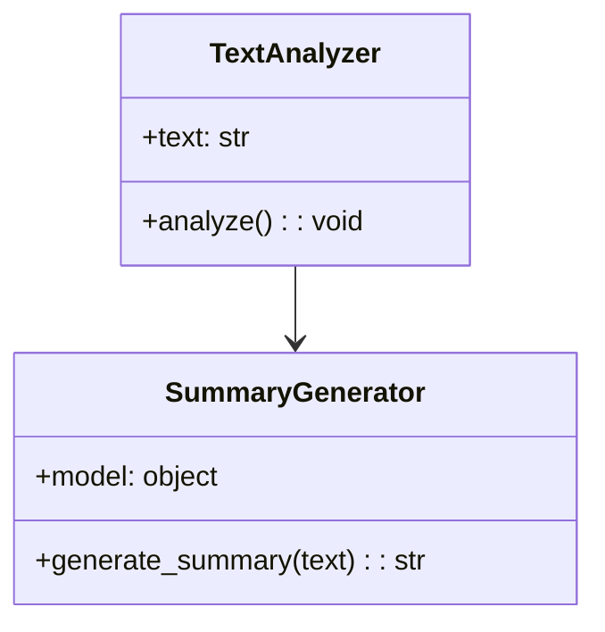
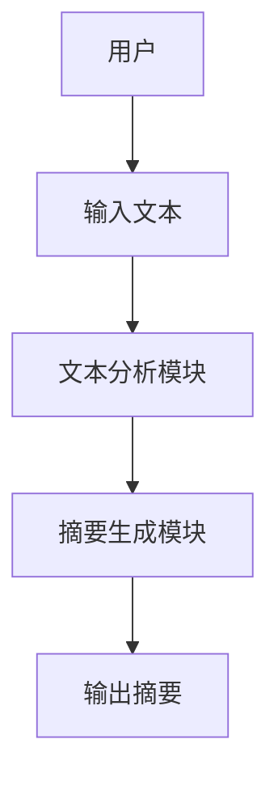
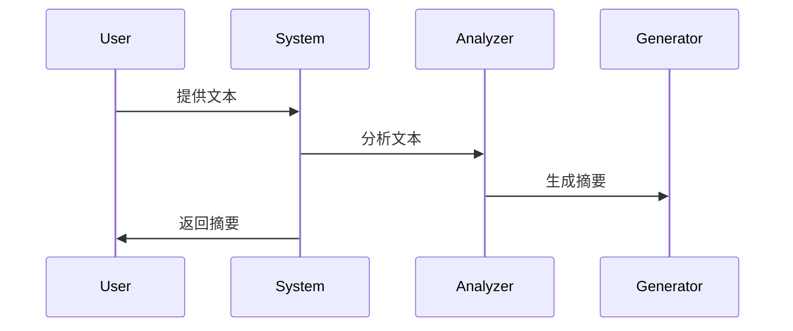

                 


# 开发具有自然语言摘要生成能力的AI Agent

## 关键词：自然语言处理、生成式AI、AI代理、文本摘要、深度学习

## 摘要：本文详细探讨了开发具有自然语言摘要生成能力的AI Agent的各个方面，从背景和核心概念到算法原理、系统架构设计、项目实战以及最佳实践，为读者提供全面的指导。

---

# 第一部分: 自然语言摘要生成与AI Agent概述

## 第1章: 自然语言摘要生成与AI Agent概述

### 1.1 问题背景与描述
#### 1.1.1 自然语言处理的现状与挑战
- 自然语言处理（NLP）的目标是让计算机能够理解和生成人类语言。
- 当前挑战包括语义理解、上下文依赖和多语言支持。
- 自动摘要生成的需求日益增长，特别是在信息爆炸的时代。

#### 1.1.2 自动摘要生成的需求与应用场景
- **需求分析**：用户希望快速获取文本的核心信息。
- **应用场景**：新闻摘要、学术论文总结、会议记录生成等。
- **案例分析**：例如，用户可能需要快速阅读一篇长文章并获取关键信息。

#### 1.1.3 AI Agent在自然语言处理中的角色
- AI Agent作为中介，连接用户与信息。
- 它能够理解用户需求，生成自然语言摘要。
- 实现人机交互的自然对话，提升用户体验。

### 1.2 问题解决与边界
#### 1.2.1 自动摘要生成的核心问题
- 如何提取文本的关键信息？
- 如何生成连贯且简洁的摘要？
- 如何处理多语言和领域特定的问题？

#### 1.2.2 AI Agent的边界与功能范围
- 界定AI Agent的功能，如摘要生成、信息检索等。
- 确定AI Agent的使用场景和用户权限。
- 设定处理文本的长度和复杂度限制。

#### 1.2.3 自然语言摘要生成的边界条件
- 最大文本长度限制。
- 支持的自然语言类型（如中文、英文）。
- 处理的文本领域范围（如科技、医疗）。

### 1.3 核心概念与结构
#### 1.3.1 自然语言摘要生成的定义与组成
- 定义：将长文本转换为简短、连贯的摘要。
- 组成部分：文本分析、信息提取、摘要生成。

#### 1.3.2 AI Agent的系统架构与要素
- 系统架构：包括输入处理、摘要生成、输出展示。
- 关键要素：自然语言理解模块、生成模块、交互界面。

#### 1.3.3 核心概念之间的关系与依赖
- 信息提取依赖于NLP技术。
- 摘要生成依赖于生成模型。
- AI Agent依赖于用户输入和系统反馈。

### 1.4 本章小结
- 介绍了自然语言摘要生成的背景和需求。
- 解释了AI Agent在其中的作用和功能。
- 明确了核心概念和系统架构。

---

# 第二部分: 核心概念与联系

## 第2章: 自然语言处理与生成原理

### 2.1 自然语言处理的核心原理
#### 2.1.1 语言模型的基本原理
- 语言模型的目标是预测下一个词。
- 常见模型包括n-gram和Transformer。

#### 2.1.2 Transformer架构的介绍
- Transformer结构：编码器和解码器。
- 注意力机制：捕捉词与词之间的关系。

#### 2.1.3 注意力机制的作用
- 通过权重计算，确定每个词的重要性。
- 提高模型的上下文理解能力。

### 2.2 自然语言生成的原理
#### 2.2.1 基于生成对抗网络的生成方法
- GAN模型：生成器和判别器的对抗训练。
- 生成器学习生成逼真的文本。

#### 2.2.2 基于Transformer的解码器结构
- 解码器：逐步生成文本。
- 自注意力机制：捕捉生成文本的内部关系。

#### 2.2.3 梯度下降与损失函数优化
- 使用交叉熵损失函数。
- 通过反向传播优化模型参数。

### 2.3 自然语言处理与生成的对比分析
#### 2.3.1 对比表格：NLP与NLG的主要区别
| 特性 | NLP | NLG |
|------|-----|-----|
| 输入 | 文本 | 模糊指令 |
| 输出 | 分析结果 | 生成文本 |
| 主要任务 | 理解 | 生成 |

#### 2.3.2 ER实体关系图：系统核心要素关系


## 第3章: 自然语言摘要生成的算法原理

### 3.1 摘要生成算法概述
#### 3.1.1 基于提取式摘要的算法
- 提取关键句子或词语。
- 常见方法：基于TF-IDF和文本排名。

#### 3.1.2 基于生成式摘要的算法
- 使用生成模型（如GPT）生成摘要。
- 优点：灵活性高，可处理长文本。

#### 3.1.3 深度学习模型的应用
- 使用预训练模型（如BERT、GPT）进行微调。

### 3.2 摘要生成的数学模型
#### 3.2.1 编码器-解码器模型的数学表示
- 编码器将输入文本转换为向量表示。
- 解码器根据向量生成目标摘要。

#### 3.2.2 注意力机制的公式推导
- 注意力权重计算公式：
  $$\text{Attention}(Q,K,V) = \text{softmax}\left(\frac{QK^T}{\sqrt{d_k}}\right)V$$

#### 3.2.3 损失函数的计算与优化
- 使用交叉熵损失函数：
  $$\mathcal{L} = -\sum_{i=1}^{n} y_i \log p(y_i|x)$$

### 3.3 算法实现与代码示例
#### 3.3.1 使用Python实现的摘要生成器
```python
import torch
import torch.nn as nn

class SimpleGenerator(nn.Module):
    def __init__(self, input_size, hidden_size, output_size):
        super(SimpleGenerator, self).__init__()
        self.encoder = nn.Embedding(input_size, hidden_size)
        self.decoder = nn.Linear(hidden_size, output_size)
    
    def forward(self, input):
        encoded = self.encoder(input)
        decoded = self.decoder(encoded)
        return decoded
```

#### 3.3.2 模型训练的代码框架
```python
def train(model, optimizer, criterion, inputs, targets):
    outputs = model(inputs)
    loss = criterion(outputs, targets)
    loss.backward()
    optimizer.step()
    return loss.item()
```

#### 3.3.3 模型推理的代码实现
```python
def generate_summary(model, tokenizer, text):
    input_tensor = tokenizer(text, padding=True, return_tensors='pt')
    summary = model.generate(input_tensor.input_ids)
    return tokenizer.decode(summary[0])
```

---

# 第三部分: 系统分析与架构设计

## 第4章: 系统分析与架构设计

### 4.1 问题场景介绍
#### 4.1.1 用户需求分析
- 用户希望快速获取文本摘要。
- 用户可能需要多语言支持。

#### 4.1.2 系统功能需求
- 支持文本输入和摘要生成。
- 提供多种摘要风格（简洁、详细）。

#### 4.1.3 约束条件与边界条件
- 文本长度限制：不超过5000字。
- 支持语言：中文、英文。

### 4.2 系统功能设计
#### 4.2.1 领域模型类图


#### 4.2.2 系统架构设计图


#### 4.2.3 系统接口设计
- 输入接口：文本字符串。
- 输出接口：摘要字符串。

### 4.3 系统交互设计
#### 4.3.1 序列图：用户与系统的交互流程


---

# 第四部分: 项目实战

## 第5章: 项目实战

### 5.1 环境安装与配置
- 安装Python和相关库（如TensorFlow、PyTorch）。
- 安装自然语言处理库（如spaCy、NLTK）。

### 5.2 系统核心实现
#### 5.2.1 摘要生成器的实现
```python
from transformers import GPT2Tokenizer, GPT2LMHeadModel

tokenizer = GPT2Tokenizer.from_pretrained('gpt2')
model = GPT2LMHeadModel.from_pretrained('gpt2')

def generate_summary(text):
    inputs = tokenizer(text, return_tensors='pt')
    outputs = model.generate(**inputs)
    summary = tokenizer.decode(outputs[0], skip_special_tokens=True)
    return summary
```

#### 5.2.2 信息提取模块的实现
```python
import spacy

nlp = spacy.load('en_core_web_sm')

def extract_entities(text):
    doc = nlp(text)
    entities = [ent.text for ent in doc.ents]
    return entities
```

### 5.3 项目分析与总结
- 项目实现的关键点。
- 经验与教训。
- 性能优化建议。

---

# 第五部分: 最佳实践

## 第6章: 最佳实践

### 6.1 小结
- 总结全文内容。
- 强调AI Agent在自然语言处理中的重要性。

### 6.2 注意事项
- 数据质量和多样性的重要性。
- 模型的可解释性和透明度。

### 6.3 拓展阅读
- 推荐相关书籍和论文。
- 提供在线资源和工具链接。

---

# 作者：AI天才研究院/AI Genius Institute & 禅与计算机程序设计艺术 /Zen And The Art of Computer Programming

