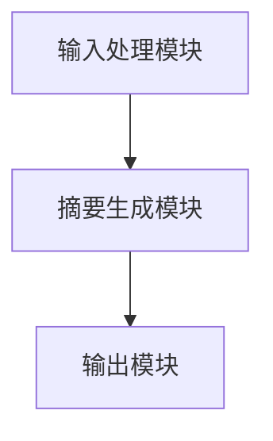

                 


# 开发具有自然语言摘要能力的AI Agent

> 关键词：AI Agent，自然语言处理，文本摘要，机器学习，系统架构

> 摘要：本文详细探讨了开发具有自然语言摘要能力的AI Agent的各个方面，从基础的自然语言处理概念到复杂的系统架构设计，结合实际案例和算法实现，帮助读者全面掌握相关技术。

---

## 第1章：AI Agent与自然语言处理概述

### 1.1 AI Agent的基本概念

#### 1.1.1 什么是AI Agent
AI Agent（人工智能代理）是指能够感知环境并采取行动以实现目标的智能实体。它可以是一个软件程序，也可以是一个物理设备，通过与用户或环境交互来完成特定任务。

#### 1.1.2 AI Agent的核心功能
AI Agent的核心功能包括：
1. **感知**：通过传感器或用户输入获取信息。
2. **推理**：利用逻辑推理或机器学习模型处理信息。
3. **决策**：基于推理结果做出最优决策。
4. **行动**：执行决策以实现目标。

#### 1.1.3 自然语言处理在AI Agent中的作用
自然语言处理（NLP）是AI Agent与人类交互的关键技术，负责理解用户的自然语言输入并生成相应的自然语言输出。

---

### 1.2 自然语言摘要的定义与应用

#### 1.2.1 自然语言摘要的定义
自然语言摘要是指从一段或多段文本中自动生成一段简洁的摘要，准确捕捉原文的核心信息。

#### 1.2.2 自然语言摘要的应用场景
1. **信息提取**：从大量文本中提取关键信息。
2. **内容生成**：自动生成新闻标题、产品描述等。
3. **辅助阅读**：帮助用户快速理解长文本内容。

#### 1.2.3 自然语言摘要与AI Agent的结合
AI Agent可以通过自然语言摘要技术，为用户提供简洁的信息反馈，提升交互效率。

---

### 1.3 本书的核心目标

#### 1.3.1 开发具有自然语言摘要能力的AI Agent的目标
本书旨在帮助读者掌握开发具有自然语言摘要能力的AI Agent所需的技术和方法，从理论到实践进行全面讲解。

#### 1.3.2 本书的主要内容
- 自然语言处理基础
- 文本摘要算法
- AI Agent的核心算法
- 系统架构设计
- 实战项目实现

#### 1.3.3 读者对象与预期收获
- 读者对象：AI开发者、NLP工程师、软件架构师
- 预期收获：掌握AI Agent的自然语言摘要开发能力，能够独立开发相关系统。

---

## 第2章：自然语言处理基础

### 2.1 语言模型的基本概念

#### 2.1.1 什么是语言模型
语言模型是用于预测文本序列概率的模型，广泛应用于机器翻译、语音识别和文本摘要等领域。

#### 2.1.2 语言模型的分类
1. **基于统计的语言模型**：如n-gram模型。
2. **基于深度学习的语言模型**：如RNN、LSTM、Transformer。

#### 2.1.3 语言模型的应用
- 机器翻译
- 文本生成
- 文本摘要

---

### 2.2 文本预处理与分词

#### 2.2.1 文本预处理的重要性
文本预处理是NLP任务的基础，包括去除停用词、分词、词干提取等。

#### 2.2.2 中文分词的实现
- 使用`jieba`库进行中文分词：
  ```python
  import jieba
  text = "这是一个测试文本"
  words = jieba.lcut(text)
  print(words)  # 输出：['这是', '一个', '测试', '文本']
  ```

#### 2.2.3 常见的文本分词工具
- `jieba`
- `word2vec`
- `spaCy`

---

### 2.3 词向量与文本表示

#### 2.3.1 词向量的定义
词向量是将词语表示为高维向量的技术，常用方法包括Word2Vec、GloVe、BERT。

#### 2.3.2 文本表示的实现
使用Word2Vec模型生成词向量：
```python
from gensim.models import Word2Vec
sentences = ["这是一个测试文本"]
model = Word2Vec(sentences, vector_size=100, window=5, min_count=1, workers=4)
```

---

## 第3章：文本摘要算法

### 3.1 基于长度的摘要算法

#### 3.1.1 简单截断法
直接截取文本的前N个词或句子，适用于快速生成摘要。

#### 3.1.2 前N个重要句子
基于文本的重要性评分，选择前N个重要句子生成摘要。

---

### 3.2 基于语言模型的摘要算法

#### 3.2.1 语言模型的摘要原理
利用语言模型生成概率最高的文本序列作为摘要。

#### 3.2.2 优化算法
使用贪心算法或动态规划优化摘要生成过程。

---

### 3.3 基于Transformer的摘要模型

#### 3.3.1 Transformer模型概述
Transformer模型由编码器和解码器组成，广泛应用于文本摘要任务。

#### 3.3.2 Transformer模型的数学公式
编码器中的多头注意力机制：
$$
\text{Attention}(Q, K, V) = \text{softmax}\left(\frac{QK^T}{\sqrt{d_k}}\right)V
$$

---

## 第4章：AI Agent的核心算法

### 4.1 对话管理算法

#### 4.1.1 对话状态跟踪
使用状态机或深度学习模型跟踪对话上下文。

#### 4.1.2 响应生成
基于对话历史生成合适的回复，常用的技术包括Seq2Seq模型和Transformer模型。

---

### 4.2 知识图谱构建

#### 4.2.1 知识图谱的定义
知识图谱是一种结构化的知识表示形式，用于存储实体及其关系。

#### 4.2.2 知识图谱的构建流程
1. **信息抽取**：从文本中提取实体和关系。
2. **实体链接**：将实体映射到知识库中的概念。
3. **知识融合**：整合多源数据构建知识图谱。

---

## 第5章：系统架构设计

### 5.1 系统模块划分

#### 5.1.1 模块划分
- **输入处理模块**：接收用户输入并进行预处理。
- **摘要生成模块**：生成文本摘要。
- **输出模块**：将摘要返回给用户。

#### 5.1.2 模块交互流程
1. 用户输入自然语言查询。
2. 输入处理模块进行分词和词向量化。
3. 摘要生成模块生成摘要并返回结果。

---

### 5.2 系统架构图



---

## 第6章：项目实战

### 6.1 环境配置

#### 6.1.1 安装依赖库
- Python 3.8+
- TensorFlow 2.0+
- Keras
- jieba

#### 6.1.2 安装命令
```bash
pip install tensorflow keras jieba
```

---

### 6.2 核心实现

#### 6.2.1 摘要生成代码
```python
from tensorflow.keras.models import Model
from tensorflow.keras.layers import Input, LSTM, Dense

# 定义编码器和解码器
encoder_inputs = Input(shape=(None, input_dim))
encoder_lstm = LSTM(units=latent_dim, return_sequences=True, return_state=True)
encoder_outputs, state_h, state_c = encoder_lstm(encoder_inputs)
encoder_states = [state_h, state_c]

decoder_inputs = Input(shape=(None, output_dim))
decoder_lstm = LSTM(units=latent_dim, return_sequences=True, return_state=True)
decoder_outputs, _, _ = decoder_lstm(decoder_inputs, initial_state=encoder_states)
decoder_dense = Dense(units=output_dim, activation='softmax')(decoder_outputs)

model = Model(inputs=[encoder_inputs, decoder_inputs], outputs=decoder_outputs)
model.compile(...)
```

---

## 第7章：高级话题与未来展望

### 7.1 多语言摘要

#### 7.1.1 多语言摘要的挑战
支持多种语言的文本摘要需要处理不同语言的语法和语义差异。

#### 7.1.2 解决方案
使用跨语言的预训练模型，如多语言BERT。

---

### 7.2 生成式AI与自然语言摘要

#### 7.2.1 生成式AI的定义
生成式AI是指能够生成新内容的人工智能技术。

#### 7.2.2 在摘要中的应用
利用生成式AI技术生成更自然、流畅的摘要内容。

---

## 第8章：总结与展望

### 8.1 全书总结
本文详细介绍了开发具有自然语言摘要能力的AI Agent的各个方面，从基础的自然语言处理技术到复杂的系统架构设计，帮助读者全面掌握相关知识。

### 8.2 未来展望
随着生成式AI和大语言模型的发展，AI Agent的自然语言摘要能力将更加智能化和多样化。

---

## 附录

### 附录A：参考文献
- 王军, 李明. 《自然语言处理入门》. 北京: 人民邮电出版社, 2020.
- Smith, J. 《Deep Learning for NLP》. Springer, 2019.

### 附录B：工具与库
- TensorFlow: [https://tensorflow.org](https://tensorflow.org)
- Keras: [https://keras.io](https://keras.io)
- jieba: [https://github.com/fh13/jieba](https://github.com/fh13/jieba)

---

## 作者：AI天才研究院 & 禅与计算机程序设计艺术

---

希望这篇文章能够为读者提供全面的指导，帮助他们开发出具有自然语言摘要能力的AI Agent！

