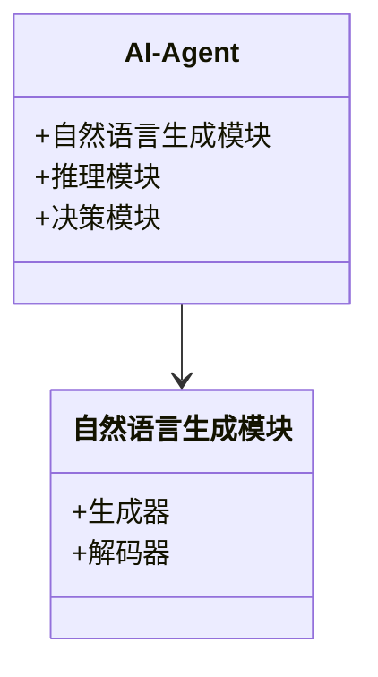
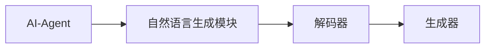

                 


# 开发具有自然语言生成能力的AI Agent

## 关键词：AI Agent、自然语言生成、深度学习、生成式AI、对话系统、文本生成、语言模型

## 摘要：  
本文将详细介绍如何开发具有自然语言生成能力的AI Agent。从核心概念到算法原理，从系统架构设计到项目实战，我们将全面解析AI Agent中的自然语言生成技术。通过深入分析生成式模型、系统架构设计以及实际案例，帮助读者掌握开发AI Agent所需的关键技能。

---

## # 第一部分: 引言

## # 第1章: AI Agent与自然语言生成概述

### ## 1.1 AI Agent的基本概念

#### ### 1.1.1 什么是AI Agent？

AI Agent（人工智能代理）是一种能够感知环境、自主决策并执行任务的智能实体。它可以是一个软件程序，也可以是一个物理设备，通过传感器和执行器与环境交互。AI Agent的核心目标是通过智能算法实现特定任务，如信息处理、决策支持或自动化操作。

**关键术语：**  
- **感知（Perception）：** AI Agent通过传感器或数据输入接口获取环境信息。
- **推理（Reasoning）：** 基于获取的信息进行逻辑推理，做出决策。
- **行动（Action）：** 根据推理结果执行动作，改变环境或输出结果。

#### ### 1.1.2 AI Agent的类型

AI Agent可以根据功能、智能水平或应用场景分为多种类型：

| 类型                | 描述                                           | 示例应用                           |
|---------------------|-----------------------------------------------|------------------------------------|
| **基于规则的Agent** | 通过预定义的规则进行决策，适用于简单任务。     | 自动化脚本、简单的对话系统         |
| **基于模型的Agent** | 使用数学模型进行推理，适用于复杂任务。         | 自然语言处理、推荐系统             |
| **强化学习Agent**   | 通过与环境交互学习，优化决策策略。             | 游戏AI、机器人控制                 |
| **混合型Agent**     | 结合多种方法，适用于复杂多变的任务。           | 自动驾驶、智能助手                 |

#### ### 1.1.3 自然语言生成的定义与作用

自然语言生成（Natural Language Generation, NLG）是AI Agent中的一个关键功能，指机器能够自动生成人类可读的文本。NLG技术广泛应用于对话系统、内容生成、数据可视化等领域。

**关键术语：**  
- **生成式AI（Generative AI）：** 基于大量数据生成新内容的技术，如文本、图像等。
- **上下文感知（Context-Aware）：** 生成的内容能够根据上下文调整语气和内容。

---

### ## 1.2 AI Agent与自然语言生成的结合

#### ### 1.2.1 AI Agent中的自然语言生成需求

AI Agent需要与用户进行自然语言交互，这要求其具备生成自然语言的能力。例如，在智能客服系统中，AI Agent需要能够理解用户的问题并生成自然的回复。

#### ### 1.2.2 自然语言生成在AI Agent中的应用场景

| 场景                | 描述                                           | 示例应用                           |
|---------------------|-----------------------------------------------|------------------------------------|
| **对话系统**         | AI Agent与用户进行实时对话，生成自然语言回复。 | 智能音箱、聊天机器人               |
| **内容生成**         | 根据输入生成文章、报告或其他文本内容。         | 自动写作工具、新闻摘要生成         |
| **数据解释**         | 将复杂数据转化为易于理解的文本描述。           | 数据可视化工具、数据分析报告       |
| **多语言支持**       | 生成多种语言的文本，满足国际化需求。             | 多语言客服系统、国际电商平台       |

#### ### 1.2.3 当前技术的挑战与未来方向

当前，自然语言生成技术面临以下挑战：  
1. **生成质量：** 如何生成连贯、准确且符合上下文的文本。  
2. **多语言支持：** 针对不同语言的生成模型需要独立训练和优化。  
3. **实时性：** 在高并发场景下，生成速度和效率是关键。  

未来，随着生成式AI的发展，AI Agent将更加智能化，能够理解情感、语气，并生成更具人性化的文本。

---

## # 第二部分: 自然语言生成的核心概念与原理

## # 第2章: 自然语言生成的实现原理

### ## 2.1 自然语言生成的流程

#### ### 2.1.1 数据准备与预处理

**数据预处理步骤：**  
1. **清洗数据：** 去除无效数据、填充缺失值。  
2. **分词与标注：** 将文本数据进行分词处理，并进行词性标注。  
3. **构建语料库：** 将预处理后的数据组织成语料库，用于模型训练。

#### ### 2.1.2 模型训练与优化

**训练流程：**  
1. **选择模型架构：** 如Transformer、GPT等。  
2. **定义损失函数：** 如交叉熵损失。  
3. **优化器选择：** 如Adam优化器。  
4. **训练数据输入：** 批量输入训练数据，更新模型参数。  

#### ### 2.1.3 生成过程与输出调整

**生成过程：**  
1. **输入处理：** 将输入文本转换为模型可接受的格式。  
2. **解码生成：** 使用解码器生成候选文本。  
3. **输出优化：** 对生成的文本进行后处理，如语法校正、语气调整。

---

### ## 2.2 常见的自然语言生成模型

#### ### 2.2.1 基于规则的生成模型

**工作原理：**  
通过预定义的规则和模板生成文本，适用于简单的生成任务。

**优缺点：**  
- **优点：** 易于实现，生成文本可控。  
- **缺点：** 生成内容缺乏灵活性，难以处理复杂场景。

#### ### 2.2.2 统计模型与机器学习模型

**工作原理：**  
基于统计学习或机器学习算法，从大量数据中学习生成规律。

**优缺点：**  
- **优点：** 生成文本质量较高，适用于复杂场景。  
- **缺点：** 需要大量数据和计算资源。

#### ### 2.2.3 基于深度学习的生成模型

**工作原理：**  
使用深度学习模型（如Transformer、LSTM）生成文本。

**优缺点：**  
- **优点：** 生成文本质量高，适用于多种场景。  
- **缺点：** 训练和推理成本较高。

---

### ## 2.3 自然语言生成的关键技术

#### ### 2.3.1 语言模型与生成式AI

**语言模型的作用：**  
语言模型用于预测下一个词，是自然语言生成的基础。

**生成式AI的作用：**  
生成式AI通过学习数据分布，生成多样化的文本内容。

#### ### 2.3.2 解码器与编码器的结合

**解码器的作用：**  
解码器负责将输入转换为输出，如将输入的自然语言转换为生成的文本。

**编码器的作用：**  
编码器用于处理输入，提取关键特征。

#### ### 2.3.3 多模态生成的实现

**多模态生成的定义：**  
同时处理多种数据类型（如文本、图像）的生成任务。

**实现方法：**  
使用多模态模型，如将图像特征与文本特征结合，生成相关文本。

---

## # 第三部分: 自然语言生成的算法原理

## # 第3章: 自然语言生成的核心算法

### ## 3.1 基于Transformer的生成模型

#### ### 3.1.1 Transformer模型的结构

**Transformer模型的核心组件：**  
1. **编码器（Encoder）：** 多头自注意力机制，用于处理输入序列。  
2. **解码器（Decoder）：** 多头自注意力机制，用于生成输出序列。  

**数学公式：**  
$$\text{Attention}(Q,K,V) = \text{softmax}(\frac{QK^T}{\sqrt{d}})V$$  

**图形表示：**  
```mermaid
graph LR
    Encoder -> Attention -> Output
    Decoder -> Attention -> Output
```

---

### ## 3.2 GPT模型的实现

#### ### 3.2.1 GPT模型的工作原理

**GPT模型的核心思想：**  
通过预测下一个词的概率分布，生成连贯的文本。

#### ### 3.2.2 GPT模型的训练过程

**训练步骤：**  
1. **输入处理：** 将输入文本转化为模型可接受的格式。  
2. **损失计算：** 使用交叉熵损失函数计算损失。  
3. **反向传播：** 使用梯度下降优化模型参数。  

---

## # 第四部分: AI Agent的系统架构设计

## # 第4章: AI Agent的系统架构

### ## 4.1 系统功能设计

#### ### 4.1.1 领域模型设计

**领域模型的定义：**  
领域模型描述了系统中的核心实体及其关系。

**领域模型示例：**  


#### ### 4.1.2 系统架构设计

**系统架构设计：**  


#### ### 4.1.3 接口设计

**系统接口设计：**  
1. **输入接口：** 接收用户的输入文本。  
2. **输出接口：** 输出生成的自然语言文本。  

#### ### 4.1.4 交互流程

**交互流程：**  
1. **用户输入：** 用户输入自然语言查询。  
2. **数据预处理：** 对输入数据进行预处理。  
3. **模型生成：** 生成自然语言回复。  
4. **输出结果：** 将生成的文本返回给用户。

---

## # 第五部分: 项目实战

## # 第5章: 自然语言生成的项目实战

### ## 5.1 项目环境安装

**安装步骤：**  
1. 安装Python和必要的库（如TensorFlow、Keras）。  
2. 下载预训练的自然语言生成模型。  

### ## 5.2 系统核心实现

#### ### 5.2.1 代码实现

**代码示例：**  
```python
import tensorflow as tf
from tensorflow.keras.layers import Dense, Input, Dropout
from tensorflow.keras.models import Model

# 定义模型输入
input_layer = Input(shape=(128,))

# 编码器
x = Dense(256, activation='relu')(input_layer)
x = Dropout(0.5)(x)
x = Dense(128, activation='relu')(x)

# 解码器
x = Dense(128, activation='relu')(x)
x = Dropout(0.5)(x)
output_layer = Dense(10, activation='softmax')(x)

model = Model(inputs=input_layer, outputs=output_layer)
model.compile(optimizer='adam', loss='sparse_categorical_crossentropy', metrics=['accuracy'])
```

---

## # 第六部分: 总结与展望

## # 第6章: 总结与展望

### ## 6.1 本章总结

本文详细介绍了AI Agent中的自然语言生成技术，从核心概念到算法原理，从系统架构设计到项目实战，帮助读者系统地掌握了相关知识。

### ## 6.2 未来展望

随着生成式AI的不断发展，AI Agent将具备更强的自然语言生成能力，实现更加智能化和人性化的交互。

---

## 作者：AI天才研究院/AI Genius Institute & 禅与计算机程序设计艺术 /Zen And The Art of Computer Programming

---

通过以上目录大纲和内容的详细规划，我们可以看到，文章将从多个方面系统地介绍如何开发具有自然语言生成能力的AI Agent，涵盖理论和实践，帮助读者深入理解并掌握相关技术。

