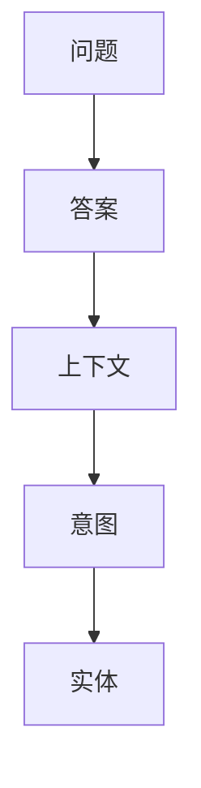
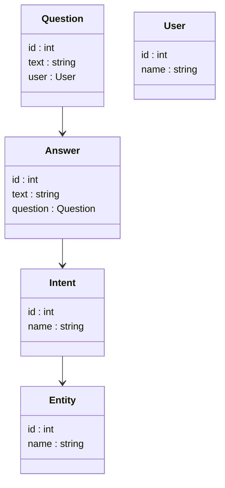

                 

# 开发具有自然语言问答能力的AI Agent

## 关键词：自然语言处理，问答系统，AI代理，深度学习，自然语言理解

## 摘要：本文详细探讨了开发具有自然语言问答能力的AI Agent的全过程，从基础概念到系统架构，从核心算法到项目实战，结合实际案例和详细代码实现，帮助读者系统掌握开发方法。

## 目录大纲：

### 第一部分: 自然语言问答与AI Agent基础

#### 第1章: 自然语言处理与问答系统概述

- 1.1 自然语言处理的基本概念
  - 1.1.1 什么是自然语言处理
  - 1.1.2 自然语言处理的核心任务
  - 1.1.3 问答系统的基本原理

- 1.2 AI Agent的定义与特点
  - 1.2.1 什么是AI Agent
  - 1.2.2 AI Agent的核心特征
  - 1.2.3 AI Agent与传统程序的区别

- 1.3 自然语言问答能力的实现基础
  - 1.3.1 从文本到问答的转换过程
  - 1.3.2 问答系统的关键技术
  - 1.3.3 AI Agent的自然语言处理能力

#### 第2章: 自然语言问答系统的核心概念

- 2.1 问题背景与问题描述
  - 2.1.1 问题背景分析
  - 2.1.2 问题描述的结构化
  - 2.1.3 问题解决的路径

- 2.2 核心概念与联系
  - 2.2.1 核心概念的原理
  - 2.2.2 核心概念的属性特征对比表格
  - 2.2.3 ER实体关系图架构的 Mermaid 流程图

#### 第3章: AI Agent的自然语言问答系统架构

- 3.1 系统功能设计
  - 3.1.1 领域模型设计

### 第二部分: 核心算法与技术实现

#### 第4章: 预训练语言模型

- 4.1 预训练语言模型的原理
  - 4.1.1 词嵌入的计算
  - 4.1.2 上下文的理解
  - 4.1.3 模型的训练

- 4.2 模型选择与优化
  - 4.2.1 模型的评估指标
  - 4.2.2 模型的调优策略
  - 4.2.3 模型的训练过程

- 4.3 模型的应用与优化
  - 4.3.1 模型的应用场景
  - 4.3.2 模型的优化方法
  - 4.3.3 模型的评估与测试

#### 第5章: 注意力机制

- 5.1 注意力机制的原理
  - 5.1.1 注意力机制的定义
  - 5.1.2 注意力机制的计算
  - 5.1.3 注意力机制的应用

- 5.2 注意力机制的实现
  - 5.2.1 编码器端的注意力机制
  - 5.2.2 解码器端的注意力机制
  - 5.2.3 注意力机制的代码实现

- 5.3 注意力机制的优化
  - 5.3.1 注意力机制的调优
  - 5.3.2 注意力机制的改进
  - 5.3.3 注意力机制的评估

#### 第6章: 序列到序列模型

- 6.1 序列到序列模型的原理
  - 6.1.1 编码器的结构
  - 6.1.2 解码器的结构
  - 6.1.3 模型的整体流程

- 6.2 序列到序列模型的实现
  - 6.2.1 模型的训练
  - 6.2.2 模型的预测
  - 6.2.3 模型的优化

- 6.3 序列到序列模型的应用
  - 6.3.1 模型的应用场景
  - 6.3.2 模型的优缺点
  - 6.3.3 模型的未来发展方向

### 第三部分: 系统架构与设计

#### 第7章: 系统架构设计

- 7.1 系统的整体架构
  - 7.1.1 系统的模块划分
  - 7.1.2 模块之间的交互
  - 7.1.3 系统的流程图

- 7.2 系统的详细设计
  - 7.2.1 数据流的设计
  - 7.2.2 模块的接口设计
  - 7.2.3 系统的交互流程

- 7.3 系统的优化与扩展
  - 7.3.1 系统的性能优化
  - 7.3.2 系统的扩展性设计
  - 7.3.3 系统的容错机制

#### 第8章: 系统接口设计

- 8.1 系统接口的定义
  - 8.1.1 接口的功能描述
  - 8.1.2 接口的输入输出
  - 8.1.3 接口的调用方式

- 8.2 系统接口的实现
  - 8.2.1 接口的代码实现
  - 8.2.2 接口的测试用例
  - 8.2.3 接口的文档编写

- 8.3 系统接口的优化
  - 8.3.1 接口的性能优化
  - 8.3.2 接口的安全性设计
  - 8.3.3 接口的版本控制

#### 第9章: 系统交互设计

- 9.1 系统交互的流程
  - 9.1.1 用户发起请求
  - 9.1.2 系统处理请求
  - 9.1.3 系统返回结果

- 9.2 系统交互的实现
  - 9.2.1 请求的解析
  - 9.2.2 请求的处理
  - 9.2.3 结果的返回

- 9.3 系统交互的优化
  - 9.3.1 交互的效率提升
  - 9.3.2 交互的用户体验优化
  - 9.3.3 交互的日志记录

### 第四部分: 项目实战与案例分析

#### 第10章: 项目实战

- 10.1 环境配置
  - 10.1.1 开发工具的安装
  - 10.1.2 依赖库的安装
  - 10.1.3 环境变量的配置

- 10.2 核心代码实现
  - 10.2.1 预训练模型的加载
  - 10.2.2 注意力机制的实现
  - 10.2.3 序列到序列模型的实现

- 10.3 系统功能测试
  - 10.3.1 单元测试的编写
  - 10.3.2 集成测试的编写
  - 10.3.3 性能测试的编写

#### 第11章: 案例分析

- 11.1 案例背景介绍
  - 11.1.1 案例的需求分析
  - 11.1.2 案例的技术选型
  - 11.1.3 案例的实现过程

- 11.2 案例的实现细节
  - 11.2.1 案例的代码实现
  - 11.2.2 案例的系统架构
  - 11.2.3 案例的交互设计

- 11.3 案例的优化与总结
  - 11.3.1 案例的优化建议
  - 11.3.2 案例的总结与反思
  - 11.3.3 案例的未来改进方向

### 第五部分: 高级主题与拓展

#### 第12章: 模型调优与优化

- 12.1 模型调优的策略
  - 12.1.1 超参数的调节
  - 12.1.2 数据增强的使用
  - 12.1.3 模型的剪枝

- 12.2 模型优化的技术
  - 12.2.1 知识蒸馏的应用
  - 12.2.2 模型压缩的方法
  - 12.2.3 模型的并行计算

- 12.3 模型优化的评估
  - 12.3.1 优化效果的评估指标
  - 12.3.2 优化过程中的监控
  - 12.3.3 优化结果的对比分析

#### 第13章: 多轮对话管理

- 13.1 多轮对话的挑战
  - 13.1.1 对话状态的管理
  - 13.1.2 对话历史的记录
  - 13.1.3 对话意图的理解

- 13.2 多轮对话的实现
  - 13.2.1 对话系统的架构设计
  - 13.2.2 对话历史的存储
  - 13.2.3 对话状态的更新

- 13.3 多轮对话的优化
  - 13.3.1 对话系统的上下文理解
  - 13.3.2 对话系统的记忆保持
  - 13.3.3 对话系统的自适应调整

#### 第14章: 系统部署与扩展

- 14.1 系统部署的步骤
  - 14.1.1 系统的打包与发布
  - 14.1.2 系统的安装与配置
  - 14.1.3 系统的运行与监控

- 14.2 系统扩展的技术
  - 14.2.1 模型的扩展
  - 14.2.2 功能的扩展
  - 14.2.3 性能的扩展

- 14.3 系统扩展的注意事项
  - 14.3.1 扩展中的潜在问题
  - 14.3.2 扩展后的测试与验证
  - 14.3.3 扩展的长期维护

### 第六部分: 附录

#### 第15章: 工具安装与使用指南

- 15.1 开发工具的安装
  - 15.1.1 Python的安装与配置
  - 15.1.2 IDE的安装与配置
  - 15.1.3 特殊工具的安装与配置

- 15.2 依赖库的安装
  - 15.2.1 NLP库的安装
  - 15.2.2 深度学习库的安装
  - 15.2.3 其他依赖库的安装

- 15.3 开发环境的配置
  - 15.3.1 环境变量的配置
  - 15.3.2 项目的初始化配置
  - 15.3.3 开发环境的优化

#### 第16章: 参考文献与拓展阅读

- 16.1 参考文献
  - 16.1.1 中文文献
  - 16.1.2 英文文献
  - 16.1.3 其他参考资料

- 16.2 拓展阅读
  - 16.2.1 自然语言处理领域的最新进展
  - 16.2.2 AI Agent的前沿研究
  - 16.2.3 相关技术的深入探讨

- 16.3 作者推荐的书籍与资源
  - 16.3.1 经典书籍推荐
  - 16.3.2 在线课程推荐
  - 16.3.3 技术博客推荐

---

作者：AI天才研究院/AI Genius Institute & 禅与计算机程序设计艺术 /Zen And The Art of Computer Programming

---

### 作者介绍：

作者：AI天才研究院/AI Genius Institute & 禅与计算机程序设计艺术 /Zen And The Art of Computer Programming

---

通过以上目录大纲，读者可以从基础概念逐步深入到系统实现，再拓展到高级主题和项目实战，系统性地掌握开发具有自然语言问答能力的AI Agent的全过程。每个章节都包含了理论、算法、设计、代码实现和优化等详细内容，确保读者能够从理论到实践，全面掌握相关技术和方法。

