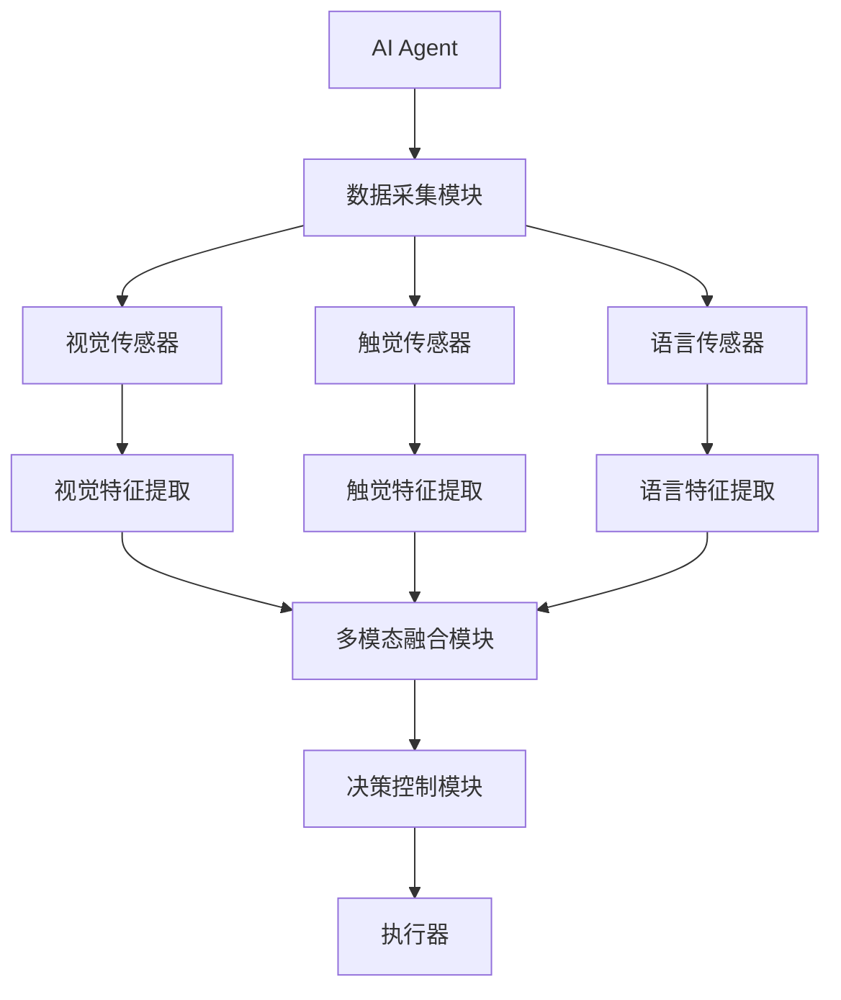

                 


# 开发具有视觉-触觉-语言多模态学习能力的AI Agent

## 关键词：
- 多模态学习
- AI Agent
- 视觉处理
- 触觉处理
- 语言处理
- 系统架构
- 项目实战

## 摘要：
本文详细探讨了开发具有视觉、触觉和语言三模态学习能力的AI Agent的关键技术。首先，介绍了多模态学习的背景及其在AI Agent中的重要性。接着，深入分析了视觉、触觉和语言信息处理的核心概念与联系，提出了三模态信息融合的算法原理。随后，详细设计了AI Agent的系统架构，包括数据处理模块、多模态融合模块和决策控制模块。最后，通过具体的项目实战案例，展示了如何实现一个多模态AI Agent，并进行了系统总结和优化建议。

---

# 第一部分: 多模态学习与AI Agent概述

## 第1章: 多模态学习的背景与意义

### 1.1 多模态学习的背景
#### 1.1.1 人工智能的发展历程
人工智能（AI）的发展经历了从符号逻辑推理到机器学习的转变，近年来，深度学习的崛起使得AI在视觉、语音和自然语言处理等领域取得了突破性进展。然而，单一模态的学习无法满足复杂场景的需求，例如机器人需要同时处理视觉、触觉和语言信息以完成复杂的任务。

#### 1.1.2 多模态学习的定义与特点
多模态学习是指AI系统能够同时处理和融合多种模态信息（如视觉、触觉、语言）来完成任务的学习方式。其特点包括信息互补性、任务相关性和模态异构性。

#### 1.1.3 多模态学习的重要性
在现实场景中，单一模态的信息往往不足以完成复杂任务。例如，机器人需要通过视觉识别物体形状，触觉感知物体材质，语言理解用户的指令。多模态学习能够显著提升AI系统的感知能力和决策能力。

### 1.2 AI Agent的基本概念
#### 1.2.1 AI Agent的定义
AI Agent是一种能够感知环境、自主决策并执行任务的智能体。它可以是一个软件程序或物理设备，通过与环境交互来实现目标。

#### 1.2.2 AI Agent的核心能力
AI Agent的核心能力包括感知能力、决策能力、学习能力和执行能力。其中，感知能力是AI Agent获取环境信息的关键，而多模态学习能够显著增强感知能力。

#### 1.2.3 多模态学习在AI Agent中的作用
通过多模态学习，AI Agent能够更全面地感知环境信息，从而做出更准确的决策。例如，在智能家居场景中，AI Agent需要通过视觉识别用户动作，触觉感知物体状态，语言理解用户指令。

### 1.3 视觉-触觉-语言三模态的结合
#### 1.3.1 视觉信息的处理
视觉信息处理主要包括图像识别、目标检测和图像分割。通过卷积神经网络（CNN），AI Agent可以提取图像中的特征信息。

#### 1.3.2 触觉信息的处理
触觉信息处理主要涉及力反馈和传感器数据。AI Agent可以通过触觉传感器感知物体的形状、材质和重量。

#### 1.3.3 语言信息的处理
语言信息处理包括自然语言理解（NLU）和自然语言生成（NLG）。通过Transformer模型，AI Agent可以理解用户的指令并生成相应的回应。

#### 1.3.4 三模态信息的融合
三模态信息的融合是多模态学习的核心。AI Agent需要将视觉、触觉和语言信息进行融合，以实现更准确的感知和决策。

---

## 第2章: 多模态学习的核心概念与联系

### 2.1 核心概念原理
#### 2.1.1 视觉信息处理的原理
视觉信息处理主要依赖于卷积神经网络（CNN）。CNN通过层次化的特征提取，能够从图像中提取出物体的形状、颜色和纹理等特征。

#### 2.1.2 触觉信息处理的原理
触觉信息处理主要依赖于物理模拟和传感器数据。AI Agent通过触觉传感器获取物体的物理特性，并通过模型模拟物体与环境的交互。

#### 2.1.3 语言信息处理的原理
语言信息处理主要依赖于自然语言处理技术（NLP）。通过词嵌入（Word Embedding）、句嵌入（Sentence Embedding）和上下文理解模型（如BERT），AI Agent可以理解和生成自然语言。

### 2.2 模态特征对比表格
| 模态类型 | 输入形式 | 输出形式 | 主要应用场景 |
|----------|----------|----------|--------------|
| 视觉     | 图像/视频 | 特征向量 | 图像识别、目标检测 |
| 触觉     | 传感器数据 | 特征向量 | 机器人控制、物体识别 |
| 语言     | 文本/语音 | 特征向量 | 机器翻译、自然语言理解 |

### 2.3 ER实体关系图
```mermaid
er
actor(AI Agent) -|-> visual_data: 处理视觉信息
actor(AI Agent) -|-> tactile_data: 处理触觉信息
actor(AI Agent) -|-> language_data: 处理语言信息
```

---

## 第3章: 多模态学习的算法原理

### 3.1 视觉信息处理算法
#### 3.1.1 卷积神经网络（CNN）
CNN通过卷积层和池化层提取图像的特征，最终将图像映射为高维特征向量。

#### 3.1.2 图像分割与目标检测算法
目标检测算法（如YOLO、Faster R-CNN）通过滑动窗口和区域建议网络，定位并识别图像中的目标。

#### 3.1.3 图像特征提取与表示
通过预训练的CNN模型（如ResNet、VGGNet），可以提取图像的高层语义特征。

### 3.2 触觉信息处理算法
#### 3.2.1 力反馈与传感器数据处理
触觉传感器数据（如力矩、加速度）通过滤波和特征提取，生成触觉特征向量。

#### 3.2.2 触觉数据融合算法
通过融合视觉和触觉特征，可以更准确地识别物体的物理特性。

### 3.3 语言信息处理算法
#### 3.3.1 自然语言理解（NLU）
NLU通过词嵌入和上下文理解模型（如BERT），将自然语言文本映射为语义向量。

#### 3.3.2 自然语言生成（NLG）
NLG通过解码器（如Transformer）生成自然语言文本。

### 3.4 多模态融合算法
#### 3.4.1 晚融合（Late Fusion）
将各模态的特征向量分别提取后，通过全连接层进行融合，生成最终的联合特征向量。

#### 3.4.2 中融合（Middle Fusion）
在特征提取过程中，将各模态的特征进行融合，生成更细粒度的特征表示。

#### 3.4.3 早融合（Early Fusion）
在初始感知阶段，将各模态的输入数据进行融合，生成统一的特征表示。

---

## 第4章: 多模态学习的系统架构设计

### 4.1 系统功能设计
AI Agent的系统功能模块包括：
- 数据采集模块：负责采集视觉、触觉和语言信息。
- 数据处理模块：对采集的数据进行预处理和特征提取。
- 多模态融合模块：将各模态的特征进行融合。
- 决策控制模块：根据融合后的特征，生成决策指令。

### 4.2 系统架构设计


### 4.3 系统接口设计
系统接口设计需要考虑各模块之间的数据交互格式和通信协议。例如，视觉传感器和触觉传感器的数据格式应与数据处理模块兼容。

### 4.4 系统交互流程图
```mermaid
sequence
    participant 用户
    participant AI Agent
    participant 执行器
    用户 -> AI Agent: 发出指令
    AI Agent -> 执行器: 发出控制指令
    执行器 -> AI Agent: 返回执行结果
    AI Agent -> 用户: 返回反馈信息
```

---

## 第5章: 项目实战

### 5.1 项目介绍
本项目旨在开发一个多模态AI Agent，能够通过视觉、触觉和语言信息，完成简单的交互任务。

### 5.2 环境安装
- 安装Python 3.8及以上版本
- 安装深度学习框架（如TensorFlow、PyTorch）
- 安装NLP处理库（如Transformers）
- 安装触觉传感器驱动

### 5.3 核心代码实现
#### 5.3.1 视觉特征提取
```python
import tensorflow as tf
from tensorflow.keras import layers

model = tf.keras.Sequential([
    layers.Conv2D(32, (3,3), activation='relu', input_shape=(224, 224, 3)),
    layers.MaxPooling2D((2,2)),
    layers.Conv2D(64, (3,3), activation='relu'),
    layers.MaxPooling2D((2,2)),
    layers.Flatten(),
    layers.Dense(128, activation='relu'),
    layers.Dense(10, activation='softmax')
])
```

#### 5.3.2 触觉特征提取
```python
import numpy as np

def process_tactile_data(data):
    # 数据预处理
    filtered_data = np.apply_along_axis(lambda x: butterworth_filter(x, order=2, cutoff=50), 0, data)
    # 特征提取
    features = np.mean(filtered_data, axis=0)
    return features
```

#### 5.3.3 语言特征提取
```python
from transformers import BertTokenizer, TFBertModel

tokenizer = BertTokenizer.from_pretrained('bert-base-chinese')
model = TFBertModel.from_pretrained('bert-base-chinese')
```

### 5.4 系统集成与测试
将各模态的特征提取模块和多模态融合模块集成到AI Agent系统中，进行功能测试和性能调优。

### 5.5 项目总结
通过本项目，我们实现了具有视觉-触觉-语言三模态学习能力的AI Agent，验证了多模态融合的有效性和系统的可行性。

---

## 第6章: 最佳实践

### 6.1 小结
多模态学习能够显著提升AI Agent的感知能力和决策能力。通过视觉、触觉和语言信息的融合，AI Agent可以更好地适应复杂场景。

### 6.2 注意事项
- 数据质量：各模态的数据质量直接影响融合效果。
- 模态权重：需要根据任务需求调整各模态的权重。
- 系统优化：多模态融合算法的计算效率和内存消耗需要优化。

### 6.3 拓展阅读
- 经典论文：《Multi-modal Deep Learning for Object Recognition》
- 技术博客：《Understanding Multi-modal Fusion in Deep Learning》

---

## 作者信息

作者：AI天才研究院/AI Genius Institute & 禅与计算机程序设计艺术 /Zen And The Art of Computer Programming

