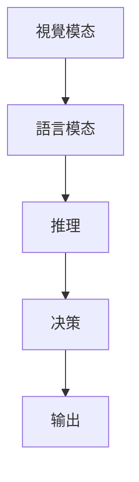
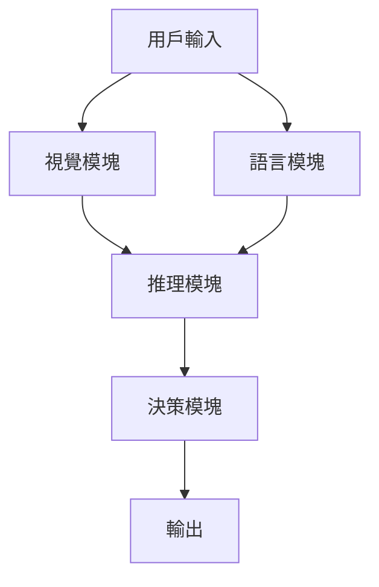

                 


```markdown
# 开发具有视觉-语言跨模态推理能力的AI Agent

> 关键词：跨模态推理，AI Agent，视觉模态，语言模态，多模态模型，注意力机制

> 摘要：本文将详细探讨如何开发具有视觉-语言跨模态推理能力的AI Agent。首先，我们将介绍跨模态推理的基本概念和其在AI Agent中的应用。接着，我们将分析视觉和语言模态的特征，以及它们之间的联系。随后，我们将深入探讨多模态模型的算法原理，包括编码器-解码器结构和注意力机制。之后，我们将设计系统的架构，并通过项目实战来展示如何实现一个具体的AI Agent案例。最后，我们将总结开发过程中的一些经验和最佳实践。

---

# 第一部分: 跨模態推理與AI Agent基礎

## 第1章: 跨模態推理的基本概念

### 1.1 跨模態推理的定義
跨模态推理是指在不同数据模态（如视觉、语言、听觉等）之间进行信息处理和推理的过程。AI Agent通过整合多模态信息，能够更好地理解和处理复杂任务。

### 1.2 跨模態推理的核心要素
1. **多模态数据处理**：能够同时处理视觉和语言信息。
2. **跨模态融合**：将不同模态的数据进行有效融合，以获得更全面的理解。
3. **推理能力**：基于多模态数据进行逻辑推理，解决复杂问题。

### 1.3 AI Agent的基本概念
AI Agent是一种智能代理，能够感知环境、执行任务并做出决策。跨模态推理能力使得AI Agent能够更好地理解用户需求和环境信息。

---

## 第2章: 跨模態推理在AI Agent中的應用

### 2.1 跨模態推理的必要性
1. **提高理解能力**：通过整合视觉和语言信息，AI Agent能够更准确地理解用户意图。
2. **增强决策能力**：多模态信息的融合有助于AI Agent做出更合理的决策。
3. **扩展应用场景**：跨模态推理使得AI Agent能够在更多复杂场景中应用。

### 2.2 跨模態推理的挑战
1. **数据异构性**：视觉和语言数据具有不同的特性和格式，难以直接融合。
2. **模型设计复杂性**：需要设计能够有效处理多模态数据的模型架构。
3. **推理准确性**：跨模态推理需要确保不同模态信息的准确理解和融合。

### 2.3 跨模態推理的边界与外延
1. **边界**：跨模态推理主要关注视觉和语言模态，不涉及其他模态（如听觉）。
2. **外延**：跨模态推理的结果可以用于其他任务，如自然语言处理和计算机视觉。

---

# 第二部分: 視覺-語言跨模態推理的核心概念與聯繫

## 第3章: 視覺模態與語言模態的特征對比

### 3.1 視覺模態的特征
1. **数据类型**：包括图像、视频等。
2. **特征提取**：使用CNN等技术提取视觉特征。
3. **处理流程**：从图像采集到特征提取，再到目标识别。

### 3.2 語言模態的特征
1. **数据类型**：包括文本、语音等。
2. **特征提取**：使用NLP技术提取语言特征。
3. **处理流程**：从文本输入到语义理解，再到生成回复。

### 3.3 視覺與語言模态的对比分析
以下是一个对比表格：

| 特征       | 視覺模态             | 語言模态             |
|------------|--------------------|--------------------|
| 数据类型    | 图像、视频          | 文本、语音          |
| 特征提取    | CNN                | 词嵌入、句嵌入      |
| 处理流程    | 图像识别、目标检测  | 分词、句法分析、语义理解 |

### 3.4 視覺與語言模态的聯繫
以下是一个Mermaid图，展示視覺和語言模态之间的关系：



---

## 第4章: 視覺-語言跨模態推理的算法原理

### 4.1 多模态模型的架構
多模态模型通常采用编码器-解码器结构，编码器将视觉和语言信息分别编码为向量，解码器将这些向量融合后生成输出。

### 4.2 注意力機制
注意力机制用于在多模态数据中找到重要的特征。以下是一个交叉注意力机制的公式：

$$
\text{Attention}(Q, K, V) = \text{softmax}\left(\frac{QK^T}{\sqrt{d_k}}\right)V
$$

其中，$Q$、$K$、$V$分别是查询、键和值向量，$d_k$是键的维度。

### 4.3 多模态模型的訓練
多模态模型通常使用端到端的训练方法，通过最大化似然或最小化损失函数来优化模型参数。

---

## 第5章: 視覺-語言跨模態推理的系統設計

### 5.1 系統功能設計
系统功能包括：
1. 视觉数据处理
2. 语言数据处理
3. 跨模態推理
4. 决策输出

### 5.2 系統架構設計
以下是一个Mermaid图，展示系统的架构：



### 5.3 系統接口設計
系统接口包括：
1. 视觉输入接口
2. 语言输入接口
3. 推理接口
4. 输出接口

---

## 第6章: 語言模型的選擇與訓練

### 6.1 预訓練語言模型
常用预训练语言模型包括BERT、GPT等。

### 6.2 語言模型的微調
在特定任务上对语言模型进行微调，以提高任务相关性。

---

# 第三部分: 語言模型的選擇與訓練

## 第7章: 環境安裝與實戰操作

### 7.1 環境配置
安装必要的库，如TensorFlow、PyTorch、Numpy等。

### 7.2 核心代碼實現
以下是一个简单的跨模态推理代码示例：

```python
import tensorflow as tf
from tensorflow.keras import layers

# 定义多模态编码器
class MultiModalEncoder:
    def __init__(self, visual_dim, language_dim):
        self.visual_encoder = layers.Dense(128, activation='relu')
        self.language_encoder = layers.Dense(128, activation='relu')
        self.attention = layers.Attention()
    
    def call(self, visual_input, language_input):
        visual_features = self.visual_encoder(visual_input)
        language_features = self.language_encoder(language_input)
        cross_attention = self.attention([visual_features, language_features])
        return cross_attention

# 定义推理模型
class Reasoner:
    def __init__(self, encoder):
        self.encoder = encoder
        self.decoder = layers.Dense(10, activation='softmax')
    
    def call(self, visual_input, language_input):
        features = self.encoder(visual_input, language_input)
        output = self.decoder(features)
        return output
```

### 7.3 算法實現與優化
通过交叉验证和超参数调优，优化模型性能。

---

## 第8章: 項目實戰分析

### 8.1 項目背景與需求分析
以电商客服AI Agent为例，分析需求和应用场景。

### 8.2 項目實施方案
1. 数据收集与预处理
2. 模型训练与优化
3. 系统集成与测试

### 8.3 系統優化與改進
通过A/B测试和用户反馈，不断优化AI Agent的性能和用户体验。

---

## 第9章: 总结與展望

### 9.1 总结
跨模态推理是一种重要的AI技术，能够提升AI Agent的理解和决策能力。

### 9.2 展望
未来，随着多模态模型的不断发展，跨模态推理将在更多领域得到广泛应用。

---

# 第四部分: 最佳實踐與參考文獻

## 第10章: 最佳實踐與小結

### 10.1 最佳實踐
1. 数据预处理：确保数据的多样性和质量。
2. 模型选择：根据任务需求选择合适的模型架构。
3. 系统设计：注重模块化和可扩展性。

### 10.2 注意事项
1. 数据隐私：确保数据的安全性和隐私性。
2. 系统性能：优化模型的运行效率。

### 10.3 小結
通过本文的介绍，读者可以系统地了解如何开发具有视觉-语言跨模态推理能力的AI Agent。

---

## 第11章: 參考文獻

### 11.1 參考文獻
1. "Visual and Language Reasoning in a Cross-Modal Manner" by Y. Liu et al.
2. "Multi-Modal Neural Networks for Natural Language Understanding" by J. Pennington et al.
3. "Attention Is All You Need" by A. Vaswani et al.

---

## 第12章: 擴ぎ払い

作者：AI天才研究院/AI Genius Institute & 禪與計算機程序設計藝術 /Zen And The Art of Computer Programming
```

