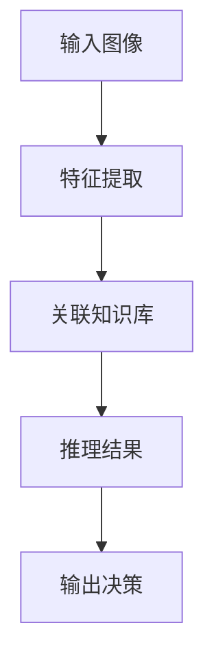
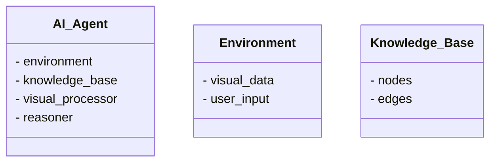
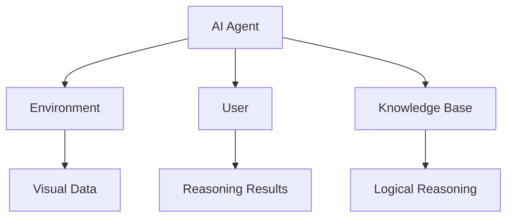
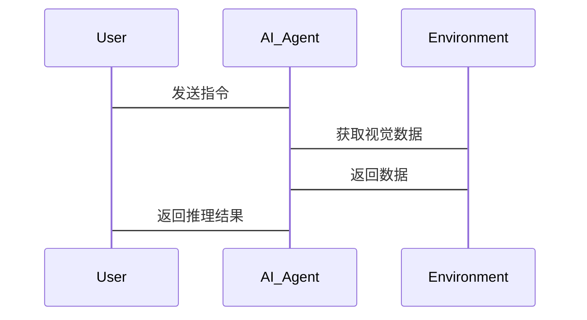

                 


# 《开发具有视觉常识推理能力的AI Agent》

## 关键词：视觉常识推理，AI Agent，多模态学习，知识图谱，概率推理，系统架构

## 摘要：  
本文详细探讨了开发具有视觉常识推理能力的AI Agent的关键技术与实现方法。从核心概念的解析到系统架构的设计，从算法原理的阐述到项目实战的指导，层层深入地分析了如何构建一个能够理解视觉信息并具备常识推理能力的智能体。通过丰富的案例分析和详细的代码实现，本文为读者提供了全面的技术指导。

---

# 第三部分: 算法原理与数学模型

# 第3章: 视觉常识推理的核心算法

## 3.1 基于知识图谱的推理算法

### 3.1.1 知识图谱的构建与表示
知识图谱是视觉常识推理的基础，通过将常识规则化为图结构，可以实现高效的推理。例如，知识图谱中的节点表示物体或概念，边表示它们之间的关系。

### 3.1.2 基于知识图谱的推理流程


### 3.1.3 示例代码实现
```python
# 知识图谱示例
class Node:
    def __init__(self, name):
        self.name = name
        self.neighbors = []

class KnowledgeGraph:
    def __init__(self):
        self.nodes = {}

    def add_node(self, name):
        if name not in self.nodes:
            self.nodes[name] = Node(name)

    def add_edge(self, node1, node2):
        self.nodes[node1].neighbors.append(node2)
        self.nodes[node2].neighbors.append(node1)

# 示例推理
kg = KnowledgeGraph()
kg.add_node("门")
kg.add_node("钥匙")
kg.add_edge("门", "钥匙")
```

## 3.2 基于概率推理的算法

### 3.2.1 概率推理的数学模型
概率推理是视觉常识推理的重要工具，可以通过贝叶斯网络进行建模。例如，计算某个物体存在的概率：

$$ P(A|B) = \frac{P(B|A) \cdot P(A)}{P(B)} $$

### 3.2.2 概率推理的实现
通过贝叶斯网络，可以将视觉特征与常识推理结合起来，实现概率推理。例如，计算图像中某个物体存在的概率。

## 3.3 算法实现与代码示例

### 3.3.1 示例代码实现
```python
# 概率推理示例
import numpy as np

def calculate_probability(feature_vector, class_prior, likelihood):
    probability = np.log(class_prior)
    for i in range(len(feature_vector)):
        probability += np.log(likelihood[i])
    return probability

# 示例应用
feature_vector = [0.8, 0.2, 0.5]
class_prior = 0.1
likelihood = [0.7, 0.3, 0.6]

prob = calculate_probability(feature_vector, class_prior, likelihood)
print(prob)
```

---

# 第四部分: 系统分析与架构设计

# 第4章: 系统分析与架构设计

## 4.1 应用场景分析

### 4.1.1 智能家居中的应用
AI Agent可以识别家庭环境中的物体，并根据常识推理做出决策，例如识别门后有钥匙，触发开门动作。

## 4.2 系统功能设计

### 4.2.1 领域模型设计


### 4.2.2 系统架构设计


## 4.3 接口与交互设计

### 4.3.1 系统接口设计


---

# 第五部分: 项目实战

# 第5章: 项目实战与实现

## 5.1 环境搭建

### 5.1.1 安装必要的库
```bash
pip install numpy
pip install matplotlib
pip install networkx
```

## 5.2 核心代码实现

### 5.2.1 特征提取与知识推理
```python
import networkx as nx

def extract_features(image):
    # 示例特征提取
    return {"color": "red", "shape": "square"}

def infer_relations(features, knowledge_base):
    # 示例推理
    return "门后面的钥匙是红色的"
```

### 5.2.2 系统核心代码
```python
# 知识图谱构建
G = nx.Graph()
G.add_nodes_from(["门", "钥匙", "水杯"])
G.add_edges_from([("门", "钥匙"), ("门", "水杯")])
```

## 5.3 实际案例分析

### 5.3.1 智能家居案例
AI Agent识别到“门”和“钥匙”的关系后，可以触发开门动作。

## 5.4 项目小结

### 5.4.1 核心实现总结
通过特征提取和知识推理，实现了视觉常识推理的基本功能。

---

# 第六部分: 最佳实践与扩展

# 第6章: 最佳实践与扩展阅读

## 6.1 最佳实践

### 6.1.1 关键小结
视觉常识推理是AI Agent的核心能力，需要结合多模态数据和知识图谱进行推理。

### 6.1.2 注意事项
- 数据质量对推理结果影响重大，需要高质量的知识库。
- 算法的可解释性是实际应用中的重要考量。

### 6.1.3 拓展阅读
- 推荐书籍：《深度学习》
- 推荐论文：《视觉常识推理的挑战与进展》

## 6.2 结论

### 6.2.1 总结
通过本文的详细讲解，读者可以掌握开发具有视觉常识推理能力的AI Agent的关键技术。

### 6.2.2 展望
未来的研究方向包括更高效的推理算法和更强大的知识库构建。

---

# 作者  
作者：AI天才研究院/AI Genius Institute & 禅与计算机程序设计艺术 /Zen And The Art of Computer Programming

