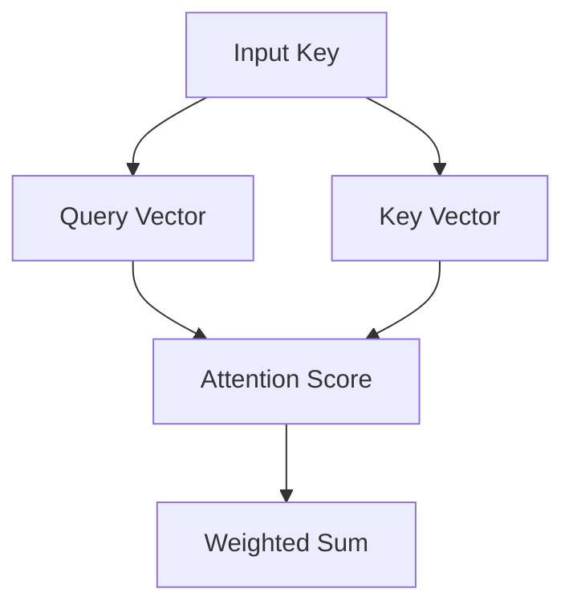
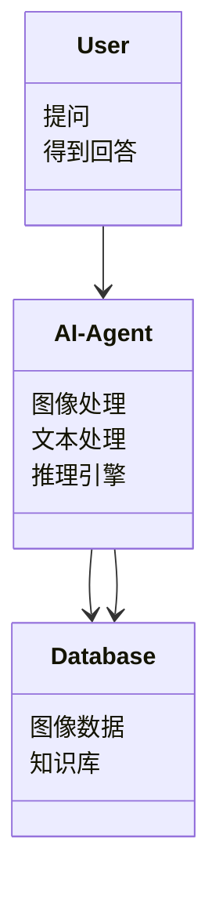
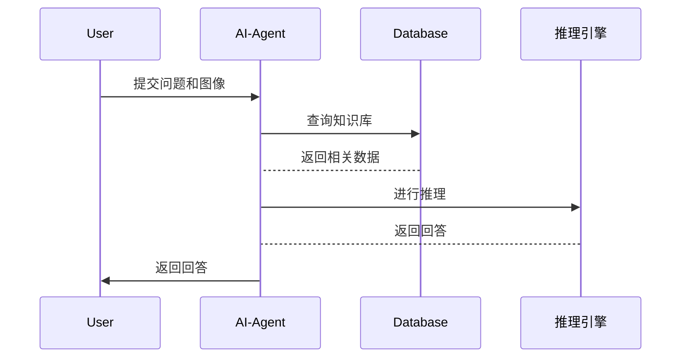

                 


# 开发具有视觉问答能力的AI Agent

> 关键词：视觉问答，AI Agent，多模态模型，注意力机制，系统架构设计，数学模型

> 摘要：本文详细探讨了开发具有视觉问答能力的AI Agent的关键技术，包括背景介绍、核心概念、算法原理、系统设计、项目实战以及高级主题。文章从理论到实践，结合实际案例，全面分析了视觉问答AI Agent的开发过程，帮助读者掌握从概念理解到实际应用的完整流程。

---

## 第一部分: 开发具有视觉问答能力的AI Agent基础

### 第1章: 背景介绍

#### 1.1 问题背景
- **当前AI Agent的发展现状**  
  AI Agent（人工智能代理）近年来取得了显著进展，尤其是在自然语言处理和计算机视觉领域。然而，现有的AI Agent大多只能处理单一模态的任务，如文本问答或图像分类，难以同时处理视觉和语言信息。
  
- **视觉问答能力的必要性**  
  视觉问答（Visual Question Answering, VQA）是一种结合了图像理解和语言理解的复杂任务，能够使AI Agent具备更强大的交互能力。例如，在医疗领域，AI Agent可以通过分析医学影像并回答相关问题，辅助医生诊断。

- **问题解决的重要性**  
  开发具有视觉问答能力的AI Agent，不仅能够提升人机交互的体验，还能在教育、医疗、安防等领域发挥重要作用。

#### 1.2 问题描述
- **视觉问答能力的定义**  
  视觉问答能力是指AI Agent能够通过分析图像内容，并结合上下文理解用户的问题，生成准确的回答。
  
- **AI Agent的定义与特点**  
  AI Agent是一种智能体，能够感知环境、理解用户需求，并通过执行任务来满足需求。其特点包括自主性、反应性、社交性和学习能力。

- **问题解决的边界与外延**  
  视觉问答能力的边界在于图像内容的理解和语言表达的准确性。外延则涉及多模态数据的融合、上下文推理以及实时性要求。

#### 1.3 核心概念与联系
- **核心概念原理**  
  视觉问答能力的核心在于多模态数据的融合和端到端模型的设计。通过将图像特征和文本特征进行融合，模型能够生成与图像内容相关的回答。

- **概念属性特征对比表格**  
  下表展示了视觉问答能力和传统问答系统的对比：

  | 特性               | 视觉问答能力       | 传统问答系统       |
  |--------------------|--------------------|--------------------|
  | 输入模态           | 图像 + 文本         | 文本                |
  | 处理能力           | 图像理解 + 语言理解 | 语言理解            |
  | 应用场景           | 医疗、教育、安防     | 通用问答            |

- **ER实体关系图架构（Mermaid流程图）**  
  ```mermaid
  erDiagram
    actor User {
      string 用户提问
      image 图像输入
    }
    agent AI-Agent {
      attribute 状态
      attribute 上下文
    }
    agent AI-Agent -- user User
    agent AI-Agent --> process Visual-Processor
    agent AI-Agent --> process Language-Processor
  ```

---

### 第2章: 核心概念与联系

#### 2.1 AI Agent与视觉问答的核心原理
- AI Agent的核心原理是通过感知环境、理解用户需求并执行任务。视觉问答能力的实现依赖于多模态数据的融合和端到端模型的设计。

#### 2.2 概念属性特征对比表格
- 与第1.3节相同，此处不再重复。

#### 2.3 ER实体关系图架构（Mermaid流程图）
- 与第1.3节相同，此处不再重复。

---

### 第3章: 算法原理讲解

#### 3.1 多模态模型的训练流程
- **数据预处理**  
  对图像进行归一化处理，并将文本问题和答案转换为数值表示。

- **模型训练**  
  使用多模态数据联合训练模型，优化目标函数以最小化预测答案与真实答案的差距。

- **模型评估**  
  通过准确率、精确率和召回率等指标评估模型的性能。

#### 3.2 视觉问答的推理过程
- **图像特征提取**  
  使用预训练的卷积神经网络（如ResNet）提取图像特征。

- **文本特征提取**  
  使用预训练的Transformer模型（如BERT）提取文本特征。

- **融合与推理**  
  将图像特征和文本特征进行融合，生成最终的答案。

#### 3.3 注意力机制的实现（Mermaid流程图）


#### 3.4 算法原理的数学模型和公式
- **注意力机制的数学公式**  
  $$\text{Attention}(Q, K, V) = \text{softmax}\left(\frac{QK^T}{\sqrt{d_k}}\right)V$$

- **多模态融合的数学模型**  
  $$F(x, y) = \sigma(W_x x + W_y y + b)$$  
  其中，$x$是图像特征，$y$是文本特征，$W_x$和$W_y$是权重矩阵，$b$是偏置项，$\sigma$是激活函数。

---

### 第4章: 系统分析与架构设计方案

#### 4.1 问题场景介绍
- 开发一个支持视觉问答的AI Agent，需要考虑图像输入、文本交互、上下文理解等多个方面。

#### 4.2 项目介绍
- 本项目旨在开发一个能够通过图像和文本交互提供问答服务的AI Agent。

#### 4.3 系统功能设计（领域模型Mermaid类图）


#### 4.4 系统架构设计（Mermaid架构图）


#### 4.5 系统接口设计
- **前端接口**  
  提供用户交互界面，接收用户输入并发送请求。

- **后端接口**  
  处理图像和文本数据，调用推理引擎生成回答。

#### 4.6 系统交互流程（Mermaid序列图）


---

### 第5章: 项目实战

#### 5.1 环境安装与配置
- 安装Python、深度学习框架（如TensorFlow或PyTorch）、NVIDIA GPU驱动和相关依赖库。

#### 5.2 系统核心实现源代码
- **数据处理代码**  
  ```python
  import numpy as np
  def preprocess_image(image):
      # 图像归一化处理
      return (image - np.mean(image)) / np.std(image)
  ```

- **模型训练代码**  
  ```python
  import torch
  class MultiModalModel(torch.nn.Module):
      def __init__(self):
          super().__init__()
          self.image_encoder = torch.nn.Linear(2048, 512)
          self.text_encoder = torch.nn.Linear(768, 512)
          self.decoder = torch.nn.Linear(512, 10)
  ```

- **推理代码**  
  ```python
  def generate_answer(image, text):
      # 提取图像特征
      image_features = image_encoder(image)
      # 提取文本特征
      text_features = text_encoder(text)
      # 融合特征
      features = torch.cat((image_features, text_features), dim=1)
      # 生成回答
      answer = decoder(features)
      return answer
  ```

#### 5.3 代码应用解读与分析
- 数据处理代码用于归一化图像数据，确保模型输入的一致性。
- 模型训练代码定义了多模态模型的结构，包括图像编码器、文本编码器和解码器。
- 推理代码实现了图像和文本特征的融合，并生成最终的回答。

#### 5.4 实际案例分析和详细讲解剖析
- **案例分析**  
  假设用户上传一张猫的图像并提问“这是什么动物？”，AI Agent需要通过图像特征提取出猫的特征，并结合文本问题生成回答“这是猫”。

#### 5.5 项目小结
- 通过项目实战，我们掌握了从数据处理到模型训练再到推理实现的完整流程。

---

### 第6章: 最佳实践 tips、小结、注意事项、拓展阅读

#### 6.1 最佳实践 tips
- 在模型训练中，建议使用预训练的权重以提升性能。
- 在推理过程中，注意图像分辨率和模型输入的兼容性。

#### 6.2 项目小结
- 本文通过理论分析和实践操作，全面介绍了开发具有视觉问答能力的AI Agent的关键技术。

#### 6.3 注意事项
- 数据预处理时，确保数据分布的均衡性。
- 模型优化时，注意防止过拟合和欠拟合。

#### 6.4 拓展阅读
- 建议进一步学习多模态模型的前沿技术，如视觉-语言预训练模型（VLP）。

---

### 第7章: 高级主题与未来趋势

#### 7.1 模型优化与调优技巧
- 使用迁移学习和数据增强技术提升模型性能。
- 通过超参数优化和模型压缩技术降低计算成本。

#### 7.2 模型部署与应用
- 将模型部署到边缘设备，实现实时推理。
- 结合云服务，构建可扩展的视觉问答系统。

#### 7.3 伦理与安全问题
- 注意数据隐私保护，避免滥用AI Agent技术。
- 建立伦理审查机制，确保技术的合理使用。

#### 7.4 未来发展趋势与研究方向
- 研究更高效的多模态融合方法。
- 探索可解释的视觉问答模型，提升用户信任度。

---

### 第8章: 数学模型和数学公式详解

#### 8.1 视觉问答模型的数学基础
- **注意力机制的数学公式**  
  $$\text{Attention}(Q, K, V) = \text{softmax}\left(\frac{QK^T}{\sqrt{d_k}}\right)V$$

- **多模态融合的数学模型**  
  $$F(x, y) = \sigma(W_x x + W_y y + b)$$

---

## 作者：AI天才研究院/AI Genius Institute & 禅与计算机程序设计艺术 /Zen And The Art of Computer Programming

