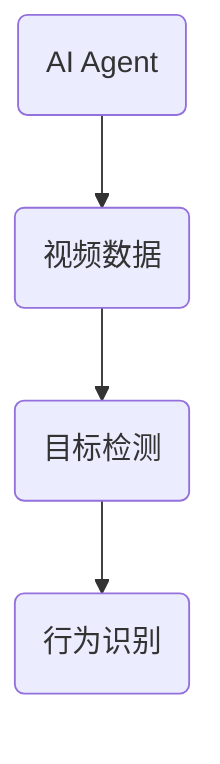
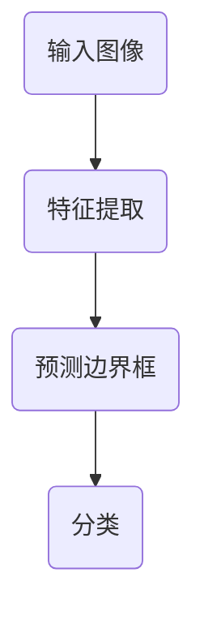
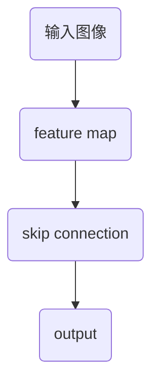
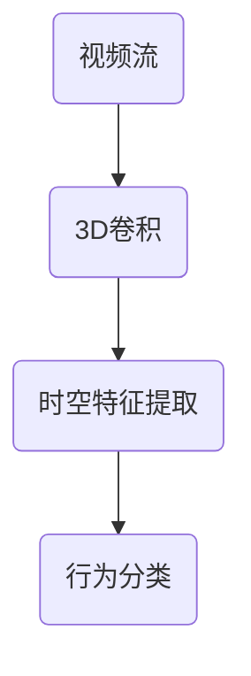
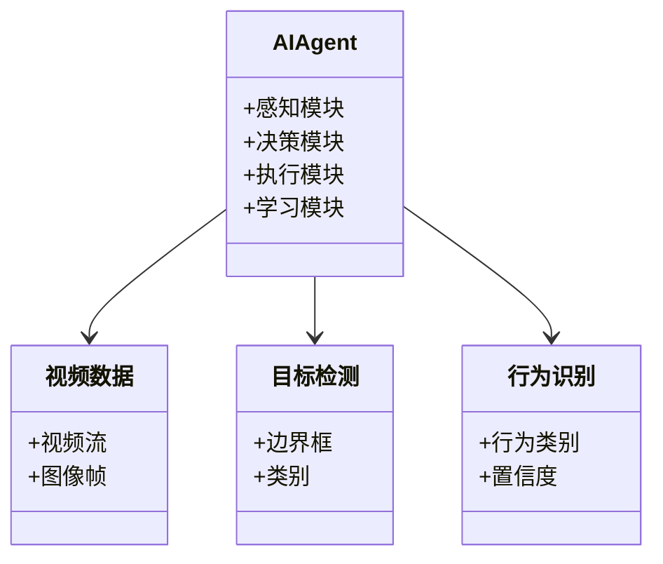
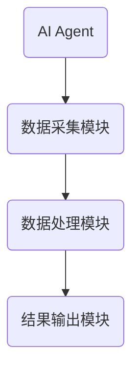

                 


# 开发具有视频分析能力的AI Agent

## 关键词
视频分析, AI Agent, 目标检测, 行为识别, 人工智能

## 摘要
开发具有视频分析能力的AI Agent是一项结合人工智能和计算机视觉的复杂任务，旨在通过自主学习和决策能力，实现对视频数据的实时处理和分析。本文从背景介绍、核心概念、算法原理、系统架构设计到项目实战，详细阐述了开发AI Agent的全过程，帮助读者全面理解视频分析的核心技术及其应用。

---

# 第一部分: 背景介绍

## 第1章: 问题背景

### 1.1 视频分析的市场需求
随着视频监控、自动驾驶和智能安防等领域的快速发展，视频分析技术的需求日益增长。传统的基于规则的视频分析系统逐渐暴露出效率低、适应性差的缺点，而AI Agent的引入为视频分析带来了智能化和自主化的解决方案。

### 1.2 AI Agent在视频分析中的优势
AI Agent具有自主决策、学习和适应能力，能够实时处理视频流数据，快速识别异常行为和潜在风险，显著提高了视频分析的准确性和效率。

### 1.3 当前视频分析技术的局限性
当前技术主要依赖于规则和模板匹配，难以应对复杂场景和动态变化的环境。AI Agent的引入能够克服这些局限性，实现更智能、更灵活的视频分析。

---

## 第2章: 问题描述

### 2.1 视频分析的核心问题
视频分析的核心问题包括目标检测、图像分割、行为识别和事件预测。这些问题需要结合计算机视觉和人工智能技术来解决。

### 2.2 AI Agent在视频分析中的目标
AI Agent的目标是通过实时分析视频数据，实现对场景中目标的识别、跟踪和行为预测，从而为用户提供智能化的决策支持。

### 2.3 视频分析与AI Agent的结合点
视频分析与AI Agent的结合点在于通过AI Agent的自主学习和决策能力，实现对视频数据的智能处理和分析，从而提高系统的智能化水平。

---

## 第3章: 问题解决

### 3.1 AI Agent的基本概念
AI Agent是一种具有自主决策和学习能力的智能体，能够根据环境输入做出决策并执行相应的动作。在视频分析中，AI Agent能够实时处理视频流数据，识别目标和行为，并做出相应的反应。

### 3.2 视频分析的基本原理
视频分析的基本原理包括图像处理、目标检测、跟踪和行为识别。通过这些技术，可以实现对视频数据的智能化分析。

### 3.3 AI Agent如何解决视频分析问题
AI Agent通过结合计算机视觉和机器学习技术，能够实现对视频数据的实时处理和分析，显著提高了视频分析的准确性和效率。

---

## 第4章: 边界与外延

### 4.1 视频分析的边界
视频分析的边界包括目标检测的精度、行为识别的准确性和系统处理能力的限制。超出这些边界的问题需要借助其他技术来解决。

### 4.2 AI Agent的边界
AI Agent的边界包括自主决策能力的限制、学习能力和环境适应能力的不足。在复杂场景中，AI Agent可能需要人类干预。

### 4.3 视频分析与AI Agent的外延
视频分析与AI Agent的外延包括与物联网、云计算和大数据分析的结合，以及在智能交通、智能安防等领域的广泛应用。

---

## 第5章: 概念结构与核心要素组成

### 5.1 视频分析的组成要素
视频分析的组成要素包括视频数据、目标检测、图像分割、行为识别和事件预测。

### 5.2 AI Agent的组成要素
AI Agent的组成要素包括感知模块、决策模块、执行模块和学习模块。

### 5.3 两者的结合关系
视频分析为AI Agent提供数据输入，AI Agent通过分析视频数据做出决策并执行相应的动作。两者结合能够实现对视频数据的智能化处理和分析。

---

## 图表展示

### 核心概念属性特征对比表格
| 概念 | 属性 | 特征 |
|------|------|------|
| AI Agent | 智能性 | 自主决策、学习能力 |
| 视频分析 | 数据处理能力 | 实时性、准确性 |

### ER实体关系图架构


---

# 第二部分: 核心概念与联系

## 第6章: 核心概念原理

### 6.1 AI Agent的核心概念原理
AI Agent通过感知环境、做出决策并执行动作来实现目标。在视频分析中，AI Agent能够实时处理视频流数据，识别目标和行为，并做出相应的反应。

### 6.2 视频分析的核心概念原理
视频分析通过图像处理、目标检测、图像分割和行为识别等技术，实现对视频数据的智能化分析。

### 6.3 两者的结合关系
AI Agent为视频分析提供智能决策能力，视频分析为AI Agent提供数据输入和应用场景。两者结合能够实现对视频数据的智能化处理和分析。

---

## 第7章: 算法原理讲解

### 7.1 目标检测算法

#### 7.1.1 YOLO算法原理
YOLO是一种基于深度学习的目标检测算法，通过单个网络直接预测目标的边界框和类别。其工作流程如下：
1. 输入图像通过特征提取网络提取特征。
2. 特征图通过预测网络生成边界框和类别概率。
3. 根据置信度筛选出目标。

#### 7.1.2 YOLO代码实现
```python
import torch
model = torch.hub.load('ultralytics/yolov5', 'yolov5s')
result = model('input.jpg')
```

#### 7.1.3 损失函数公式
YOLO的损失函数包括分类损失、定位损失和置信度损失：
$$ \text{Loss} = \lambda_c (L_{\text{class}}) + \lambda_l (L_{\text{loc}}) + \lambda_{\text{conf}} (L_{\text{conf}}) $$

### 7.2 图像分割算法

#### 7.2.1 U-Net算法原理
U-Net是一种经典的图像分割网络，通过跳跃连接实现特征的上下文聚合。其工作流程如下：
1. 输入图像通过下采样提取深层特征。
2. 深层特征通过上采样和跳跃连接恢复到原始分辨率。
3. 输出分割结果。

#### 7.2.2 U-Net代码实现
```python
def unet_model():
    import torch.nn as nn
    import torch.nn.functional as F
    class UNet(nn.Module):
        def __init__(self, in_channels=3, out_channels=1):
            super(UNet, self).__init__()
            # 网络结构定义
        def forward(self, x):
            return x
    return UNet()
```

#### 7.2.3 损失函数公式
U-Net常用的损失函数是交叉熵损失：
$$ L = -\sum_{i=1}^{n} y_i \log(p_i) + (1 - y_i) \log(1 - p_i) $$

### 7.3 行为识别算法

#### 7.3.1 3D-CNN算法原理
3D-CNN是一种基于三维卷积神经网络的行为识别算法，通过处理视频的时空特征实现行为分类。其工作流程如下：
1. 视频流通过3D卷积提取时空特征。
2. 特征通过池化和全连接层进行降维。
3. 输出行为类别。

#### 7.3.2 3D-CNN代码实现
```python
import torch
class ThreeDCNN(torch.nn.Module):
    def __init__(self):
        super(ThreeDCNN, self).__init__()
        # 网络结构定义
    def forward(self, x):
        return x
model = ThreeDCNN()
```

#### 7.3.3 损失函数公式
3D-CNN常用的损失函数是交叉熵损失：
$$ L = -\sum_{i=1}^{n} y_i \log(p_i) + (1 - y_i) \log(1 - p_i) $$

---

## 图表展示

### YOLO算法流程图


### U-Net网络结构图


### 3D-CNN网络结构图


---

## 第三部分: 系统分析与架构设计

## 第8章: 项目介绍与系统功能设计

### 8.1 项目介绍
本项目旨在开发一个具有视频分析能力的AI Agent，能够实时处理视频流数据，实现目标检测、图像分割和行为识别。

### 8.2 系统功能设计
系统功能包括：
1. 视频流输入与预处理。
2. 目标检测与跟踪。
3. 行为识别与事件预测。
4. 结果输出与可视化。

### 8.3 领域模型设计


---

## 第9章: 系统架构设计

### 9.1 系统架构设计
系统架构包括：
1. 数据采集模块。
2. 数据处理模块。
3. AI Agent模块。
4. 结果输出模块。

### 9.2 系统架构图


### 9.3 接口设计
系统接口包括：
1. 视频数据输入接口。
2. 目标检测结果接口。
3. 行为识别结果接口。

### 9.4 交互流程
系统交互流程如下：
1. 视频数据输入。
2. 数据处理模块预处理数据。
3. AI Agent模块进行目标检测和行为识别。
4. 结果输出模块显示结果。

---

## 第四部分: 项目实战

## 第10章: 环境安装与核心代码实现

### 10.1 环境安装
安装必要的依赖：
```bash
pip install torch torchvision numpy matplotlib
```

### 10.2 核心代码实现

#### 10.2.1 目标检测代码
```python
import torch
model = torch.hub.load('ultralytics/yolov5', 'yolov5s')
result = model('input.jpg')
```

#### 10.2.2 图像分割代码
```python
def unet_model():
    import torch.nn as nn
    import torch.nn.functional as F
    class UNet(nn.Module):
        def __init__(self, in_channels=3, out_channels=1):
            super(UNet, self).__init__()
            # 网络结构定义
        def forward(self, x):
            return x
    return UNet()
```

#### 10.2.3 行为识别代码
```python
class ThreeDCNN(torch.nn.Module):
    def __init__(self):
        super(ThreeDCNN, self).__init__()
        # 网络结构定义
    def forward(self, x):
        return x
model = ThreeDCNN()
```

### 10.3 代码应用解读与分析
目标检测代码使用YOLOv5进行目标检测，图像分割代码实现U-Net网络，行为识别代码实现3D-CNN网络。

---

## 第11章: 案例分析与详细讲解

### 11.1 案例分析
以交通场景为例，AI Agent能够实时检测车辆、行人和异常行为，提供智能化的交通管理支持。

### 11.2 详细讲解
通过实际案例分析，详细讲解AI Agent在视频分析中的应用，包括目标检测、图像分割和行为识别的具体实现。

---

## 第五部分: 总结与展望

## 第12章: 最佳实践 tips

### 12.1 小结
开发具有视频分析能力的AI Agent是一项复杂但极具挑战性的任务，需要结合计算机视觉和人工智能技术。

### 12.2 注意事项
在实际应用中，需要注意算法的实时性和准确性，同时考虑系统的可扩展性和可维护性。

### 12.3 拓展阅读
建议进一步学习YOLO、U-Net和3D-CNN等算法的优化和改进，探索其在更多领域的应用。

---

## 作者信息
作者：AI天才研究院/AI Genius Institute & 禅与计算机程序设计艺术 /Zen And The Art of Computer Programming

