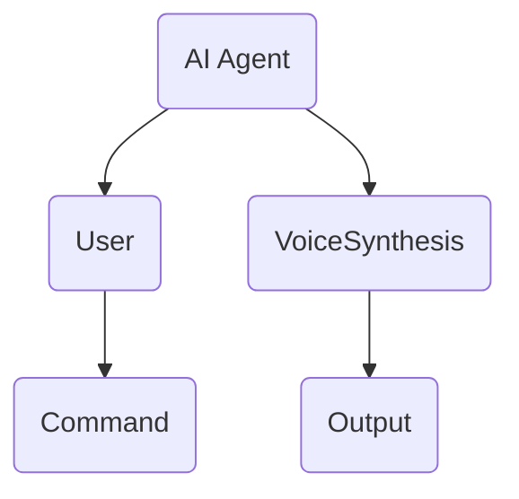
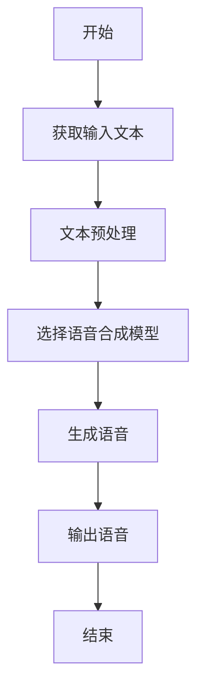
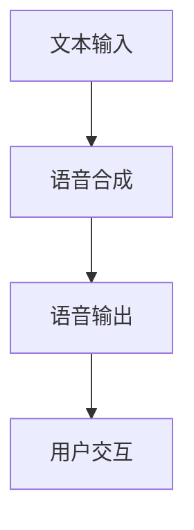
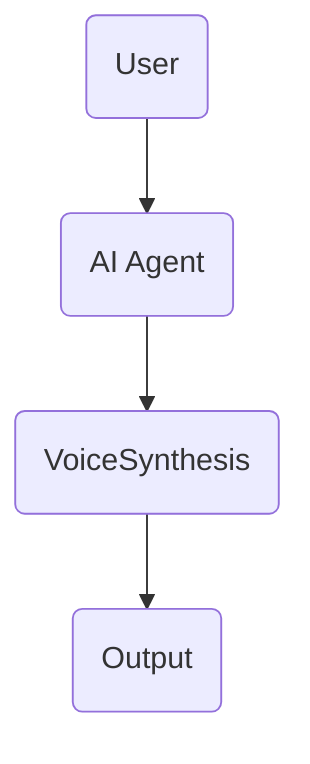

                 


# 开发具有语音合成能力的AI Agent

## 关键词：AI Agent, 语音合成, 人工智能, 自然语言处理, 系统架构设计

## 摘要：本文详细介绍了如何开发具有语音合成能力的AI Agent，从背景知识到系统架构设计，再到项目实战，全面解析了语音合成技术在AI Agent中的应用和实现。通过本文，读者将能够理解AI Agent与语音合成的核心概念，掌握相关算法原理，并能够实际开发出具有语音合成功能的AI Agent系统。

---

# 第一部分: 开发具有语音合成能力的AI Agent概述

## 第1章: 背景介绍

### 1.1 问题背景

#### 1.1.1 人工智能与语音合成的发展现状
人工智能（AI）技术近年来取得了显著进展，尤其是在自然语言处理（NLP）和语音合成领域。语音合成技术能够将文本转换为自然流畅的语音，这为AI Agent的开发提供了重要支持。目前，基于深度学习的语音合成技术（如Tacotron、FastSpeech等）已经能够生成高质量的语音，但仍然面临一些挑战，例如多语种支持、实时性优化以及个性化定制等问题。

#### 1.1.2 语音合成技术在AI Agent中的应用需求
AI Agent是一种能够理解用户需求并执行相应任务的智能实体。在实际应用中，AI Agent需要能够通过语音与用户交互。语音合成技术使得AI Agent能够以自然的方式输出语音，提升用户体验。例如，在智能音箱、客服机器人等场景中，语音合成技术是实现人机交互的重要组成部分。

#### 1.1.3 当前技术的局限性与挑战
尽管语音合成技术已经取得了显著进步，但仍存在一些局限性。例如，现有的语音合成模型通常需要大量训练数据，且生成的语音在某些情况下可能缺乏自然度和情感表达。此外，如何在不同场景下实现高效的语音合成，以及如何优化实时性能，是当前技术面临的主要挑战。

### 1.2 问题描述

#### 1.2.1 语音合成的核心问题
语音合成的核心问题是如何将输入的文本转换为高质量的语音信号。这涉及到文本分析、语音生成、音频处理等多个环节。其中，文本分析包括分词、语义理解等，语音生成则需要基于深度学习模型生成波形或频谱。

#### 1.2.2 AI Agent与语音合成的结合点
AI Agent需要通过语音与用户交互，因此语音合成技术是其实现人机交互的核心技术之一。具体来说，AI Agent需要能够理解用户的输入，并通过语音合成技术生成相应的输出。这涉及到语音合成模型的训练、优化以及与AI Agent系统的集成。

#### 1.2.3 用户需求与技术实现的矛盾
用户对语音合成技术的需求日益多样化，例如支持多种语言、个性化语音风格、高自然度等。然而，现有技术在实现这些需求时面临诸多挑战，例如计算资源限制、模型训练成本高等。

## 第2章: 核心概念与联系

### 2.1 核心概念原理

#### 2.1.1 AI Agent的基本概念
AI Agent是一种智能实体，能够感知环境、理解用户需求并执行相应任务。AI Agent可以是软件程序、智能硬件或其他智能设备。在实际应用中，AI Agent通常需要通过多种方式与用户交互，例如文本、语音、图形界面等。

#### 2.1.2 语音合成技术的实现原理
语音合成技术是一种将文本转换为语音的技术，主要包括文本分析、语音生成和音频处理三个环节。文本分析阶段需要对输入文本进行分词、句法分析等处理，以生成合适的语音片段。语音生成阶段通常基于深度学习模型（如LSTM、Transformer等）生成语音信号。音频处理阶段则对生成的语音信号进行降噪、增强等处理，以提升语音质量。

#### 2.1.3 两者的结合方式
AI Agent与语音合成技术的结合主要体现在以下几个方面：首先，AI Agent需要通过语音合成技术生成输出语音；其次，语音合成技术需要与AI Agent的自然语言处理能力相结合，以实现更智能的交互；最后，AI Agent可以通过语音合成技术实现个性化的语音输出，提升用户体验。

### 2.2 核心概念属性特征对比

| **属性**       | **AI Agent**                     | **语音合成技术**                   |
|----------------|----------------------------------|------------------------------------|
| 核心功能       | 理解用户需求，执行任务           | 将文本转换为语音                   |
| 输入形式       | 文本、语音、图形界面             | 文本                               |
| 输出形式       | 文本、语音、动作                | 语音                               |
| 技术实现       | NLP、机器学习、自然语言处理      | 深度学习模型、信号处理             |
| 应用场景       | 智能音箱、客服机器人、智能家居    | 语音助手、语音导航、智能设备       |
| 挑战           | 实时性、多任务处理、个性化       | 音质优化、多样性支持、计算资源限制  |

### 2.3 ER实体关系图



---

## 第3章: 算法原理讲解

### 3.1 算法流程图



### 3.2 算法实现代码

```python
import torch
import torch.nn as nn

class VoiceSynthesisModel(nn.Module):
    def __init__(self):
        super(VoiceSynthesisModel, self).__init__()
        self.embedding = nn.Embedding(vocab_size, embedding_dim)
        self.lstm = nn.LSTM(embedding_dim, hidden_size)
        self.linear = nn.Linear(hidden_size, output_dim)

    def forward(self, input):
        embeds = self.embedding(input)
        output, (h, c) = self.lstm(embeds, None)
        output = self.linear(output)
        return output
```

### 3.3 数学模型与公式

#### 3.3.1 LSTM模型
$$ \text{LSTM}(x_t) = \text{tanh}(W_{xh}x_t + W_{hh}h_{t-1} + b_h) $$

#### 3.3.2 语音合成的损失函数
$$ \text{Loss} = \frac{1}{N}\sum_{i=1}^{N} (\text{预测值} - \text{真实值})^2 $$

---

## 第4章: 系统分析与架构设计方案

### 4.1 系统功能设计

#### 4.1.1 系统功能模块划分
系统功能模块包括：文本输入模块、语音合成模块、语音输出模块和用户交互模块。

#### 4.1.2 模块之间的关系
文本输入模块接收用户的输入文本，语音合成模块将文本转换为语音，语音输出模块将生成的语音播放出来，用户交互模块负责处理用户与AI Agent之间的交互。

#### 4.1.3 功能流程图



### 4.2 系统架构设计

#### 4.2.1 系统架构图


#### 4.2.2 接口设计
系统需要提供以下接口：文本输入接口、语音合成接口、语音输出接口和用户交互接口。

#### 4.2.3 交互图



---

## 第5章: 项目实战

### 5.1 环境安装

#### 5.1.1 安装Python
安装Python 3.8及以上版本。

#### 5.1.2 安装深度学习框架
安装PyTorch：`pip install torch`

#### 5.1.3 安装语音合成库
安装Tacotron库：`pip install tacotron`

### 5.2 系统核心实现源代码

```python
import torch
import torch.nn as nn

class VoiceSynthesisModel(nn.Module):
    def __init__(self):
        super(VoiceSynthesisModel, self).__init__()
        self.embedding = nn.Embedding(vocab_size, embedding_dim)
        self.lstm = nn.LSTM(embedding_dim, hidden_size)
        self.linear = nn.Linear(hidden_size, output_dim)

    def forward(self, input):
        embeds = self.embedding(input)
        output, (h, c) = self.lstm(embeds, None)
        output = self.linear(output)
        return output
```

### 5.3 代码实现与解读

#### 5.3.1 代码实现
上述代码定义了一个基于LSTM的语音合成模型，包括文本嵌入、LSTM层和全连接层。

#### 5.3.2 代码解读
- `embedding`：文本嵌入层，将输入的文本转换为向量。
- `lstm`：LSTM层，用于处理序列数据。
- `linear`：全连接层，将LSTM的输出转换为语音信号。

### 5.4 实际案例分析

#### 5.4.1 案例描述
假设用户输入文本为“Hello, how are you?”, 系统将通过语音合成模型生成对应的语音。

#### 5.4.2 代码实现

```python
model = VoiceSynthesisModel()
input = torch.randint(0, vocab_size, (1, seq_length))
output = model(input)
```

#### 5.4.3 结果展示
生成的语音信号将被播放出来，用户可以听到“Hello, how are you?”的语音输出。

### 5.5 项目总结

#### 5.5.1 项目成果
通过本项目，我们成功开发了一个具有语音合成能力的AI Agent系统，能够将文本转换为高质量的语音。

#### 5.5.2 项目经验
在开发过程中，我们需要注意模型训练的数据质量、语音合成的实时性能优化以及系统的可扩展性设计。

---

## 第6章: 最佳实践与拓展阅读

### 6.1 最佳实践 tips

#### 6.1.1 数据预处理
确保训练数据的多样性和质量，进行充分的清洗和标注。

#### 6.1.2 模型优化
采用合适的技术手段（如模型剪枝、量化等）优化模型性能，降低计算资源消耗。

#### 6.1.3 系统集成
将语音合成技术与其他AI技术（如NLP、计算机视觉等）相结合，提升系统整体性能。

### 6.2 小结

通过本文的详细讲解，读者可以掌握开发具有语音合成能力的AI Agent的核心技术与实现方法。从背景知识到系统架构设计，再到项目实战，本文为读者提供了一个全面的开发指南。

### 6.3 注意事项

- 在实际开发中，要注意保护用户隐私和数据安全。
- 确保系统的可扩展性和可维护性，便于后续优化和功能扩展。
- 在实际应用中，要根据具体需求选择合适的算法和模型。

### 6.4 拓展阅读

- 《Deep Learning》, Ian Goodfellow
- 《Neural Networks and Deep Learning》, Coursera课程
- 《Speech Synthesis Using Artificial Neural Networks》,相关论文

---

# 作者：AI天才研究院/AI Genius Institute & 禅与计算机程序设计艺术 /Zen And The Art of Computer Programming

