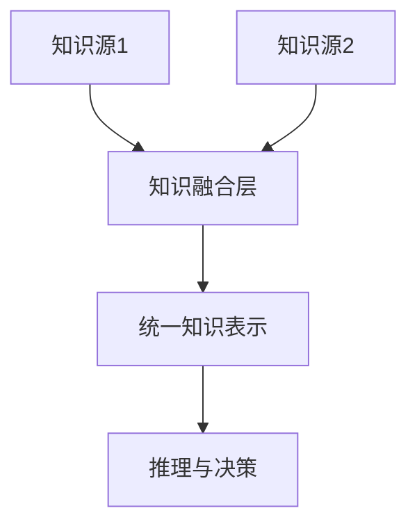

                 


# 开发具有跨域知识融合能力的AI Agent

**关键词**：跨域知识融合、AI Agent、知识图谱、多模态数据、机器学习

**摘要**：  
随着人工智能技术的快速发展，AI Agent（智能体）在各个领域的应用越来越广泛。然而，现有的AI Agent大多局限于单一领域，难以应对跨域复杂问题。本文将深入探讨如何开发具有跨域知识融合能力的AI Agent，通过结合多源异构数据、知识图谱和先进的机器学习技术，实现跨域知识的高效整合与推理。文章将从背景、核心概念、算法原理、系统架构到项目实战，全面解析跨域知识融合的关键技术与实现方法，为开发者提供理论支持与实践指导。

---

## 目录

1. **开发具有跨域知识融合能力的AI Agent概述**  
   - 1.1 跨域知识融合的背景与问题背景  
   - 1.2 跨域知识融合的定义与特点  
   - 1.3 跨域知识融合的应用领域与潜力  

2. **跨域知识融合的核心概念与联系**  
   - 2.1 跨域知识融合的核心概念原理  
   - 2.2 跨域知识融合的概念属性特征对比  
   - 2.3 跨域知识融合的ER实体关系图架构  

3. **跨域知识融合的算法原理**  
   - 3.1 基于注意力机制的知识融合  
   - 3.2 基于对比学习的知识融合  

4. **跨域知识融合的系统架构与设计**  
   - 4.1 系统架构设计  
   - 4.2 系统功能设计  
   - 4.3 系统接口设计  

5. **跨域知识融合的项目实战**  
   - 5.1 项目背景与目标  
   - 5.2 系统实现与代码解析  
   - 5.3 实际案例分析  

6. **跨域知识融合的高级主题与未来趋势**  
   - 6.1 知识图谱的构建与优化  
   - 6.2 多模态数据的融合挑战  
   - 6.3 跨域知识融合的可解释性与伦理安全  

7. **总结与展望**  
   - 7.1 本文总结  
   - 7.2 未来研究方向  

---

## 第1章：开发具有跨域知识融合能力的AI Agent概述

### 1.1 跨域知识融合的背景与问题背景

随着人工智能技术的快速发展，AI Agent（智能体）在各个领域的应用越来越广泛。然而，现有的AI Agent大多局限于单一领域，难以应对跨域复杂问题。例如，在医疗领域，AI Agent可能需要整合医学知识、患者数据和药品信息；在金融领域，可能需要结合市场数据、用户行为和法规信息。这些跨域数据的整合与融合，是当前AI Agent技术的核心挑战。

#### 1.1.1 跨域知识融合的背景

跨域知识融合的核心思想是将来自不同领域、不同形式的数据或知识进行整合，形成统一的知识表示，并在此基础上进行推理和决策。这种技术在多个领域都有广泛的应用需求，例如：

- **医疗领域**：整合医学文献、患者数据和药物信息，辅助医生进行诊断和治疗方案制定。
- **金融领域**：结合市场数据、用户行为和法规信息，提供智能投资建议。
- **教育领域**：整合学习者数据、课程信息和教育资源，提供个性化的学习建议。

#### 1.1.2 跨域知识融合的核心问题与挑战

跨域知识融合的核心问题在于如何将来自不同领域的异构数据进行统一表示和有效融合。具体挑战包括：

1. **数据异构性**：不同领域的数据形式和语义可能完全不同，例如文本数据、图像数据和结构化数据。
2. **语义歧义性**：同一概念在不同领域中的含义可能不同，例如“时间”在医学和金融中的含义差异。
3. **知识复杂性**：跨域知识的规模和复杂性远超单一领域，需要高效的表示和推理方法。

#### 1.1.3 跨域知识融合的边界与外延

跨域知识融合的边界在于如何定义“域”的范围。一个域可以是特定的领域（如医学、金融），也可以是数据的类型（如文本、图像）。其外延则包括如何将跨域知识应用于实际场景中，例如智能客服、智能医疗等。

---

### 1.2 跨域知识融合的定义与特点

#### 1.2.1 跨域知识融合的定义

跨域知识融合是指将来自不同领域或数据源的知识进行整合，形成统一的知识表示，并在此基础上进行推理和决策的过程。其目标是通过多源异构数据的融合，提升AI Agent的智能性和适应性。

#### 1.2.2 跨域知识融合的核心特点

1. **多源性**：整合来自多个数据源或领域的知识。
2. **异构性**：数据形式多样，包括文本、图像、结构化数据等。
3. **动态性**：知识融合过程需要动态更新和调整，以应对变化的环境。
4. **语义一致性**：需要确保不同领域的知识在语义上的一致性。

#### 1.2.3 跨域知识融合与传统知识融合的区别

传统知识融合主要关注单一领域内的知识整合，而跨域知识融合则强调跨领域、跨数据源的整合。两者的区别主要体现在：

| 特性 | 传统知识融合 | 跨域知识融合 |
|------|--------------|--------------|
| 数据来源 | 单一领域     | 多领域       |
| 数据形式 | 同一类型     | 多种类型     |
| 知识复杂性 | 较低         | 较高         |

---

### 1.3 跨域知识融合的应用领域与潜力

#### 1.3.1 跨域知识融合的典型应用场景

1. **智能客服**：整合客户信息、产品数据和常见问题，提供个性化的解决方案。
2. **智能医疗**：整合医学文献、患者数据和药物信息，辅助医生进行诊断。
3. **智能金融**：结合市场数据、用户行为和法规信息，提供智能投资建议。

#### 1.3.2 跨域知识融合在企业级AI Agent中的应用前景

随着企业数字化转型的推进，跨域知识融合在企业级AI Agent中的应用前景广阔。例如：

- **企业知识管理**：整合企业内部知识库和外部行业知识，提升员工工作效率。
- **智能决策支持**：基于跨域知识融合，提供数据驱动的决策支持。

#### 1.3.3 跨域知识融合的挑战与机遇

挑战主要在于如何处理多源异构数据的融合问题，而机遇则在于跨域知识融合能够为企业带来更高效的决策支持和更智能化的服务能力。

---

## 第2章：跨域知识融合的核心概念与联系

### 2.1 跨域知识融合的核心概念原理

#### 2.1.1 知识表示与知识图谱

知识表示是跨域知识融合的基础。常用的知识表示方法包括符号逻辑、概率分布和向量表示。其中，知识图谱是一种基于图结构的知识表示方法，能够有效地整合多源异构数据。

#### 2.1.2 跨域知识的表示方法

跨域知识的表示方法需要能够处理不同领域之间的语义差异。例如，可以使用多语言知识图谱来表示不同语言的知识。

#### 2.1.3 跨域知识融合的数学模型

跨域知识融合的数学模型通常基于概率图模型或神经网络模型。例如，可以通过概率分布来表示不同领域的知识，并通过贝叶斯推断进行融合。

---

### 2.2 跨域知识融合的概念属性特征对比

跨域知识融合的不同方法具有不同的特点和适用场景。以下是一个对比表格：

| 概念属性 | 符号化方法 | 概率图模型 | 神经网络方法 |
|----------|------------|------------|--------------|
| 表示方式 | 符号逻辑   | 概率分布   | 向量表示     |
| 融合方式 | 基于规则   | 基于概率   | 基于相似性   |
| 优缺点   | 精确性高，但灵活性低 | 精确性与灵活性较好 | 灵活性高，但可解释性差 |

---

### 2.3 跨域知识融合的ER实体关系图架构

以下是跨域知识融合的ER实体关系图：



---

## 第3章：跨域知识融合的算法原理

### 3.1 跨域知识融合的主流算法

#### 3.1.1 基于注意力机制的知识融合

注意力机制是一种有效的跨域知识融合方法，特别是在处理文本数据时表现优异。以下是注意力机制的基本原理：

```mermaid
graph TD
    Input --> Attention Layer
    Attention Layer --> Output
```

#### 3.1.2 基于对比学习的知识融合

对比学习是一种新兴的跨域知识融合方法，通过对比不同领域的知识表示，提升融合效果。

---

### 3.2 跨域知识融合的数学模型

以下是一个基于注意力机制的知识融合模型：

$$
\text{Attention}(q, k, v) = \text{softmax}\left(\frac{q \cdot k^T}{\sqrt{d}}\right) v
$$

其中，$q$ 是查询向量，$k$ 是键向量，$v$ 是值向量，$d$ 是向量维度。

---

## 第4章：跨域知识融合的系统架构与设计

### 4.1 系统架构设计

跨域知识融合的系统架构通常包括感知层、知识融合层和决策层。以下是系统架构图：

```mermaid
graph TD
    Perception --> Knowledge Fusion
    Knowledge Fusion --> Decision Making
```

---

## 第5章：跨域知识融合的项目实战

### 5.1 项目背景与目标

以智能客服为例，项目目标是通过跨域知识融合，提升客服的响应效率和准确性。

---

### 5.2 系统实现与代码解析

以下是项目的核心代码示例：

```python
def attention Fusion(q, k, v):
    # 计算注意力权重
    dk = v.shape[-1]
    attn_weights = torch.softmax((q @ k.T) / torch.sqrt(torch.tensor(dk, dtype=torch.float32)), dim=-1)
    # 加权求和
    output = attn_weights @ v
    return output
```

---

## 第6章：跨域知识融合的高级主题与未来趋势

### 6.1 知识图谱的构建与优化

知识图谱的构建是跨域知识融合的核心技术之一，未来的研究方向包括知识图谱的动态更新和多模态知识表示。

### 6.2 多模态数据的融合挑战

多模态数据的融合是跨域知识融合的重要方向，例如图像、文本和语音的融合。

### 6.3 跨域知识融合的可解释性与伦理安全

跨域知识融合的可解释性和伦理安全是未来研究的重要方向，特别是在金融和医疗领域。

---

## 第7章：总结与展望

### 7.1 本文总结

本文系统地探讨了跨域知识融合的核心技术与实现方法，从背景、概念、算法到系统架构和项目实战，为开发者提供了全面的理论支持与实践指导。

### 7.2 未来研究方向

未来的研究方向包括多模态数据融合、知识图谱的动态更新以及跨域知识融合的可解释性与伦理安全。

---

## 作者

**作者：AI天才研究院/AI Genius Institute & 禅与计算机程序设计艺术 /Zen And The Art of Computer Programming**

---

以上是文章的详细目录和内容概要，您可以根据需要进一步扩展和详细撰写每个章节的内容。

