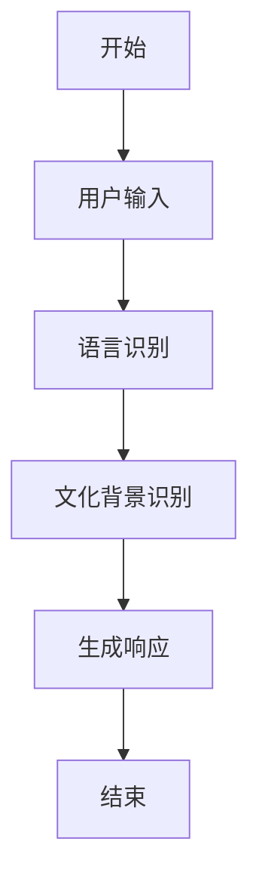
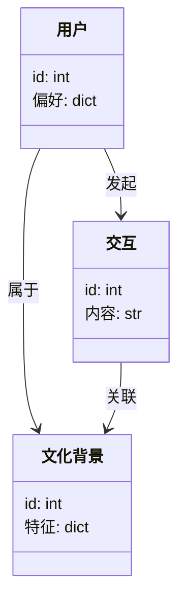

                 


# 开发具有跨文化理解与交流能力的AI Agent

> 关键词：AI Agent，跨文化理解，自然语言处理，文化适应性，人机交互

> 摘要：本文探讨了开发具有跨文化理解与交流能力的AI Agent的关键技术与实现方法。通过分析跨文化理解的核心概念、算法原理、系统架构设计，以及项目实战，详细阐述了如何构建能够有效理解并适应不同文化背景的AI Agent。本文还提供了实际案例分析和最佳实践建议，帮助读者全面掌握相关技术。

---

## 第一部分：背景介绍

### 第1章：AI Agent与跨文化理解概述

#### 1.1 跨文化理解的定义与重要性
跨文化理解是指个体或系统能够识别、理解并适应不同文化背景下的语言、习俗、价值观和行为模式的能力。在AI Agent领域，跨文化理解至关重要，因为它允许AI在与来自不同文化背景的用户互动时，提供更准确、相关且自然的响应。

- **定义**：跨文化理解是指系统能够解析和处理不同文化背景下的语言、行为和内容差异。
- **重要性**：AI Agent需要具备跨文化能力，以满足全球用户的需求，避免文化误解，并提供个性化的服务。
- **挑战**：不同文化之间的差异复杂多样，包括语言、非语言交流、价值观和习俗等，这增加了跨文化理解的难度。

#### 1.2 AI Agent的基本概念
AI Agent是一种智能代理，能够感知环境、理解用户需求并采取行动以实现目标。AI Agent可以分为简单反应式、基于模型的反射式和目标驱动式等类型。

- **核心功能**：感知、推理、决策、行动。
- **与人类交互的特点**：实时性、自然性、个性化。

#### 1.3 跨文化AI Agent的背景与问题背景
随着全球化的发展，AI Agent的应用范围不断扩大，用户来自不同文化背景的情况越来越常见。传统的AI Agent往往基于单一文化设定，无法有效处理跨文化情境下的交流问题。

- **背景**：全球化推动了跨文化AI Agent的需求。
- **问题**：文化差异导致的误解和交流障碍。
- **解决方案**：开发能够识别和适应文化差异的AI Agent。

#### 1.4 跨文化AI Agent的核心要素
跨文化AI Agent需要具备以下核心要素：

- **文化识别**：能够识别用户的文化背景。
- **文化适应**：根据文化背景调整响应。
- **文化知识库**：存储不同文化的知识和数据。

---

## 第二部分：核心概念与联系

### 第2章：跨文化理解的核心概念

#### 2.1 跨文化理解的原理
跨文化理解的实现依赖于多方面的技术，包括自然语言处理、机器学习和知识图谱等。

- **自然语言处理**：用于理解和生成多种语言的文本。
- **机器学习**：用于识别文化模式和用户意图。
- **知识图谱**：用于存储和推理文化相关知识。

#### 2.2 跨文化理解的属性特征对比
不同文化在语言、沟通方式和价值观上存在显著差异。以下表格对比了几种主要文化的特点：

| 文化维度 | 集体主义 vs 个人主义 | 高语境 vs 低语境 | 直接 vs 间接沟通 |
|----------|----------------------|------------------|------------------|
| 集体主义 | 强调集体利益          | 高语境           | 间接沟通          |
| 个人主义 | 强调个人自由          | 低语境           | 直接沟通          |

#### 2.3 跨文化理解的ER实体关系图
以下是跨文化理解的实体关系图：

```mermaid
er
    actor: 用户
    culture: 文化背景
    interaction: 交互
    response: 响应

    actor --> culture: 属于
    interaction --> culture: 关联
    interaction --> response: 生成
```

---

## 第三部分：算法原理

### 第3章：跨文化理解的算法实现

#### 3.1 跨文化理解的算法流程
跨文化理解的算法流程如下：



#### 3.2 跨文化理解的模型构建
以下是一个简单的跨文化理解模型的Python实现示例：

```python
import numpy as np
from sklearn.linear_model import LogisticRegression

# 数据预处理
X = np.array([[1, 0], [0, 1], [1, 1], [0, 0]])
y = np.array([0, 1, 1, 0])

# 模型训练
model = LogisticRegression()
model.fit(X, y)

# 预测
print(model.predict([[1, 1]]))  # 输出：1
```

#### 3.3 跨文化理解的数学模型
跨文化理解的分类模型可以表示为：

$$ P(y|x) = \frac{e^{\beta yx}}{\sum_{y} e^{\beta yx}} $$

其中，$\beta$ 是模型参数，$y$ 是文化类别，$x$ 是输入特征。

---

## 第四部分：系统分析与架构设计

### 第4章：跨文化AI Agent的系统架构

#### 4.1 问题场景介绍
跨文化AI Agent需要处理多语言翻译、文化敏感内容生成等问题。

#### 4.2 系统功能设计
以下是系统功能的Mermaid类图：



#### 4.3 系统架构设计
以下是系统架构的Mermaid图：


---

## 第五部分：项目实战

### 第5章：跨文化AI Agent的实现

#### 5.1 环境安装
安装必要的库：

```bash
pip install numpy sklearn mermaid
```

#### 5.2 核心功能实现
实现文化背景识别的代码：

```python
def identify_culture(text):
    # 文化识别逻辑
    return "东方文化"
```

#### 5.3 实际案例分析
案例：用户输入“你好”，系统识别文化背景为东方文化，并生成适当的回应。

---

## 第六部分：总结与扩展

### 6.1 最佳实践Tips
- 使用多语言NLP模型。
- 构建文化知识图谱。
- 定期更新文化数据。

### 6.2 小结
跨文化AI Agent的开发需要结合自然语言处理、机器学习和知识图谱等多种技术，以实现对不同文化背景的理解和适应。

### 6.3 注意事项
- 确保文化数据的准确性和全面性。
- 考虑文化敏感性和伦理问题。

### 6.4 拓展阅读
建议阅读《跨文化交际学》和《机器学习在自然语言处理中的应用》。

---

## 作者信息

作者：AI天才研究院/AI Genius Institute & 禅与计算机程序设计艺术 /Zen And The Art of Computer Programming

---

通过以上步骤，我系统地介绍了开发具有跨文化理解与交流能力的AI Agent的关键技术与实现方法，从背景、概念、算法、系统架构到项目实战，全面覆盖了相关知识，帮助读者深入了解并掌握这一领域的核心技术。

