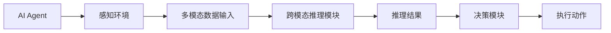
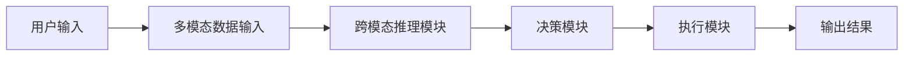
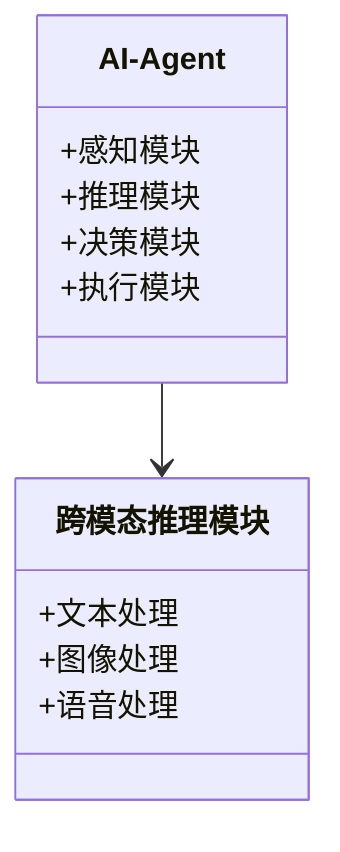

                 


# 开发具有跨模态推理能力的AI Agent

---

## 关键词
跨模态推理、AI Agent、多模态数据、深度学习、人机交互

---

## 摘要
本文详细探讨了开发具有跨模态推理能力的AI Agent的核心概念、算法原理、系统架构以及实际应用。通过结合跨模态推理与AI Agent，我们能够构建更智能、更灵活的智能系统，使其能够处理和理解多种模态数据，并在复杂场景中做出合理决策。本文从理论到实践，全面解析了跨模态推理AI Agent的开发过程，为读者提供了从基础到进阶的完整指南。

---

# 第一部分：跨模态推理与AI Agent基础

## 第1章：跨模态推理与AI Agent概述

### 1.1 跨模态推理的定义与特点

跨模态推理是指在多种数据模态（如文本、图像、语音、视频等）之间进行信息整合和逻辑推理的过程。其核心特点包括：
1. **多模态数据融合**：能够同时处理和理解多种数据类型。
2. **跨模态关联**：在不同模态之间建立关联，挖掘潜在关系。
3. **推理能力**：通过推理得出超越单模态信息的新结论。

### 1.2 AI Agent的基本概念

AI Agent（智能体）是一种能够感知环境、自主决策并执行任务的智能系统。其核心功能包括：
1. **感知**：通过传感器或接口获取环境信息。
2. **推理**：基于获取的信息进行逻辑推理。
3. **决策**：根据推理结果做出最优决策。
4. **执行**：通过执行机构或接口完成任务。

### 1.3 跨模态推理在AI Agent中的作用

跨模态推理能够显著提升AI Agent的能力：
- **多场景适应**：在复杂环境中，结合多种模态信息，提高感知和决策的准确性。
- **人机交互优化**：通过理解用户的多模态输入（如语音和图像），提供更自然的交互方式。
- **复杂任务处理**：在需要多模态数据融合的任务（如自动驾驶、智能客服）中，跨模态推理能够显著提升任务处理能力。

---

## 第2章：跨模态推理的核心概念与联系

### 2.1 跨模态推理的核心原理

跨模态推理的核心原理包括：
1. **多模态特征提取**：从不同模态数据中提取有意义的特征。
2. **跨模态关联建模**：建立不同模态之间的关联关系。
3. **联合推理**：基于关联关系进行跨模态推理。

### 2.2 跨模态推理与AI Agent的关系

通过表格和Mermaid图展示两者的关系：

#### 跨模态推理与AI Agent的关系（表格）
| 属性           | 跨模态推理       | AI Agent                  |
|----------------|------------------|---------------------------|
| 核心功能       | 数据融合与推理   | 感知、决策、执行          |
| 输入           | 多模态数据       | 多模态数据 + 环境信息      |
| 输出           | 跨模态推理结果   | 行为决策或任务完成结果    |

#### 跨模态推理与AI Agent的关系（Mermaid图）


---

## 第3章：跨模态推理的算法原理

### 3.1 跨模态推理算法概述

常用的跨模态推理算法包括：
1. **基于Transformer的跨模态推理**：利用Transformer模型进行多模态特征融合。
2. **图神经网络（GNN）**：通过图结构建模跨模态关系。
3. **对比学习**：通过对比不同模态的特征，提升跨模态关联能力。

### 3.2 跨模态推理算法的实现细节

#### 基于Transformer的跨模态推理

- **多模态特征提取**：
  ```python
  # 提取文本特征
  text_features = model_text(input_text)
  # 提取图像特征
  image_features = model_image(input_image)
  ```

- **跨模态注意力机制**：
  ```python
  # 文本到图像的注意力
  attention = torch.softmax((text_features @ image_features.T), dim=-1)
  image_attention = (attention @ image_features)
  ```

- **损失函数**：
  ```python
  # 对比学习损失
  loss = -(torch.sum(torch.log(attention + 1e-8)) / batch_size)
  ```

---

## 第4章：AI Agent的系统架构与设计

### 4.1 AI Agent的系统架构

#### 系统架构设计（Mermaid图）


### 4.2 系统功能设计

#### 领域模型（Mermaid类图）


---

## 第5章：项目实战

### 5.1 环境安装

```bash
pip install torch transformers mermaid4jupyter
```

### 5.2 核心代码实现

#### 跨模态推理模块实现
```python
import torch
import torch.nn as nn

class CrossModalFuse(nn.Module):
    def __init__(self, embed_dim=256):
        super().__init__()
        self.text_proj = nn.Linear(512, embed_dim)
        self.image_proj = nn.Linear(512, embed_dim)
        self.fuse = nn.Linear(embed_dim*2, embed_dim)
    
    def forward(self, text_features, image_features):
        text_embed = self.text_proj(text_features)
        image_embed = self.image_proj(image_features)
        fused = torch.cat([text_embed, image_embed], dim=-1)
        output = self.fuse(fused)
        return output
```

---

## 第6章：总结与展望

### 6.1 总结

跨模态推理能力的引入显著提升了AI Agent的智能性和适应性。通过多模态数据的融合与推理，AI Agent能够更好地理解复杂场景，并做出更准确的决策。

### 6.2 展望

未来，随着深度学习和多模态技术的进一步发展，跨模态推理AI Agent将在更多领域得到广泛应用，例如自动驾驶、智能客服、机器人控制等。

---

## 作者

作者：AI天才研究院/AI Genius Institute & 禅与计算机程序设计艺术 /Zen And The Art of Computer Programming

