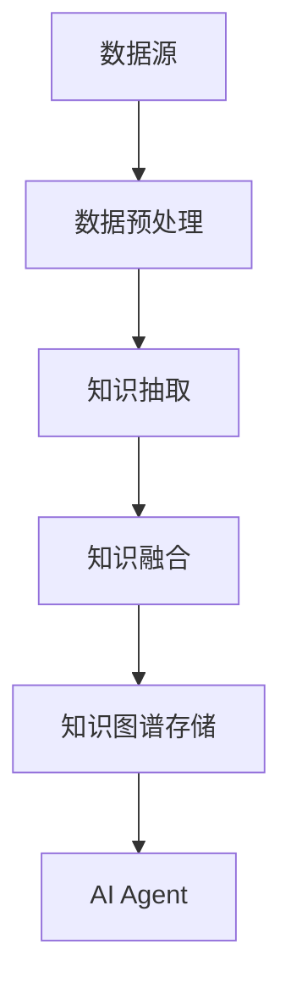
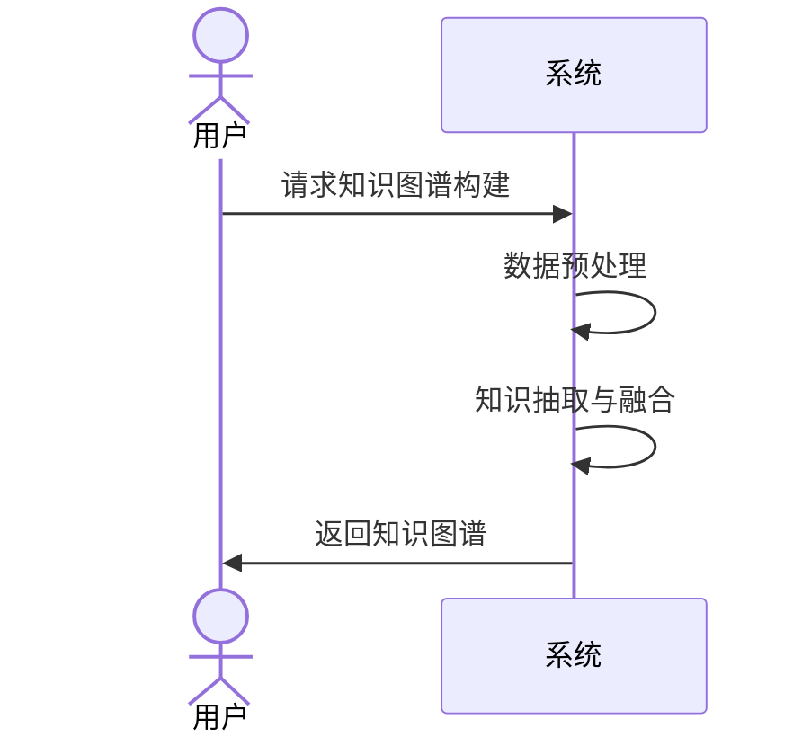
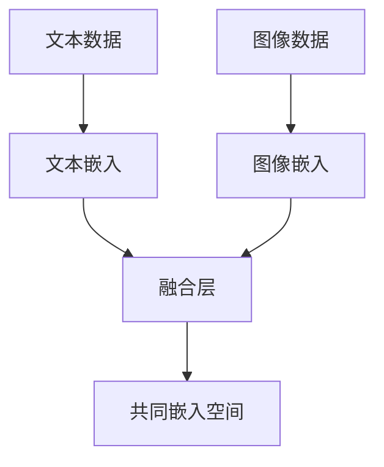

                 


# 开发具有跨模态知识图谱构建能力的AI Agent

> 关键词：跨模态知识图谱、AI Agent、知识图谱构建、多模态数据处理、智能系统设计

> 摘要：本文探讨了开发具有跨模态知识图谱构建能力的AI Agent的各个方面，从背景介绍到系统架构设计，再到项目实战和总结。通过详细的技术分析和实例，展示了如何结合跨模态知识图谱和AI Agent，构建高效的智能系统。

---

## 目录大纲

### 第一部分: 背景介绍

#### 第1章: 跨模态知识图谱与AI Agent的背景

##### 1.1 问题背景
###### 1.1.1 当前AI Agent的发展现状
###### 1.1.2 跨模态知识图谱的兴起
###### 1.1.3 两者的结合与应用前景

##### 1.2 问题描述
###### 1.2.1 AI Agent的核心功能
###### 1.2.2 跨模态知识图谱的定义
###### 1.2.3 两者的结合方式

##### 1.3 问题解决
###### 1.3.1 AI Agent如何利用知識图谱
###### 1.3.2 跨模态知识图谱的构建方法
###### 1.3.3 实际应用场景分析

##### 1.4 边界与外延
###### 1.4.1 AI Agent的边界
###### 1.4.2 跨模态知识图谱的边界
###### 1.4.3 两者的相互作用

##### 1.5 核心要素组成
###### 1.5.1 AI Agent的核心要素
###### 1.5.2 跨模态知识图谱的核心要素
###### 1.5.3 两者的关联性

### 第二部分: 核心概念与联系

#### 第2章: 跨模态知识图谱与AI Agent的核心概念

##### 2.1 跨模态知识图谱的定义与特点
###### 2.1.1 跨模态知识图谱的定义
###### 2.1.2 跨模态知识图谱的特点
###### 2.1.3 跨模态知识图谱的构建过程

##### 2.2 AI Agent的定义与特点
###### 2.2.1 AI Agent的定义
###### 2.2.2 AI Agent的特点
###### 2.2.3 AI Agent的核心功能

##### 2.3 跨模态知识图谱与AI Agent的关系
###### 2.3.1 跨模态知识图谱在AI Agent中的作用
###### 2.3.2 AI Agent对知识图谱的影响
###### 2.3.3 两者的协同工作方式

##### 2.4 核心概念对比表
```plaintext
| 比较维度 | 跨模态知识图谱 | AI Agent |

----------------------------------------------------------------

* 说明：请在回答中使用 Mermaid 来描述表格和图示，以及数学公式使用 LaTeX 格式，并在代码中展示相关代码示例。
```

### 第三部分: 算法原理

#### 第3章: 跨模态知识图谱构建算法

##### 3.1 跨模态数据融合算法
###### 3.1.1 跨模态数据的特点
###### 3.1.2 跨模态数据融合方法
###### 3.1.3 典型算法介绍（如多模态嵌入算法）

##### 3.2 知识图谱构建算法
###### 3.2.1 知识抽取与整合
###### 3.2.2 知识关联与推理
###### 3.2.3 知识图谱优化

##### 3.3 AI Agent中的知识图谱应用
###### 3.3.1 知识图谱作为AI Agent的知识库
###### 3.3.2 知识图谱的动态更新与维护
###### 3.3.3 知识图谱在任务规划中的作用

### 第四部分: 系统架构与设计

#### 第4章: 跨模态知识图谱构建系统的架构设计

##### 4.1 系统功能设计
###### 4.1.1 数据采集模块
###### 4.1.2 数据处理模块
###### 4.1.3 知识图谱构建模块
###### 4.1.4 AI Agent接口模块

##### 4.2 系统架构图


##### 4.3 接口设计与交互
###### 4.3.1 API接口定义
###### 4.3.2 系统交互流程
###### 4.3.3 交互序列图


### 第五部分: 项目实战

#### 第5章: 跨模态知识图谱构建项目实现

##### 5.1 项目环境搭建
###### 5.1.1 开发工具安装
###### 5.1.2 数据集准备
###### 5.1.3 依赖库安装

##### 5.2 核心代码实现
###### 5.2.1 数据处理模块代码
###### 5.2.2 知识抽取与融合代码
###### 5.2.3 AI Agent接口实现

##### 5.3 代码解读与分析
###### 5.3.1 代码结构分析
###### 5.3.2 代码功能说明
###### 5.3.3 代码优化建议

##### 5.4 实际案例分析
###### 5.4.1 案例背景介绍
###### 5.4.2 数据处理流程
###### 5.4.3 知识图谱构建与应用
###### 5.4.4 结果分析与总结

##### 5.5 项目总结
###### 5.5.1 项目成果
###### 5.5.2 项目经验
###### 5.5.3 改进建议

### 第六部分: 最佳实践与总结

#### 第6章: 跨模态知识图谱构建与AI Agent开发的最佳实践

##### 6.1 开发注意事项
###### 6.1.1 数据质量的重要性
###### 6.1.2 算法选择的策略
###### 6.1.3 系统设计的要点

##### 6.2 小结
###### 6.2.1 核心概念回顾
###### 6.2.2 系统设计总结
###### 6.2.3 未来发展趋势

##### 6.3 结束语
###### 6.3.1 致谢
###### 6.3.2 未来展望

---

## 示例内容

### 第3章: 跨模态知识图谱构建算法

#### 3.1 跨模态数据融合算法

##### 3.1.1 跨模态数据的特点

跨模态数据指的是来自不同感知模态（如文本、图像、音频等）的数据。例如，一张图片和一段描述图片的文字就是典型的跨模态数据。这些数据的特点是：

1. **异构性**：不同模态的数据具有不同的数据类型和结构。
2. **互补性**：不同模态的数据可以相互补充，提供更全面的信息。
3. **多样性**：跨模态数据可以在多种应用场景中使用，如图像描述匹配、多模态问答等。

##### 3.1.2 跨模态数据融合方法

跨模态数据融合的核心目标是将不同模态的数据有效地结合起来，以提高信息的利用效率。常用的方法包括：

1. **基于特征的融合**：将不同模态的数据转换为特征向量，然后通过加法、乘法等方式进行融合。
2. **基于模型的融合**：使用深度学习模型（如多模态循环神经网络）来学习跨模态数据的潜在关系。
3. **基于注意力机制的融合**：通过注意力机制来动态地调整不同模态数据的权重，实现自适应的融合。

##### 3.1.3 典型算法介绍（如多模态嵌入算法）

以下是一个典型的跨模态嵌入算法的示意图：



该算法将文本和图像分别嵌入到各自的特征空间中，然后通过融合层将它们映射到一个共同的嵌入空间中，从而实现跨模态数据的统一表示。

---

### 第4章: 跨模态知识图谱构建系统的架构设计

#### 4.2 系统架构图

以下是一个跨模态知识图谱构建系统的架构图：


- **数据源**：包括文本、图像、音频等多种模态的数据。
- **数据预处理**：对数据进行清洗、归一化等处理，确保数据质量。
- **知识抽取**：从数据中提取出实体、关系等知识。
- **知识融合**：将不同来源的知识进行整合，消除冲突，形成一致的知识图谱。
- **知识图谱存储**：将构建好的知识图谱存储在数据库中，供AI Agent使用。
- **AI Agent**：利用知识图谱进行智能推理、决策等任务。

---

通过以上目录大纲和示例内容，您可以根据实际需求逐步展开每个部分的内容，确保文章结构清晰、逻辑连贯，最终完成一篇高质量的技术博客文章。

