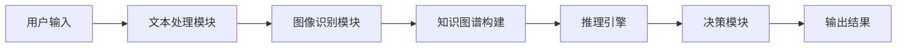
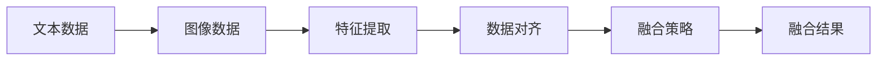
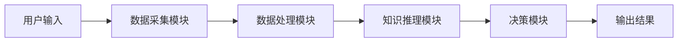

                 


# 开发具有跨模态知识推理与决策能力的AI Agent

---

## 关键词：
跨模态数据、知识推理、决策模型、AI Agent、多模态融合

---

## 摘要：
本文探讨了开发具有跨模态知识推理与决策能力的AI Agent的关键技术。首先，从问题背景和概念入手，分析了跨模态数据处理的重要性。随后，详细讲解了多模态数据融合算法、知识推理算法和决策模型的实现原理，并通过Mermaid图表展示了算法流程和系统架构。接着，结合实际案例，提供了项目实战的环境配置、代码实现和优化建议。最后，总结了开发中的关键点和未来发展方向，为读者提供了全面的技术指导。

---

# 第一部分: 背景与概念

## 第1章: 问题背景与描述

### 1.1 问题背景
#### 1.1.1 当前AI Agent的发展现状
AI Agent（智能体）作为人工智能的核心技术之一，广泛应用于自然语言处理、计算机视觉、机器人等领域。然而，现有的AI Agent大多局限于单一模态的数据处理，难以在复杂场景中实现高效的跨模态知识推理与决策。

#### 1.1.2 跨模态数据处理的必要性
在现实场景中，信息往往以多种模态形式呈现，如文本、图像、语音等。单一模态的数据处理能力有限，无法全面捕捉问题的本质。因此，跨模态数据处理成为提升AI Agent能力的关键。

#### 1.1.3 知识推理与决策能力的重要性
知识推理是AI Agent理解上下文、关联信息的核心能力。具备知识推理与决策能力的AI Agent能够更好地理解用户需求，提供更精准的服务。

### 1.2 问题描述
#### 1.2.1 跨模态数据整合的挑战
跨模态数据的异构性和多样性增加了整合的难度。如何有效地将文本、图像等多种数据类型统一处理，是一个亟待解决的问题。

#### 1.2.2 知识推理与决策的复杂性
知识推理需要处理大量的关联信息，决策过程涉及多目标优化，这增加了算法设计的复杂性。

#### 1.2.3 当前AI Agent的局限性
现有的AI Agent大多依赖于预定义规则或简单的模式匹配，难以应对复杂多变的场景。

---

## 第2章: 核心概念与联系

### 2.1 跨模态知识推理的核心原理
#### 2.1.1 跨模态数据的定义与特点
跨模态数据指的是来自不同感官渠道的数据，如文本、图像、语音等。这些数据具有异构性、多样性和互补性。

#### 2.1.2 知识推理的基本原理
知识推理是通过逻辑推理、关联分析等方式，从数据中提取隐含知识的过程。它依赖于知识图谱、规则引擎等技术。

#### 2.1.3 决策能力的实现机制
决策能力基于推理结果，结合预设的目标函数，选择最优行动方案。常用的方法包括基于规则的决策、基于模型的决策等。

### 2.2 核心概念对比
#### 2.2.1 跨模态数据与单一模态数据的对比
跨模态数据能够提供更全面的信息，而单一模态数据则信息有限。

#### 2.2.2 知识推理与传统推理的对比
知识推理结合了知识图谱，能够处理复杂关联关系，而传统推理通常基于逻辑规则。

#### 2.2.3 决策能力与简单响应的对比
决策能力能够根据推理结果制定策略，而简单响应仅基于预设规则。

### 2.3 实体关系图


---

# 第二部分: 算法原理

## 第3章: 跨模态数据融合算法

### 3.1 多模态数据融合
#### 3.1.1 数据预处理
对文本、图像等数据进行清洗、归一化处理，确保数据质量。

#### 3.1.2 数据对齐
通过特征提取和维度转换，将不同模态的数据对齐到同一空间。

#### 3.1.3 融合策略
采用加权融合、注意力机制等方法，综合多种模态的信息。

### 3.2 算法流程图


---

## 第4章: 知识推理算法

### 4.1 知识图谱构建
#### 4.1.1 实体识别
通过NLP技术从文本中提取实体。

#### 4.1.2 实体关系抽取
利用模式匹配或深度学习方法，识别实体之间的关系。

#### 4.1.3 知识图谱存储
将实体及其关系存储到图数据库中。

### 4.2 知识推理模型
#### 4.2.1 基于规则的推理
定义一系列推理规则，进行逻辑推理。

#### 4.2.2 基于图的推理
利用图遍历算法，从知识图谱中获取关联信息。

---

## 第5章: 决策模型

### 5.1 决策树模型
#### 5.1.1 决策树构建
基于训练数据，构建决策树模型。

#### 5.1.2 决策树推理
根据输入数据，沿着决策树进行推理，得到决策结果。

### 5.2 基于强化学习的决策
#### 5.2.1 状态定义
将问题转化为强化学习中的状态空间。

#### 5.2.2 动作选择
通过策略网络选择最优动作。

#### 5.2.3 奖励函数设计
设计合理的奖励函数，指导学习过程。

---

# 第三部分: 系统分析与架构设计

## 第6章: 问题场景介绍

### 6.1 项目介绍
开发一个多模态客服AI Agent，能够处理文本、图像等多种数据，提供智能服务。

### 6.2 系统功能设计
#### 6.2.1 数据采集模块
负责采集用户输入的文本、图像等数据。

#### 6.2.2 数据处理模块
对数据进行预处理和对齐。

#### 6.2.3 知识推理模块
基于知识图谱进行推理，生成决策建议。

#### 6.2.4 决策模块
根据推理结果，制定最优决策方案。

### 6.3 系统架构设计


---

## 第7章: 项目实战

### 7.1 环境安装
安装必要的库和工具，如Python、TensorFlow、PyTorch等。

### 7.2 核心代码实现
#### 7.2.1 数据预处理
```python
import numpy as np

def preprocess(text, image):
    # 文本预处理
    text_features = encode_text(text)
    # 图像预处理
    image_features = encode_image(image)
    return text_features, image_features
```

#### 7.2.2 融合策略
```python
def fuse_features(text_features, image_features):
    # 使用注意力机制融合特征
    attention_weights = softmax(Dense([text_features, image_features]))
    fused_features = attention_weights * text_features + (1 - attention_weights) * image_features
    return fused_features
```

### 7.3 代码解读与分析
详细解读每部分代码的功能，分析其在系统中的作用。

### 7.4 案例分析
通过具体案例，展示AI Agent的推理与决策过程。

### 7.5 项目小结
总结项目开发的经验与教训，提出改进建议。

---

# 第四部分: 最佳实践

## 第8章: 开发经验总结

### 8.1 小结
跨模态数据处理和知识推理是开发AI Agent的核心技术，需要综合运用多种算法和工具。

### 8.2 注意事项
- 数据质量对推理结果影响重大，需重视数据预处理。
- 算法调优需要结合具体场景，避免过度优化。
- 系统架构设计要注重模块化，便于扩展和维护。

### 8.3 拓展阅读
推荐阅读相关领域的最新论文和技术文档，保持技术更新。

---

## 作者：
AI天才研究院/AI Genius Institute & 禅与计算机程序设计艺术 /Zen And The Art of Computer Programming

---

# 结语：
开发具有跨模态知识推理与决策能力的AI Agent是一项复杂但极具挑战性的任务。通过本文的系统讲解，读者可以深入了解相关技术的核心原理和实现方法。希望本文能为AI Agent的开发提供有价值的参考和指导。

