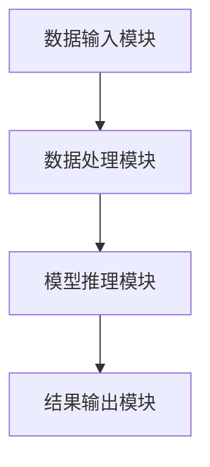

                 


# 开发具有跨语言信息提取能力的AI Agent

> 关键词：跨语言信息提取，AI Agent，自然语言处理，多语言模型，信息抽取，深度学习

> 摘要：本文详细探讨了开发具有跨语言信息提取能力的AI Agent的各个方面，包括其背景、核心概念、算法原理、系统架构设计、项目实战以及最佳实践。通过系统化的分析和案例研究，本文为读者提供了从理论到实践的全面指南，帮助他们在多语言环境中高效提取和处理信息。

---

# 第一部分: 跨语言信息提取与AI Agent基础

## 第1章: 跨语言信息提取与AI Agent概述

### 1.1 跨语言信息提取的背景与意义

#### 1.1.1 什么是跨语言信息提取
跨语言信息提取是指从多种语言的文本中提取特定信息的过程。例如，从英文和中文文档中提取日期、地点、人物等实体信息。

#### 1.1.2 跨语言信息提取的挑战与机遇
- **挑战**：语言差异、语义歧义、数据稀缺性。
- **机遇**：全球化背景下，跨语言信息处理需求激增，推动了技术进步。

#### 1.1.3 AI Agent在跨语言信息提取中的作用
AI Agent作为智能代理，能够自动执行任务，包括信息提取、数据分析和决策制定。

### 1.2 AI Agent的核心概念

#### 1.2.1 AI Agent的定义与特点
- **定义**：AI Agent是一个智能实体，能够感知环境、自主决策并执行任务。
- **特点**：自主性、反应性、目标导向、社会能力。

#### 1.2.2 跨语言信息提取的实现方式
- 统计方法：基于规则的提取。
- 深度学习：使用神经网络模型进行特征学习。

#### 1.2.3 跨语言信息提取与AI Agent的结合
AI Agent通过集成跨语言信息提取模型，能够处理多语言输入并生成统一的输出结果。

### 1.3 跨语言信息提取的典型应用场景

#### 1.3.1 多语言客服系统
AI Agent能够理解并处理多种语言的客户请求，提供实时支持。

#### 1.3.2 跨语言文档分析
从多语言文档中提取关键信息，用于企业决策。

#### 1.3.3 全球化信息监控
实时监控全球多语言信息，识别趋势和热点。

### 1.4 本章小结
本章介绍了跨语言信息提取的基本概念、挑战与机遇，以及AI Agent在其中的作用，为后续章节奠定了基础。

---

## 第2章: 跨语言信息提取的算法原理

### 2.1 跨语言信息提取的模型选择

#### 2.1.1 基于统计的模型
- **特点**：简单高效，依赖特征工程。
- **应用**：基于规则的实体识别。

#### 2.1.2 基于深度学习的模型
- **特点**：自动学习特征，性能优越。
- **应用**：使用神经网络进行语义分析。

#### 2.1.3 多语言模型的选择与优化
- **选择**：使用预训练的多语言模型，如BERT。
- **优化**：通过微调模型适应特定任务。

### 2.2 跨语言信息提取的算法流程

#### 2.2.1 数据预处理
- **分词**：将文本分割成词语或短语。
- **标注**：标记实体类型。

#### 2.2.2 模型训练
- **训练数据**：使用多语言标注数据。
- **训练过程**：使用交叉熵损失函数优化模型。

#### 2.2.3 模型评估与优化
- **评估指标**：精确率、召回率、F1分数。
- **优化方法**：调整模型参数，使用验证集进行调参。

### 2.3 跨语言信息提取的数学模型

#### 2.3.1 跨语言词嵌入模型
- **模型**：使用多语言词嵌入，如M-BERT。
- **公式**：词嵌入表示为$X_i$，其中$i$表示词的位置。

#### 2.3.2 跨语言句法分析
- **句法树构建**：使用依存句法分析。
- **公式**：句法关系表示为$R_{i,j}$，表示词$i$和词$j$之间的依存关系。

#### 2.3.3 跨语言语义理解
- **模型**：使用预训练的多语言模型进行上下文表示。
- **公式**：上下文表示为$H_i$，通过自注意力机制生成。

### 2.4 本章小结
本章详细探讨了跨语言信息提取的算法原理，包括模型选择、训练流程和数学模型，并为后续实现奠定了理论基础。

---

## 第3章: 跨语言信息提取的系统架构

### 3.1 系统整体架构

#### 3.1.1 数据输入模块
- **功能**：接收多语言文本输入。
- **实现**：通过API接口接收数据。

#### 3.1.2 数据处理模块
- **功能**：进行分词、标注和句法分析。
- **实现**：使用NLP工具包，如spaCy或NLTK。

#### 3.1.3 模型推理模块
- **功能**：运行预训练模型进行信息提取。
- **实现**：使用深度学习框架，如TensorFlow或PyTorch。

#### 3.1.4 结果输出模块
- **功能**：将提取结果格式化输出。
- **实现**：返回结构化数据，如JSON格式。

### 3.2 系统功能设计

#### 3.2.1 多语言支持
- **功能**：支持多种语言的文本输入。
- **实现**：通过语言检测库识别输入语言。

#### 3.2.2 实时信息提取
- **功能**：实时处理输入文本并返回结果。
- **实现**：使用异步处理和队列机制。

#### 3.2.3 可视化结果展示
- **功能**：将提取结果以可视化形式展示。
- **实现**：使用数据可视化工具，如D3.js或Plotly。

### 3.3 系统架构图

#### 3.3.1 系统架构Mermaid图


### 3.4 本章小结
本章设计了跨语言信息提取系统的整体架构，并详细描述了各个模块的功能和实现方式，为实际开发提供了指导。

---

## 第4章: 跨语言信息提取的项目实战

### 4.1 环境安装

#### 4.1.1 安装Python环境
- 使用Anaconda安装Python 3.8及以上版本。

#### 4.1.2 安装依赖库
- 安装深度学习框架：`pip install tensorflow`
- 安装NLP工具包：`pip install transformers`

### 4.2 系统核心实现

#### 4.2.1 数据预处理代码
```python
import transformers
from transformers import AutoTokenizer, AutoModelForTokenClassification

tokenizer = AutoTokenizer.from_pretrained('dbmdz/bert-large-wwm-ext')
model = AutoModelForTokenClassification.from_pretrained('dbmdz/bert-large-wwm-ext-finetuned-conll03-wwm')
```

#### 4.2.2 模型推理代码
```python
def extract_entities(text):
    inputs = tokenizer.encode(text, return_tensors='pt')
    outputs = model(inputs)
    predictions = torch.argmax(outputs.logits, dim=2)
    tokens = tokenizer.convert_ids_to_tokens(inputs[0])
    entities = []
    for i, token in enumerate(tokens):
        if predictions[0][i] == 1:  # 假设标签1表示实体
            entities.append(token)
    return entities
```

### 4.3 代码应用解读与分析

#### 4.3.1 代码功能解读
- 数据预处理：使用预训练的分词器对输入文本进行分词。
- 模型推理：使用预训练的实体识别模型进行预测，提取实体信息。

#### 4.3.2 代码实现细节
- 使用预训练的BERT模型进行实体识别，标签1表示实体。
- 返回提取的实体列表。

### 4.4 实际案例分析

#### 4.4.1 案例分析
输入文本：`The meeting is scheduled on October 5th in Paris.`
提取结果：`['October', '5th', 'Paris']`

### 4.5 项目小结
本章通过实际案例展示了跨语言信息提取系统的开发过程，从环境搭建到代码实现，再到案例分析，为读者提供了实践指导。

---

## 第5章: 跨语言信息提取的最佳实践

### 5.1 小贴士

#### 5.1.1 模型选择
- 根据任务需求选择合适的模型，微调预训练模型以提高性能。

#### 5.1.2 数据预处理
- 确保数据清洗和标注质量，避免噪声干扰。

#### 5.1.3 性能优化
- 使用分布式训练和批量处理提高训练效率。

### 5.2 注意事项

#### 5.2.1 跨语言模型的局限性
- 预训练模型在某些语言或领域上可能表现不佳，需进行微调。

#### 5.2.2 数据隐私问题
- 注意数据来源的合法性，避免隐私泄露。

### 5.3 拓展阅读

#### 5.3.1 推荐的书籍
- 《Deep Learning for NLP》
- 《Multi-Language Natural Language Processing》

#### 5.3.2 推荐的论文
- "A Simple yet Effective Baseline for the 2018 Dialogue System Challenge" by V. Prabhu et al.

### 5.4 本章小结
本章提供了跨语言信息提取开发中的实用建议和注意事项，帮助读者在实际项目中避免常见问题。

---

## 作者：AI天才研究院 & 禅与计算机程序设计艺术

---

通过以上步骤，我们详细分析了开发具有跨语言信息提取能力的AI Agent的各个方面，从理论到实践，为读者提供了全面的指导。希望本文能够为相关领域的研究和应用提供有价值的参考。

