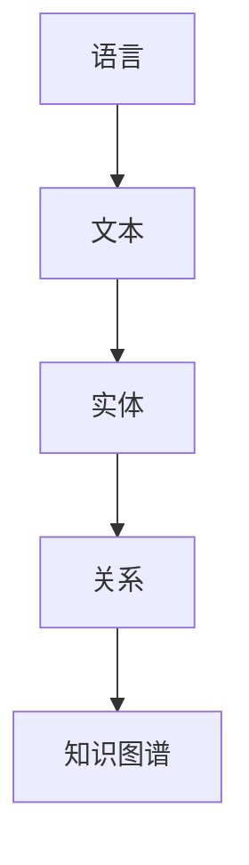
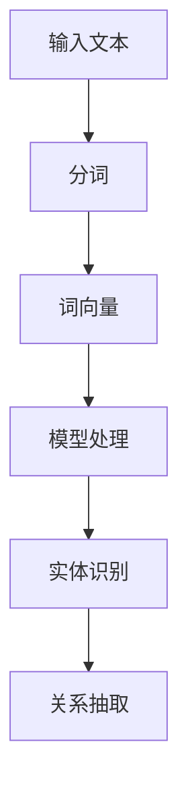
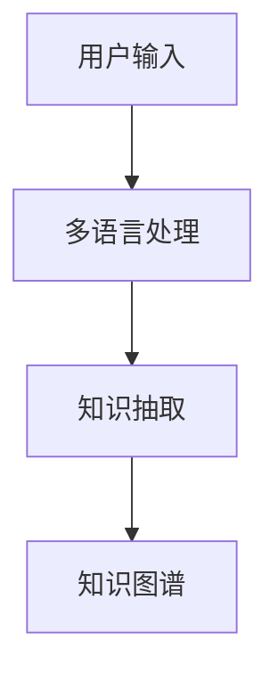
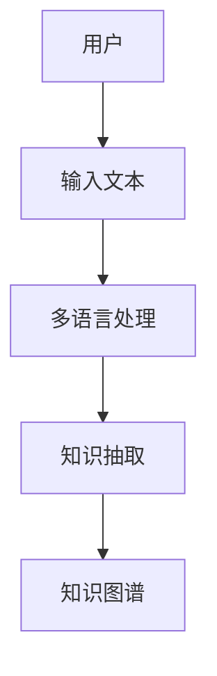

                 


# 开发具有跨语言知识抽取能力的AI Agent

> 关键词：跨语言知识抽取，AI Agent，自然语言处理，知识图谱，多语言模型

> 摘要：本文详细探讨了开发具有跨语言知识抽取能力的AI Agent的关键技术，从背景介绍、核心概念、算法原理、系统架构设计到项目实战，全面分析了实现跨语言知识抽取的全过程。文章结合理论与实践，深入讲解了技术细节，并通过具体案例展示了实际应用，为开发者提供了宝贵的参考。

---

## 第一部分: 跨语言知识抽取的背景与核心概念

### 第1章: 跨语言知识抽取的背景与问题描述

#### 1.1 跨语言知识抽取的背景

在当今信息化的社会中，信息呈现多样化和多语言化的趋势。随着全球化的推进，跨语言信息处理的需求日益增长。例如，一个AI Agent需要能够理解并处理多种语言的文本，提取其中的关键信息，构建统一的知识图谱，以支持后续的应用，如问答系统、信息检索等。传统的知识抽取技术主要针对单一语言，难以满足跨语言场景的需求，因此开发具有跨语言知识抽取能力的AI Agent显得尤为重要。

#### 1.2 跨语言知识抽取的核心问题

跨语言知识抽取的核心问题包括以下几个方面：

1. **多语言支持**：AI Agent需要能够处理多种语言的文本，识别不同语言中的实体和关系。
2. **知识表示**：如何将不同语言的知识统一表示，构建跨语言的知识图谱。
3. **抽取算法**：设计高效的算法，能够从多语言文本中准确提取实体和关系。

#### 1.3 跨语言知识抽取的边界与外延

跨语言知识抽取的边界主要集中在以下几个方面：

1. **输入范围**：仅限于文本数据，不涉及图片、音频等其他形式。
2. **处理范围**：仅限于实体和关系的抽取，不包括情感分析、语义理解等其他NLP任务。
3. **输出范围**：生成的知识图谱仅包含实体和关系，不包括属性值等其他信息。

跨语言知识抽取的外延则包括多语言NLP技术、知识图谱构建、跨语言信息检索等。

### 第2章: 跨语言知识抽取的核心概念与联系

#### 2.1 跨语言知识抽取的核心概念

跨语言知识抽取涉及多个核心概念，包括：

1. **多语言NLP**：涉及多种语言的自然语言处理技术，如分词、词性标注、句法分析等。
2. **知识抽取**：从文本中提取实体和关系的过程。
3. **跨语言模型**：能够处理多种语言的模型，如多语言词嵌入模型。

#### 2.2 核心概念的属性特征对比

| 核心概念       | 属性特征                           |
|----------------|------------------------------------|
| 多语言NLP      | 支持多种语言，模型参数共享        |
| 知识抽取       | 提取实体和关系，依赖语言理解       |
| 跨语言模型     | 能够处理多种语言，模型结构统一     |

#### 2.3 跨语言知识抽取的ER实体关系图



## 第二部分: 跨语言知识抽取的算法原理

### 第3章: 跨语言知识抽取的算法原理

#### 3.1 算法原理概述

跨语言知识抽取的算法可以分为三类：

1. **基于规则的方法**：利用语言学规则进行实体和关系的抽取。
2. **基于统计的方法**：利用统计模型，如条件随机场（CRF）进行抽取。
3. **基于深度学习的方法**：利用神经网络模型，如BERT进行抽取。

#### 3.2 基于深度学习的抽取算法



#### 3.3 算法数学模型

1. **词向量表示**
   $$v_i = \text{word2vec}(w_i)$$

2. **实体识别模型**
   $$P(y|x) = \text{softmax}(Wx + b)$$

3. **关系抽取模型**
   $$P(r|x) = \text{softmax}(Ux + c)$$

---

## 第三部分: 跨语言知识抽取的系统分析与架构设计

### 第4章: 跨语言知识抽取的系统分析与架构设计

#### 4.1 问题场景介绍

跨语言知识抽取系统需要处理多种语言的文本，提取实体和关系，并构建知识图谱。系统输入为多语言文本，输出为知识图谱。

#### 4.2 系统功能设计

1. **多语言支持模块**：处理多种语言的文本，进行分词和词性标注。
2. **知识抽取模块**：从文本中提取实体和关系。
3. **知识图谱构建模块**：将提取的实体和关系整合到知识图谱中。

#### 4.3 系统架构设计



#### 4.4 系统接口设计

1. **输入接口**：接收多种语言的文本数据。
2. **输出接口**：输出知识图谱的结构化数据。
3. **API设计**：提供RESTful API，方便其他系统调用。

#### 4.5 系统交互设计



---

## 第四部分: 跨语言知识抽取的项目实战

### 第5章: 跨语言知识抽取的项目实战

#### 5.1 环境安装

```bash
pip install transformers
pip install pytorch
pip install numpy
```

#### 5.2 系统核心实现源代码

```python
import torch
import torch.nn as nn
from transformers import BertTokenizer, BertModel

class MultiLanguageKnowledgeExtractor:
    def __init__(self, languages):
        self.languages = languages
        self.tokenizers = {lang: BertTokenizer.from_pretrained(lang) for lang in languages}
        self.models = {lang: BertModel.from_pretrained(lang) for lang in languages}
    
    def extract_entities(self, text, lang):
        tokens = self.tokenizers[lang](text)
        with torch.no_grad():
            outputs = self.models[lang](**tokens)
        # 实体抽取逻辑
        return entities
    
    def extract_relations(self, text, lang):
        tokens = self.tokenizers[lang](text)
        with torch.no_grad():
            outputs = self.models[lang](**tokens)
        # 关系抽取逻辑
        return relations
```

#### 5.3 代码应用解读与分析

1. **环境安装**：安装必要的库，如`transformers`、`pytorch`和`numpy`。
2. **核心实现**：定义`MultiLanguageKnowledgeExtractor`类，支持多种语言的实体和关系抽取。
3. **案例分析**：以中文和英文为例，展示如何使用该类进行知识抽取。

#### 5.4 项目小结

通过实际案例，展示了如何开发一个具有跨语言知识抽取能力的AI Agent。代码实现了多语言支持、实体抽取和关系抽取的核心功能。

---

## 第五部分: 最佳实践与扩展阅读

### 5.1 最佳实践

1. **数据预处理**：确保输入数据的质量，进行清洗和格式化。
2. **模型调优**：根据具体任务调整模型参数，优化抽取效果。
3. **性能优化**：通过并行计算、缓存技术等提高系统的运行效率。

### 5.2 小结

跨语言知识抽取是一个复杂但极具挑战性的任务，需要结合多语言NLP技术和知识图谱构建方法。通过本文的介绍，读者可以掌握实现跨语言知识抽取的核心技术和方法。

### 5.3 注意事项

1. **数据多样性**：确保训练数据覆盖多种语言和领域。
2. **模型适应性**：选择适合目标语言的预训练模型。
3. **性能监控**：实时监控系统的运行状态，及时发现和解决问题。

### 5.4 拓展阅读

1. **多语言NLP技术**：深入学习多语言词嵌入模型，如M-BERT。
2. **知识图谱构建**：研究知识图谱的构建方法和应用。
3. **深度学习模型**：探索更先进的深度学习模型，如Transformer架构。

---

## 作者：AI天才研究院/AI Genius Institute & 禅与计算机程序设计艺术 /Zen And The Art of Computer Programming

---

通过本文的详细讲解，读者可以系统地了解跨语言知识抽取的背景、核心概念、算法原理、系统架构设计以及项目实战。希望本文能为开发者提供有价值的参考，助力他们在跨语言知识抽取领域取得更大的突破。

