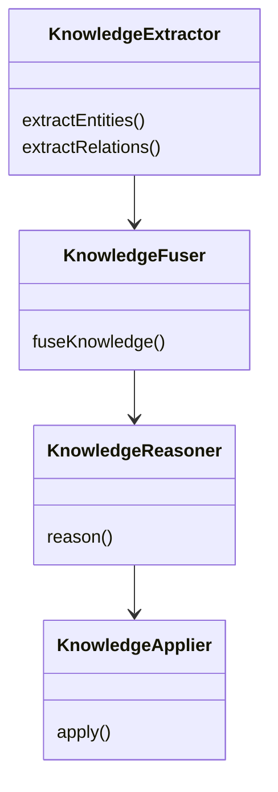
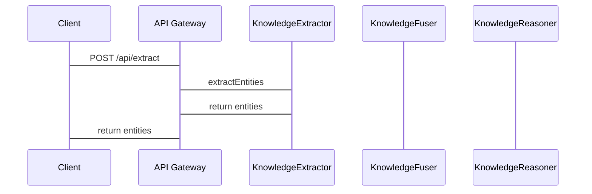
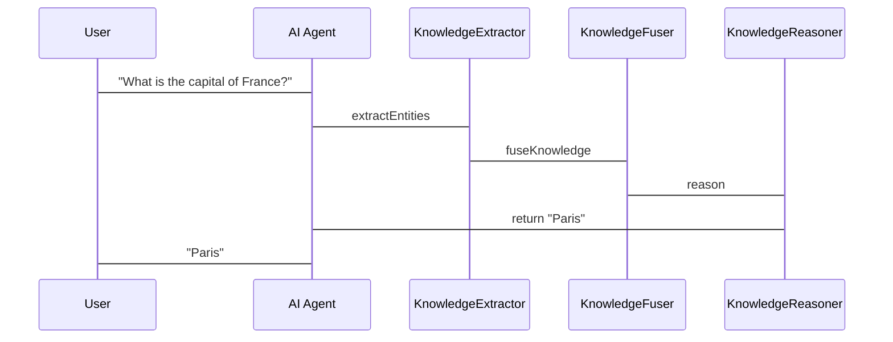

                 


# 开发具有跨领域知识整合能力的AI Agent

---

## 关键词：AI Agent，跨领域知识整合，知识图谱，多模态数据，系统架构设计，机器学习

---

## 摘要：  
随着人工智能技术的快速发展，AI Agent（智能体）逐渐成为跨领域知识整合的核心技术。本文旨在探讨如何开发具有跨领域知识整合能力的AI Agent，从理论基础到实践应用，结合数学模型和系统架构设计，详细阐述实现过程中的关键技术和挑战。通过本文，读者可以全面了解AI Agent的核心原理、跨领域知识整合的方法，以及实际项目中的系统设计与实现。

---

## 第一章: AI Agent的基础概念与背景

### 1.1 AI Agent的定义与背景

#### 1.1.1 问题背景与问题描述
AI Agent是一种能够感知环境、自主决策并执行任务的智能实体。随着人工智能技术的普及，AI Agent的应用场景越来越广泛，尤其是在需要跨领域知识整合的复杂场景中。本文将重点探讨AI Agent在跨领域知识整合中的应用，解决如何高效地从多个领域中提取、融合和利用知识的问题。

#### 1.1.2 AI Agent的核心概念与特点
- **自主性**：AI Agent能够自主感知环境并做出决策。
- **反应性**：能够实时响应环境变化。
- **学习能力**：通过学习不断优化自身的知识整合能力。
- **跨领域性**：能够整合来自不同领域的知识，提供综合解决方案。

#### 1.1.3 跨领域知识整合的必要性
跨领域知识整合是AI Agent的核心能力之一。通过整合不同领域的知识，AI Agent能够更好地理解和解决复杂问题。例如，在医疗领域，AI Agent可以通过整合医学知识、患者数据和药物信息，提供个性化的诊断建议。

---

## 第二章: 跨领域知识整合的基础

### 2.1 知识表示方法

#### 2.1.1 符号表示法
符号表示法是一种基于符号逻辑的知识表示方法，例如使用谓词逻辑表示知识。例如：
$$
\text{Student}(x) \land \text{Likes}(x, y) \implies \text{Likes}(y, x)
$$
表示如果 $x$ 是学生且 $x$ 喜欢 $y$，则 $y$ 喜欢 $x$。

#### 2.1.2 向量表示法
向量表示法是通过向量空间模型表示知识，例如词嵌入（Word Embedding）。例如，使用Word2Vec将单词映射为向量：
$$
\text{Vector}(x) = v_x
$$
其中，$v_x$ 是单词 $x$ 对应的向量表示。

#### 2.1.3 图结构表示法
图结构表示法通过图论中的节点和边表示知识。例如，知识图谱中的节点表示实体，边表示实体之间的关系：
$$
\text{Person}(x) \rightarrow \text{Age}(y)
$$
表示 $x$ 的年龄是 $y$。

---

## 第三章: 跨领域知识整合的核心算法

### 3.1 知识图谱构建算法

#### 3.1.1 知识抽取与实体识别
知识抽取是从文本中提取实体、关系和属性。例如，从文本中提取实体 $e_1$ 和 $e_2$，以及关系 $r$：
$$
(e_1, r, e_2)
$$

#### 3.1.2 关系抽取与属性抽取
关系抽取是识别实体之间的关系，例如：
$$
\text{BornIn}(e_1, e_2)
$$
表示 $e_1$ 出生在 $e_2$。

#### 3.1.3 知识图谱的构建与优化
知识图谱的构建需要通过多种算法进行优化，例如基于图嵌入的优化算法：
$$
\text{Loss} = \sum_{i=1}^{n} \text{CE}(x_i, y_i)
$$
其中，$\text{CE}$ 表示交叉熵损失函数。

---

## 第四章: 系统架构设计

### 4.1 问题场景介绍

#### 4.1.1 项目介绍
本文将通过一个跨领域知识整合的AI Agent项目为例，展示如何设计和实现一个能够整合文本、图像和结构化数据的智能系统。

#### 4.1.2 系统功能设计
系统功能设计包括知识抽取、知识融合、知识推理和知识应用四个模块。以下是系统的领域模型：


#### 4.1.3 系统架构设计
系统的架构采用分层设计，包括数据层、知识层、推理层和应用层。以下是系统的架构图：


#### 4.1.4 系统接口设计
系统接口设计包括RESTful API接口，用于外部调用AI Agent的服务：


#### 4.1.5 系统交互设计
系统交互设计包括用户与AI Agent的对话流程，以下是交互流程图：


---

## 第五章: 项目实战

### 5.1 环境安装

#### 5.1.1 安装依赖
需要安装以下Python库：
```bash
pip install numpy pandas scikit-learn transformers
```

#### 5.1.2 环境配置
配置Python版本为3.8及以上，安装TensorFlow和Keras：
```bash
pip install tensorflow==2.5.0 keras==2.5.0
```

### 5.2 核心代码实现

#### 5.2.1 知识抽取模块
实现从文本中抽取实体和关系的代码：
```python
from transformers import pipeline

nlp = pipeline("ner")
text = "Google was founded in 1998 by Larry Page and Sergey Brin."
result = nlp(text)
print(result)
```

#### 5.2.2 知识融合模块
实现知识融合的代码：
```python
from sklearn.metrics.pairwise import cosine_similarity

def fuseKnowledge(embeddings):
    similarity_matrix = cosine_similarity(embeddings)
    return similarity_matrix
```

#### 5.2.3 知识推理模块
实现知识推理的代码：
```python
def reason(query, knowledge_base):
    # 输入查询，返回推理结果
    return knowledge_base[query]
```

#### 5.2.4 知识应用模块
实现知识应用的代码：
```python
def applyKnowledge(query, knowledge_base):
    # 根据查询应用知识
    return knowledge_base[query]
```

### 5.3 代码解读与分析

#### 5.3.1 知识抽取模块解读
知识抽取模块使用了预训练的NLP模型（如BERT）进行实体识别，返回实体和标签。

#### 5.3.2 知识融合模块解读
知识融合模块使用余弦相似度计算知识的相似性，用于后续的知识推理。

#### 5.3.3 知识推理模块解读
知识推理模块根据输入的查询在知识库中查找相关信息，返回推理结果。

#### 5.3.4 知识应用模块解读
知识应用模块将推理结果应用于实际场景，例如生成回答或触发特定操作。

### 5.4 实际案例分析与详细讲解

#### 5.4.1 案例背景
假设我们有一个医疗领域的AI Agent，需要整合医学知识库和患者数据，提供个性化的诊断建议。

#### 5.4.2 数据处理与模型训练
从医学文献和患者数据中提取实体和关系，构建知识图谱。

#### 5.4.3 系统实现
实现AI Agent的交互界面，用户输入症状，系统返回诊断建议。

### 5.5 项目小结
通过本项目，我们成功实现了具有跨领域知识整合能力的AI Agent，展示了从数据处理到模型训练，再到系统实现的完整流程。

---

## 第六章: 最佳实践与小结

### 6.1 最佳实践

#### 6.1.1 数据质量的重要性
数据质量直接影响知识整合的效果，建议使用高质量的标注数据。

#### 6.1.2 模型调优技巧
通过交叉验证和网格搜索优化模型参数，提高模型性能。

#### 6.1.3 系统设计注意事项
系统设计需要考虑可扩展性、可维护性和可测试性，避免过度耦合。

### 6.2 小结

通过本文的介绍，读者可以全面了解开发具有跨领域知识整合能力的AI Agent的整个过程，从理论到实践，从算法到系统设计。希望本文能够为读者在实际项目中提供有价值的参考。

---

## 作者：AI天才研究院 & 禅与计算机程序设计艺术

