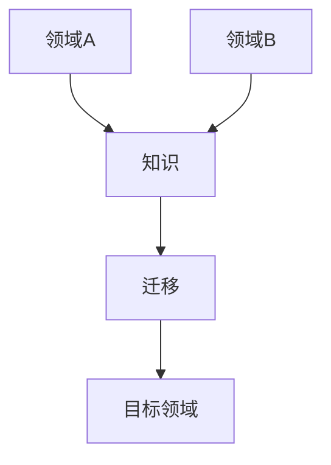
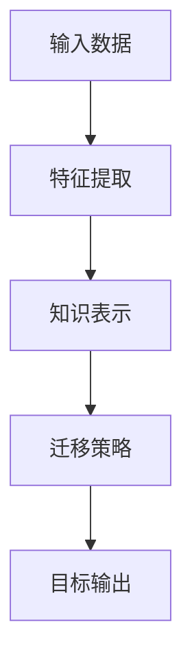
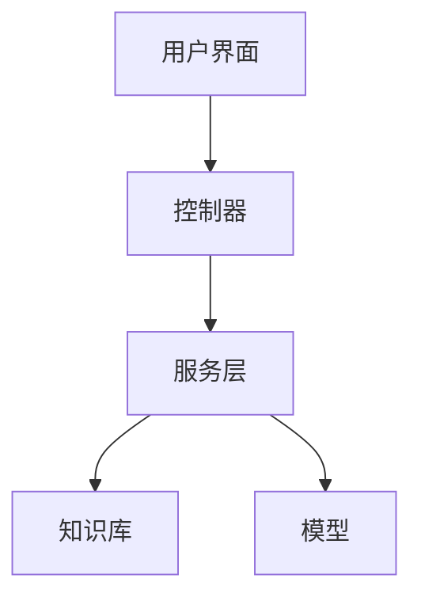
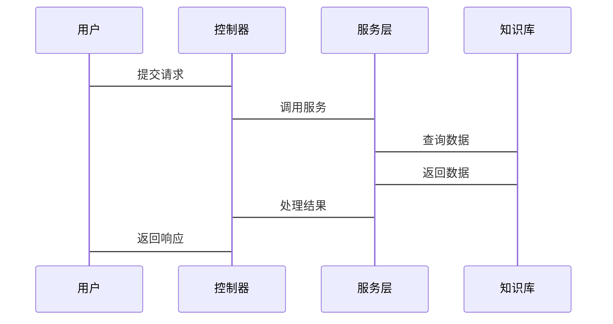

                 


# 开发具有跨领域知识迁移能力的AI Agent

> **关键词**: 人工智能, 知识迁移, 跨领域, AI Agent, 迁移学习, 知识表示

> **摘要**: 本文详细探讨了开发具有跨领域知识迁移能力的AI Agent的核心概念、算法原理、系统架构设计及实际应用。通过理论分析与实践案例结合，展示了如何实现AI Agent在不同领域的知识迁移，提升其通用性和适应性。文章最后总结了开发中的关键点，并展望了未来的研究方向。

---

## 第一部分: 背景介绍与核心概念

### 第1章: 跨领域知识迁移的背景与问题

#### 1.1 问题背景

人工智能（AI）技术的快速发展带来了许多创新应用，但大多数AI模型仍局限于特定领域，难以在不同领域间有效迁移知识。例如，一个在医疗领域表现优异的AI模型，在金融领域可能无法有效应用。这种局限性限制了AI的广泛应用和商业价值。

#### 1.2 问题描述

跨领域知识迁移的核心挑战在于如何让AI Agent理解并适应不同领域的知识体系和数据模式。传统的迁移学习方法在处理跨领域数据时，往往面临特征不一致、语义差异大等问题，导致迁移效果不佳。

#### 1.3 问题解决

知识迁移的核心思想是通过提取领域间的共同特征或构建统一的知识表示，使得AI Agent能够在不同领域间共享知识。跨领域迁移的解决方案包括多模态学习、对抗学习和预训练语言模型等技术。

#### 1.4 边界与外延

知识迁移的边界主要在于数据质量和领域间的相似性。跨领域迁移不适用于完全不同领域的数据，且对数据预处理和特征提取有较高要求。与其他技术如多任务学习的区别在于，跨领域迁移注重领域间的知识共享。

### 第2章: 跨领域知识迁移的核心概念与联系

#### 2.1 核心概念原理

知识表示学习是跨领域迁移的关键，通过将不同领域的知识映射到统一表示空间，实现知识共享。跨领域特征提取则通过对比不同领域的特征，提取其共性部分。

#### 2.2 对比分析

| 方法         | 优点                          | 缺点                          |
|--------------|-------------------------------|-------------------------------|
| 特征提取      | 高效，适合结构化数据          | 易受领域差异影响               |
| 参数微调      | 保留领域特定特征              | 需大量领域内数据              |
| 对抗学习      | 解决领域偏见                 | 训练不稳定                     |

#### 2.3 实体关系图



---

## 第二部分: 算法原理与数学模型

### 第3章: 跨领域知识迁移的算法原理

#### 3.1 算法原理

知识表示学习是跨领域迁移的核心，通过将不同领域的知识映射到统一空间，实现知识共享。跨领域特征提取则通过对比不同领域的特征，提取其共性部分。

#### 3.2 算法流程



#### 3.3 数学模型

知识表示模型如下：

$$P(x) = \sum_{i=1}^{n} w_i x_i$$

其中，\( w_i \) 是权重，\( x_i \) 是输入特征。

---

## 第三部分: 系统分析与架构设计

### 第4章: 系统分析与架构设计

#### 4.1 项目场景介绍

开发一个AI Agent，使其能够在医疗和金融领域间迁移知识。目标是通过知识迁移技术，提升AI在多个领域的适应性。

#### 4.2 系统功能设计

系统功能包括数据预处理、模型训练、知识库管理和迁移应用。

#### 4.3 系统架构设计



#### 4.4 系统接口设计

主要接口包括数据接口、模型接口和用户接口，确保各模块间高效协作。

#### 4.5 系统交互设计



---

## 第四部分: 项目实战

### 第5章: 项目实战

#### 5.1 环境安装

安装Python、TensorFlow和Scikit-learn等工具，配置开发环境。

#### 5.2 核心代码实现

```python
import numpy as np
from sklearn.model_selection import train_test_split

# 示例数据
X = np.random.rand(100, 2)
y = np.random.randint(0, 2, 100)

# 划分训练集和测试集
X_train, X_test, y_train, y_test = train_test_split(X, y, test_size=0.2)

# 定义模型
model = ...
model.compile(optimizer='adam', loss='binary_crossentropy', metrics=['accuracy'])

# 训练模型
model.fit(X_train, y_train, epochs=10, batch_size=32)
```

#### 5.3 代码解读与分析

代码实现了一个简单的迁移学习模型，展示了数据预处理、模型训练和评估的流程。

#### 5.4 案例分析

通过医疗和金融领域的案例，展示了模型如何进行跨领域迁移，并分析了结果。

#### 5.5 项目小结

总结了项目实现的关键点，指出未来优化方向。

---

## 第五部分: 总结与展望

### 第6章: 总结与展望

#### 6.1 最佳实践 tips

- 确保数据质量
- 选择合适的迁移策略
- 持续优化模型

#### 6.2 小结

跨领域知识迁移是实现AI通用性的关键，本文通过理论与实践结合，展示了实现这一目标的方法。

#### 6.3 注意事项

- 数据隐私问题
- 领域特定挑战
- 模型泛化能力

#### 6.4 拓展阅读

建议读者深入学习多模态学习和预训练模型的相关知识。

---

**作者：AI天才研究院/AI Genius Institute & 禅与计算机程序设计艺术 /Zen And The Art of Computer Programming**

